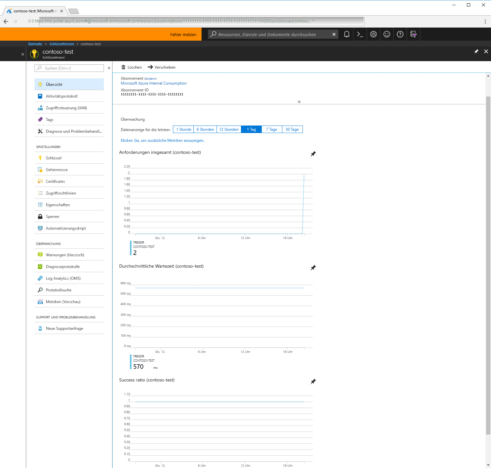

# Was ist Azure Key Vault?

Azure Key Vault ist ein Clouddienst, der als sicherer Geheimnisspeicher fungiert.

Ihre Anwendungen sind auf Informationen wie Kennwörter, Verbindungszeichenfolgen und Ähnliches angewiesen. Diese Informationen müssen verfügbar, aber auch sicher sein. Hier kommt Azure Key Vault ins Spiel. Azure Key Vault unterstützt Sie bei der sicheren Speicherung und Verwaltung von Anwendungsgeheimnissen.

Mit Key Vault können Sie mehrere sichere Container (so genannte Tresore) erstellen. Diese Tresore basieren auf Hardwaresicherheitsmodulen (HSMs). Tresore zentralisieren die Speicherung von Anwendungsgeheimnissen und verringern so die Gefahr, dass Sicherheitsinformationen abhandenkommen. Darüber hinaus steuern und protokollieren Key Vault-Instanzen auch den Zugriff auf alle darin gespeicherten Daten. Azure Key Vault kann Anforderungen und Verlängerungen von TLS-Zertifikaten (Transport Layer Security) abwickeln und stellt Features bereit, die für eine zuverlässige Zertifikatlebenszyklus-Verwaltungslösung benötigt werden.

 Azure Key Vault ist für die Unterstützung von Anwendungsschlüsseln und -geheimnissen konzipiert. Key Vault ist jedoch nicht als Speicher für Benutzerkennwörter vorgesehen.

## Gründe für die Verwendung von Azure Key Vault

### Zentralisieren von Anwendungsgeheimnissen

Durch die zentralisierte Speicherung von Anwendungsgeheimnissen in Azure Key Vault können Sie deren Verteilung steuern. Dadurch lässt sich das Risiko einer unbeabsichtigten Weitergabe der Geheimnisse erheblich senken. Dank Key Vault müssen Anwendungsentwickler Sicherheitsinformationen nicht mehr in der Anwendung speichern. Die Informationen müssen also nicht mehr in den Code integriert werden. Ein Beispiel: Angenommen, eine Anwendung muss eine Verbindung mit einer Datenbank herstellen. In diesem Fall können Sie die Verbindungszeichenfolge sicher in Key Vault speichern anstatt im Anwendungscode.

Über URIs können Ihre Anwendungen sicher auf die benötigten Informationen zugreifen. Die URIs ermöglichen das Abrufen spezifischer Versionen eines Geheimnisses, nachdem der Schlüssel oder das Geheimnis der Anwendung in Azure Key Vault gespeichert wurde. Dabei muss keinerlei benutzerdefinierter Code geschrieben werden, um geheime Informationen zu schützen.

### Sicheres Speichern von Geheimnissen

Schlüssel werden von Azure mit branchenüblichen Algorithmen, Schlüssellängen und Hardwaresicherheitsmodulen (HSMs) geschützt. Die verwendeten HSMs erfüllen die Anforderungen von FIPS 140-2, Level 2 (Federal Information Processing Standards).

Ein Aufrufer (Benutzer oder Anwendung) kann erst nach ordnungsgemäßer Authentifizierung und Autorisierung auf einen Schlüsseltresor zugreifen. Bei der Authentifizierung wird die Identität des Aufrufers ermittelt. Bei der Autorisierung wird dagegen bestimmt, welche Vorgänge der Aufrufer ausführen darf.

Die Authentifizierung erfolgt über Azure Active Directory. Für die Autorisierung kann die rollenbasierte Zugriffssteuerung (Role-Based Access Control, RBAC) oder eine Key Vault-Zugriffsrichtlinie verwendet werden. RBAC kommt bei der Verwaltung der Tresore zum Einsatz. Eine Key Vault-Zugriffsrichtlinie wird für den Zugriff auf gespeicherte Daten in einem Tresor verwendet.

Azure Key Vault-Instanzen können durch Software oder Hardware (HSM) geschützt werden. In Szenarien mit erhöhten Sicherheitsanforderungen können Sie Schlüssel in Hardwaresicherheitsmodule (HSMs) importieren oder darin generieren. Diese Schlüssel bleiben immer innerhalb der HSM-Grenzen. Microsoft verwendet Hardwaresicherheitsmodule von Thales. Sie können Thales-Tools verwenden, um einen Schlüssel aus Ihrem HSM in Azure Key Vault zu verschieben.

Darüber hinaus ist Azure Key Vault so konzipiert, dass Ihre Schlüssel von Microsoft weder angezeigt noch extrahiert werden können.

### Überwachen von Zugriff und Verwendung

Nachdem Sie eine Reihe von Key Vault-Instanzen erstellt haben, können Sie überwachen, wie und wann auf Ihre Schlüssel und Geheimnisse zugegriffen wird. Hierzu können Sie die Protokollierung für Key Vault aktivieren. Azure Key Vault kann für Folgendes konfiguriert werden:

- Archivieren in einem Speicherkonto
- Streamen an einen Event Hub
- Senden der Protokolle an Log Analytics

Sie haben die Kontrolle über Ihre Protokolle: Sie können den Zugriff auf Protokolle einschränken, um sie zu schützen, und Sie können nicht mehr benötigte Protokolle löschen.

### Einfachere Verwaltung von Anwendungsgeheimnissen

Beim Speichern wertvoller Daten sind mehrere Punkte zu berücksichtigen: Sicherheitsinformationen müssen geschützt werden, für die Informationen muss ein Lebenszyklus konfiguriert werden, und die Informationen müssen hochverfügbar sein. Azure Key Vault vereinfacht einen Großteil dieser Punkte durch Folgendes:

- Beseitigung des Bedarfs für interne HSM-Kenntnisse
- Kurzfristige zentrale Hochskalierung zur Abdeckung von Auslastungsspitzen Ihrer Organisation
- Replikation des Inhalts Ihrer Key Vault-Instanz innerhalb einer Region und in einer sekundären Region. Dadurch wird die Hochverfügbarkeit der Informationen gewährleistet, und ein Failover kann ganz ohne Eingriff des Administrators ausgelöst werden.
- Bereitstellung standardmäßiger Azure-Verwaltungsoptionen über das Portal, über die Azure-Befehlszeilenschnittstelle und über PowerShell
- Automatisierung bestimmter Aufgaben im Zusammenhang mit Zertifikaten, die Sie von öffentlichen Zertifizierungsstellen erwerben (beispielsweise Registrierung und Verlängerung)

Darüber hinaus können Azure Key Vault-Instanzen auch zur Isolierung von Anwendungsgeheimnissen verwendet werden. Anwendungen können nur auf den Tresor zugreifen, für den sie zugriffsberechtigt sind, und die ausführbaren Vorgänge können auf bestimmte Vorgänge beschränkt werden. Sie können eine Azure Key Vault-Instanz pro Anwendung erstellen und die in einer Key Vault-Instanz gespeicherten Geheimnisse auf eine bestimmte Anwendung und ein bestimmtes Entwicklerteam beschränken.

### Integrieren in andere Azure-Dienste

Als sicherer Speicher in Azure vereinfacht Key Vault beispielsweise Szenarien mit [Azure Disk Encryption](../security/azure-security-disk-encryption.md), mit der Funktion [Always Encrypted]( https://docs.microsoft.com/sql/relational-databases/security/encryption/always-encrypted-database-engine) in SQL Server und Azure SQL sowie mit [Azure-Web-Apps]( https://docs.microsoft.com/azure/app-service/web-sites-purchase-ssl-web-site). Key Vault kann in Speicherkonten, Event Hubs und Log Analytics integriert werden.

## Nächste Schritte

- [Schnellstart: Erstellen einer Azure Key Vault-Instanz mithilfe der Befehlszeilenschnittstelle](quick-create-cli.md)
- [Tutorial: Konfigurieren einer Azure-Webanwendung zum Lesen eines Geheimnisses aus Key Vault](tutorial-web-application-keyvault.md)