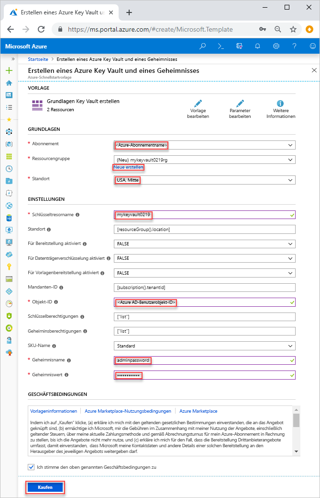

# <a name="quickstart-set-and-retrieve-a-secret-from-azure-key-vault-using-resource-manager-template"></a>Schnellstart: Festlegen und Abrufen eines Geheimnisses aus Azure Key Vault per Resource Manager-Vorlage

[Azure Key Vault](./key-vault-overview.md) ist ein Clouddienst, der einen sicheren Speicher für Geheimnisse bereitstellt, z. B. für Schlüssel, Kennwörter, Zertifikate usw. In dieser Schnellstartanleitung geht es die Bereitstellung einer Resource Manager-Vorlage zum Erstellen eines Schlüsseltresors und eines Geheimnisses. Weitere Informationen zur Entwicklung von Resource Manager-Vorlagen finden Sie in der [Resource Manager-Dokumentation](/azure/azure-resource-manager/) und der [Vorlagenreferenz](/azure/templates/microsoft.keyvault/allversions).

Wenn Sie kein Azure-Abonnement besitzen, können Sie ein [kostenloses Konto](https://azure.microsoft.com/free/?WT.mc_id=A261C142F) erstellen, bevor Sie beginnen.

## <a name="prerequisites"></a>Voraussetzungen

Damit Sie die Anweisungen in diesem Artikel ausführen können, benötigen Sie Folgendes:

* Ihre Azure AD-Benutzerobjekt-ID wird von der Vorlage zum Konfigurieren von Berechtigungen benötigt. Die folgende Prozedur ruft die Objekt-ID (GUID) ab.

    1. Führen Sie den folgenden Azure PowerShell- oder Azure CLI-Befehl aus, indem Sie die Option **Ausprobieren** wählen und das Skript anschließend in den Shell-Bereich einfügen. Klicken Sie zum Einfügen des Skripts mit der rechten Maustaste auf das Skript, und wählen Sie **Einfügen**. 

        ```azurecli-interactive
        echo "Enter your email address that is used to sign in to Azure:" &&
        read upn &&
        az ad user show --upn-or-object-id $upn --query "objectId" 
        ```

        ```azurepowershell-interactive
        $upn = Read-Host -Prompt "Enter your email address used to sign in to Azure"
        (Get-AzADUser -UserPrincipalName $upn).Id
        ```

    2. Notieren Sie sich die Objekt-ID. Sie benötigen sie im nächsten Abschnitt dieser Schnellstartanleitung.

## <a name="create-a-vault-and-a-secret"></a>Erstellen eines Tresors und eines Geheimnisses

Die in dieser Schnellstartanleitung verwendete Vorlage stammt von der Seite mit den [Azure-Schnellstartvorlagen](https://azure.microsoft.com/resources/templates/101-key-vault-create/). Weitere Beispiele für Azure Key Vault-Vorlagen finden Sie [hier](https://azure.microsoft.com/resources/templates/?resourceType=Microsoft.Keyvault).

1. Klicken Sie auf das folgende Bild, um sich bei Azure anzumelden und eine Vorlage zu öffnen. Die Vorlage erstellt einen Schlüsseltresor und ein Geheimnis.

    <a href="https://portal.azure.com/#create/Microsoft.Template/uri/https%3A%2F%2Fraw.githubusercontent.com%2FAzure%2Fazure-quickstart-templates%2Fmaster%2F101-key-vault-create%2Fazuredeploy.json"></a>

2. Wählen Sie die folgenden Werte aus, bzw. geben Sie sie ein.  

    

    Verwenden Sie den Standardwert, um den Schlüsseltresor und ein Geheimnis zu erstellen, sofern kein anderer Wert angegeben ist.

    * **Abonnement**: Wählen Sie ein Azure-Abonnement aus.
    * **Ressourcengruppe**: Wählen Sie die Option **Neu erstellen** aus, geben Sie einen eindeutigen Namen für die Ressourcengruppe ein, und klicken Sie dann auf **OK**. 
    * **Standort**: Wählen Sie einen Standort aus.  Beispiel: **USA, Mitte**.
    * **Schlüsseltresorname:** Geben Sie einen Namen für den Schlüsseltresor ein. Dieser muss im Namespace vault.azure.net global eindeutig sein.  
    * **Mandanten-ID**: Die Vorlagenfunktion ruft automatisch Ihre Mandanten-ID ab.  Lassen Sie den Standardwert unverändert.
    * **Ad User Id** (AD-Benutzer-ID): Geben Sie Ihre Azure AD-Benutzerobjekt-ID ein, die Sie unter [Voraussetzungen](#prerequisites) abgerufen haben.
    * **Geheimnisname**: Geben Sie einen Namen für das Geheimnis ein, das Sie im Schlüsseltresor speichern.  Beispiel: **adminpassword**.
    * **Geheimniswert**: Geben Sie den Geheimniswert ein.  Beim Speichern eines Kennworts wird die Verwendung des generierten Kennworts empfohlen, das Sie unter „Voraussetzungen“ erstellt haben.
    * **Ich stimme den oben genannten Geschäftsbedingungen zu**: Aktivieren Sie dieses Kontrollkästchen.
3. Wählen Sie die Option **Kaufen**.

## <a name="validate-the-deployment"></a>Überprüfen der Bereitstellung

Sie können entweder das Azure-Portal nutzen, um den Schlüsseltresor und das Geheimnis zu überprüfen, oder das unten angegebene Azure CLI- oder Azure PowerShell-Skript, um das erstellte Geheimnis aufzulisten.

```azurecli-interactive
echo "Enter your key vault name:" &&
read keyVaultName &&
az keyvault secret list --vault-name $keyVaultName
```

```azurepowershell-interactive
$keyVaultName = Read-Host -Prompt "Enter your key vault name"
Get-AzKeyVaultSecret -vaultName $keyVaultName
```

## <a name="clean-up-resources"></a>Bereinigen von Ressourcen

Andere Schnellstartanleitungen und Tutorials für Key Vault bauen auf dieser Schnellstartanleitung auf. Falls Sie mit weiteren Schnellstartanleitungen und Tutorials fortfahren möchten, sollten Sie die Ressourcen nicht bereinigen.
Wenn Sie die Ressourcen nicht mehr benötigen, löschen Sie die Ressourcengruppe. Dadurch werden die Key Vault-Instanz und die dazugehörigen Ressourcen gelöscht. Löschen Sie die Ressourcengruppe wie folgt mit Azure CLI oder Azure Powershell:

```azurecli-interactive
echo "Enter the Resource Group name:" &&
read resourceGroupName &&
az group delete --name $resourceGroupName 
```
```azurepowershell-interactive
$resourceGroupName = Read-Host -Prompt "Enter the Resource Group name"
Remove-AzResourceGroup -Name $resourceGroupName 
```

## <a name="next-steps"></a>Nächste Schritte

* [Azure Key Vault – Startseite](https://azure.microsoft.com/services/key-vault/)
* [Azure Key Vault – Dokumentation](https://docs.microsoft.com/azure/key-vault/)
* [Azure SDK für Node](https://docs.microsoft.com/javascript/api/overview/azure/key-vault)
* [Azure REST-API-Referenz](https://docs.microsoft.com/rest/api/keyvault/)
