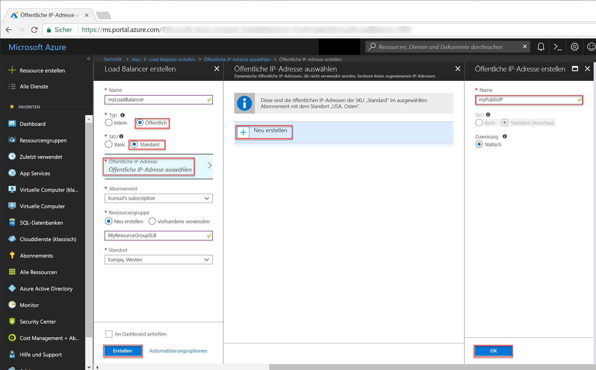
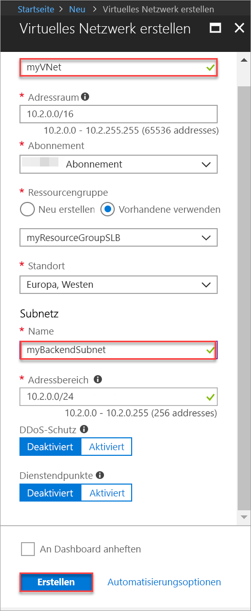
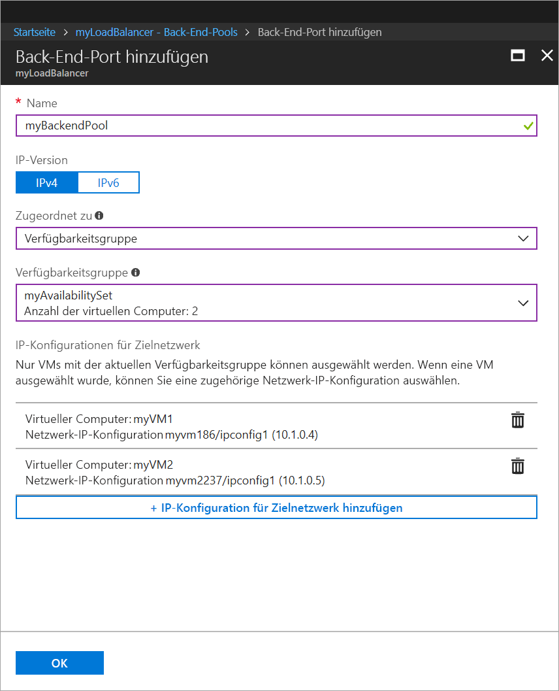
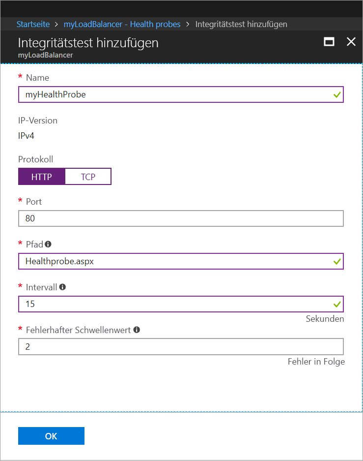
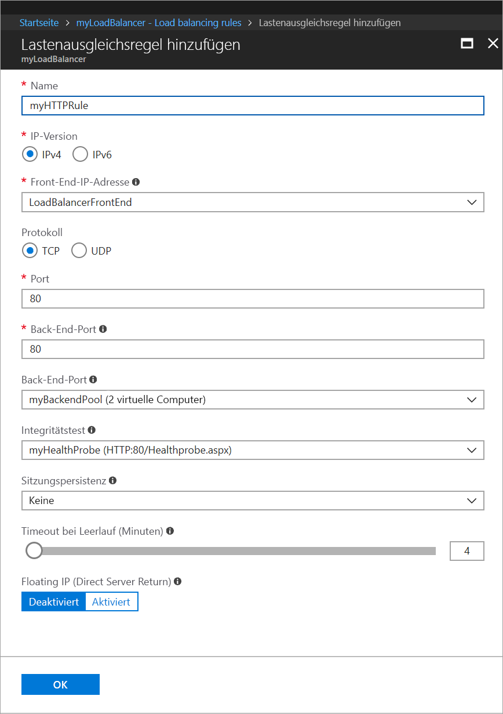
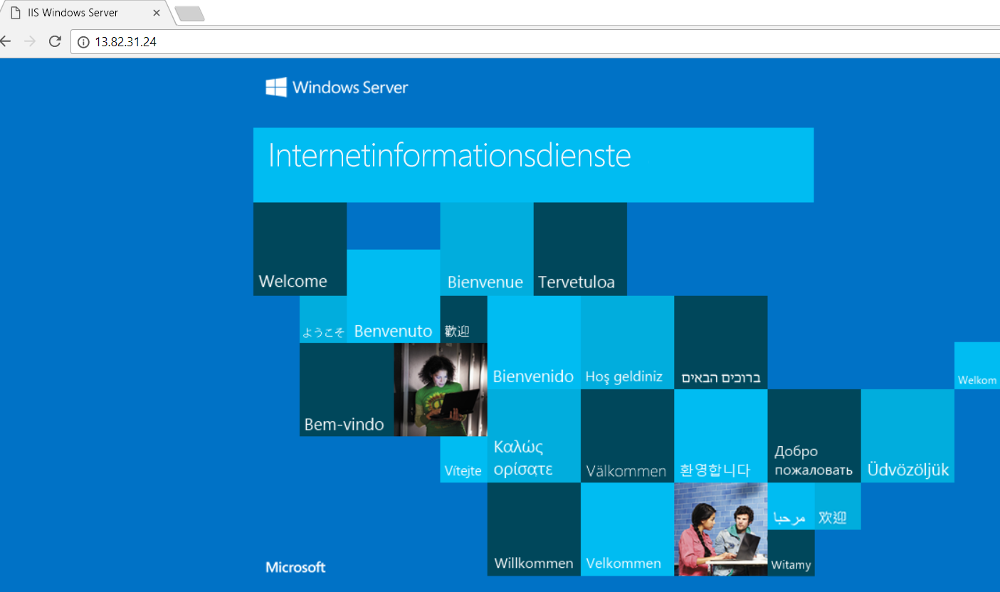

# Erstellen eines Load Balancers im Tarif „Standard“ für den Lastenausgleich virtueller Computer über das Azure-Portal

Durch die Verteilung der eingehenden Anforderungen auf mehrere virtuelle Computer bietet ein Lastenausgleich ein höheres Maß an Verfügbarkeit und Skalierbarkeit. Sie können das Azure-Portal verwenden, um einen Load Balancer für den Lastenausgleich virtueller Computer (Virtual Machines, VMs) zu erstellen. In dieser Schnellstartanleitung erfahren Sie, wie Sie für den Lastenausgleich virtueller Computer einen Load Balancer im Tarif „Standard“ verwenden.

Wenn Sie kein Azure-Abonnement besitzen, können Sie ein [kostenloses Konto](https://azure.microsoft.com/free/?WT.mc_id=A261C142F) erstellen, bevor Sie beginnen. 

## Anmelden an Azure

Melden Sie sich unter [http://portal.azure.com](http://portal.azure.com) beim Azure-Portal an.

## Erstellen eines öffentlichen Lastenausgleichs

In diesem Abschnitt erstellen Sie einen öffentlichen Load Balancer für den Lastenausgleich virtueller Computer. Ein Load Balancer im Standard-Tarif unterstützt nur eine öffentliche Standard-IP-Adresse. Wenn Sie einen Load Balancer im Standard-Tarif erstellen, müssen Sie für diesen auch eine neue öffentliche Standard-IP-Adresse erstellen, die als Front-End konfiguriert ist. Dieses hat standardmäßig den Namen *LoadBalancerFrontend*. 

1. Klicken Sie links oben auf dem Bildschirm auf **Ressource erstellen** > **Netzwerk** > **Load Balancer**.
2. Geben Sie auf der Seite **Lastenausgleich erstellen** folgende Werte für den Lastenausgleich ein:
    - *myLoadBalancer*: Name des Lastenausgleichs
    - **Öffentlich**: Lastenausgleichstyp
     - *myPublicIP*: **neue** öffentliche IP-Adresse, die Sie erstellen
    - *myResourceGroupSLB*: Name der **neuen** Ressourcengruppe, die Sie erstellen
    - **westeurope**: Standort
3. Klicken Sie auf **Erstellen**, um den Lastenausgleich zu erstellen.
   
    

## Erstellen von Back-End-Servern

In diesem Abschnitt erstellen Sie ein virtuelles Netzwerk sowie zwei virtuelle Computer für den Back-End-Pool Ihres Lastenausgleichs und installieren anschließend IIS auf den virtuellen Computern, um den Lastenausgleich zu testen.

### Erstellen eines virtuellen Netzwerks
1. Klicken Sie links oben auf dem Bildschirm auf **Neu** > **Netzwerk** > **Virtuelles Netzwerk**, und geben Sie folgende Werte für das virtuelle Netzwerk an:
    - *myVnet*: Name des virtuellen Netzwerks
    - *myResourceGroupSLB*: Name der vorhandenen Ressourcengruppe
    - *myBackendSubnet*: Subnetzname
2. Klicken Sie auf **Erstellen**, um das virtuelle Netzwerk zu erstellen.

    

### Erstellen von virtuellen Computern

1. Klicken Sie links oben auf dem Bildschirm auf **Neu** > **Compute** > **Windows Server 2016 Datacenter**, und geben Sie folgende Werte für den virtuellen Computer an:
    - *myVM1*: Name des virtuellen Computers        
    - *azureuser*: Name des Administratorbenutzers    
    - *myResourceGroupSLB*: Wählen Sie für **Ressourcengruppe** die Option **Vorhandene verwenden** und anschließend *myResourceGroupSLB* aus.
2. Klicken Sie auf **OK**.
3. Wählen Sie als Größe des virtuellen Computers **DS1_V2** aus, und klicken Sie auf **Auswählen**.
4. Geben Sie für die VM-Einstellungen folgende Werte ein:
    - *myAvailabilitySet*: Name der neuen Verfügbarkeitsgruppe, die Sie erstellen
    -  *myVnet*: Vergewissern Sie sich, dass als virtuelles Netzwerk diese Option ausgewählt ist.
    - *myBackendSubnet*: Vergewissern Sie sich, dass als Subnetz diese Option ausgewählt ist.
    - *myNetworkSecurityGroup*: Name der neuen Netzwerksicherheitsgruppe (Firewall), die Sie erstellen müssen
5. Klicken Sie auf **Deaktiviert**, um die Startdiagnose zu deaktivieren.
6. Klicken Sie auf **OK**, überprüfen Sie die Einstellungen auf der Seite „Zusammenfassung“, und klicken Sie dann auf **Erstellen**.
7. Erstellen Sie anhand der Schritte 1 bis 6 einen zweiten virtuellen Computer namens *VM2* mit *myAvailabilityset* als Verfügbarkeitsgruppe, *myVnet* als virtuelles Netzwerk, *myBackendSubnet* als Subnetz und **myNetworkSecurityGroup* als Netzwerksicherheitsgruppe. 

### Erstellen von NSG-Regeln

In diesem Abschnitt erstellen Sie NSG-Regeln, um eingehende HTTP- und RDP-Verbindungen zuzulassen.

1. Klicken Sie im linken Menü auf **Alle Ressourcen** und anschließend in der Ressourcenliste auf **myNetworkSecurityGroup** (in der Ressourcengruppe **myResourceGroupSLB**).
2. Klicken Sie unter **Einstellungen** auf **Eingangssicherheitsregeln** und anschließend auf **Hinzufügen**.
3. Geben Sie für die Eingangssicherheitsregel *myHTTPRule* folgende Werte ein, um eine eingehende HTTP-Verbindung über den Port 80 zuzulassen:
    - *Service Tag* für **Quelle**
    - *Internet* für **Quelldiensttag**
    - *80* für **Zielportbereiche**
    - *TCP* für **Protokoll**
    - *Zulassen* für **Aktion**
    - *100* für **Priorität**
    - *myHTTPRule* als Name
    - *Allow HTTP* als Beschreibung
4. Klicken Sie auf **OK**.
 
 
5. Wiederholen Sie die Schritte 2 bis 4, um eine weitere Regel namens *myRDPRule* zu erstellen und eine eingehende RDP-Verbindung über den Port 3389 zu ermöglichen. Verwenden Sie dabei die folgenden Werte:
    - *Service Tag* für **Quelle**
    - *Internet* für **Quelldiensttag**
    - *3389* für **Zielportbereiche**
    - *TCP* für **Protokoll**
    - *Zulassen* für **Aktion**
    - *200* für **Priorität**
    - *myRDPRule* als Name
    - *Allow RDP* als Beschreibung

### Installieren von IIS

1. Klicken Sie im linken Menü auf **Alle Ressourcen** und anschließend in der Ressourcenliste auf **myVM1** (in der Ressourcengruppe *myResourceGroupLB*).
2. Klicken Sie auf der Seite **Übersicht** auf **Verbinden**, um eine RDP-Verbindung mit dem virtuellen Computer herzustellen.
3. Melden Sie mit dem Benutzernamen *azureuser* bei dem virtuellen Computer.
4. Navigieren Sie auf dem Serverdesktop zu **Windows-Verwaltungsprogramme**>**Server-Manager**.
5. Klicken Sie im Server-Manager auf **Rollen und Features hinzufügen**.
6. Verwenden Sie im Assistenten **Rollen und Features hinzufügen** folgende Werte:
    - Klicken Sie auf der Seite **Installationstyp auswählen** auf die Option **Rollenbasierte oder featurebasierte Installation**.
    - Klicken Sie auf der Seite **Zielserver auswählen** auf **myVM1**.
    - Klicken Sie auf der Seite **Serverrolle auswählen** auf **Webserver (IIS)**.
    - Folgen Sie den Anweisungen, um den restlichen Assistenten abzuschließen. 
7. Wiederholen Sie die Schritte 1 bis 6 für den virtuellen Computer *myVM2*.

## Erstellen von Lastenausgleichsressourcen

In diesem Abschnitt konfigurieren Sie Lastenausgleichseinstellungen für einen Back-End-Adresspool und einen Integritätstest. Außerdem geben Sie Lastenausgleichs- und NAT-Regeln an.

### Erstellen eines Back-End-Adresspools

Zum Verteilen von Datenverkehr auf die virtuellen Computer enthält ein Back-End-Adresspool die IP-Adressen der virtuellen NICs, die mit dem Load Balancer verbunden sind. Erstellen Sie den Back-End-Adresspool *myBackendPool* mit *VM1* und *VM2*.

1. Klicken Sie im linken Menü auf **Alle Ressourcen** und dann in der Ressourcenliste auf **myLoadBalancer**.
2. Klicken Sie unter **Einstellungen** auf **Back-End-Pools** und anschließend auf **Hinzufügen**.
3. Gehen Sie auf der Seite **Back-End-Pool hinzufügen** wie folgt vor:
    - Geben Sie unter „Name“ die Zeichenfolge „*myBackEndPool“ als Name für Ihren Back-End-Pool ein.
    - Wählen Sie in der Dropdownliste **Zugeordnet zu** die Option **Verfügbarkeitsgruppe** aus.
    - Wählen Sie unter **verfügbarkeitsgruppe** die Option **myAvailabilitySet** aus.
    - Klicken Sie auf **+ Zielnetzwerk-IP-Konfiguration hinzufügen**, um die virtuellen Computer (*myVM1* & *myVM2*), die Sie erstellt haben, dem Back-End-Pool hinzuzufügen.
    - Klicken Sie auf **OK**.

    

3. Vergewissern Sie sich, dass in der Back-End-Pool-Einstellung Ihres Lastenausgleichs beide virtuellen Computer (**VM1** und **VM2**) angezeigt werden.

### Erstellen eines Integritätstests

Damit der Load Balancer den Status Ihrer App überwachen kann, verwenden Sie einen Integritätstest. Abhängig von der Reaktion auf Integritätsüberprüfungen werden der Load Balancer-Rotation durch den Integritätstest dynamisch virtuelle Computer hinzugefügt oder daraus entfernt. Erstellen Sie zur Überwachung der Integrität der virtuellen Computer einen Integritätstest namens *myHealthProbe*.

1. Klicken Sie im linken Menü auf **Alle Ressourcen** und dann in der Ressourcenliste auf **myLoadBalancer**.
2. Klicken Sie unter **Einstellungen** auf **Integritätstests** und anschließend auf **Hinzufügen**.
3. Verwenden Sie folgende Werte, um den Integritätstest zu erstellen:
    - *myHealthProbe*: Name des Integritätstests
    - **HTTP**: Protokolltyp
    - *80*: Portnummer
    - *15*: Wert für **Intervall** (Sekunden zwischen Testversuchen)
    - *2*: Wert für **Fehlerschwellenwert** oder Anzahl aufeinander folgender Testfehler, die auftreten müssen, damit ein virtueller Computer als fehlerhaft eingestuft wird
4. Klicken Sie auf **OK**.

   

### Erstellen einer Load Balancer-Regel

Mithilfe einer Load Balancer-Regel wird definiert, wie Datenverkehr auf die virtuellen Computer verteilt werden soll. Sie definieren die Front-End-IP-Konfiguration für den eingehenden Datenverkehr und den Back-End-IP-Pool zum Empfangen des Datenverkehrs zusammen mit dem erforderlichen Quell- und Zielport. Erstellen Sie eine Lastenausgleichsregel namens *myLoadBalancerRuleWeb*, die an Port 80 des Front-Ends *FrontendLoadBalancer* lauscht und den Netzwerkdatenverkehr nach erfolgtem Lastenausgleich an den Back-End-Adresspool *myBackEndPool* sendet, wobei ebenfalls der Port 80 verwendet wird. 

1. Klicken Sie im linken Menü auf **Alle Ressourcen** und dann in der Ressourcenliste auf **myLoadBalancer**.
2. Klicken Sie unter **Einstellungen** auf **Lastenausgleichsregeln** und anschließend auf **Hinzufügen**.
3. Konfigurieren Sie die Lastenausgleichsregel mit folgenden Werten:
    - *myHTTPRule*: Name der Lastenausgleichsregel
    - **TCP**: Protokolltyp
    - *80*: Portnummer
    - *80*: Back-End-Port
    - *myBackendPool*: Name des Back-End-Pools
    - *myHealthProbe*: Name des Integritätstests
4. Klicken Sie auf **OK**.
    
    

## Testen des Lastenausgleichs
1. Ermitteln Sie auf dem Bildschirm **Übersicht** die öffentliche IP-Adresse für den Load Balancer. Klicken Sie auf **Alle Ressourcen** und anschließend auf **myPublicIP**.

2. Kopieren Sie die öffentliche IP-Adresse, und fügen Sie sie in die Adressleiste des Browsers ein. Die Standardseite des IIS-Webservers wird im Browser angezeigt.

      

## Bereinigen von Ressourcen

Löschen Sie die Ressourcengruppe, den Lastenausgleich und alle dazugehörigen Ressourcen, wenn Sie sie nicht mehr benötigen. Wählen Sie hierzu die Ressourcengruppe aus, die den Lastenausgleich enthält, und klicken Sie auf **Löschen**.

## Nächste Schritte

Weitere Informationen zu [Standard Load Balancer](load-balancer-standard-overview.md).
