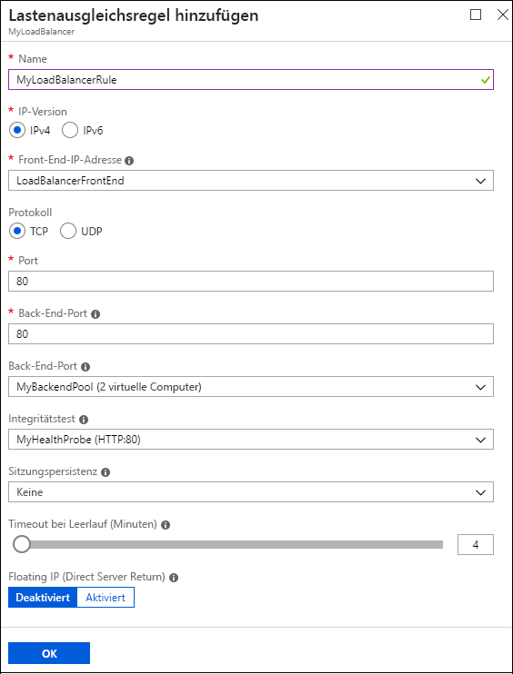

# Schnellstart: Erstellen eines öffentlichen Load Balancers im Tarif „Basic“ mit dem Azure-Portal

Durch die Verteilung der eingehenden Anforderungen auf mehrere virtuelle Computer (VMs) bietet ein Lastenausgleich ein höheres Maß an Verfügbarkeit und Skalierbarkeit. Sie können das Azure-Portal verwenden, um einen Load Balancer für den Lastenausgleich virtueller Computer zu erstellen. In dieser Schnellstartanleitung erfahren Sie, wie Sie Netzwerkressourcen, Back-End-Server und einen Load Balancer im Tarif „Basic“ erstellen.

Wenn Sie kein Azure-Abonnement besitzen, können Sie ein [kostenloses Konto](https://azure.microsoft.com/free/?WT.mc_id=A261C142F) erstellen, bevor Sie beginnen. 

## Melden Sie sich auf dem Azure-Portal an.

Melden Sie sich zur Durchführung aller Aufgaben dieser Schnellstartanleitung am [Azure-Portal](http://portal.azure.com) an.

## Erstellen eines Load Balancers im Tarif „Basic“

In diesem Abschnitt erstellen Sie über das Portal einen öffentlichen Load Balancer im Tarif „Basic“. Die öffentliche IP-Adresse wird automatisch als Front-End des Load Balancers konfiguriert, wenn Sie die öffentliche IP-Adresse und die Lastenausgleichsressource im Portal erstellen. Der Name des Front-Ends lautet **myLoadBalancer**.

1. Wählen Sie oben links im Portal **Ressource erstellen** > **Netzwerk** > **Load Balancer**.
2. Geben Sie im Bereich **Lastenausgleich erstellen** die folgenden Werte ein:
   - **myLoadBalancer** als Name für den Lastenausgleich
   - **Öffentlich** als Typ für den Lastenausgleich 
   - **myPublicIP** als zu erstellende öffentliche IP-Adresse, wobei **SKU** auf **Basic** und **Zuweisung** auf **Dynamisch** festgelegt sein muss
   - **myResourceGroupLB** als Name der neuen Ressourcengruppe
3. Klicken Sie auf **Erstellen**.
   

## Erstellen von Back-End-Servern

In diesem Abschnitt erstellen Sie ein virtuelles Netzwerk sowie zwei virtuelle Computer für den Back-End-Pool Ihres Load Balancers im Tarif „Basic“. Anschließend installieren Sie Internetinformationsdienste (IIS) auf den virtuellen Computern, um das Testen des Load Balancers zu unterstützen.

### Erstellen eines virtuellen Netzwerks
1. Wählen Sie im Portal oben links die Option **Neu** > **Netzwerk** > **Virtuelles Netzwerk**.
2. Geben Sie im Bereich **Virtuelles Netzwerk erstellen** die folgenden Werte ein, und wählen Sie anschließend die Option **Erstellen**:
   - **myVnet** als Name des virtuellen Netzwerks
   - **myResourceGroupLB** als Name der vorhandenen Ressourcengruppe
   - **myBackendSubnet** als Subnetzname

   

### Erstellen von virtuellen Computern

1. Wählen Sie oben links im Portal die Option **Neu** > **Compute** > **Windows Server 2016 Datacenter**. 
2. Geben Sie diese Werte für den virtuellen Computer ein, und wählen Sie anschließend **OK**:
   - **myVM1** als Name des virtuellen Computers        
   - **azureuser** als Name des Administratorbenutzers    
   - **myResourceGroupLB** als Ressourcengruppe (Wählen Sie unter **Ressourcengruppe** die Option **Vorhandene verwenden** und dann **myResourceGroupLB**.)   
3. Wählen Sie als Größe des virtuellen Computers **DS1_V2** aus, und klicken Sie auf **Auswählen**.
4. Geben Sie für die VM-Einstellungen folgende Werte ein:
   - **myAvailabilitySet** als Name der neu erstellten Verfügbarkeitsgruppe
   - **myVNet** als Name des virtuellen Netzwerks (Stellen Sie sicher, dass diese Option ausgewählt ist.)
   - **myBackendSubnet** als Name des Subnetzes (Stellen Sie sicher, dass diese Option ausgewählt ist.)
   - **myVM1-ip** als öffentliche IP-Adresse
   - **myNetworkSecurityGroup** als Name der neuen Netzwerksicherheitsgruppe (NSG, ein Firewalltyp), die Sie erstellen müssen
5. Wählen Sie **Deaktiviert**, um die Startdiagnose zu deaktivieren.
6. Wählen Sie **OK**, überprüfen Sie die Einstellungen auf der Seite „Zusammenfassung“, und wählen Sie anschließend **Erstellen**.
7. Erstellen Sie mit den Schritten 1 bis 6 eine zweite VM mit dem Namen **VM2** und den folgenden Werten:
   - **myAvailabilityset** als Verfügbarkeitsgruppe
   - **myVnet** als virtuelles Netzwerk
   - **myBackendSubnet** als Subnetz
   - **myNetworkSecurityGroup** als Netzwerksicherheitsgruppe 

### Erstellen von NSG-Regeln

In diesem Abschnitt erstellen Sie NSG-Regeln, um eingehende Verbindungen mit Verwendung von HTTP und RDP zuzulassen.

1. Wählen Sie im linken Menü die Option **Alle Ressourcen**. Wählen Sie in der Ressourcenliste in der Ressourcengruppe **myResourceGroupLB** die Option **myNetworkSecurityGroup**.
2. Wählen Sie unter **Einstellungen** die Option **Eingangssicherheitsregeln** und dann **Hinzufügen**.
3. Geben Sie für die Eingangssicherheitsregel **myHTTPRule** folgende Werte ein, um eingehende HTTP-Verbindungen über Port 80 zuzulassen. Wählen Sie dann **OK**aus.
   - **Service Tag** für **Quelle**
   - **Internet** für **Quelldiensttag**
   - **80** für **Zielportbereiche**
   - **TCP** für **Protokoll**
   - **Zulassen** für **Aktion**
   - **100** für **Priorität**
   - **myHTTPRule** für **Name**
   - **Allow HTTP** für **Beschreibung**
 
   
4. Wiederholen Sie die Schritte 2 und 3, um eine weitere Regel mit dem Namen **myRDPRule** zu erstellen und eine eingehende RDP-Verbindung über Port 3389 zuzulassen. Verwenden Sie die folgenden Werte:
   - **Service Tag** für **Quelle**
   - **Internet** für **Quelldiensttag**
   - **3389** für **Zielportbereiche**
   - **TCP** für **Protokoll**
   - **Zulassen** für **Aktion**
   - **200** für **Priorität**
   - **myRDPRule** für **Name**
   - **Allow RDP** für **Beschreibung**

   

### Installieren von IIS

1. Wählen Sie im linken Menü die Option **Alle Ressourcen**. Wählen Sie in der Ressourcenliste in der Ressourcengruppe **myResourceGroupLB** die Option **myVM1**.
2. Wählen Sie auf der Seite **Übersicht** die Option **Verbinden**, um eine RDP-Verbindung mit dem virtuellen Computer herzustellen.
3. Melden Sie sich am virtuellen Computer mit dem Benutzernamen **azureuser** und dem Kennwort **Azure123456!** an.
4. Navigieren Sie auf dem Serverdesktop zu **Windows-Verwaltungsprogramme** > **Server-Manager**.
5. Wählen Sie in Server-Manager die Option **Verwalten** und dann **Rollen und Features hinzufügen**.
   
6. Verwenden Sie im Assistenten „Rollen und Features hinzufügen“ folgende Werte:
   - Wählen Sie auf der Seite **Installationstyp auswählen** die Option **Rollenbasierte oder featurebasierte Installation**.
   - Wählen Sie auf der Seite **Zielserver auswählen** die Option **myVM1**.
   - Wählen Sie auf der Seite **Serverrolle auswählen** die Option **Webserver (IIS)**.
   - Befolgen Sie die Anweisungen, um die restlichen Schritte des Assistenten auszuführen. 
7. Wiederholen Sie die Schritte 1 bis 6 für den virtuellen Computer **myVM2**.

## Erstellen von Ressourcen für den Load Balancer im Tarif „Basic“

In diesem Abschnitt konfigurieren Sie die Load Balancer-Einstellungen für einen Back-End-Adresspool und einen Integritätstest. Außerdem geben Sie den Load Balancer und NAT-Regeln an.

### Erstellen eines Back-End-Adresspools

Zum Verteilen von Datenverkehr auf die virtuellen Computer enthält ein Back-End-Adresspool die IP-Adressen der virtuellen NICs, die mit dem Load Balancer verbunden sind. Erstellen Sie den Back-End-Adresspool **myBackendPool** mit **VM1** und **VM2**.

1. Wählen Sie im Menü auf der linken Seite die Option **Alle Ressourcen** und dann in der Ressourcenliste die Option **myLoadBalancer**.
2. Wählen Sie unter **Einstellungen** die Option **Back-End-Pools** und dann **Hinzufügen**.
3. Gehen Sie auf der Seite **Back-End-Pool hinzufügen** wie folgt vor, um wählen Sie anschließend **OK**:
   - Geben Sie **myBackEndPool** als **Name** ein.
   - Wählen Sie im Dropdownmenü **Zugeordnet zu** die Option **Verfügbarkeitsgruppe** aus.
   - Wählen Sie unter **Verfügbarkeitsgruppe** die Option **myAvailabilitySet**.
   - Wählen Sie **Zielnetzwerk-IP-Konfiguration hinzufügen**, um die virtuellen Computer (**myVM1** und **myVM2**), die Sie erstellt haben, dem Back-End-Pool hinzuzufügen.

   

3. Vergewissern Sie sich, dass in der Back-End-Pool-Einstellung Ihres Lastenausgleichs beide virtuellen Computer (**VM1** und **VM2**) angezeigt werden.

### Erstellen eines Integritätstests

Damit der Load Balancer im Tarif „Basic“ den Status Ihrer App überwachen kann, verwenden Sie einen Integritätstest. Abhängig von der Reaktion auf Integritätsüberprüfungen werden der Load Balancer-Rotation durch den Integritätstest dynamisch virtuelle Computer hinzugefügt oder daraus entfernt. Erstellen Sie zur Überwachung der Integrität der virtuellen Computer einen Integritätstest mit dem Namen **myHealthProbe**.

1. Wählen Sie im Menü auf der linken Seite die Option **Alle Ressourcen** und dann in der Ressourcenliste die Option **myLoadBalancer**.
2. Wählen Sie unter **Einstellungen** die Option **Integritätstests** und dann **Hinzufügen**.
3. Verwenden Sie die folgenden Werte, und wählen Sie anschließend **OK**:
   - **myHealthProbe** als Name des Integritätstests
   - **HTTP** als Protokolltyp
   - **80** als Portnummer
   - **Healthprobe.aspx** für den URI-Pfad. Sie können diesen Wert entweder durch einen beliebigen anderen URI ersetzen oder den Standardpfadwert **"\\"** beibehalten, um den Standard-URI zu erhalten.
   - **15** als **Intervall** (Anzahl von Sekunden zwischen Testversuchen)
   - **2** als **Fehlerschwellenwert** oder Anzahl aufeinander folgender Testfehler, die auftreten müssen, damit ein virtueller Computer als fehlerhaft eingestuft wird

   

### Erstellen einer Load Balancer-Regel

Sie verwenden eine Load Balancer-Regel, um zu definieren, wie Datenverkehr auf die virtuellen Computer verteilt werden soll. Sie definieren die Front-End-IP-Konfiguration für den eingehenden Datenverkehr und den Back-End-IP-Pool zum Empfangen des Datenverkehrs zusammen mit dem erforderlichen Quell- und Zielport. 

Erstellen Sie eine Load Balancer-Regel mit dem Namen **myLoadBalancerRuleWeb** zum Lauschen über Port 80 des Front-Ends **LoadBalancerFrontEnd**. Die Regel gilt auch zum Senden von Netzwerkdatenverkehr, für den ein Lastenausgleich durchgeführt wurde, an den Back-End-Adresspool **myBackEndPool** (ebenfalls über Port 80). 

1. Wählen Sie im Menü auf der linken Seite die Option **Alle Ressourcen** und dann in der Ressourcenliste die Option **myLoadBalancer**.
2. Wählen Sie unter **Einstellungen** die Option **Lastenausgleichsregeln** und dann **Hinzufügen**.
3. Verwenden Sie die folgenden Werte, und wählen Sie anschließend **OK**:
   - **myHTTPRule** als Name der Lastenausgleichsregel
   - **TCP** als Protokolltyp
   - **80** als Portnummer
   - **80** als Back-End-Port
   - **myBackendPool** als Name des Back-End-Pools
   - **myHealthProbe** als Name des Integritätstests
    
   

## Testen des Lastenausgleichs
1. Ermitteln Sie auf dem Bildschirm **Übersicht** die öffentliche IP-Adresse für den Load Balancer. Wählen Sie die Option **Alle Ressourcen** und dann **myPublicIP**.

2. Kopieren Sie die öffentliche IP-Adresse, und fügen Sie sie in die Adressleiste des Browsers ein. Die Standardseite des IIS-Webservers wird im Browser angezeigt.

   

## Bereinigen von Ressourcen

Sie können die Ressourcengruppe, den Load Balancer und alle dazugehörigen Ressourcen löschen, wenn Sie sie nicht mehr benötigen. Wählen Sie die Ressourcengruppe aus, die den Load Balancer enthält, und wählen Sie anschließend **Löschen**.

## Nächste Schritte

In dieser Schnellstartanleitung haben Sie eine Ressourcengruppe, Netzwerkressourcen und Back-End-Server erstellt. Danach haben Sie diese Ressourcen verwendet, um einen Lastenausgleich im Tarif „Basic“ zu erstellen. Weitere Informationen zu Azure Load Balancer finden Sie in den Tutorials zu Azure Load Balancer.

> [!div class="nextstepaction"]
> [Azure Load Balancer-Tutorials](tutorial-load-balancer-basic-internal-portal.md)
