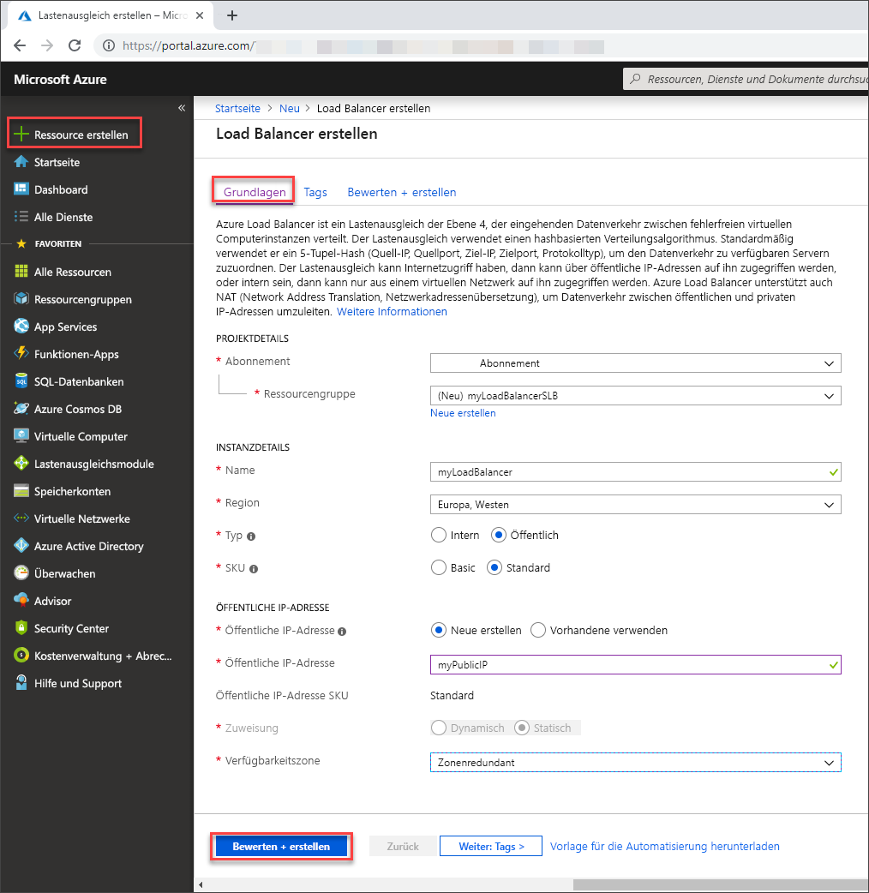

# Schnellstart: Erstellen eines Load Balancers im Tarif „Standard“ für den Lastenausgleich virtueller Computer über das Azure-Portal

Durch die Verteilung der eingehenden Anforderungen auf mehrere virtuelle Computer bietet ein Lastenausgleich ein höheres Maß an Verfügbarkeit und Skalierbarkeit. Sie können das Azure-Portal verwenden, um einen Load Balancer für den Lastenausgleich virtueller Computer (Virtual Machines, VMs) zu erstellen. In dieser Schnellstartanleitung erfahren Sie, wie Sie für den Lastenausgleich virtueller Computer einen Load Balancer im Tarif „Standard“ verwenden.

Wenn Sie kein Azure-Abonnement besitzen, können Sie ein [kostenloses Konto](https://azure.microsoft.com/free/?WT.mc_id=A261C142F) erstellen, bevor Sie beginnen. 

## Anmelden bei Azure

Melden Sie sich unter [https://portal.azure.com](https://portal.azure.com) beim Azure-Portal an.

## Einrichten eines Load Balancers im Tarif „Standard“

In diesem Abschnitt erstellen Sie eine Load Balancer Standard-Instanz für den Lastenausgleich virtueller Computer. Ein Load Balancer im Standard-Tarif unterstützt nur eine öffentliche Standard-IP-Adresse. Wenn Sie einen Load Balancer im Standard-Tarif erstellen, müssen Sie für diesen auch eine neue öffentliche Standard-IP-Adresse erstellen, die als Front-End konfiguriert ist. Dieses hat standardmäßig den Namen *LoadBalancerFrontend*. 

1. Wählens Sie links oben auf dem Bildschirm die Optionen **Ressource erstellen** > **Netzwerk** > **Lastenausgleich** aus.
2. Geben Sie auf der Seite **Lastenausgleich erstellen** auf der Registerkarte **Grundlagen** die folgenden Informationen ein, oder wählen Sie sie aus, übernehmen Sie die Standardwerte für die übrigen Einstellungen, und klicken Sie auf **Überprüfen + erstellen**:

    | Einstellung                 | Wert                                              |
    | ---                     | ---                                                |
    | Abonnement               | Wählen Sie Ihr Abonnement aus.    |    
    | Ressourcengruppe         | Wählen Sie **Neu erstellen** aus, und geben Sie *myResourceGroupSLB* in das Textfeld ein.|
    | NAME                   | *myLoadBalancer*                                   |
    | Region         | Wählen Sie **Europa, Westen** aus.                                        |
    | Type          | Wählen Sie **Öffentlich** aus.                                        |
    | SKU           | Wählen Sie **Standard** aus.                          |
    | Öffentliche IP-Adresse | Wählen Sie **Neu erstellen**. |
    | Name der öffentlichen IP-Adresse              | Geben Sie *myPublicIP* in das Textfeld ein.   |
    |Verfügbarkeitszone| Wählen Sie **Zonenredundant** aus.    |
3. Wählen Sie auf der Registerkarte **Bewerten + erstellen** die Option **Erstellen** aus.   

    

## Erstellen von Load Balancer-Ressourcen

In diesem Abschnitt konfigurieren Sie Load Balancer-Einstellungen für einen Back-End-Adresspool und einen Integritätstest. Außerdem legen Sie eine Lastenausgleichsregel fest.

### Erstellen eines Back-End-Adresspools

Ein Back-End-Adresspool enthält die IP-Adressen der virtuellen NICs, die mit dem Load Balancer verbunden sind, um Datenverkehr an die virtuellen Computer verteilen zu können. Erstellen Sie den Back-End-Adresspool *myBackendPool*, um virtuelle Computer für den Lastenausgleich von Internetdatenverkehr einzubeziehen.

1. Wählen Sie im linken Menü **Alle Dienste** > **Alle Ressourcen** und anschließend in der Ressourcenliste den Eintrag **myLoadBalancer** aus.
2. Wählen Sie unter **Einstellungen** die Option **Back-End-Pools** und dann **Hinzufügen** aus.
3. Geben Sie auf der Seite **Back-End-Pool hinzufügen** die Zeichenfolge *myBackendPool* als Name für Ihren Back-End-Pool ein, und wählen Sie anschließend **Hinzufügen** aus.

### Erstellen eines Integritätstests

Damit der Load Balancer den Status Ihrer App überwachen kann, verwenden Sie einen Integritätstest. Abhängig von der Reaktion auf Integritätsüberprüfungen werden der Load Balancer-Rotation durch den Integritätstest dynamisch virtuelle Computer hinzugefügt oder daraus entfernt. Erstellen Sie zur Überwachung der Integrität der virtuellen Computer einen Integritätstest namens *myHealthProbe*.

1. Wählen Sie im linken Menü **Alle Dienste** > **Alle Ressourcen** und anschließend in der Ressourcenliste den Eintrag **myLoadBalancer** aus.
2. Wählen Sie unter **Einstellungen** die Option **Integritätstests** und dann **Hinzufügen** aus.
    
    | Einstellung | Wert |
    | ------- | ----- |
    | NAME | Geben Sie *myHealthProbe* ein. |
    | Protokoll | Wählen Sie **HTTP** aus. |
    | Port | Geben Sie *80* ein.|
    | Intervall | Geben Sie für das **Intervall** den Wert *15* (Sekunden zwischen Testversuchen) ein. |
    | Fehlerhafter Schwellenwert | Wählen Sie *2* als Wert für den **Fehlerschwellenwert** bzw. als Anzahl aufeinander folgender Testfehler aus, die auftreten müssen, damit ein virtueller Computer als fehlerhaft eingestuft wird.|
    | Integritätstest | Wählen Sie *myHealthProbe* aus. |
4. Klicken Sie auf **OK**.

### Erstellen einer Load Balancer-Regel
Mithilfe einer Load Balancer-Regel wird definiert, wie Datenverkehr auf die virtuellen Computer verteilt werden soll. Sie definieren die Front-End-IP-Konfiguration für den eingehenden Datenverkehr und den Back-End-IP-Pool zum Empfangen des Datenverkehrs zusammen mit dem erforderlichen Quell- und Zielport. Erstellen Sie eine Load Balancer-Regel namens *myLoadBalancerRuleWeb*, die am Port 80 des Front-Ends *FrontendLoadBalancer* lauscht und den Netzwerkdatenverkehr nach erfolgtem Lastenausgleich an den Back-End-Adresspool *myBackEndPool* sendet, wobei ebenfalls der Port 80 verwendet wird. 

1. Wählen Sie im linken Menü **Alle Dienste** > **Alle Ressourcen** und anschließend in der Ressourcenliste den Eintrag **myLoadBalancer** aus.
2. Wählen Sie unter **Einstellungen** die Option **Lastenausgleichsregeln** und dann **Hinzufügen** aus.
3. Konfigurieren Sie die Lastenausgleichsregel mit folgenden Werten:
    
    | Einstellung | Wert |
    | ------- | ----- |
    | NAME | Geben Sie *myHTTPRule* ein. |
    | Protokoll | Wählen Sie **TCP** aus. |
    | Port | Geben Sie *80* ein.|
    | Back-End-Port | Geben Sie *80* ein. |
    | Back-End-Pool | Wählen Sie *myBackendPool* aus.|
    | Integritätstest | Wählen Sie *myHealthProbe* aus. |
4. Übernehmen Sie die übrigen Standardeinstellungen, und wählen Sie **OK**.
4. Klicken Sie auf **OK**.

## Erstellen von Back-End-Servern

In diesem Abschnitt erstellen Sie ein virtuelles Netzwerk sowie zwei virtuelle Computer für den Back-End-Pool des Load Balancers und installieren anschließend IIS auf den virtuellen Computern, um den Load Balancer zu testen.

### Erstellen eines virtuellen Netzwerks
1. Wählen Sie oben links auf dem Bildschirm **Ressource erstellen** > **Netzwerk** > **Virtuelles Netzwerk** aus.

1. Geben Sie in **Virtuelles Netzwerk erstellen** diese Informationen ein, oder wählen Sie sie aus:

    | Einstellung | Wert |
    | ------- | ----- |
    | NAME | Geben Sie *myVNet* ein. |
    | Adressraum | Geben Sie *10.1.0.0/16* ein. |
    | Abonnement | Wählen Sie Ihr Abonnement aus.|
    | Ressourcengruppe | Wählen Sie die vorhandene Ressource *myResourceGroupSLB* aus. |
    | Standort | Wählen Sie **Europa, Westen** aus.|
    | Subnetzname | Geben Sie *myBackendSubnet* ein. |
    | Subnetzadressbereich | Geben Sie *10.1.0.0/24* ein. |
1. Übernehmen Sie die übrigen Standardeinstellungen, und wählen Sie **Erstellen** aus.

### Erstellen von virtuellen Computern
Load Balancer Standard unterstützt nur virtuelle Computer mit Standard-IP-Adressen im Back-End-Pool. In diesem Abschnitt werden zwei virtuelle Computer(*myVM1* und *myVM2*) mit einer öffentlichen Standard-IP-Adresse in zwei verschiedenen Zonen (*Zone 1* und *Zone 2*) erstellt, die dem Back-End-Pool der zuvor erstellten Load Balancer Standard-Instanz hinzugefügt werden.

1. Wählen Sie oben links im Portal die Option **Ressource erstellen** > **Compute** > **Windows Server 2016 Datacenter**. 
   
1. Geben Sie unter **Virtuellen Computer erstellen** auf der Registerkarte **Grundlagen** die folgenden Werte ein (bzw. wählen Sie sie aus):
   - **Abonnement** > **Ressourcengruppe**: Wählen Sie **myResourceGroupSLB** aus.
   - **Instanzendetails** > **Name des virtuellen Computers**: Geben Sie *myVM1* ein.
   - **Instanzendetails** > **Region**: Wählen Sie **Europa, Westen** aus.
   - **Instanzendetails** > **Verfügbarkeitsoptionen**: Wählen Sie **Verfügbarkeitszonen** aus. 
   - **Instanzendetails** > **Verfügbarkeitszone**: Wählen Sie **1** aus.
  
1. Wählen Sie die Registerkarte **Netzwerk** aus, oder wählen Sie **Weiter: Datenträger** und anschließend **Weiter: Netzwerk** aus. 
   
   - Stellen Sie sicher, dass Folgendes ausgewählt ist:
       - **Virtuelles Netzwerk:** *myVnet*
       - **Subnetz:** *myBackendSubnet*
       - **Öffentliche IP-Adresse:** Wählen Sie **Neu erstellen** und anschließend im Fenster **Öffentliche IP-Adresse erstellen** unter **SKU** die Option **Standard** und unter **Verfügbarkeitszone** die Option **Zonenredundant** und dann **OK** aus.
   - Wählen Sie zum Erstellen einer neuen Netzwerksicherheitsgruppe (NSG) – einer Art Firewall – unter **Netzwerksicherheitsgruppe** die Option **Erweitert**. 
       1. Wählen Sie im Feld **Netzwerksicherheitsgruppe konfigurieren** die Option **Neu erstellen**. 
       1. Geben Sie *myNetworkSecurityGroup* ein, und wählen Sie **OK** aus.
   - Führen Sie die folgenden Schritte aus, um den virtuellen Computer dem Back-End-Pool des Load Balancers hinzuzufügen:
        - Wählen Sie unter **Lastenausgleich** für **Diese VM hinter einer vorhandenen Lastenausgleichslösung platzieren?** die Option **Ja** aus.
        - Wählen Sie in den **Lastenausgleichseinstellungen** unter **Optionen für den Lastenausgleich** die Option **Azure Load Balancer** aus.
        - Wählen Sie unter **Load Balancer auswählen** die Option *myLoadBalancer* aus. 
1. Wählen Sie die Registerkarte **Verwaltung** oder **Weiter** > **Verwaltung**. Legen Sie unter **Überwachung** die Option **Startdiagnose** auf **Aus** fest. 
1. Klicken Sie auf **Überprüfen + erstellen**.   
1. Überprüfen Sie die Einstellungen, und wählen Sie dann die Option **Erstellen**.
1. Führen Sie die Schritte zum Erstellen eines zweiten virtuellen Computers mit dem Namen *myVM2*, der öffentlichen IP-Adresse für die Standard-SKU *myVM2-ip* und der **Verfügbarkeitszone** mit dem Wert **2** aus, und verwenden Sie für alle anderen Einstellungen die Werte wie für *myVM1*. 

### Erstellen der NSG-Regel

In diesem Abschnitt erstellen Sie eine Netzwerksicherheitsgruppen-Regel, um eingehende Verbindungen über HTTP zuzulassen.

1. Wählen Sie im linken Menü **Alle Dienste** > **Alle Ressourcen** und anschließend in der Ressourcenliste den Eintrag **myNetworkSecurityGroup** (in der Ressourcengruppe **myResourceGroupSLB**) aus.
2. Wählen Sie unter **Einstellungen** die Option **Eingangssicherheitsregeln** und dann **Hinzufügen**.
3. Geben Sie für die Eingangssicherheitsregel *myHTTPRule* folgende Werte ein, um eine eingehende HTTP-Verbindung über den Port 80 zuzulassen:
    - *Service Tag* für **Quelle**
    - *Internet* für **Quelldiensttag**
    - *80* für **Zielportbereiche**
    - *TCP* für **Protokoll**
    - *Zulassen* für **Aktion**
    - *100* für **Priorität**
    - *myHTTPRule* als Name
    - *Allow HTTP* als Beschreibung
4. Klicken Sie auf **OK**.
 
### Installieren von IIS

1. Wählen Sie im linken Menü **Alle Dienste** > **Alle Ressourcen** und anschließend in der Ressourcenliste den Eintrag **myVM1** (in der Ressourcengruppe *myResourceGroupSLB*) aus.
2. Wählen Sie auf der Seite **Übersicht** die Option **Verbinden**, um eine RDP-Verbindung mit dem virtuellen Computer herzustellen.
3. Melden Sie mit dem Benutzernamen *azureuser* bei dem virtuellen Computer.
4. Navigieren Sie auf dem Serverdesktop zu **Windows-Verwaltungsprogramme**>**Server-Manager**.
5. Wählen Sie in Server-Manager die Option **Rollen und Features hinzufügen** aus.
6. Verwenden Sie im Assistenten **Rollen und Features hinzufügen** folgende Werte:
    - Wählen Sie auf der Seite **Installationstyp auswählen** die Option **Rollenbasierte oder featurebasierte Installation** aus.
    - Wählen Sie auf der Seite **Zielserver auswählen** die Option **myVM1** aus.
    - Wählen Sie auf der Seite **Serverrolle auswählen** die Option **Webserver (IIS)** aus.
    - Folgen Sie den Anweisungen, um den restlichen Assistenten abzuschließen. 
7. Wiederholen Sie die Schritte 1 bis 6 für den virtuellen Computer *myVM2*.

## Testen des Load Balancers
1. Ermitteln Sie auf dem Bildschirm **Übersicht** die öffentliche IP-Adresse für den Load Balancer. Wählen Sie im linken Menü **Alle Dienste** > **Alle Ressourcen** und anschließend **myPublicIP** aus.

2. Kopieren Sie die öffentliche IP-Adresse, und fügen Sie sie in die Adressleiste des Browsers ein. Die Standardseite des IIS-Webservers wird im Browser angezeigt.

      

Sie können eine erzwungene Aktualisierung Ihres Webbrowsers durchführen, um zu verfolgen, wie der Load Balancer den Datenverkehr auf alle drei virtuellen Computer verteilt, auf denen Ihre App ausgeführt wird.

## Bereinigen von Ressourcen

Löschen Sie die Ressourcengruppe, den Load Balancer und alle zugehörigen Ressourcen, wenn Sie sie nicht mehr benötigen. Wählen Sie hierzu die Ressourcengruppe (*myResourceGroupSLB*) aus, die den Load Balancer enthält, und wählen Sie anschließend **Löschen** aus.

## Nächste Schritte

In diesem Schnellstart haben Sie eine Load Balancer Standard-Instanz erstellt, virtuelle Computer angefügt, die Datenverkehrsregel für den Load Balancer sowie einen Integritätstest konfiguriert und den Load Balancer getestet. Weitere Informationen zu Azure Load Balancer finden Sie in den Tutorials zu Azure Load Balancer.

> [!div class="nextstepaction"]
> [Azure Load Balancer-Tutorials](tutorial-load-balancer-standard-public-zone-redundant-portal.md)
