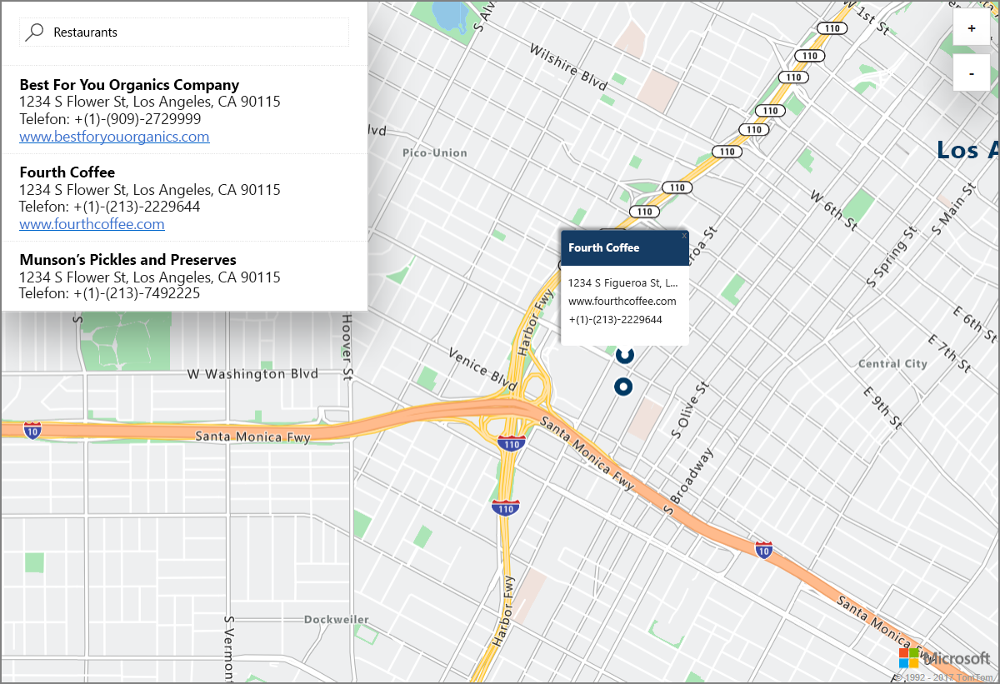

# Starten einer Demonstration für die interaktive Kartensuche mit Azure Location Based Services (Vorschau)

In diesem Artikel werden die Funktionen von Azure Location Based Services (LBS) unter Verwendung einer interaktiven Suche mit Azure Maps veranschaulicht. Zudem werden die grundlegenden Schritte zum Erstellen eines eigenen LBS-Kontos sowie zum Abrufen des Schlüssels für das Konto beschrieben, der in der Demo-Webanwendung verwendet wird. 

Wenn Sie kein Azure-Abonnement besitzen, können Sie ein [kostenloses Konto](https://azure.microsoft.com/free/?WT.mc_id=A261C142F) erstellen, bevor Sie beginnen.

## Anmelden beim Azure-Portal

Melden Sie sich beim [Azure-Portal](https://portal.azure.com/)an.

## Erstellen eines Location Based Services-Kontos und Abrufen des Kontoschlüssels

1. Klicken Sie im [Azure-Portal](https://portal.azure.com) links oben auf **Ressource erstellen**.
2. Geben Sie im Feld *Marketplace durchsuchen* den Namen **location based services** ein.
3. Klicken Sie unter *Ergebnisse* auf **Location Based Services (Vorschauversion)**. Klicken Sie auf die unterhalb der Karte angezeigte Schaltfläche **Erstellen**. 
4. Geben Sie auf der Seite **Location Based Services-Konto erstellen** unter *Name* den Namen des neuen Kontos ein, wählen Sie das zu verwendende *Abonnement* aus, und geben Sie den Namen einer neuen oder vorhandenen *Ressourcengruppe* ein. Wählen Sie den Speicherort für die Ressourcengruppe aus, akzeptieren Sie die *Nutzungsbedingungen für die Vorschau*, und klicken Sie auf **Erstellen**.

    

5. Nachdem Ihr Konto erfolgreich erstellt wurde, öffnen Sie es, und navigieren Sie zu den **EINSTELLUNGEN** des Kontos. Klicken Sie auf **Schlüssel**, um den primären und sekundären Schlüssel für Ihr Azure Location Based Services-Konto zu erhalten. Kopieren Sie den Wert für den **Primärschlüssel** zur Verwendung im folgenden Abschnitt in die lokale Zwischenablage. 

## Herunterladen der Demoanwendung für Azure Maps

1. Laden Sie den Inhalt der Datei [interactiveSearch.html](https://github.com/Azure-Samples/location-based-services-samples/blob/master/src/interactiveSearch.html) herunter, oder kopieren Sie ihn.
2. Speichern Sie den Inhalt dieser Datei lokal unter **AzureMapDemo.html**, und öffnen Sie die Datei in einem Text-Editor.
3. Suchen Sie nach der Zeichenfolge `<insert-key>`, und ersetzen Sie sie durch den Wert für den **Primärschlüssel**, den Sie im vorherigen Abschnitt abgerufen haben. 

## Starten der Demoanwendung für Azure Maps

1. Öffnen Sie die Datei **AzureMapDemo.html** in einem Browser Ihrer Wahl.
2. Die Karte von Los Angeles wird angezeigt. Die Stadt wird durch den Wert des `[longitude, latitude]`-Paars festgelegt, das für die JavaScript-Variable **center** in der Datei *AzureMapDemo.html* angegeben ist. Sie können diese Koordinaten in die Koordinaten jedes anderen Orts Ihrer Wahl ändern. Die Koordinaten für New York lauten z.B. *[-74.0060, 40.7128]*.
3. Geben Sie im Suchfeld oben links in der Demo-Webanwendung einen Standorttyp oder eine Adresse ein, nach denen Sie suchen möchten. 
4. Bewegen Sie den Mauszeiger über die Liste der Adressen/Standorte, die unterhalb des Suchfelds angezeigt werden. Beachten Sie dabei, wie über dem entsprechenden Pin auf der Karte Informationen zum jeweiligen Standort angezeigt werden. Beim Start dieser Webanwendung und der Suche nach *Restaurants* wird beispielsweise Folgendes angezeigt. Beachten Sie, dass hier zum Schutz von Privatunternehmen fiktive Namen und Adressen angezeigt werden. 

    

## Bereinigen von Ressourcen

In den Tutorials wird im Detail beschrieben, wie die Azure Location Based Services für Ihr Konto verwendet und konfiguriert werden können. Wenn Sie mit den Tutorials fortfahren möchten, sollten Sie die in diesem Schnellstart erstellten Ressourcen nicht bereinigen. Falls Sie nicht fortfahren möchten, führen Sie die folgenden Schritte aus, um alle erstellten Ressourcen zu löschen, die im Rahmen dieser Schnellstartanleitung erstellt wurden:

1. Schließen Sie den Browser, in dem die Webanwendung **AzureMapDemo.html** ausgeführt wird.
2. Klicken Sie im Azure-Portal im Menü auf der linken Seite auf **Alle Ressourcen**, und wählen Sie Ihr LBS-Konto aus. Klicken Sie im oberen Bereich des Blatts **Alle Ressourcen** auf **Löschen**.

## Nächste Schritte

In diesem Schnellstart haben Sie Ihr Azure LBS-Konto erstellt und über dieses Konto eine Demoanwendung gestartet. Informationen zum Erstellen Ihrer eigenen Anwendung mithilfe der Azure Location Based Services-APIs finden Sie im folgenden Tutorial.

> [!div class="nextstepaction"]
> [Suchen nach einem interessanten Ort in der Nähe mit Azure Location Based Services](./tutorial-search-location.md)
