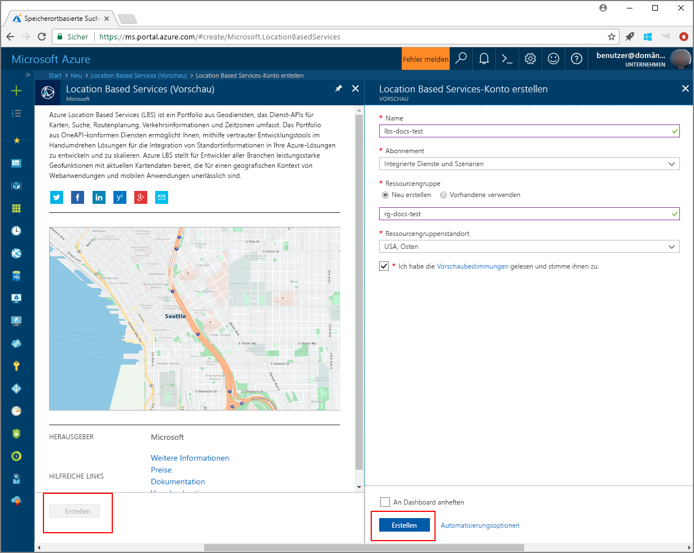

# <a name="search-nearby-points-of-interest-using-azure-location-based-services"></a>Suchen nach Points of Interest in der Nähe mit Azure Location Based Services

In diesem Tutorial wird gezeigt, wie Sie ein Konto für Azure Location Based Services einrichten und anschließend mithilfe der bereitgestellten APIs nach einem Point of Interest suchen. In diesem Tutorial lernen Sie Folgendes:

> [!div class="checklist"]
> * Erstellen eines Kontos für Azure Location Based Services
> * Ermitteln des Primärschlüssels für Ihr Azure Location Based Services-Konto
> * Erstellen einer neuen Webseite mit der Kartensteuerelement-API
> * Suchen eines Point of Interest in der Nähe mithilfe des Suchdiensts

Wenn Sie kein Azure-Abonnement besitzen, können Sie ein [kostenloses Konto](https://azure.microsoft.com/free/) erstellen, bevor Sie beginnen.

## <a name="log-in-to-the-azure-portal"></a>Anmelden beim Azure-Portal
Melden Sie sich beim [Azure-Portal](https://portal.azure.com)an.

<a id="createaccount"></a>

## <a name="create-an-account-with-azure-location-based-services"></a>Erstellen eines Kontos für Azure Location Based Services

Führen Sie die folgenden Schritte aus, um ein neues Location Based Services-Konto zu erstellen.

1. Klicken Sie im [Azure-Portal](https://portal.azure.com) oben links auf **Ressource erstellen**.
2. Geben Sie im Feld *Marketplace durchsuchen* den Namen **location based services** ein.
3. Klicken Sie unter *Ergebnisse* auf **Location Based Services (Vorschauversion)**. Klicken Sie auf die unterhalb der Karte angezeigte Schaltfläche **Erstellen**. 
4. Geben Sie auf der Seite **Location Based Services-Konto erstellen** die folgenden Werte ein:
    - *Name* des neuen Kontos 
    - *Abonnement*, das Sie für dieses Konto verwenden möchten
    - Name der *Ressourcengruppe* für dieses Konto. Sie können für die Ressourcengruppe die Option *Neu erstellen* oder die Option *Vorhandene verwenden* auswählen.
    - Wählen Sie den *Ressourcengruppenstandort*.
    - Lesen Sie die *Nutzungsbedingungen für die Vorschau*, und aktivieren Sie das Kontrollkästchen, um die Bedingungen zu akzeptieren. 
    - Klicken Sie schließlich auf die Schaltfläche **Erstellen**.
   
    


<a id="getkey"></a>

## <a name="get-the-primary-key-for-your-account"></a>Abrufen des Primärschlüssels für Ihr Konto

Führen Sie nach der Erstellung des Location Based Services-Kontos die folgenden Schritte aus, um es mit den APIs für die Kartensuche zu verknüpfen:

1. Öffnen Sie Ihr Location Based Services-Konto im Portal.
2. Navigieren Sie zu den **EINSTELLUNGEN** Ihres Kontos, und klicken Sie auf **Schlüssel**.
3. Kopieren Sie den **Primärschlüssel** in die Zwischenablage. Speichern Sie ihn lokal, um ihn später zu verwenden. 

    


<a id="createmap"></a>

## <a name="create-new-web-page-using-azure-map-control-api"></a>Erstellen einer neuen Webseite mit der Kartensteuerelement-API von Azure
Bei der Kartensteuerelement-API von Azure handelt es sich um eine praktische Clientbibliothek, die die einfache Integration von Azure Location Based Services in Ihre Webanwendung ermöglicht. Sie vereinfacht reine REST-Dienstaufrufe und steigert Ihre Produktivität mit anpassbaren Komponenten. Die folgenden Schritte veranschaulichen, wie Sie eine statische HTML-Seite erstellen, in die die Kartensteuerelement-API von Location Based Services eingebettet ist. 

1. Erstellen Sie auf dem lokalen Computer eine neue Datei, und nennen Sie sie **MapSearch.html**. 
2. Fügen Sie der Datei die folgenden HTML-Komponenten hinzu:

    ```HTML
    <!DOCTYPE html>
    <html lang="en">

    <head>
        <meta charset="utf-8" />
        <meta name="viewport" content="width=device-width, user-scalable=no" />
        <title>Map Search</title>

        <link rel="stylesheet" href="https://atlas.microsoft.com/sdk/css/atlas.min.css?api-version=1.0" type="text/css" />
        <script src="https://atlas.microsoft.com/sdk/js/atlas.min.js?api-version=1.0"></script>

        <style>
            html,
            body {
                width: 100%;
                height: 100%;
                padding: 0;
                margin: 0;
            }

            #map {
                width: 100%;
                height: 100%;
            }
        </style>
    </head>

    <body>
        <div id="map"></div>
        <script>
            // Embed Map Control JavaScript code here
        </script>
    </body>

    </html>
    ``` 
    Beachten Sie, dass der HTML-Header die CSS- und JavaScript-Ressourcendateien enthält, die von der Azure-Kartensteuerelement-Bibliothek gehostet werden. Beachten Sie außerdem das Segment *script*, das zum Abschnitt *body* der HTML-Datei hinzugefügt wurde. Dieses Segment enthält den JavaScript-Inlinecode für den Zugriff auf die Azure Location Based Services-APIs.
 
3.  Fügen Sie dem *script*-Block der HTML-Datei den folgenden JavaScript-Code hinzu. Verwenden Sie den Primärschlüssel Ihres Location Based Services-Kontos im Skript. 

    ```JavaScript
    // Instantiate map to the div with id "map"
    var LBSAccountKey = "<_your account key_>";
    var map = new atlas.Map("map", {
        "subscription-key": LBSAccountKey
    });
    ```
    In diesem Segment wird die Kartensteuerelement-API für den Schlüssel Ihres Azure Location Based Services-Kontos initiiert. **Atlas** ist der Namespace, der die Azure-Kartensteuerelement-API und die zugehörigen visuellen Komponenten enthält. **atlas.Map** stellt das Steuerelement für ein visuelles Element und eine interaktive Webkarte bereit. Sie können sich ansehen, wie die Karte aussieht, indem Sie die HTML-Seite im Browser öffnen. 

4. Fügen Sie den folgenden JavaScript-Code zum Block *script* hinzu, um eine Ebene mit Suchpins zum Kartensteuerelement hinzuzufügen:

    ```JavaScript
    // Initialize the pin layer for search results to the map
    var searchLayerName = "search-results";
    map.addPins([], {
        name: searchLayerName,
        cluster: false,
        icon: "pin-round-darkblue"
    });
    ```

5. Speichern Sie die Datei auf Ihrem Computer. 


<a id="usesearch"></a>

## <a name="use-search-service-to-find-nearby-point-of-interest"></a>Suchen eines Point of Interest in der Nähe mithilfe des Suchdiensts

In diesem Abschnitt wird veranschaulicht, wie mit der Suchdienst-API von Azure Location Based Services ein Point of Interest auf Ihrer Karte gesucht wird. Es handelt sich um eine RESTful-API für Entwickler für die Suche nach Adressen, Points of Interest und geografischen Informationen. Der Suchdienst ordnet einer bestimmten Adresse Informationen zu Breiten- und Längengrad zu. 

1. Öffnen Sie die im vorherigen Abschnitt erstellte Datei **MapSearch.html**, und fügen Sie den folgenden JavaScript-Code zum Block *script* hinzu, um die Funktionen des Suchdiensts nachzuvollziehen. 
    ```JavaScript
    // Perform a request to the search service and create a pin on the map for each result
    var xhttp = new XMLHttpRequest();
    xhttp.onreadystatechange = function () {
        var searchPins = [];

        if (this.readyState === 4 && this.status === 200) {
            var response = JSON.parse(this.responseText);

            var poiResults = response.results.filter((result) => { return result.type === "POI" }) || [];

            searchPins = poiResults.map((poiResult) => {
                var poiPosition = [poiResult.position.lon, poiResult.position.lat];
                return new atlas.data.Feature(new atlas.data.Point(poiPosition), {
                    name: poiResult.poi.name,
                    address: poiResult.address.freeformAddress,
                    position: poiResult.position.lat + ", " + poiResult.position.lon
                });
            });

            map.addPins(searchPins, {
                name: searchLayerName
            });

            var lons = searchPins.map((pin) => { return pin.geometry.coordinates[0] });
            var lats = searchPins.map((pin) => { return pin.geometry.coordinates[1] });

            var swLon = Math.min.apply(null, lons);
            var swLat = Math.min.apply(null, lats);
            var neLon = Math.max.apply(null, lons);
            var neLat = Math.max.apply(null, lats);

            map.setCameraBounds({
                bounds: [swLon, swLat, neLon, neLat],
                padding: 50
            });
        }
    };
    ```
    Dieser Codeausschnitt erstellt [XMLHttpRequest](https://xhr.spec.whatwg.org/) und fügt einen Ereignishandler zum Analysieren der eingehenden Antwort hinzu. Für eine erfolgreiche Antwort werden die Adressen, Namen und Breiten- und Längengradinformationen für jeden zurückgegebenen Ort in der Variable `searchPins` gesammelt. Schließlich wird diese Sammlung von Ortspunkten als Pins zum `map`-Steuerelement hinzugefügt. 

2. Fügen Sie den folgenden Code zum Block *script* hinzu, um „XMLHttpRequest“ an den Azure Location Based Services-Suchdienst zu senden:

    ```JavaScript
    var url = "https://atlas.microsoft.com/search/fuzzy/json?";
    url += "&api-version=1.0";
    url += "&query=gasoline%20station";
    url += "&subscription-key=" + LBSAccountKey;
    url += "&lat=47.6292";
    url += "&lon=-122.2337";
    url += "&radius=100000";

    xhttp.open("GET", url, true);
    xhttp.send();
    ``` 
    Dieser Codeausschnitt verwendet die Standardsuche-API (**Fuzzysuche**) des Suchdiensts. Diese Suche ist für ungenaue Angaben vorgesehen und verarbeitet beliebige Kombinationen aus Adress- oder *POI*-Token. Sie sucht für die angegebene Adresse am Breiten- und Längengrad und innerhalb des angegebenen Radius nach einer nahe gelegenen **Tankstelle**. Der Aufruf von Location Based Services erfolgt unter Verwendung des Primärschlüssels für Ihr Konto, der zuvor in der Beispieldatei bereitgestellt wurde. Die Ergebnisse werden für die gefundenen Orte als Breiten-/Längengradpaare zurückgegeben. Sie können sich die Suchpins ansehen, indem Sie die HTML-Seite im Browser öffnen. 

3. Fügen Sie die folgenden Zeilen zum Block *script* hinzu, um Popups für die vom Suchdienst zurückgegebenen gewünschten Orte zu erstellen:

    ```JavaScript
    // Add a popup to the map which will display some basic information about a search result on hover over a pin
    var popup = new atlas.Popup();
    map.addEventListener("mouseover", searchLayerName, (e) => {
        var popupContentElement = document.createElement("div");
        popupContentElement.style.padding = "5px";

        var popupNameElement = document.createElement("div");
        popupNameElement.innerText = e.features[0].properties.name;
        popupContentElement.appendChild(popupNameElement);

        var popupAddressElement = document.createElement("div");
        popupAddressElement.innerText = e.features[0].properties.address;
        popupContentElement.appendChild(popupAddressElement);

        var popupPositionElement = document.createElement("div");
        popupPositionElement.innerText = e.features[0].properties.position;
        popupContentElement.appendChild(popupPositionElement);

        popup.setPopupOptions({
            position: e.features[0].geometry.coordinates,
            content: popupContentElement
        });

        popup.open(map);
    });
    ```
    Die API **atlas.Popup** stellt ein Informationsfenster bereit, das an der erforderlichen Position auf der Karte verankert ist. Der Codeausschnitt legt den Inhalt und die Position für das Popup fest, fügt einen Ereignislistener zum `map`-Steuerelement hinzu und wartet, dass die _Maus_ über das Popup bewegt wird. 

4. Speichern Sie die Datei, öffnen Sie dann die Datei **MapSearch.html** in einem Webbrowser Ihrer Wahl, und sehen Sie sich das Ergebnis an. Auf der Karte im Browser werden jetzt Popupelemente mit Informationen angezeigt, wenn Sie mit der Maus auf einen der angezeigten Suchpins zeigen. Das sieht etwa wie folgt aus: 

    


## <a name="next-steps"></a>Nächste Schritte
In diesem Tutorial haben Sie Folgendes gelernt:

> [!div class="checklist"]
> * Erstellen eines Kontos für Azure Location Based Services
> * Abrufen des Primärschlüssels für Ihr Konto
> * Erstellen einer neuen Webseite mit der Kartensteuerelement-API
> * Suchen eines Point of Interest in der Nähe mithilfe des Suchdiensts

Fahren Sie mit dem Tutorial [Route zu einem Point of Interest in der Nähe mit Azure Location Based Services](./tutorial-route-location.md) fort, um zu erfahren, wie Sie mit Azure Location Based Services eine Route zum Point of Interest ermitteln. 
