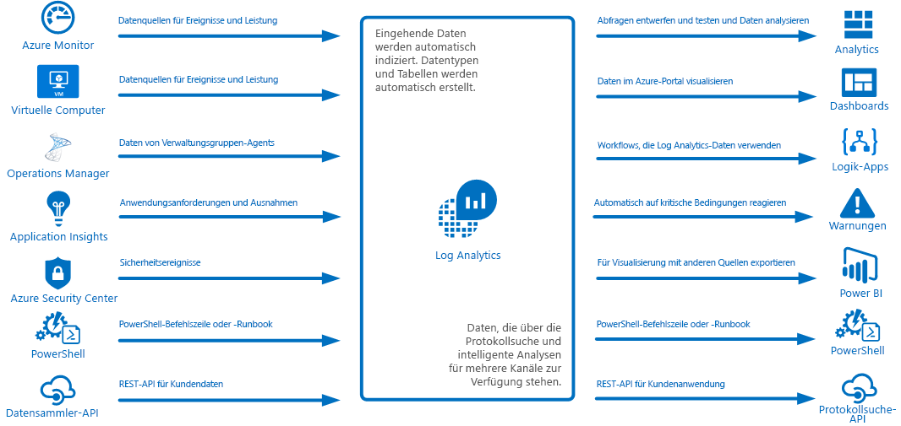
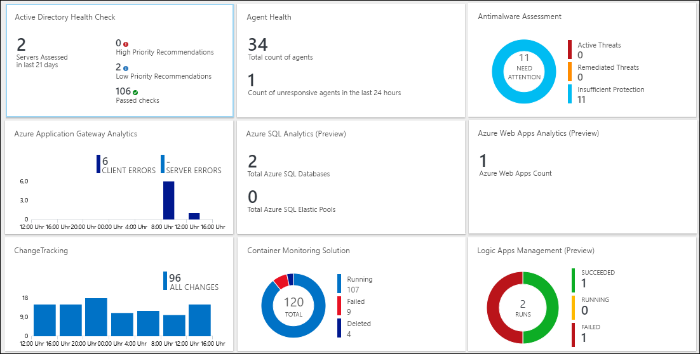
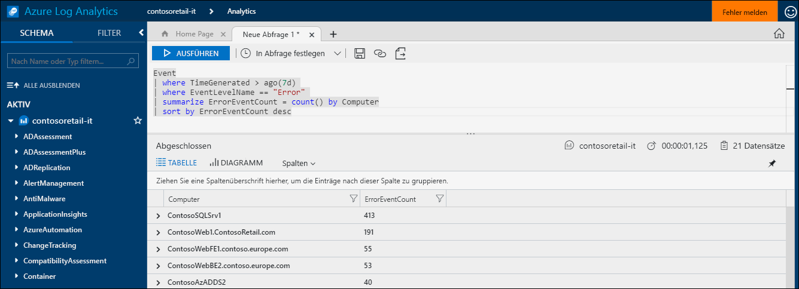
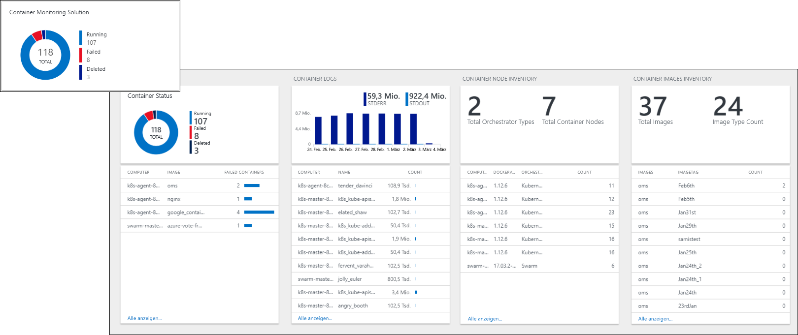
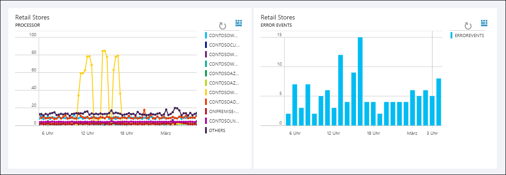
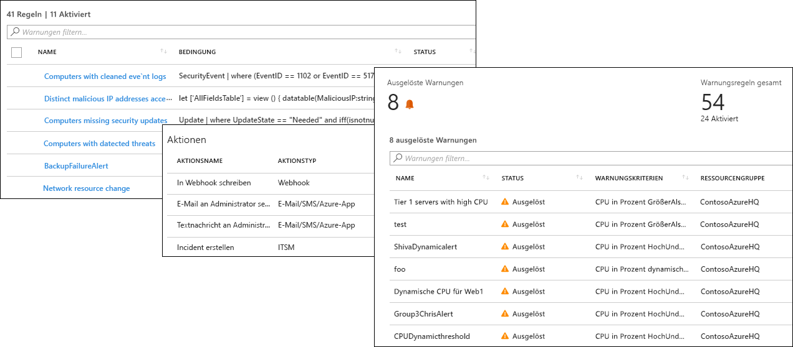
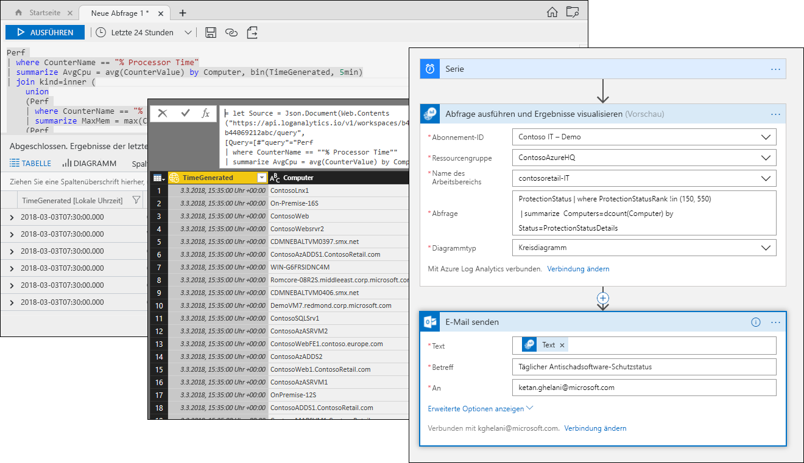

# Was ist Azure Log Analytics?
Log Analytics spielt eine zentrale Rolle bei der Azure-Verwaltung, indem Telemetriedaten und andere Daten aus vielen verschiedenen Quellen gesammelt und eine Abfragesprache und ein Analysemodul bereitgestellt werden, damit Sie Einblicke in die Abläufe Ihrer Anwendungen und Ressourcen erhalten.  Sie können entweder über Protokollsuchen und Ansichten direkt mit Log Analytics-Daten interagieren, oder Sie können Analysetools in anderen Azure-Diensten nutzen, z.B. Application Insights oder Azure Security Center, bei denen die Daten in Log Analytics gespeichert werden.  

Für Log Analytics ist nur eine minimale Konfiguration erforderlich, und die Anwendung ist bereits in andere Azure-Dienste integriert.  Sie müssen nur einen Arbeitsbereich erstellen, um das Sammeln zu aktivieren.  Anschließend können Sie Agents auf virtuellen Computern installieren, um sie in den Arbeitsbereich einzubinden, und Verwaltungslösungen mit einer Logik aktivieren, mit der weitere Erkenntnisse zu verschiedenen Anwendungen gewonnen werden können.  Im Hintergrund sind Datentypen entweder vordefiniert oder werden beim Sammeln der Daten automatisch erstellt.

## Rolle bei der Überwachung

Die verschiedenen Überwachungsdienste in Azure sind unter [Überwachen von Azure-Anwendungen und -Ressourcen](../monitoring-and-diagnostics/monitoring-overview.md) beschrieben.  Log Analytics spielt eine zentrale Rolle, indem Überwachungsdaten aus unterschiedlichen Quellen zusammengefasst werden und eine leistungsstarke Abfragesprache für die Konsolidierung und Analyse bereitgestellt wird.  

Log Analytics ist aber nicht allein auf die Überwachung von Azure-Ressourcen beschränkt.  Die Anwendung ermöglicht das Sammeln von Daten von Ressourcen, die lokal oder in anderen Clouds angeordnet sind, um eine Hybrid-Überwachungsumgebung zu erstellen. Außerdem kann eine direkte Verbindung mit System Center Operations Manager hergestellt werden, um Telemetriedaten von vorhandenen Agents zu sammeln.  Analysetools in Log Analytics (wie Protokollsuche, Ansichten und Verwaltungslösungen) berücksichtigen alle gesammelten Daten und ermöglichen somit eine zentrale Analyse Ihrer gesamten Umgebung.

## Datensammlung
Log Analytics sammelt Daten aus vielen verschiedenen Quellen.  Nachdem die Daten gesammelt wurden, werden sie in separaten Tabellen für die einzelnen Datentypen angeordnet, damit alle Daten unabhängig von der ursprünglichen Quelle zusammen analysiert werden können.

Es gibt die folgenden Methoden zum Sammeln von Daten in Log Analytics:

- Konfigurieren Sie Azure Monitor so, dass von Azure-Ressourcen gesammelte Metriken und Protokolle kopiert werden.
- Agents auf virtuellen [Windows](log-analytics-windows-agent.md)- und [Linux](log-analytics-linux-agents.md)-Computern senden Telemetriedaten basierend auf den von Ihnen konfigurierten [Datenquellen](log-analytics-data-sources.md) aus dem Gastbetriebssystem und aus Anwendungen an Log Analytics.  
- Stellen Sie für eine [System Center Operations Manager-Verwaltungsgruppe](log-analytics-om-agents.md) eine Verbindung mit Log Analytics her, um Daten von den dazugehörigen Agents zu sammeln.
- Azure-Dienste, z.B. [Application Insights](https://docs.microsoft.com/azure/application-insights/) und [Azure Security Center](https://docs.microsoft.com/azure/security-center/), speichern ihre Daten ohne Konfiguration direkt in Log Analytics.
- Schreiben Sie Daten über die PowerShell-Befehlszeile oder das [Azure Automation-Runbook](../automation/automation-runbook-types.md), indem Sie Log Analytics-Cmdlets verwenden.
- Wenn Sie besondere Anforderungen haben, können Sie die [HTTP-Datensammler-API](log-analytics-data-collector-api.md) verwenden, um Daten eines beliebigen REST-API-Clients in Log Analytics zu schreiben.

## Hinzufügen von Funktionen mit Verwaltungslösungen
[Verwaltungslösungen](log-analytics-add-solutions.md) verfügen über eine vorgefertigte Logik für ein bestimmtes Produkt oder Szenario.  Es kann passieren, dass zusätzliche Daten in Log Analytics gesammelt werden, die bereits erfasst wurden.  Normalerweise verfügen sie über eine Ansicht, damit Sie diese zusätzlichen Daten analysieren können.  Lösungen stehen für verschiedenste Funktionen zur Verfügung, und es kommen kontinuierlich weitere Lösungen hinzu.  Im Azure Marketplace können Sie komfortabel nach verfügbaren Lösungen suchen und sie [Ihrem Arbeitsbereich hinzufügen](log-analytics-add-solutions.md).  

## Abfragesprache

Log Analytics enthält eine [umfassende Abfragesprache](http://docs.loganalytics.io), mit der gesammelte Daten schnell abgerufen, zusammengefasst und analysiert werden können.  Sie können Abfragen mit dem [Portal für die Protokollsuche oder die erweiterte Analyse](log-analytics-log-search-portals.md) erstellen und testen und die Daten mit diesen Tools dann entweder direkt analysieren oder Abfragen zur Verwendung mit Visualisierungen, Warnungen oder für Exporte in andere Tools wie Power BI oder Excel speichern.

Die Log Analytics-Abfragesprache ist für einfache Protokollsuchen geeignet, aber sie enthält auch erweiterte Funktionen, z.B. Aggregationen, Verknüpfungen und intelligente Analysen. Sie können die Abfragesprache schnell erlernen, indem Sie [mehrere verfügbare Tutorials](https://docs.loganalytics.io/docs/Learn/Tutorials) verwenden.  Es ist eine spezielle Anleitung für Benutzer vorhanden, die bereits mit [SQL](https://docs.loganalytics.io/docs/Learn/References/SQL-to-Azure-Log-Analytics) und [Splunk](https://docs.loganalytics.io/docs/Learn/References/Splunk-to-Azure-Log-Analytics) vertraut sind.

## Visualisieren von Log Analytics-Daten

In den [Ansichten in Log Analytics](log-analytics-view-designer.md) werden Daten aus Protokollsuchen visuell dargestellt.  Jede Ansicht enthält eine Kombination aus Visualisierungen, z.B. Balken- und Liniendiagramme, sowie Listen, in denen wichtige Daten zusammengefasst sind.  [Verwaltungslösungen](#add-functionality-with-management-solutions) enthalten Ansichten, in denen Daten für eine bestimmte Anwendung zusammengefasst sind, und Sie können Ihre eigenen Ansichten erstellen, um Daten aus beliebigen Log Analytics-Protokollsuchen darzustellen.

Sie können die Ergebnisse einer Log Analytics-Abfrage auch in einem [Azure-Dashboard](../azure-portal/azure-portal-dashboards.md) anheften, um Kacheln verschiedener Azure-Dienste zu kombinieren.  Außerdem können Sie eine Log Analytics-Ansicht in einem Dashboard anheften.

## Erstellen von Warnungen aus Log Analytics-Daten

Verwenden Sie [Azure-Warnungen](../monitoring-and-diagnostics/monitoring-overview-unified-alerts.md), damit Sie proaktiv über Bedingungen in Log Analytics-Daten benachrichtigt werden, die für Sie wichtig sind.  Eine Abfrage wird in geplanten Intervallen automatisch ausgeführt, und es wird eine Warnung erstellt, wenn die Ergebnisse bestimmte Kriterien erfüllen.  Auf diese Weise können Sie Warnungen aus Log Analytics mit anderen Quellen kombinieren, z.B. Warnungen nahezu in Echtzeit (Near Real Time Alerts), [Azure Monitor](../monitoring-and-diagnostics/monitoring-near-real-time-metric-alerts.md) und Anwendungsausnahmen, [Application Insights](../application-insights/app-insights-alerts.md) und die gemeinsame Nutzung von [Aktionsgruppen](../monitoring-and-diagnostics/monitoring-action-groups.md) als Reaktion auf Warnungsbedingungen.

## Verwenden von Log Analytics-Daten in anderen Diensten
Dienste wie Application Insights und Azure Security Center speichern ihre Daten in Log Analytics.  Normalerweise interagieren Sie mit den umfassenden Analysetools, die von diesen Diensten bereitgestellt werden. Sie können aber auch Log Analytics-Abfragen verwenden, um auf die entsprechenden Daten zuzugreifen und diese ggf. mit Daten aus anderen Diensten zu kombinieren.  

Die folgende Ansicht stammt beispielsweise aus Application Insights.  Wenn Sie auf das Symbol oben rechts klicken, wird die Analytics-Konsole von Log Analytics mit den vom Graphen verwendeten Abfragen gestartet.

## Exportieren von Log Analytics-Daten

Log Analytics macht seine Daten auch außerhalb von Azure verfügbar.  Sie können [Power BI](log-analytics-powerbi.md) so konfigurieren, dass die Ergebnisse einer Abfrage in geplanten Intervallen importiert werden. So können Sie Features wie das Kombinieren der Daten unterschiedlicher Quellen und das Teilen von Berichten im Web und auf mobilen Geräten nutzen.  Sie können auch die [Protokollsuch-API](log-analytics-log-search-api.md) verwenden, um benutzerdefinierte Lösungen zu erstellen, die Log Analytics-Daten nutzen, oder um sie in andere Systeme zu integrieren.

Sie können [Logic Apps](../logic-apps/logic-apps-overview.md) in Azure verwenden, um basierend auf Log Analytics-Daten benutzerdefinierte Workflows zu erstellen.  Für komplexere Logik, die auf PowerShell basiert, können Sie [Runbooks in Azure Automation](../automation/automation-runbook-types.md) verwenden.

## Nächste Schritte
- Beginnen Sie, indem Sie [Daten von Azure-VMs sammeln](log-analytics-quick-collect-azurevm.md).
- Arbeiten Sie ein [Tutorial zur Analyse von Log Analytics-Daten mit einer einfachen Abfrage](log-analytics-tutorial-viewdata.md) durch.
* [Durchsuchen Sie die verfügbaren Lösungen](log-analytics-add-solutions.md), um Log Analytics Funktionalität hinzuzufügen.

