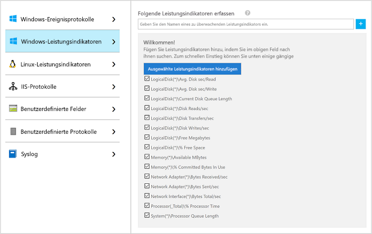
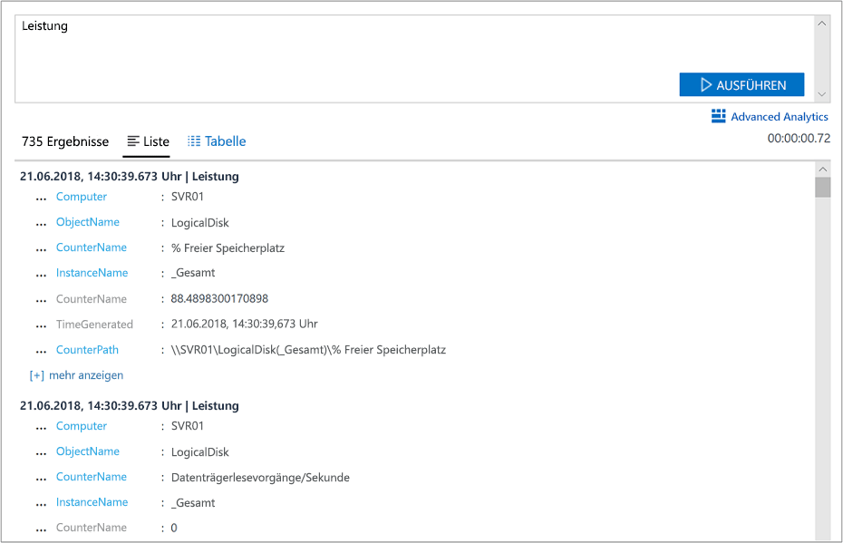

# Sammeln von Daten über virtuelle Azure-Computer
[Azure Log Analytics](log-analytics-overview.md) kann Daten direkt von Ihren virtuellen Azure-Computern und anderen Ressourcen in Ihrer Umgebung zur detaillierten Analyse und Korrelation in einem einzelnen Repository sammeln.  Dieser Schnellstart zeigt Ihnen, wie Sie in wenigen einfachen Schritten Daten von Ihren Azure-Linux- oder Windows-VMs konfigurieren und sammeln.  
 
Dieser Schnellstart setzt voraus, dass Sie über einen virtuellen Azure-Computer verfügen. Wenn nicht, können Sie mit unseren VM-Schnellstarts [eine Windows-VM erstellen](../virtual-machines/windows/quick-create-portal.md) oder [eine Linux-VM erstellen](../virtual-machines/linux/quick-create-cli.md).

## Anmelden beim Azure-Portal
Melden Sie sich unter [https://portal.azure.com](https://portal.azure.com) im Azure-Portal an. 

## Erstellen eines Arbeitsbereichs
1. Klicken Sie im Azure-Portal unten links auf **Weitere Dienste**. Geben Sie in der Liste mit den Ressourcen **Log Analytics** ein. Sobald Sie mit der Eingabe beginnen, wird die Liste auf der Grundlage Ihrer Eingabe gefiltert. Wählen Sie **Log Analytics**.     
2. Klicken Sie auf **Erstellen**, und wählen Sie anschließend Optionen für die folgenden Elemente aus:

  * Geben Sie einen Namen für den neuen **OMS-Arbeitsbereich** ein, wie z.B. *DefaultLAWorkspace*. 
  * Wählen Sie ein **Abonnement** aus, mit dem eine Verknüpfung erstellt werden soll, indem Sie in der Dropdownliste einen anderen Eintrag auswählen, falls der Standardeintrag nicht geeignet ist.
  * Wählen Sie für **Ressourcengruppe** eine vorhandene Ressourcengruppe aus, die einen oder mehrere virtuelle Azure-Computer enthält.  
  * Wählen Sie den **Speicherort** für die Bereitstellung Ihrer virtuellen Computer aus.  Weitere Informationen finden Sie auf der Seite zur [Verfügbarkeit von Log Analytics in den einzelnen Regionen](https://azure.microsoft.com/regions/services/).
  * In Log Analytics können Sie zwischen drei verschiedenen **Tarifen** wählen, aber wählen Sie für diesen Schnellstart den **kostenlosen** Tarif.  Weitere Informationen zu den einzelnen Tarifen finden Sie unter [Log Analytics – Preise](https://azure.microsoft.com/pricing/details/log-analytics/).

           
3. Klicken Sie nach dem Bereitstellen der erforderlichen Informationen im Bereich **OMS-Arbeitsbereich** auf **OK**.  

Die Informationen werden überprüft, und der Arbeitsbereich wird erstellt. Sie können den Fortschritt im Menü unter **Benachrichtigungen** nachverfolgen. 

## Aktivieren der Log Analytics-VM-Erweiterung
Für bereits in Azure bereitgestellte Windows- und Linux-VMs installieren Sie den Log Analytics-Agent mit Log Analytics-VM-Erweiterung.  Die Verwendung der Erweiterung vereinfacht den Installationsvorgang. Außerdem wird der Agent zum Senden von Daten an den angegebenen Log Analytics-Arbeitsbereich automatisch konfiguriert. Der Agent wird auch automatisch aktualisiert, damit Sie immer über die neuesten Features und Fixes verfügen.

Am oberen Rand der Log Analytics-Ressourcenseite im Portal wird Ihnen ein Banner auffallen, das Sie zu einem Upgrade einlädt.  Das Upgrade ist im Rahmen dieses Schnellstarts nicht erforderlich. 

.    
1. Klicken Sie im Azure-Portal unten links auf **Weitere Dienste**. Geben Sie in der Liste mit den Ressourcen **Log Analytics** ein. Sobald Sie mit der Eingabe beginnen, wird die Liste auf der Grundlage Ihrer Eingabe gefiltert. Wählen Sie **Log Analytics**.
2. Wählen Sie in der Liste der Log Analytics-Arbeitsbereiche den zuvor erstellten *DefaultLAWorkspace*.
3. Klicken Sie im linken Menü unter „Arbeitsbereichsdatenquellen“ auf **Virtuelle Computer**.  
4. Wählen Sie in der Liste **Virtuelle Computer** einen virtuellen Computer aus, auf dem Sie den Agent installieren möchten. Beachten Sie, dass der **OMS-Verbindungsstatus** für den virtuellen Computer **Nicht verbunden** lautet.
5. Klicken Sie in den Details Ihres virtuellen Computers auf **Verbinden**. Der Agent wird automatisch installiert und für den Log Analytics-Arbeitsbereich konfiguriert. Dieser Vorgang dauert einige Minuten. Während dieses Zeitraums lautet der **Status** **Verbindung wird hergestellt...**
6. Nachdem der Agent installiert und verbunden wurde, ändert sich der **OMS-Verbindungsstatus** in **Dieser Arbeitsbereich**.

## Sammeln von Ereignis- und Leistungsdaten
Log Analytics kann Ereignisdaten aus den Windows-Ereignisprotokollen oder Linux Syslog und Leistungsindikatoren sammeln, die Sie für längerfristige Analysen und Berichte angeben, und Maßnahmen einleiten, wenn eine bestimmte Bedingung erkannt wird.  Führen Sie diese Schritte aus, um die Sammlung von Ereignissen aus dem Systemprotokoll von Windows und Linux Syslog sowie mehreren allgemeinen Leistungsindikatoren zu konfigurieren.  

### Datensammlung auf Windows-VM
1. Wählen Sie **Erweiterte Einstellungen**.    
3. Wählen Sie **Daten** und dann **Windows-Ereignisprotokolle**.  
4. Sie können ein Ereignisprotokoll hinzufügen, indem Sie den Namen des Protokolls eingeben.  Geben Sie **System** ein, und klicken Sie dann auf das Pluszeichen **+**.  
5. Aktivieren Sie in der Tabelle die Schweregrade **Fehler** und **Warnung**.   
6. Klicken Sie ganz oben auf der Seite auf **Speichern**, um die Konfiguration zu speichern.
7. Wählen Sie **Windows-Leistungsdaten**, um die Sammlung von Leistungsindikatoren auf einem Windows-Computer zu aktivieren. 
8. Wenn Sie die Windows-Leistungsindikatoren zum ersten Mal für einen neuen Log Analytics-Arbeitsbereich konfigurieren, haben Sie die Möglichkeit, schnell mehrere allgemeine Indikatoren zu erstellen. Diese werden in einer Liste aufgeführt, und neben jedem Indikator finden Sie ein Kontrollkästchen.  .  Klicken Sie auf **Ausgewählte Leistungsindikatoren hinzufügen**.  Sie werden hinzugefügt und mit einem Stichprobenintervall von zehn Sekunden voreingestellt.  
9. Klicken Sie ganz oben auf der Seite auf **Speichern**, um die Konfiguration zu speichern.

### Datensammlung auf Linux-VM

1. Wählen Sie **Syslog**.  
2. Sie können ein Ereignisprotokoll hinzufügen, indem Sie den Namen des Protokolls eingeben.  Geben Sie **Syslog** ein, und klicken Sie dann auf das Pluszeichen **+**.  
3. Deaktivieren Sie in der Tabelle die Schweregrade **Info**, **Hinweis** und **Debuggen**. 
4. Klicken Sie ganz oben auf der Seite auf **Speichern**, um die Konfiguration zu speichern.
5. Wählen Sie **Linux-Leistungsdaten**, um die Sammlung von Leistungsindikatoren auf einem Windows-Computer zu aktivieren. 
6. Wenn Sie die Linux-Leistungsindikatoren zum ersten Mal für einen neuen Log Analytics-Arbeitsbereich konfigurieren, haben Sie die Möglichkeit, schnell mehrere allgemeine Indikatoren zu erstellen. Diese werden in einer Liste aufgeführt, und neben jedem Indikator finden Sie ein Kontrollkästchen.  .  Klicken Sie auf **Ausgewählte Leistungsindikatoren hinzufügen**.  Sie werden hinzugefügt und mit einem Stichprobenintervall von zehn Sekunden voreingestellt.  
7. Klicken Sie ganz oben auf der Seite auf **Speichern**, um die Konfiguration zu speichern.

## Anzeigen gesammelter Daten
Jetzt haben Sie die Datensammlung aktiviert und können ein einfaches Protokollsuchebeispiel ausführen, um einige Daten aus den Ziel-VMs anzuzeigen.  

1. Navigieren Sie im Azure-Portal zu Log Analytics, und wählen Sie den zuvor erstellten Arbeitsbereich aus.
2. Klicken Sie auf die Kachel **Protokollsuche** und im Bereich „Protokollsuche“ auf den Abfragefeldtyp `Type=Perf`, und drücken Sie dann auf EINGABE, oder klicken Sie auf die Suchschaltfläche rechts neben dem Abfragefeld.    Die Abfrage in der folgenden Abbildung gibt z.B. 78.000 Leistungsdatensätze zurück.  Ihre Ergebnisse werden deutlich geringer ausfallen.  

## Bereinigen von Ressourcen
Wenn Sie den Log Analytics-Arbeitsbereich nicht mehr benötigen, löschen Sie ihn. Wählen Sie zu diesem Zweck den Log Analytics-Arbeitsbereich, den Sie zuvor erstellt haben, und klicken Sie auf der Ressourcenseite auf **Löschen**.  

## Nächste Schritte
Jetzt sammeln Sie Betriebs- und Leistungsdaten von Ihren Windows- oder Linux-VMs und können problemlos beginnen, *kostenlos* Daten zu untersuchen, zu analysieren und Aktionen an ihnen vorzunehmen.  

Um zu erfahren, wie Sie die Daten anzeigen und analysieren, fahren Sie mit dem Tutorial fort.   

> [!div class="nextstepaction"]
> [Anzeigen oder Analysieren der Daten in Log Analytics](log-analytics-tutorial-viewdata.md)
