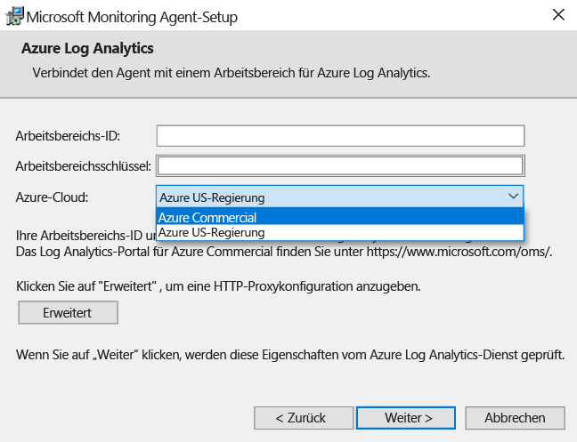
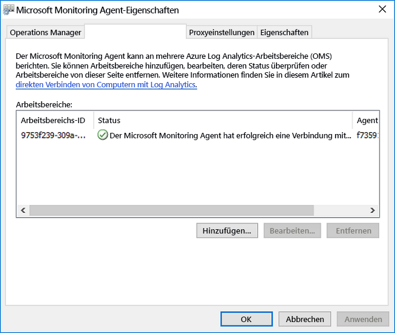
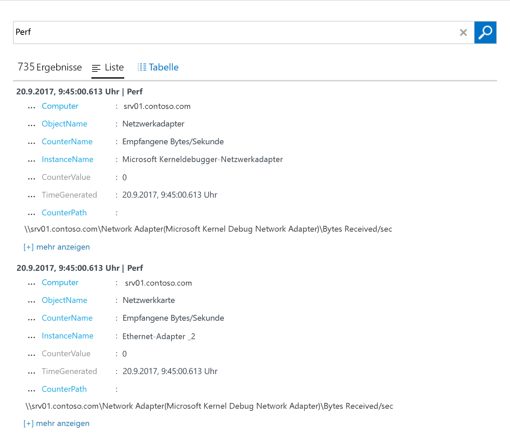

# Sammeln von Daten von Windows-Computern, die in Ihrer Umgebung gehostet werden
[Azure Log Analytics](log-analytics-overview.md) kann Daten direkt von Ihren physischen oder virtuellen Windows-Computern und anderen Ressourcen in Ihrer Umgebung zur detaillierten Analyse und Korrelation in einem einzelnen Repository sammeln.  Dieser Schnellstart zeigt Ihnen, wie Sie in wenigen einfachen Schritten Daten von Ihrem Windows-Computer konfigurieren und sammeln.  Informationen zu virtuellen Azure Windows-Computern finden Sie im folgenden Thema [Sammeln von Daten zu Azure Virtual Machines](log-analytics-quick-collect-azurevm.md).  
 
Wenn Sie kein Azure-Abonnement besitzen, können Sie ein [kostenloses Konto](https://azure.microsoft.com/free/?WT.mc_id=A261C142F) erstellen, bevor Sie beginnen.

## Anmelden beim Azure-Portal
Melden Sie sich unter [https://portal.azure.com](https://portal.azure.com) im Azure-Portal an. 

## Erstellen eines Arbeitsbereichs
1. Klicken Sie im Azure-Portal unten links auf **Weitere Dienste**. Geben Sie in der Liste mit den Ressourcen **Log Analytics** ein. Sobald Sie mit der Eingabe beginnen, wird die Liste auf der Grundlage Ihrer Eingabe gefiltert. Wählen Sie **Log Analytics**.       
2. Klicken Sie auf **Erstellen**, und wählen Sie anschließend Optionen für die folgenden Elemente aus:

  * Geben Sie einen Namen für den neuen **OMS-Arbeitsbereich** ein, wie z.B. *DefaultLAWorkspace*. 
  * Wählen Sie ein **Abonnement** aus, mit dem eine Verknüpfung erstellt werden soll, indem Sie in der Dropdownliste einen anderen Eintrag auswählen, falls der Standardeintrag nicht geeignet ist.
  * Wählen Sie für **Ressourcengruppe** eine vorhandene Ressourcengruppe aus, die einen oder mehrere virtuelle Azure-Computer enthält.  
  * Wählen Sie den **Speicherort** für die Bereitstellung Ihrer virtuellen Computer aus.  Weitere Informationen finden Sie auf der Seite zur [Verfügbarkeit von Log Analytics in den einzelnen Regionen](https://azure.microsoft.com/regions/services/).
  * In Log Analytics können Sie zwischen drei verschiedenen **Tarifen** wählen, aber wählen Sie für diesen Schnellstart den **kostenlosen** Tarif.  Weitere Informationen zu den einzelnen Tarifen finden Sie unter [Log Analytics – Preise](https://azure.microsoft.com/pricing/details/log-analytics/).

           
3. Klicken Sie nach dem Bereitstellen der erforderlichen Informationen im Bereich **OMS-Arbeitsbereich** auf **OK**.  

Die Informationen werden überprüft, und der Arbeitsbereich wird erstellt. Sie können den Fortschritt im Menü unter **Benachrichtigungen** nachverfolgen. 

## Abrufen von Arbeitsbereichs-ID und -Schlüssel
Vor der Installation von Microsoft Monitoring Agent für Windows benötigen Sie die Arbeitsbereichs-ID und den Schlüssel für Ihren Log Analytics-Arbeitsbereich.  Diese Informationen sind für den Setup-Assistenten erforderlich, um den Agent ordnungsgemäß zu konfigurieren und sicherzustellen, dass er erfolgreich mit Log Analytics kommunizieren kann.  

1. Klicken Sie im Azure-Portal unten links auf **Weitere Dienste**. Geben Sie in der Liste mit den Ressourcen **Log Analytics** ein. Sobald Sie mit der Eingabe beginnen, wird die Liste auf der Grundlage Ihrer Eingabe gefiltert. Wählen Sie **Log Analytics**.
2. Wählen Sie in der Liste der Log Analytics-Arbeitsbereiche den zuvor erstellten *DefaultLAWorkspace*.
3. Wählen Sie **Erweiterte Einstellungen**.       
4. Wählen Sie **Verbundene Quellen** und dann **Windows Server** aus.   
5. Der Wert rechts von **Arbeitsbereichs-ID** und **Primärschlüssel**. Kopieren Sie beide Angaben, und fügen Sie sie in den von Ihnen bevorzugten Editor ein.   

## Installieren des Agents für Windows
Mit den folgenden Schritten wird der Agent für Log Analytics in Azure und Azure Government Cloud mithilfe des Setups für Microsoft Monitoring Agent auf Ihrem Computer installiert und konfiguriert.  

1. Wählen Sie auf der Seite **Windows-Server** die entsprechende Version für **Windows-Agent herunterladen** aus, um in Abhängigkeit von der Prozessorarchitektur des Windows-Betriebssystems herunterzuladen.
2. Führen Sie Setup aus, um den Agent auf Ihrem Computer zu installieren.
2. Klicken Sie auf der Seite **Willkommen**auf **Weiter**.
3. Lesen Sie die Seite **Lizenzbedingungen** durch, und klicken Sie anschließend auf **Ich stimme zu**.
4. Auf der Seite **Zielordner** können Sie den Standardinstallationsordner entweder ändern oder beibehalten. Klicken Sie anschließend auf **Weiter**.
5. Wählen Sie auf der Seite **Agent-Setupoptionen** aus, dass der Agent mit Azure Log Analytics (OMS) verbunden wird, und klicken Sie dann auf **Weiter**.   
6. Führen Sie auf der Seite **Azure Log Analytics** die folgenden Schritte aus:
   1. Fügen Sie die **Arbeitsbereichs-ID** und den **Arbeitsbereichsschlüssel (Primärschlüssel)** ein, die Sie zuvor kopiert haben.  Wenn der Computer in einen Log Analytics-Arbeitsbereich in Azure Government Cloud melden soll, wählen Sie **Azure US-Regierung** aus der Dropdownliste **Azure Cloud** aus.  
   2. Wenn der Computer über einen Proxyserver mit dem Log Analytics-Dienst kommunizieren muss, klicken Sie auf **Erweitert**, und stellen Sie die URL sowie die Portnummer des Proxyservers bereit.  Wenn der Proxyserver eine Authentifizierung erfordert, geben Sie den Benutzernamen und das Kennwort für die Authentifizierung mit dem Proxyserver ein, und klicken Sie dann auf **Weiter**.  
7. Klicken Sie auf **Weiter**, nachdem Sie die Bereitstellung der erforderlichen Konfigurationseinstellungen abgeschlossen haben.     
8. Überprüfen Sie Ihre Auswahl auf der Seite **Bereit zum Installieren**, und klicken Sie dann auf **Installieren**.
9. Klicken Sie auf der Seite **Die Konfiguration wurde erfolgreich abgeschlossen** auf **Fertig stellen**.

Nach Abschluss wird der **Microsoft Monitoring Agent** in der **Systemsteuerung** angezeigt. Sie können Ihre Konfiguration überprüfen und sicherstellen, dass der Agent mit Log Analytics verbunden ist. Wenn die Verbindung hergestellt ist, zeigt der Agent eine Meldung auf der Registerkarte **Azure Log Analytics (OMS)** an, die besagt, dass **der Microsoft Monitoring Agent erfolgreich eine Verbindung mit dem Microsoft Operations Management Suite-Dienst hergestellt hat.**   

## Sammeln von Ereignis- und Leistungsdaten
Log Analytics kann Ereignisdaten aus den Windows-Ereignisprotokollen und Leistungsindikatoren sammeln, die Sie für längerfristige Analysen und Berichte angeben, und Maßnahmen einleiten, wenn eine bestimmte Bedingung erkannt wird.  Führen Sie diese Schritte aus, um die Sammlung von Ereignissen aus dem Ereignisprotokoll von Windows sowie mehreren allgemeinen Leistungsindikatoren zu konfigurieren.  

1. Klicken Sie im Azure-Portal unten links auf **Weitere Dienste**. Geben Sie in der Liste mit den Ressourcen **Log Analytics** ein. Sobald Sie mit der Eingabe beginnen, wird die Liste auf der Grundlage Ihrer Eingabe gefiltert. Wählen Sie **Log Analytics**.
2. Wählen Sie **Erweiterte Einstellungen**.      
3. Wählen Sie **Daten** und dann **Windows-Ereignisprotokolle**.  
4. Sie können ein Ereignisprotokoll hinzufügen, indem Sie den Namen des Protokolls eingeben.  Geben Sie **System** ein, und klicken Sie dann auf das Pluszeichen **+**.  
5. Aktivieren Sie in der Tabelle die Schweregrade **Fehler** und **Warnung**.   
6. Klicken Sie ganz oben auf der Seite auf **Speichern**, um die Konfiguration zu speichern.
7. Wählen Sie **Windows-Leistungsdaten**, um die Sammlung von Leistungsindikatoren auf einem Windows-Computer zu aktivieren. 
8. Wenn Sie die Windows-Leistungsindikatoren zum ersten Mal für einen neuen Log Analytics-Arbeitsbereich konfigurieren, haben Sie die Möglichkeit, schnell mehrere allgemeine Indikatoren zu erstellen. Diese werden in einer Liste aufgeführt, und neben jedem Indikator finden Sie ein Kontrollkästchen.  .  Klicken Sie auf **Ausgewählte Leistungsindikatoren hinzufügen**.  Sie werden hinzugefügt und mit einem Stichprobenintervall von zehn Sekunden voreingestellt.  
9. Klicken Sie ganz oben auf der Seite auf **Speichern**, um die Konfiguration zu speichern.

## Anzeigen gesammelter Daten
Jetzt haben Sie die Datensammlung aktiviert und können ein einfaches Protokollsuchebeispiel ausführen, um einige Daten vom Zielcomputer anzuzeigen.  

1. Klicken Sie im Azure-Portal unter dem ausgewählten Arbeitsbereich auf die Kachel **Protokollsuche**.  
2. Geben Sie im Bereich „Protokollsuche“ im Abfragefeldtyp `Perf` ein, und drücken Sie dann auf EINGABE, oder klicken Sie auf die Suchschaltfläche rechts neben dem Abfragefeld.      Die Abfrage in der folgenden Abbildung gibt z. B. 735 Leistungsdatensätze zurück.   

## Bereinigen von Ressourcen
Wenn er nicht mehr benötigt wird, können Sie den Agent vom Windows-Computer entfernen und den Log Analytics-Arbeitsbereich löschen.  

Führen Sie die folgenden Schritte aus, um den Agent zu entfernen.

1. Öffnen Sie die **Systemsteuerung**.
2. Öffnen Sie **Programme und Features**.
3. Wählen Sie in **Programme und Features** die Option **Microsoft Monitoring Agent** aus, und klicken Sie auf **Deinstallieren**.

Wählen Sie zum Löschen des Arbeitsbereichs den Log Analytics-Arbeitsbereich aus, den Sie zuvor erstellt haben, und klicken Sie auf der Ressourcenseite auf **Löschen**.   

## Nächste Schritte
Jetzt sammeln Sie Betriebs- und Leistungsdaten von Ihrem lokalen Linux-Computer und können problemlos beginnen, *kostenlos* Daten zu untersuchen, zu analysieren und Aktionen an ihnen vorzunehmen.  

Um zu erfahren, wie Sie die Daten anzeigen und analysieren, fahren Sie mit dem Tutorial fort.   

> [!div class="nextstepaction"]
> [Anzeigen oder Analysieren der Daten in Log Analytics](log-analytics-tutorial-viewdata.md)
