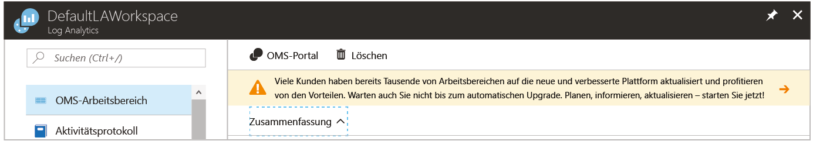

# <a name="view-or-analyze-data-collected-with-log-analytics-log-search"></a>Anzeigen oder Analysieren der mit der Log Analytics-Protokollsuche gesammelten Daten

In Log Analytics können Sie Protokollsuchen nutzen, indem Sie Abfragen zum Analysieren der gesammelten Daten erstellen, und bereits vorhandene Dashboards verwenden, die Sie mit grafischen Ansichten Ihrer wertvollsten Suchvorgänge anpassen können.  Nun haben Sie die Sammlung von Betriebsdaten von Ihren Azure-VMs und Aktivitätsprotokollen definiert und erfahren in diesem Tutorial, wie Sie Folgendes durchführen:

> [!div class="checklist"]
> * Upgrade Ihrer Azure Log Analytics-Ressource auf die neue Abfragesprache 
> * Durchführen einer einfachen Suche von Ereignisdaten und Verwenden von Features zum Ändern und Filtern der Ergebnisse 
> * Lernen, mit Leistungsdaten zu arbeiten

Für das Beispiel in diesem Tutorial muss ein virtueller Computer vorhanden sein, der [mit dem Log Analytics-Arbeitsbereich verbunden](log-analytics-quick-collect-azurevm.md) ist.  

Für die Erstellung und Bearbeitung von Abfragen sowie die interaktive Verwendung zurückgegebener Daten stehen zwei Methoden zur Verfügung.  Verwenden Sie für einfache Abfragen die Seite „Protokollsuche“ im Azure-Portal. Für erweiterte Abfragen können Sie das Advanced Analytics-Portal nutzen. Weitere Informationen zu den Unterschieden zwischen den beiden Portalen in Bezug auf die Funktionalität finden Sie unter [Portale zum Erstellen und Bearbeiten von Protokollabfragen in Azure Log Analytics](log-analytics-log-search-portals.md).

In diesem Tutorial arbeiten wir mit der Protokollsuche im Azure-Portal. 

## <a name="log-in-to-azure-portal"></a>Anmelden beim Azure-Portal
Melden Sie sich unter [https://portal.azure.com](https://portal.azure.com) im Azure-Portal an. 

## <a name="open-the-log-search-portal"></a>Öffnen des Portals für die Protokollsuche 
Öffnen Sie zunächst das Portal für die Protokollsuche.   

1. Klicken Sie im Azure-Portal unten links auf **Weitere Dienste**. Geben Sie in der Liste mit den Ressourcen **Log Analytics** ein. Sobald Sie mit der Eingabe beginnen, wird die Liste auf der Grundlage Ihrer Eingabe gefiltert. Wählen Sie **Log Analytics**.
2. Klicken Sie im Log Analytics-Abonnementbereich auf einen Arbeitsbereich, und wählen Sie dann die Kachel **Protokollsuche**.<br> 

Am oberen Rand der Log Analytics-Ressourcenseite im Portal wird Ihnen ein Banner auffallen, das Sie zu einem Upgrade einlädt.<br> 

Log Analytics hat kürzlich eine neue Abfragesprache eingeführt, die das Erstellen von Abfragen, Korrelieren von Daten aus verschiedenen Quellen und Analysieren zur schnellen Identifikation von Trends oder Problemen vereinfacht.

Das Upgrade ist einfach.  Starten Sie den Prozess, indem Sie auf das Banner **Weitere Informationen und Upgrade** klicken.  Lesen Sie die zusätzlichen Informationen auf der Seite „Upgradeinformationen“, und klicken Sie dann auf **Jetzt aktualisieren**.

Dieser Vorgang dauert einige Minuten, und während dieser Zeit können Sie den Fortschritt im Menü unter **Benachrichtigungen** nachverfolgen. Weitere Informationen über die Vorzüge der neuen Sprache finden Sie unter [Warum gibt es eine neue Sprache?](log-analytics-log-search-upgrade.md#why-the-new-language).

## <a name="create-a-simple-search"></a>Erstellen einer einfachen Suche
Die schnellste Methode, Daten für die weitere Verwendung abzurufen, besteht in einer einfachen Abfrage, die alle Datensätze aus der Tabelle zurückgibt.  Wenn Windows- oder Linux-Clients mit Ihrem Arbeitsbereich verbunden sind, liegen die Daten in der Ereignistabelle (Windows) bzw. in der Syslog-Tabelle (Linux) vor.

Geben Sie eine der folgenden Abfragen im Suchfeld ein, und klicken Sie auf die Schaltfläche „Suchen“.  

```
Event
```
```
Syslog
```

Die Daten werden in der Standardlistenansicht zurückgegeben. Sie können ablesen, wie viele Datensätze insgesamt zurückgegeben wurden.


Es werden nur die ersten paar Eigenschaften zu jedem Datensatz angezeigt.  Klicken Sie auf **Mehr anzeigen**, damit alle Eigenschaften für einen bestimmten Datensatz angezeigt werden.

## <a name="filter-results-of-the-query"></a>Filtern der Abfrageergebnisse
Auf der linken Seite des Bildschirms befindet sich der Filterbereich, über den Sie Filter zu Abfragen hinzufügen können, ohne die Abfrage direkt zu verändern.  Mehrere Datensatzeigenschaften werden für diesen Datensatztyp angezeigt, und Sie können einen oder mehrere Eigenschaftenwerte auswählen, um Ihre Suchergebnisse einzugrenzen.

Wenn Sie die **Ereignistabelle** verwenden, wählen Sie das Kontrollkästchen neben **Fehler** unter **EVENTLEVELNAME** aus.   Wenn Sie **Syslog** verwenden, wählen Sie das Kontrollkästchen neben **err** unter **SEVERITYLEVEL** aus.  Dadurch wird die Abfrage wie folgt geändert, um die Ergebnisse auf Fehlerereignisse zu beschränken:

```
Event | where (EventLevelName == "Error")
```
```
Syslog | where (SeverityLevel == "err")
```


Fügen Sie dem Filterbereich Eigenschaften hinzu, indem Sie im Eigenschaftenmenü eines der Datensätze **Zu Filtern hinzufügen** auswählen.


Sie können den gleichen Filter festlegen, indem Sie im Eigenschaftenmenü eines Datensatzes mit dem Wert, nach dem Sie filtern möchten, **Filter** auswählen.  

Die Option **Filter** ist nur für Eigenschaften verfügbar, deren Name in Blau angezeigt wird, wenn Sie den Cursor darauf setzen.  Dies sind *durchsuchbare* Felder, die für Suchbedingungen indiziert sind.  Graue Felder sind *Freitextsuchfelder*, die nur über die Option **Verweise anzeigen** verfügen.  Mit dieser Option werden Datensätze zurückgegeben, bei denen eine beliebige Eigenschaft diesen Wert besitzt.

Sie können die Ergebnisse nach einer einzelnen Eigenschaft gruppieren, indem Sie im Datensatzmenü die Option **Gruppieren nach** auswählen.  Dadurch wird der Abfrage ein [summarize](https://docs.loganalytics.io/docs/Language-Reference/Tabular-operators/summarize-operator)-Operator hinzugefügt, um die Ergebnisse in einem Diagramm anzuzeigen.  Sie können auch nach mehreren Eigenschaften gruppieren, dazu müssen Sie die Abfrage jedoch direkt bearbeiten.  Wählen Sie im Datensatzmenü neben der **Computer**-Eigenschaft **Gruppieren nach „Computer“** aus.  


## <a name="work-with-results"></a>Arbeiten mit Ergebnissen
Das Portal für die Protokollsuche verfügt über eine Reihe von Funktionen zum Arbeiten mit den Ergebnissen einer Abfrage.  Sie können Ergebnisse sortieren, filtern und gruppieren, um die Daten zu analysieren, ohne die Abfrage selbst zu ändern.  Die Ergebnisse einer Abfrage werden standardmäßig nicht sortiert.

Klicken Sie zum Anzeigen der Daten in Tabellenform, die über zusätzliche Optionen zum Filtern und Sortieren verfügt, auf **Tabelle**.  


Klicken Sie auf den Pfeil neben einem Datensatz, um die Details für diesen Datensatz anzuzeigen.


Sortieren Sie nach einem Feld, indem Sie auf den entsprechenden Spaltenkopf klicken.


Filtern Sie die Ergebnisse nach einem bestimmten Wert in der Spalte, indem Sie auf die Schaltfläche „Filter“ klicken und eine Filterbedingung angeben.


Gruppieren Sie nach einer Spalte, indem Sie den entsprechenden Spaltenkopf an den Anfang der Ergebnisse ziehen.  Sie können nach mehreren Feldern gruppieren, indem Sie mehrere Spalten nach oben ziehen.


## <a name="work-with-performance-data"></a>Arbeiten mit Leistungsdaten
Leistungsdaten für Windows und Linux-Agents werden im Log Analytics-Arbeitsbereich in der Tabelle **Perf** gespeichert.  Leistungsdatensätze sehen wie andere Datensätze aus, und Sie können eine einfache Abfrage verfassen, mit der wie bei Ereignissen alle Leistungsdatensätze zurückgegeben werden.

```
Perf
```


Millionen Datensätze für alle Leistungsobjekte und -indikatoren zurückzugeben, ist jedoch nicht sehr nützlich.  Sie können die gleichen Verfahren wie oben verwenden, um die Daten zu filtern, oder einfach die folgende Abfrage direkt in das Protokollsuchfeld eingeben.  Dadurch werden nur die Datensätze zur Prozessorauslastung für Windows- und Linux-Computer zurückgegeben.

```
Perf | where (ObjectName == "Processor")  | where (CounterName == "% Processor Time")
```


Dies schränkt die Daten zwar auf einen bestimmten Leistungsindikator ein, damit liegen sie jedoch immer noch nicht in einem nützlichen Format vor.  Sie können die Daten in einem Liniendiagramm anzeigen, dazu müssen Sie sie jedoch zunächst nach „Computer“ und „TimeGenerated“ gruppieren.  Um nach mehreren Feldern zu gruppieren, müssen Sie die Abfrage direkt ändern, ändern Sie die Abfrage daher wie folgt:  Hierbei wird die [avg](https://docs.loganalytics.io/docs/Language-Reference/Aggregation-functions/avg())-Funktion für die **CounterValue**-Eigenschaft verwendet, um für jede Stunde den Durchschnittswert zu berechnen.

```
Perf  | where (ObjectName == "Processor")  | where (CounterName == "% Processor Time") | summarize avg(CounterValue) by Computer, TimeGenerated
```


Nachdem die Daten eine geeignete Gruppierung aufweisen, können Sie sie in einem visuellen Diagramm anzeigen, indem Sie den [render](https://docs.loganalytics.io/docs/Language-Reference/Tabular-operators/render-operator)-Operator hinzufügen.  

```
Perf  | where (ObjectName == "Processor")  | where (CounterName == "% Processor Time") | summarize avg(CounterValue) by Computer, TimeGenerated | render timechart
```


## <a name="next-steps"></a>Nächste Schritte
In diesem Tutorial haben Sie gelernt, einfache Protokollsuchen zur Analyse von Ereignis- und Leistungsdaten zu erstellen.  Fahren Sie mit dem nächsten Tutorial fort, um zu erfahren, wie Sie die Daten durch Erstellen eines Dashboards visualisieren.

> [!div class="nextstepaction"]
> [Erstellen und Freigeben von Log Analytics-Dashboards](log-analytics-tutorial-dashboards.md)
