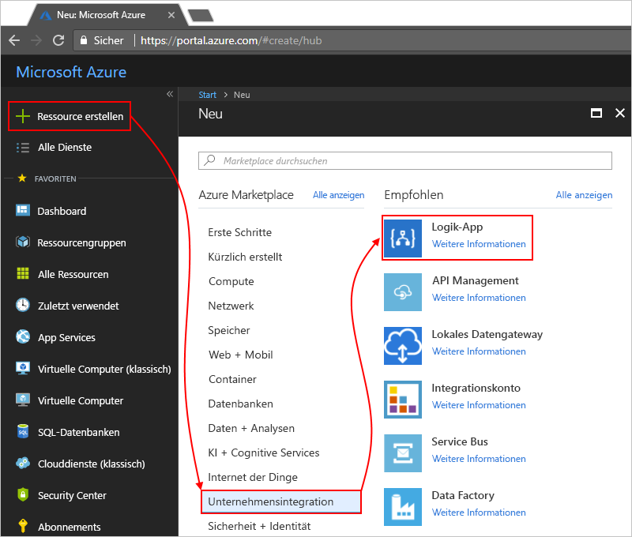

# Überwachen und Gewinnen von Erkenntnissen zu Logik-App-Ausführungen mit Operations Management Suite (OMS) und Log Analytics

Sie können beim Erstellen einer Logik-App gleichzeitig Log Analytics aktivieren, um die Überwachung durchzuführen und umfassendere Debuginformationen zu erhalten. Log Analytics ermöglicht die Diagnoseprotokollierung und Überwachung für Ihre Logik-App-Ausführungen über das OMS-Portal (Operations Management Suite). Wenn Sie OMS die Lösung für die Logik-App-Verwaltung hinzufügen, erhalten Sie den aggregierten Status für Ihre Logik-App-Ausführungen und spezifische Details wie Status, Ausführungszeit, Status der erneuten Übermittlung und Korrelations-IDs.

In diesem Thema wird veranschaulicht, wie Sie Log Analytics aktivieren oder die Lösung für die Logik-App-Verwaltung in OMS installieren, um Laufzeitereignisse und Daten für Ihre Logik-App-Ausführung anzuzeigen.

 > [!TIP]
 > Führen Sie diese Schritte zum [Aktivieren der Diagnoseprotokollierung und Senden von Logik-App-Laufzeitdaten an OMS](../logic-apps/logic-apps-monitor-your-logic-apps.md#azure-diagnostics) aus, um Ihre vorhandenen Logik-Apps zu überwachen.

## Anforderungen

Sie müssen über einen OMS-Arbeitsbereich verfügen, bevor Sie beginnen können. Informieren Sie sich, wie Sie [einen OMS-Arbeitsbereich erstellen](../log-analytics/log-analytics-get-started.md). 

## Aktivieren der Diagnoseprotokollierung beim Erstellen von Logik-Apps

1. Erstellen Sie im [Azure-Portal](https://portal.azure.com) eine Logik-App. Wählen Sie **Neu** > **Unternehmensintegration** > **Logik-App** > **Erstellen**.

   

2. Führen Sie auf der Seite **Logik-App erstellen** wie gezeigt die folgenden Schritte aus:

   1. Geben Sie einen Namen für Ihre Logik-App an, und wählen Sie Ihr Azure-Abonnement aus. 
   2. Erstellen Sie eine Azure-Ressourcengruppe, oder wählen Sie sie aus.
   3. Legen Sie **Log Analytics** auf **Ein** fest. 
   Wählen Sie den OMS-Arbeitsbereich aus, für den Sie Daten für Ihre Logik-App-Ausführungen senden möchten. 
   4. Wählen Sie **An Dashboard anheften** > **Erstellen**, wenn alles bereit ist.

      

      Nach Abschluss dieses Schritts erstellt Azure Ihre Logik-App, die jetzt Ihrem OMS-Arbeitsbereich zugeordnet ist. 
      Mit diesem Schritt wird auch die Lösung für die Logik-App-Verwaltung automatisch in Ihrem OMS-Arbeitsbereich installiert.

3. [Fahren Sie mit diesen Schritten fort](#view-logic-app-runs-oms), um Ihre Logik-App-Ausführungen in OMS anzuzeigen.

## Installieren der Lösung für die Logik-App-Verwaltung in OMS

Überspringen Sie diesen Schritt, falls Sie Log Analytics bereits beim Erstellen Ihrer Logik-App aktiviert haben. Sie haben die Lösung für die Logik-App-Verwaltung bereits in OMS installiert.

1. Wählen Sie im [Azure-Portal](https://portal.azure.com) die Option **Weitere Dienste** aus. Verwenden Sie für die Suche den Filter „log analytics“, und wählen Sie dann wie gezeigt **Log Analytics**:

   

2. Wählen Sie unter **Log Analytics** Ihren OMS-Arbeitsbereich aus. 

   

3. Wählen Sie unter **Verwaltung** die Option **OMS-Portal**.

   

4. Wenn auf Ihrer OMS-Startseite das Upgradebanner angezeigt wird, wählen Sie das Banner aus, um erst ein Upgrade für Ihren OMS-Arbeitsbereich durchzuführen. Wählen Sie dann **Lösungskatalog** aus.

   

5. Wählen Sie unter **Alle Lösungen** die Kachel für die Lösung **Logic Apps Management** (Logik-App-Verwaltung) aus.

   

6. Wählen Sie **Hinzufügen**, um die Lösung in Ihrem OMS-Arbeitsbereich zu installieren.

   

## Anzeigen Ihrer Logik-App-Ausführungen in Ihrem OMS-Arbeitsbereich

1. Navigieren Sie zur Übersichtsseite für Ihren OMS-Arbeitsbereich, um Anzahl und Status für Ihre Logik-App-Ausführungen anzuzeigen. Überprüfen Sie die Details auf der Kachel **Logic Apps Management** (Logik-App-Verwaltung).

   

   > [!Note]
   > Wenn anstelle der Kachel „Logik-App-Verwaltung“ dieses Upgradebanner angezeigt wird, wählen Sie das Banner aus, um zuerst ein Upgrade für Ihren OMS-Arbeitsbereich durchzuführen.
  
   > 

2. Wählen Sie die Kachel **Logic Apps Management** (Logik-App-Verwaltung), um eine Zusammenfassung mit weiteren Details zu Ihren Logik-App-Ausführungen anzuzeigen.

   Hier sind Ihre Logik-App-Ausführungen nach Name oder Ausführungsstatus gruppiert. Sie sehen auch Details zu den Fehlern in Aktionen oder Triggern für die Logik-App-Ausführungen.

   
   
3. Wählen Sie die Zeile für eine Logik-App oder einen Status aus, um alle Ausführungen für eine bestimmte Logik-App bzw. einen Status anzuzeigen.

   Hier ist ein Beispiel angegeben, bei dem alle Ausführungen für eine bestimmte Logik-App aufgeführt werden:

   

   Es gibt zwei erweiterte Optionen auf dieser Seite:
   * **Überwachte Eigenschaften:** In dieser Spalte werden überwachte Eigenschaften, die nach Aktionen gruppiert sind, für die Logik-App angezeigt. Wählen Sie zum Anzeigen der überwachten Eigenschaften **Ansicht** aus. Sie können die überwachten Eigenschaften mit dem Spaltenfilter durchsuchen.
   
     

     Alle neu hinzugefügten überwachten Eigenschaften werden möglicherweise erst nach 10 bis 15 Minuten erstmalig angezeigt. Erfahren Sie mehr über das [Hinzufügen überwachter Eigenschaften zu Ihrer Logik-App](logic-apps-monitor-your-logic-apps.md#azure-diagnostics-event-settings-and-details).

   * **Erneut übermitteln:** Sie können eine oder mehrere Logik-App-Ausführungen erneut übermitteln, die fehlgeschlagen sind, erfolgreich waren oder noch ausgeführt werden. Aktivieren Sie die Kontrollkästchen für die Ausführungen, die Sie erneut übermitteln möchten, und wählen Sie **Erneut übermitteln** aus. 

     

4. Zum Filtern dieser Ergebnisse können Sie sowohl die clientseitige als auch die serverseitige Filterung durchführen.

   * Clientseitiger Filter: Wählen Sie für jede Spalte die gewünschten Filter aus. 
   Hier einige Beispiele:

     

   * Serverseitiger Filter: Verwenden Sie das Steuerelement für die Bereichsauswahl oben auf der Seite, um ein bestimmtes Zeitfenster auszuwählen oder die Anzahl von angezeigten Ausführungen zu begrenzen. 
   Standardmäßig werden nur jeweils 1.000 Datensätze angezeigt. 
   
     
 
5. Um alle Aktionen und deren Details für eine bestimmte Ausführung anzuzeigen, wählen Sie eine Zeile für eine Logik-App-Ausführung aus.

   Hier ist ein Beispiel mit allen Aktionen für eine bestimmte Logik-App-Ausführung dargestellt:

   
   
6. Um auf einer Ergebnisseite die Abfrage hinter den Ergebnissen anzuzeigen oder um alle Ergebnisse anzuzeigen, wählen Sie **Alle anzeigen** aus. Damit wird die Seite der Protokollsuche geöffnet.
   
   
   
   Auf der Seite „Protokollsuche“:
   * Um die Abfrageergebnisse in einer Tabelle anzuzeigen, wählen Sie **Tabelle** aus.
   * Sie können die Abfragezeichenfolge in der Suchleiste bearbeiten, um die Abfrage zu ändern. 
   Wählen Sie **Erweiterte Analyse**, falls Sie mehr Optionen benötigen.

     
     
     Hier auf der Azure Log Analytics-Seite können Sie Abfragen aktualisieren und die Ergebnisse der Tabelle anzeigen. 
     Für diese Abfrage wird die [Kusto-Abfragesprache](https://docs.loganalytics.io/docs/Language-Reference) verwendet. Sie können diese Sprache bearbeiten, wenn Sie unterschiedliche Ergebnisse anzeigen möchten. 

     

## Nächste Schritte

* [Überwachen von B2B-Nachrichten](../logic-apps/logic-apps-monitor-b2b-message.md)

