# Schnellstart: Erstellen und Automatisieren von Aufgaben, Prozessen und Workflows mit Azure Logic Apps – Visual Studio

Mit [Azure Logic Apps](../logic-apps/logic-apps-overview.md) und Visual Studio können Sie Workflows zur Automatisierung von Aufgaben und Prozessen für die Integration von Apps, Daten, Systemen und Diensten in Unternehmen und Organisationen erstellen. In dieser Schnellstartanleitung wird veranschaulicht, wie Sie diese Workflows entwerfen und erstellen können, indem Sie in Visual Studio Logik-Apps erstellen und diese Apps über <a href="https://docs.microsoft.com/azure/guides/developer/azure-developer-guide" target="_blank">Azure</a> in der Cloud bereitstellen. Sie können diese Aufgaben zwar auch im <a href="https://portal.azure.com" target="_blank">Azure-Portal</a> durchführen, aber mit Visual Studio können Sie Logik-Apps der Quellcodeverwaltung hinzufügen, unterschiedliche Versionen veröffentlichen und Azure Resource Manager-Vorlagen für verschiedene Bereitstellungsumgebungen erstellen. 

Wenn Sie mit Azure Logic Apps noch nicht vertraut sind und sich nur über die grundlegenden Konzepte informieren möchten, hilft Ihnen die [Schnellstartanleitung zur Erstellung einer Logik-App im Azure-Portal](../logic-apps/quickstart-create-first-logic-app-workflow.md) weiter. Der Logik-App-Designer funktioniert im Azure-Portal und in Visual Studio ähnlich. 

Hier erstellen Sie die gleiche Logik-App wie in der Schnellstartanleitung zum Azure-Portal, aber Sie verwenden stattdessen Visual Studio. Mit dieser Logik-App wird der RSS-Feed einer Website überwacht und eine E-Mail für jedes neue Element gesendet, das auf der Site gepostet wird. Am Ende ähnelt Ihre Logik-App diesem allgemeinen Workflow:

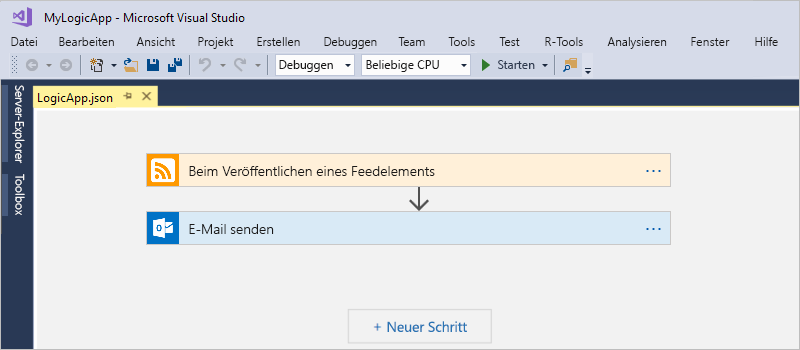

Stellen Sie zunächst sicher, dass Sie über die folgenden Elemente verfügen:

* Wenn Sie nicht über ein Azure-Abonnement verfügen, können Sie sich <a href="https://azure.microsoft.com/free/" target="_blank">für ein kostenloses Azure-Konto registrieren</a>.

* Laden Sie diese Tools herunter, und installieren Sie sie, falls sie noch nicht vorhanden sind: 

  * <a href="https://www.visualstudio.com/downloads" target="_blank">Visual Studio 2017 oder Visual Studio 2015 – Community Edition oder höher</a>. 
  In dieser Schnellstartanleitung wird die kostenlose Version Visual Studio Community 2017 verwendet.

  * <a href="https://azure.microsoft.com/downloads/" target="_blank">Microsoft Azure SDK für .NET (2.9.1 oder höher)</a> und <a href="https://github.com/Azure/azure-powershell#installation" target="_blank">Azure PowerShell</a>. 
  Weitere Informationen zu <a href="https://docs.microsoft.com/dotnet/azure/dotnet-tools?view=azure-dotnet">Azure SDK für .NET</a>.

  * <a href="https://marketplace.visualstudio.com/items?itemName=VinaySinghMSFT.AzureLogicAppsToolsforVisualStudio-18551" target="_blank">Azure Logic Apps-Tools für Visual Studio 2017</a> oder <a href="https://marketplace.visualstudio.com/items?itemName=VinaySinghMSFT.AzureLogicAppsToolsforVisualStudio" target="_blank">Visual Studio 2015</a>
  
    Sie können die Azure Logic Apps-Tools entweder direkt vom Visual Studio Marketplace herunterladen und installieren oder sich über das <a href="https://docs.microsoft.com/visualstudio/ide/finding-and-using-visual-studio-extensions" target="_blank">Installieren dieser Erweiterung aus Visual Studio</a> informieren. 
    Achten Sie darauf, dass Sie Visual Studio nach Abschluss der Installation neu starten.

* Ein von Logic Apps unterstütztes E-Mail-Konto, z.B. Office 365 Outlook, Outlook.com oder Gmail. Informationen zu Connectors für andere Anbieter finden Sie in <a href="https://docs.microsoft.com/connectors/" target="_blank">dieser Liste</a>. Für diese Logik-App wird Office 365 Outlook verwendet. Bei Verwendung eines anderen Anbieters sind die Schritte im Großen und Ganzen identisch, aber die Benutzeroberfläche weicht ggf. etwas ab.

* Internetzugriff bei Verwendung des eingebetteten Logik-App-Designers

  Für den Designer ist eine Internetverbindung zum Erstellen von Ressourcen in Azure und zum Lesen der Eigenschaften und Daten von Connectors in Ihrer Logik-App erforderlich. 
  Wenn Sie beispielsweise den Dynamics CRM Online-Connector verwenden, prüft der Designer Ihre CRM-Instanz auf verfügbare standardmäßige und benutzerdefinierte Eigenschaften.

## Erstellen eines Azure-Ressourcengruppenprojekts

Erstellen Sie zunächst ein [Azure-Ressourcengruppenprojekt](../azure-resource-manager/vs-azure-tools-resource-groups-deployment-projects-create-deploy.md). Informieren Sie sich über [Azure-Ressourcengruppen und -Ressourcen](../azure-resource-manager/resource-group-overview.md).

1. Starten Sie Visual Studio, und melden Sie sich mit Ihrem Azure-Konto an.

2. Wählen Sie im Menü **Datei** die Option **Neu** > **Projekt**. (Tastenkombination: STRG+UMSCHALT+N)

   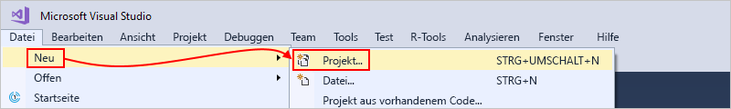

3. Wählen Sie unter **Installiert** die Option **Visual C#** oder **Visual Basic**. Wählen Sie **Cloud** > **Azure-Ressourcengruppe**. Geben Sie Ihrem Projekt einen Namen, z.B.:

   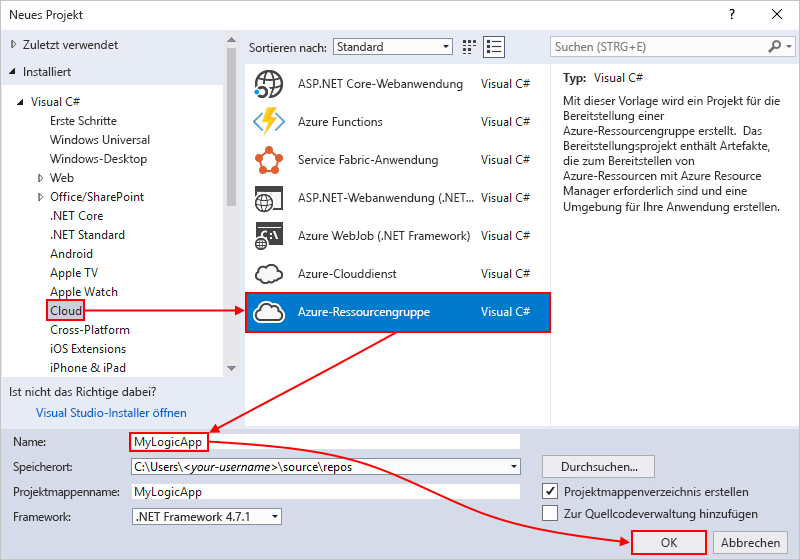

4. Wählen Sie die Vorlage **Logik-App** aus. 

   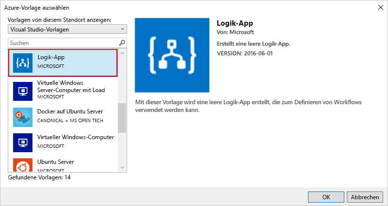

   Nachdem Visual Studio Ihr Projekt erstellt hat, wird der Projektmappen-Explorer geöffnet, und Ihre Projektmappe wird angezeigt. 

   

   In Ihrer Projektmappe wird in der Datei **LogicApp.json** nicht nur die Definition für Ihre Logik-App gespeichert, sondern sie dient auch als Azure Resource Manager-Vorlage, die Sie für die Bereitstellung einrichten können.

## Erstellen einer leeren Logik-App

Führen Sie nach der Erstellung Ihres Azure-Ressourcengruppenobjekts die Erstellung und den Buildvorgang für Ihre Logik-App durch, indem Sie mit der Vorlage **Leere Logik-App** beginnen.

1. Öffnen Sie im Projektmappen-Explorer das Kontextmenü für die Datei **LogicApp.json**. Wählen Sie die Option **Open With Logic App Designer** (Mit Logik-App-Designer öffnen) aus. (Tastenkombination: STRG+L)

   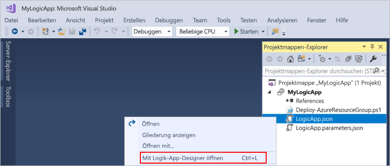

2. Wählen Sie unter **Abonnement** das gewünschte Azure-Abonnement aus. Wählen Sie unter **Ressourcengruppe** die Option **Neu erstellen...**, um eine neue Azure-Ressourcengruppe zu erstellen. 

   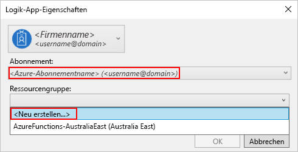

   Visual Studio benötigt Ihr Azure-Abonnement und eine Ressourcengruppe, um Ressourcen erstellen und bereitstellen zu können, die Ihrer Logik-App und den Verbindungen zugeordnet sind. 

   | Einstellung | Beispielwert | BESCHREIBUNG | 
   | ------- | ------------- | ----------- | 
   | Benutzerprofilliste | Contoso   jamalhartnett@contoso.com | Standardmäßig das zum Anmelden verwendete Konto | 
   | **Abonnement** | Nutzungsbasierte Bezahlung   (jamalhartnett@contoso.com) | Name für Ihr Azure-Abonnement und das zugeordnete Konto |
   | **Ressourcengruppe** | MyLogicApp-RG   (USA, Westen) | Azure-Ressourcengruppe und Standort zum Speichern und Bereitstellen von Ressourcen für Ihre Logik-App | 
   | **Location** | MyLogicApp-RG2   (USA, Westen) | Anderer Standort, falls Sie nicht den Ressourcengruppenstandort verwenden möchten |
   ||||

3. Der Logik-App-Designer wird geöffnet, und es wird eine Seite mit einem Einführungsvideo und häufig verwendeten Triggern angezeigt. Scrollen Sie nach unten, bis der Bereich unter dem Video und den Triggern angezeigt wird. Wählen Sie unter **Vorlagen** die Option **Leere Logik-App**.

   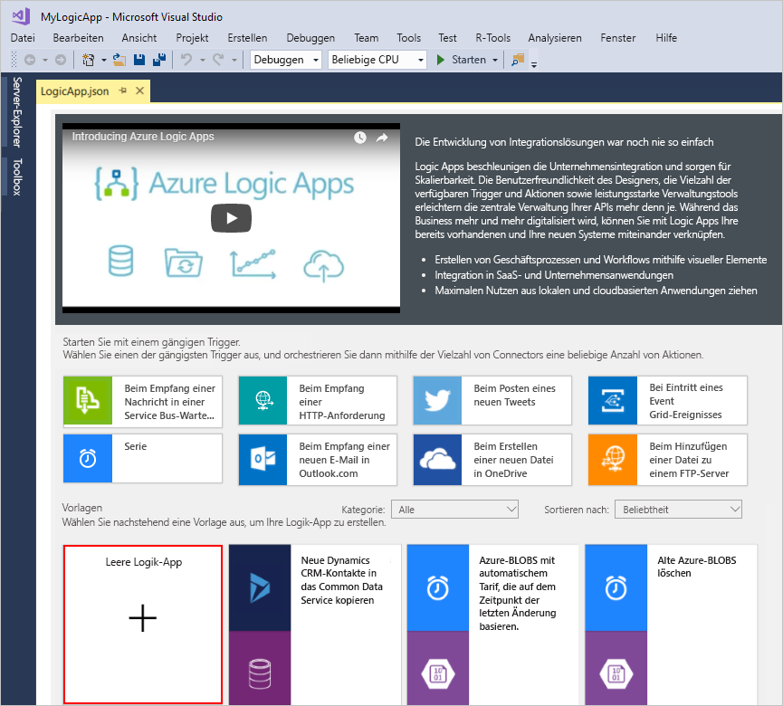

## Erstellen eines Logik-App-Workflows

Fügen Sie als Nächstes einen [Trigger](../logic-apps/logic-apps-overview.md#logic-app-concepts) hinzu, der bei einem neuen RSS-Feedelement ausgelöst wird. Jede Logik-App muss mit einem Trigger beginnen, der ausgelöst wird, wenn bestimmte Kriterien erfüllt sind. Bei jeder Auslösung des Triggers erstellt die Logic Apps-Engine eine Logik-App-Instanz zur Ausführung Ihres Workflows.

1. Geben Sie im Logik-App-Designer im Suchfeld „rss“ ein. Wählen Sie diesen Trigger: **Beim Veröffentlichen eines Feedelements**

   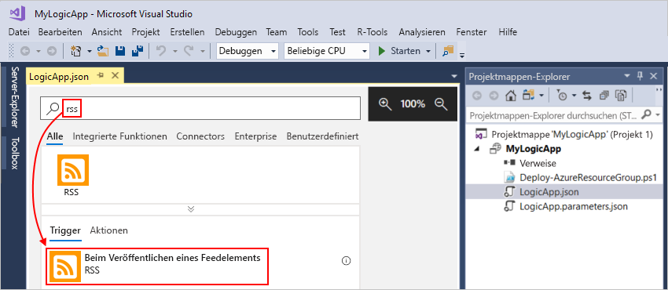

   Der Trigger wird jetzt im Designer angezeigt:

   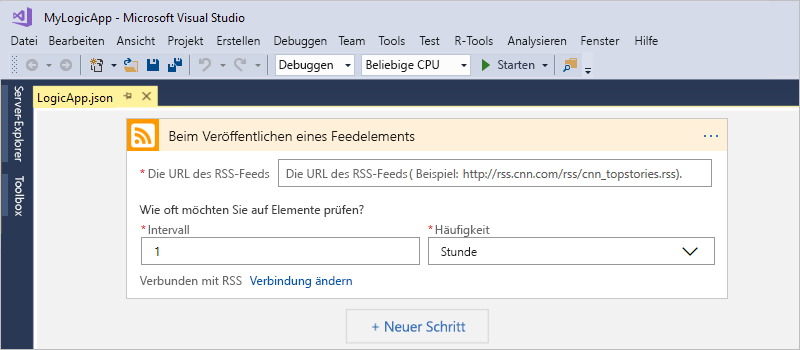

2. Führen Sie zum Abschließen der Logik-App-Erstellung die Workflowschritte in der [Schnellstartanleitung für das Azure-Portal](../logic-apps/quickstart-create-first-logic-app-workflow.md#add-rss-trigger) aus, und kehren Sie dann zu diesem Artikel zurück.

   Anschließend sieht Ihre Logik-App in etwa wie im folgenden Beispiel aus: 

   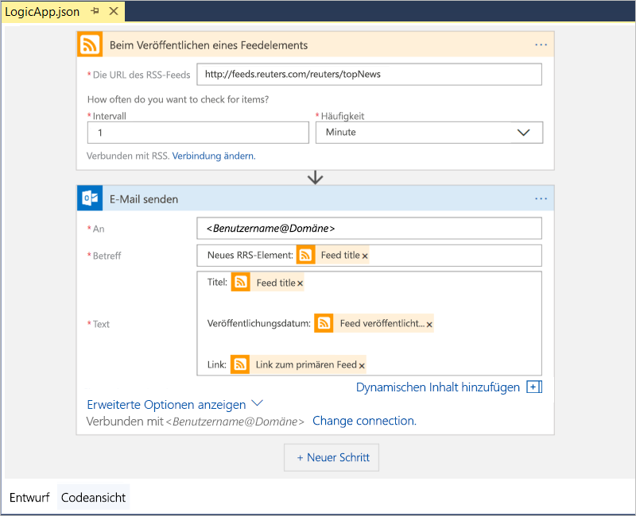

3. Speichern Sie die Visual Studio-Projektmappe, um Ihre Logik-App zu speichern. (Tastenkombination: STRG+S)

Bevor Sie Ihre Logik-App testen können, müssen Sie sie in Azure bereitstellen.

## Bereitstellen der Logik-App in Azure

Bevor Sie Ihre Logik-App ausführen können, müssen Sie sie aus Visual Studio in Azure bereitstellen. Hierfür sind nur einige Schritte erforderlich.

1. Wählen Sie im Projektmappen-Explorer im Kontextmenü Ihres Projekts die Option **Bereitstellen** > **Neu**. Melden Sie sich nach Aufforderung mit Ihrem Azure-Konto an.

   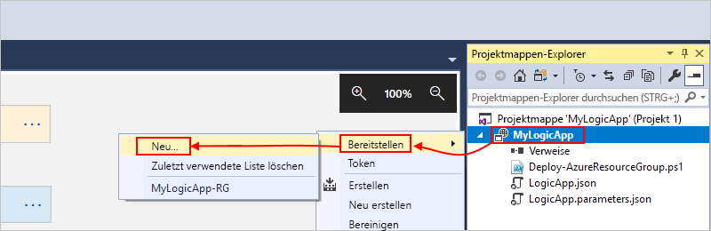

2. Behalten Sie für diese Bereitstellung das Azure-Abonnement, die Ressourcengruppe und andere Standardeinstellungen bei. Wählen Sie **Fertig**, wenn Sie fertig sind. 

   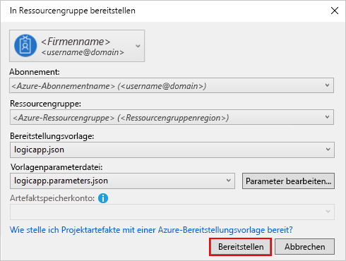

3. Geben Sie den Ressourcennamen der für die Bereitstellung bestimmten Logik-App an, wenn das Feld **Parameter bearbeiten** angezeigt wird, und speichern Sie anschließend Ihre Einstellungen. Beispiel:

   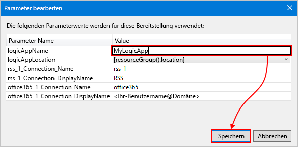

   Wenn die Bereitstellung gestartet wird, wird der Bereitstellungsstatus Ihrer App im Fenster **Ausgabe** von Visual Studio angezeigt. 
   Falls der Status nicht angezeigt wird, können Sie die Liste **Ausgabe anzeigen von** öffnen und Ihre Azure-Ressourcengruppe auswählen.

   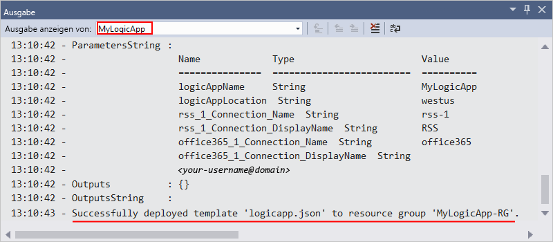

   Nach Abschluss der Bereitstellung befindet sich Ihre Logik-App im Azure-Portal im Livezustand und prüft den RSS-Feed gemäß Ihrem angegebenen Zeitplan (jede Minute). 
   Falls der RSS-Feed über neue Elemente verfügt, sendet Ihre Logik-App für jedes neue Element eine E-Mail. 
   Andernfalls wartet Ihre Logik mit einer erneuten Prüfung bis zum nächsten Intervall. 

   Hier sind Beispiele für E-Mails angegeben, die von dieser Logik-App gesendet werden: 
   Überprüfen Sie Ihren Ordner mit den Junk-E-Mails, falls Sie keine E-Mails erhalten. 

   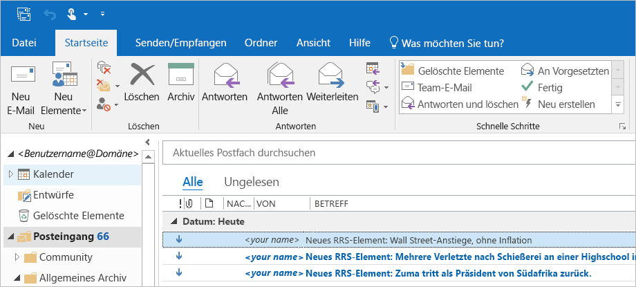

   Aus technischer Sicht passiert Folgendes: Wenn der Trigger den RSS-Feed prüft und neue Elemente findet, wird der Trigger ausgelöst, und die Logic Apps-Engine erstellt eine Instanz Ihres Logik-App-Workflows, mit der Aktionen im Workflow ausgeführt werden.
   Falls der Trigger keine neuen Elemente findet, wird er nicht ausgelöst und überspringt das Instanziieren des Workflows.

Glückwunsch! Sie haben den Buildvorgang und die Bereitstellung Ihrer Logik-App mit Visual Studio erfolgreich durchgeführt. Informationen zur Verwaltung Ihrer Logik-App und des dazugehörigen Ausführungsverlaufs finden Sie unter [Verwalten von Logik-Apps mit Visual Studio](../logic-apps/manage-logic-apps-with-visual-studio.md).

## Bereinigen von Ressourcen

Wenn Sie sie nicht mehr benötigen, löschen Sie die Ressourcengruppe mit Ihrer Logik-App und den dazugehörigen Ressourcen.

1. Melden Sie sich am <a href="https://portal.azure.com" target="_blank">Azure-Portal</a> mit demselben Konto an, das Sie zum Erstellen Ihrer Logik-App verwendet haben. 

2. Wählen Sie im Azure-Hauptmenü die Option **Ressourcengruppen**.
Wählen Sie die Ressourcengruppe für Ihre Logik-App aus, und wählen Sie anschließend **Übersicht**.

3. Wählen Sie auf der Seite **Übersicht** die Option **Ressourcengruppe löschen** aus. Geben Sie zur Bestätigung den Ressourcengruppennamen ein, und klicken Sie auf **Löschen**.

   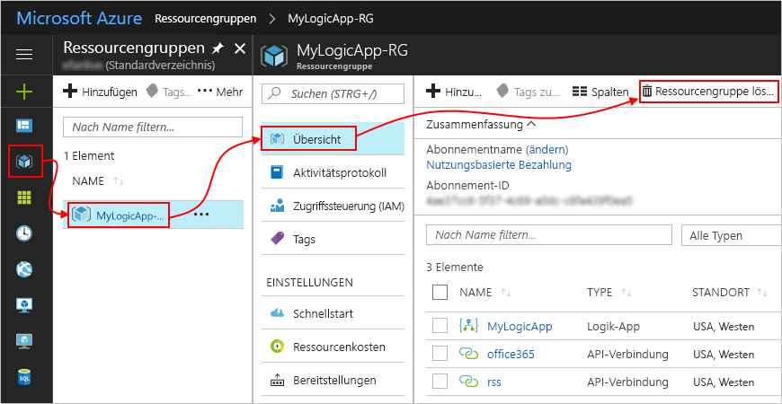

4. Löschen Sie die Visual Studio-Projektmappe von Ihrem lokalen Computer.

## Support

* Sollten Sie Fragen haben, besuchen Sie das <a href="https://social.msdn.microsoft.com/Forums/en-US/home?forum=azurelogicapps" target="_blank">Azure Logic Apps-Forum</a>.
* Wenn Sie Features vorschlagen oder für Vorschläge abstimmen möchten, besuchen Sie die <a href="http://aka.ms/logicapps-wish" target="_blank">Website für Logic Apps-Benutzerfeedback</a>.

## Nächste Schritte

In diesem Artikel haben Sie Ihre Logik-App mit Visual Studio erstellt, bereitgestellt und ausgeführt. Die folgenden Artikel enthalten weitere Informationen zur Verwaltung und Durchführung der erweiterten Bereitstellung für Logik-Apps mit Visual Studio:

> [!div class="nextstepaction"]
> * [Verwalten von Logik-Apps mit Visual Studio](../logic-apps/manage-logic-apps-with-visual-studio.md)
> * [Erstellen von Azure Resource Manager-Vorlagen für die Bereitstellung von Logik-Apps](../logic-apps/logic-apps-create-deploy-template.md)
