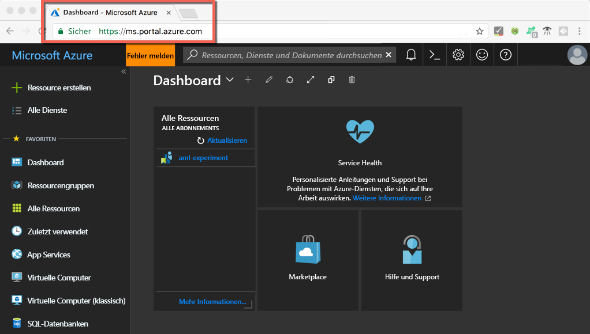
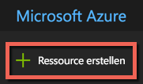
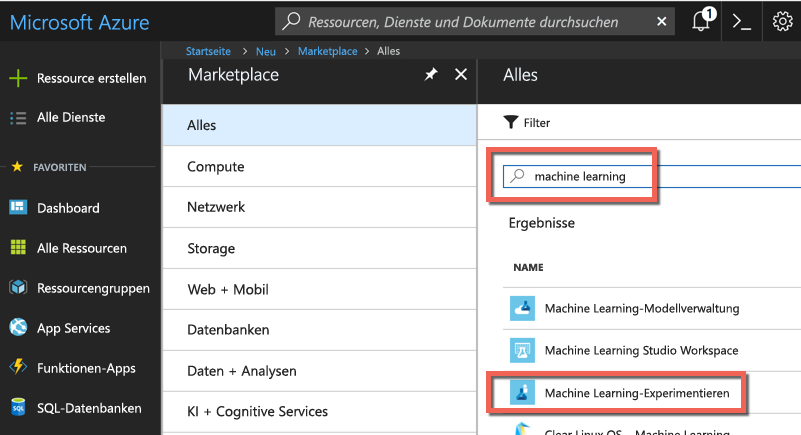
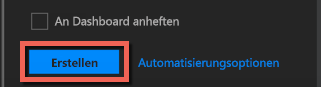
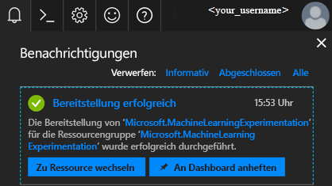
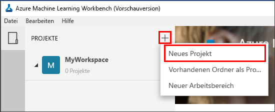
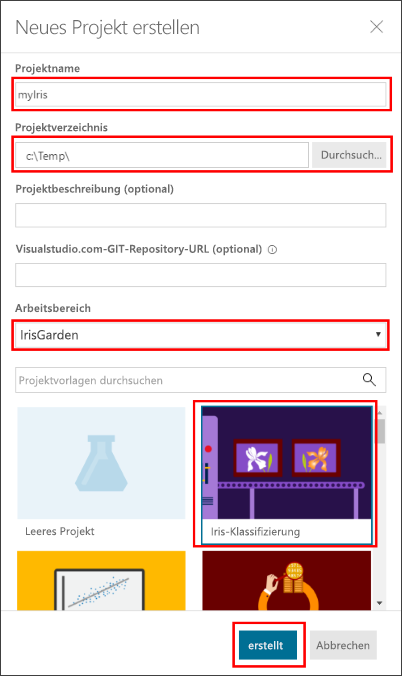
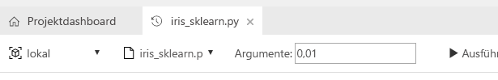
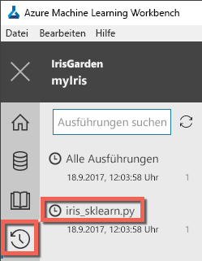
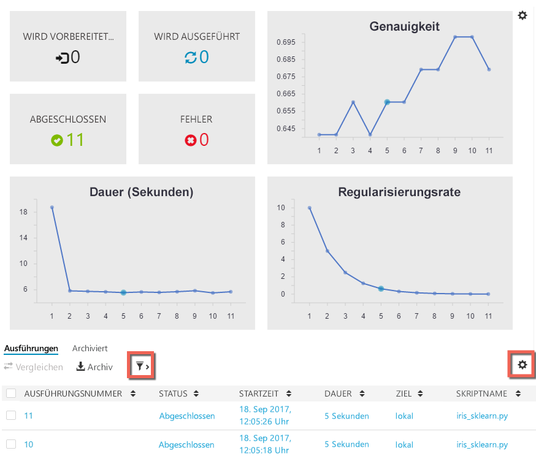

# <a name="quickstart-install-and-get-started-with-azure-machine-learning-service"></a>Schnellstart: Installation und erste Schritte mit Azure Machine Learning Service

[!INCLUDE [workbench-deprecated](../../../includes/aml-deprecating-preview-2017.md)]


Der Azure Machine Learning-Dienst (Vorschauversion) ist eine integrierte End-to-End-Lösung für Data Science und Advanced Analytics. Sie stellt eine Hilfe für professionelle Datenanalysten dar, um Daten vorzubereiten, Experimente zu entwickeln und Modelle für die Cloud bereitzustellen.

In dieser Schnellstartanleitung wird Folgendes beschrieben:

* Erstellen von Dienstkonten für den Azure Machine Learning-Dienst
* Installieren von Azure Machine Learning Workbench und Anmeldung
* Erstellen eines Projekts in Workbench
* Ausführen eines Skripts in diesem Projekt  
* Zugriff auf die Befehlszeilenschnittstelle (CLI)


Als Bestandteil des Microsoft Azure-Portfolios erfordert der Azure Machine Learning-Dienst ein Azure-Abonnement. Wenn Sie kein Azure-Abonnement besitzen, können Sie ein [kostenloses Konto](https://azure.microsoft.com/free/?WT.mc_id=A261C142F) erstellen, bevor Sie beginnen.

Außerdem benötigen Sie ausreichende Berechtigungen zum Erstellen von Objekten wie Ressourcengruppen, VMs usw. 

<a name="prerequisites"></a> Sie können die Azure Machine Learning Workbench-Anwendung unter folgenden Betriebssystemen installieren:
- Windows 10 oder Windows Server 2016
- macOS Sierra oder High Sierra

## <a name="create-azure-machine-learning-service-accounts"></a>Erstellen von Konten für den Azure Machine Learning-Dienst
Verwenden des Azure-Portals für die Bereitstellung der Azure Machine Learning-Konten: 
1. Melden Sie sich mit den Anmeldeinformationen, die Sie für das Azure-Abonnement verwenden, beim [Azure-Portal](https://portal.azure.com/) an. Wenn Sie kein Azure-Abonnement besitzen, können Sie jetzt ein [kostenloses Konto](https://azure.microsoft.com/free/?WT.mc_id=A261C142F) erstellen. 

   

1. Klicken Sie in der linken oberen Ecke des Portals auf die Schaltfläche **Ressource erstellen** (+).

   

1. Geben Sie in der Suchleiste **Machine Learning** ein. Wählen Sie das Suchergebnis mit dem Namen **Machine Learning-Experimentieren** aus. 

   

1. Scrollen Sie im Bereich **Machine Learning-Experimentieren** nach unten, und wählen Sie **Erstellen** aus, um mit der Definition Ihres Experimentieren-Kontos zu beginnen.  

   

1. Konfigurieren Sie im Bereich **ML-Experimentieren** Ihr Machine Learning-Experimentieren-Konto. 

   Einstellung|Vorgeschlagener Wert für Tutorial|BESCHREIBUNG
   ---|---|---
   Experimentation account name (Name des Experimentieren-Kontos) | _Eindeutiger Name_ |Geben Sie einen eindeutigen Namen ein, der Ihr Konto identifiziert. Sie können Ihren eigenen Namen verwenden oder einen Abteilungs- oder Projektnamen, der am besten zu dem Experiment passt. Der Name sollte 2 bis 32 Zeichen lang sein. Es sind nur alphanumerische Zeichen und der Bindestrich (-) zulässig. 
   Abonnement | _Ihr Abonnement_ |Wählen Sie das Azure-Abonnement aus, das Sie für das Experiment verwenden möchten. Wählen Sie bei mehreren Abonnements das Abonnement aus, über das die Ressource abgerechnet wird.
   Ressourcengruppe | _Ihre Ressourcengruppe_ | Verwenden Sie eine vorhandene Ressourcengruppe in Ihrem Abonnement, oder geben Sie einen Namen ein, um eine neue Ressourcengruppe für dieses Experimentieren-Konto zu erstellen. 
   Standort | _Die Region, die Ihren Benutzern am nächsten liegt_ | Wählen Sie den Standort aus, der Ihren Benutzern und den Datenressourcen am nächsten ist.
   Number of seats (Anzahl von Arbeitsplätzen) | 2 | Geben Sie die Anzahl von Arbeitsplätzen ein. Erfahren Sie, wie sich [Arbeitsplätze auf die Preise auswirken](https://azure.microsoft.com/pricing/details/machine-learning/).<br/><br/>Für diesen Schnellstart benötigen Sie nur zwei Arbeitsplätze. Arbeitsplätze können je nach Bedarf im Azure-Portal hinzugefügt oder entfernt werden.
   Speicherkonto | _Eindeutiger Name_ | Wählen Sie **Neu erstellen**, und geben Sie einen Namen an, um ein [Azure-Speicherkonto](https://docs.microsoft.com/azure/storage/common/storage-quickstart-create-account?tabs=portal) zu erstellen. Der Name muss 3 bis 24 Zeichen lang sein und darf nur alphanumerische Zeichen enthalten. Wählen Sie alternativ hierzu die Option **Vorhandene verwenden** und dann Ihr vorhandenes Speicherkonto in der Dropdownliste. Das Speicherkonto ist erforderlich. Es wird zum Speichern von Projektartefakten und Ausführungsverlaufsdaten verwendet. 
   Workspace for Experimentation account (Arbeitsbereich für Experimentieren-Konto) | IrisGarden<br/>(in Tutorials verwendeter Name) | Geben Sie einen Namen für einen Arbeitsbereich für dieses Konto an. Der Name sollte 2 bis 32 Zeichen lang sein. Es sind nur alphanumerische Zeichen und der Bindestrich (-) zulässig. Dieser Arbeitsbereich enthält die Tools, die zum Erstellen, Verwalten und Veröffentlichen von Experimenten erforderlich sind.
   Assign owner for the workspace (Besitzer für den Arbeitsbereich zuweisen) | _Ihr Konto_ | Wählen Sie Ihr eigenes Konto als Besitzer des Arbeitsbereichs aus.
   Erstellen eines Kontos für die Modellverwaltung | **check** |Erstellen Sie jetzt ein Modellverwaltungskonto, damit diese Ressource verfügbar ist, wenn Sie Ihre Modelle als Webdienste in Echtzeit bereitstellen und verwalten möchten. <br/><br/>Dieser Schritt ist zwar optional, es wird jedoch empfohlen, das Modellverwaltungskonto zur gleichen Zeit wie das Experimentieren-Konto zu erstellen.
   Kontoname | _Eindeutiger Name_ | Wählen Sie einen eindeutigen Namen, der Ihr Modellverwaltungskonto identifiziert. Sie können Ihren eigenen Namen verwenden oder einen Abteilungs- oder Projektnamen, der am besten zu dem Experiment passt. Der Name sollte 2 bis 32 Zeichen lang sein. Es sind nur alphanumerische Zeichen und der Bindestrich (-) zulässig. 
   Model Management pricing tier (Modellverwaltungstarif) | **DEVTEST** | Wählen Sie **Es wurde kein Tarif ausgewählt**, um den Tarif für Ihr neues Konto für die Modellverwaltung anzugeben. Um Kosten zu sparen, können Sie den Tarif **DEVTEST** wählen, falls er für Ihr Abonnement verfügbar ist (eingeschränkte Verfügbarkeit). Wählen Sie andernfalls den Tarif S1. Klicken Sie auf **OK**, um die Tarifauswahl zu speichern. 
   An Dashboard anheften | _check_ | Wählen Sie die Option **An Dashboard anheften**, um das Machine Learning-Experimentieren-Konto komfortabel auf der Titelseite des Dashboards im Azure-Portal nachverfolgen zu können.

   

5. Wählen Sie **Erstellen**, um mit dem Erstellungsprozess des Experimentieren-Kontos zusammen mit dem Modellverwaltungskonto zu beginnen.

   

   Die Erstellung eines Kontos kann einige Momente dauern. Sie können den Status des Bereitstellungsprozesses überprüfen, indem Sie in der Symbolleiste des Azure-Portals auf das Benachrichtigungssymbol (Glocke) klicken.
   
   


## <a name="install-and-log-in-to-workbench"></a>Installieren von und Anmelden bei Workbench

Azure Machine Learning Workbench ist für Windows oder macOS verfügbar. Zeigen Sie die Liste der [unterstützten Plattformen](#prerequisites) an.

>[!WARNING]
>Die Installation kann bis zu 30 Minuten dauern. 

1. Laden Sie das aktuelle Workbench-Installationsprogramm herunter, und führen Sie es aus. 
   >[!IMPORTANT]
   >Laden Sie den Installer vollständig auf den Datenträger herunter, und führen Sie ihn dann von dort aus. Führen Sie ihn nicht direkt über das Download-Widget Ihres Browsers aus.

   **Unter Windows:** 

   &nbsp;&nbsp;&nbsp;&nbsp;A. Laden Sie [AmlWorkbenchSetup.msi](https://aka.ms/azureml-wb-msi) herunter.  <br/>
   &nbsp;&nbsp;&nbsp;&nbsp;B. Doppelklicken Sie im Datei-Explorer auf das heruntergeladene Installationsprogramm.

   **Unter macOS:** 

   &nbsp;&nbsp;&nbsp;&nbsp;A. Laden Sie [AmlWorkbench.dmg](https://aka.ms/azureml-wb-dmg) herunter. <br/>
   &nbsp;&nbsp;&nbsp;&nbsp;B. Doppelklicken Sie in Finder auf das heruntergeladene Installationsprogramm.<br/><br/>

1. Folgen Sie im Installationsprogramm den Anweisungen auf dem Bildschirm bis zum Abschluss. 

   **Die Installation kann bis zu 30 Minuten dauern.**  
   
   | |Installationspfad zu Azure Machine Learning Workbench|
   |--------|------------------------------------------------|
   |Windows|C:\Users\\<Benutzer\>\AppData\Local\AmlWorkbench|
   |macOS|/Applications/Azure ML Workbench.app|

   Das Installationsprogramm lädt alle erforderlichen Abhängigkeiten wie Python, Miniconda und andere zugehörige Bibliotheken herunter und richtet sie ein. Diese Installation enthält auch das plattformübergreifende Azure-Befehlszeilentool (Azure CLI).

1. Starten Sie Workbench durch Auswählen der Schaltfläche **Workbench starten** auf der letzten Anzeige des Installationsprogramms. 

   Wenn Sie das Installationsprogramm geschlossen haben:
   + Unter Windows starten Sie sie mithilfe der Desktopverknüpfung **Machine Learning Workbench**. 
   + Unter macOS wählen Sie im Launchpad **Azure ML Workbench**.

1. Wählen Sie auf der ersten Seite die Option **Bei Microsoft anmelden** aus, um die Authentifizierung bei Azure Machine Learning Workbench durchzuführen. Verwenden Sie die gleichen Anmeldeinformationen, die Sie im Azure-Portal zum Erstellen der Experimentieren- und Modellverwaltungskonten verwendet haben. 

   Nachdem Sie sich angemeldet haben, verwendet Workbench das erste Experimentieren-Konto, das in Ihren Azure-Abonnements gefunden wird, und zeigt alle Arbeitsbereiche und Projekte an, die diesem Konto zugeordnet sind. 

   >[!TIP]
   > Sie können über das Symbol unten links im Anwendungsfenster zu einem anderen Experimentieren-Konto wechseln.

## <a name="create-a-project-in-workbench"></a>Erstellen eines Projekts in Workbench

In Azure Machine Learning ist ein Projekt der logische Container für die gesamte Arbeit, die beim Lösen eines Problems anfällt. Es ist einem einzelnen Ordner auf dem lokalen Datenträger zugeordnet, dem Sie Dateien und Unterordner hinzufügen können. 

Hier erstellen wir ein neues Workbench-Projekt mithilfe einer Vorlage, die das [Schwertlilien-DataSet](https://en.wikipedia.org/wiki/Iris_flower_data_set) beinhaltet. In den Tutorials, die sich an diesem Schnellstart orientieren, werden diese Daten zum Erstellen eines Modells verwendet, das den Typ einer Schwertlilie basierend auf einigen ihrer physischen Merkmale vorhersagt.  

1. Wenn Azure Machine Learning Workbench geöffnet ist, wählen Sie im Bereich **PROJEKTE** das Pluszeichen (+) aus und wählen dann **Neues Projekt**.  

   

1. Füllen Sie die Formularfelder aus, und wählen Sie die Schaltfläche **Erstellen**, um in der Workbench ein neues Projekt zu erstellen.

   Feld|Vorgeschlagener Wert für Tutorial|BESCHREIBUNG
   ---|---|---
   Projektname | myIris |Geben Sie einen eindeutigen Namen ein, der Ihr Konto identifiziert. Sie können Ihren eigenen Namen verwenden oder einen Abteilungs- oder Projektnamen, der am besten zu dem Experiment passt. Der Name sollte 2 bis 32 Zeichen lang sein. Es sind nur alphanumerische Zeichen und der Bindestrich (-) zulässig. 
   Projektverzeichnis | c:\Temp\ | Geben Sie das Verzeichnis an, in dem das Projekt erstellt wird.
   Projektbeschreibung | _nicht ausfüllen_ | Optionales Feld für eine Beschreibung der Projekte.
   Visualstudio.com GIT Repository URL (Git-Repository-URL für Visualstudio.com) |_nicht ausfüllen_ | Optionales Feld. Zur Quellcodeverwaltung und Zusammenarbeit kann ein Projekt optional einem Git-Repository bei Azure DevOps zugeordnet werden. [Hier erfahren Sie, wie Sie das Verfahren einrichten](../desktop-workbench/using-git-ml-project.md#step-3-set-up-a-machine-learning-project-and-git-repo). 
   Ausgewählter Arbeitsbereich | IrisGarden (falls vorhanden) | Wählen Sie einen Arbeitsbereich aus, den Sie im Azure-Portal für Ihr Experimentieren-Konto erstellt haben. <br/>Wenn Sie nach dem Schnellstart vorgegangen sind, sollten Sie einen Arbeitsbereich namens „IrisGarden“ haben. Wenn dies nicht der Fall ist, wählen Sie den Arbeitsbereich aus, den Sie bei der Erstellung Ihres Experimentieren-Kontos erstellt haben, oder einen anderen Arbeitsbereich, den Sie verwenden möchten.
   Projektvorlage | Klassifizieren von Schwertlilien | Vorlagen enthalten Skripts und Daten, die Sie zum Erkunden des Produkts verwenden können. Diese Vorlage enthält die benötigten Skripts und Daten für diesen Schnellstart und andere Tutorials auf dieser Dokumentationswebsite. 

   
 
 Ein neues Projekt wird erstellt, und das Projektdashboard wird mit diesem Projekt geöffnet. Nun können Sie die Projektstartseite, Datenquellen, Notebooks und Quellcodedateien untersuchen. 

>[!TIP]
>Für eine reibungslose Data Science-Entwicklungserfahrung können Sie Workbench für die Verwendung in einer integrierten Python-Umgebung (IDE) konfigurieren. Anschließend können Sie in der IDE mit Ihrem Projekt interagieren. [Weitere Informationen](../desktop-workbench/how-to-configure-your-ide.md). 

## <a name="run-a-python-script"></a>Ausführen eines Python-Skripts

Jetzt können Sie das Skript **iris_sklearn.py** auf Ihrem lokalen Computer ausführen. Dieses Skript ist standardmäßig in der Projektvorlage **Klassifizieren von Schwertlilien** enthalten. Mit dem Skript wird ein Modell für die [logistische Regression](https://en.wikipedia.org/wiki/Logistic_regression) erstellt, indem die beliebte Python-Bibliothek [scikit-learn](http://scikit-learn.org/stable/index.html) verwendet wird.

1. Wählen Sie oben auf der Seite **Projektdashboard** die Option **Lokal** als Ausführungsziel und dann **iris_sklearn.py** als auszuführendes Skript aus. Diese Werte sind standardmäßig bereits ausgewählt. 

   Das Beispiel enthält noch weitere Dateien, die Sie später verwenden können, in diesem Schnellstart ist für uns jedoch nur **iris_sklearn.py** interessant. 

   

1. Geben Sie im Textfeld **Argumente** den Wert **0,01** ein. Dieser Wert entspricht der Regularisierungsrate und wird im Skript verwendet, um das Modell für die logistische Regression zu konfigurieren. 

1. Wählen Sie **Ausführen**, um die Ausführung des Skripts auf Ihrem Computer zu starten. Der Auftrag **iris_sklearn.py** wird sofort im Panel **Aufträge** auf der rechten Seite angezeigt, sodass Sie die Ausführung des Skripts überwachen können.

   Glückwunsch! Sie haben in Azure Machine Learning Workbench erfolgreich ein Python-Skript ausgeführt.

1. Wiederholen Sie die Schritte 2 bis 3 mehrmals mit verschiedenen Argumentwerten im Bereich von **0,001** bis **10** (z.B. in Zehnerpotenzen). Jede Ausführung wird im Bereich **Aufträge** angezeigt.

1. Untersuchen Sie den Ausführungsverlauf, indem Sie die Ansicht **Ausführungen** und dann **iris_sklearn.py** in der Liste mit den Ausführungen verwenden. 

   

   In dieser Ansicht werden alle Ausführungen angezeigt, die für **iris_sklearn.py** erfolgt sind. Auf dem Dashboard mit dem Ausführungsverlauf werden darüber hinaus die wichtigsten Metriken, eine Reihe von Standarddiagrammen und eine Liste der Metriken für jede Ausführung angezeigt. 

1. Sie können diese Ansicht anpassen, indem Sie die Konfigurationen mithilfe der Zahnrad- und Filtersymbole sortieren, filtern und anpassen.

   

3. Wählen Sie im Auftragsbereich eine abgeschlossene Ausführung aus, um eine ausführliche Übersicht über die jeweilige Ausführung anzuzeigen. Zu den Details gehören zusätzliche Metriken, die dafür erzeugten Dateien und andere Protokolle, die ggf. nützlich sind.

## <a name="start-the-cli"></a>Starten der CLI

Die Azure Machine Learning-Befehlszeilenschnittstelle (CLI) wird ebenfalls installiert. Die Befehlszeilenschnittstelle ermöglicht den Zugriff auf Ihren Azure Machine Learning-Dienst und die Interaktion mit diesem mithilfe der `az`-Befehle zum Durchführen aller erforderlichen Aufgaben für einen vollständigen Data Science-Workflow. [Weitere Informationen.](../desktop-workbench/tutorial-iris-azure-cli.md)

Sie können die Azure Machine Learning-CLI über die Workbench-Symbolleiste über **Datei → Eingabeaufforderung öffnen** starten.

Mit dem Argument „--help“ erhalten Sie in der Azure Machine Learning-CLI Hilfe zu Befehlen.

```az ml --help```

## <a name="clean-up-resources"></a>Bereinigen von Ressourcen

[!INCLUDE [aml-delete-resource-group](../../../includes/aml-delete-resource-group.md)]

## <a name="next-steps"></a>Nächste Schritte
Sie haben jetzt die erforderlichen Azure Machine Learning-Konten erstellt und die Azure Machine Learning Workbench-Anwendung installiert. Außerdem haben Sie ein neues Projekt erstellt, ein Skript ausgeführt und den Ausführungsverlauf des Skripts untersucht.

Eine ausführlichere Erläuterung dieses Workflows, u.a. Informationen zum Bereitstellen des Schwertlilienmodells als Webdienst, finden Sie im Tutorial zum *Klassifizieren von Schwertlilien*. Dieses Tutorial in voller Länge enthält ausführliche Schritte für die [Datenvorbereitung](../desktop-workbench/tutorial-classifying-iris-part-1.md), das [Experimentieren](../desktop-workbench/tutorial-classifying-iris-part-2.md) und die [Modellverwaltung](../desktop-workbench/tutorial-classifying-iris-part-3.md). 

> [!div class="nextstepaction"]
> [Tutorial: Klassifizieren von Schwertlilien (Teil 1)](../desktop-workbench/tutorial-classifying-iris-part-1.md)

>[!NOTE]
> Sie haben zwar Ihr Modellverwaltungskonto erstellt, aber Ihre Umgebung ist noch nicht für die Bereitstellung von Webdiensten eingerichtet. Erfahren Sie, wie die [Bereitstellungsumgebung](../desktop-workbench/deployment-setup-configuration.md) eingerichtet wird.
