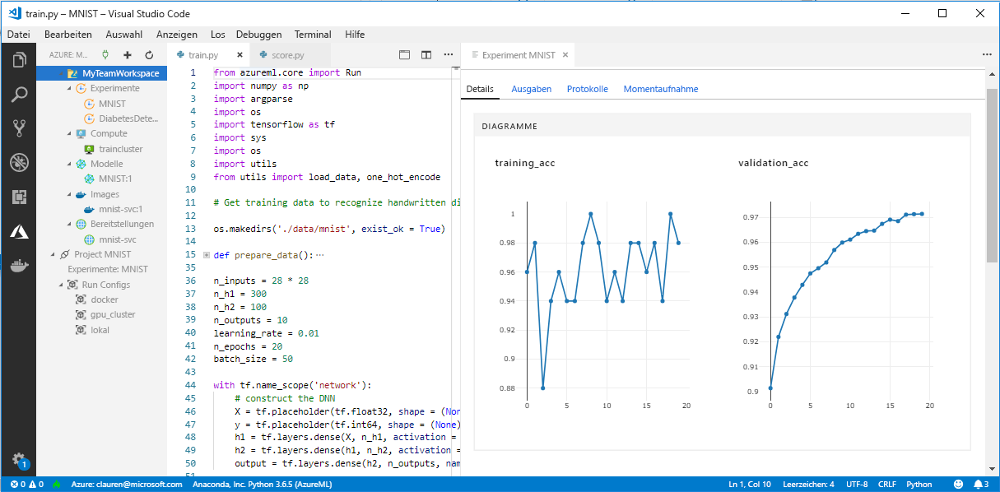

# <a name="what-happened-to-azure-machine-learning-workbench"></a>Was ist mit der Azure Machine Learning Workbench geschehen?

Die Azure Machine Learning Workbench-Anwendung und einige andere frühe Features sind veraltet und wurden im Release vom 2018 ersetzt, um den Weg für eine verbesserte [Architektur](concept-azure-machine-learning-architecture.md) frei zu machen. 

Die Version enthält viele wichtige Updates, die durch Feedback von Kunden ausgelöst wurden, um Ihr Benutzererlebnis verbessern. Die Kernfunktionen von der Experimentausführung bis hin zur Modellimplementierung hat sich nicht geändert. Jetzt können Sie jedoch das stabile <a href="https://aka.ms/aml-sdk" target="_blank">SDK</a> und die [Azure CLI](reference-azure-machine-learning-cli.md) für Ihre Machine Learning-Aufgaben und -Pipelines verwenden.  

Die meisten der in der früheren Version des Azure Machine Learning Service erstellten Artefakte sind in Ihrem eigenen lokalen Speicher oder in Cloudspeicher gespeichert. Diese Artefakte verschwinden nie.

In diesem Artikel erfahren Sie, was sich geändert hat und welche Auswirkungen das auf Ihre mit Azure Machine Learning Workbench und den APIs erledigte Arbeit hat.

>[!Warning]
>Dieser Artikel ist nicht für Benutzer von Azure Machine Learning Studio bestimmt. Er richtet sich an Kunden von Azure Machine Learning Service, die die Workbench-Anwendung (Vorschau) installiert haben und/oder über Experimentier- und Modellverwaltungskonten (Vorschau) verfügen.


## <a name="what-changed"></a>Was hat sich geändert?

Die neueste Version von Azure Machine Learning Service umfasst folgende Funktionen:
+ Ein [vereinfachtes Azure-Ressourcenmodell](concept-azure-machine-learning-architecture.md).
+ Eine [neue Portal-Benutzeroberfläche](how-to-track-experiments.md) zum Verwalten Ihrer Experimente und Computeziele.
+ Ein neues, umfangreicheres Python-<a href="https://aka.ms/aml-sdk" target="_blank">SDK</a>.
+ Die neue, erweiterte [Azure CLI-Erweiterung](reference-azure-machine-learning-cli.md) für Machine Learning.

Die [Architektur](concept-azure-machine-learning-architecture.md) wurde im Hinblick auf leichte Bedienbarkeit umgestaltet. Anstelle von mehreren Azure-Ressourcen und -Konten benötigen Sie nur einen [Arbeitsbereich für den Azure Machine Learning-Dienst](concept-azure-machine-learning-architecture.md#workspace). Arbeitsbereiche können schnell im [Azure-Portal]((setup-create-workspace.md#portal) erstellt werden. Durch die Verwendung eines Arbeitsbereichs können mehrere Benutzer Computeziele für Training und Bereitstellung, Modellexperimente, Docker-Images, bereitgestellte Modelle usw. speichern.

Zwar gibt es in der aktuellen Version neue, verbesserte CLI- und SDK-Clients, die eigentliche Workbench-Desktopanwendung wurde aber eingestellt. Experimente können im [Arbeitsbereich-Dashboard im Azure-Portal](how-to-track-experiments.md#view-the-experiment-in-the-azure-portal) verwaltet werden. Verwenden Sie das Dashboard, um Ihren Experimentverlauf abzurufen, die an Ihren Arbeitsbereich angefügten Computeziele zu verwalten, Ihre Modelle und Docker-Images zu verwalten und sogar Webdienste bereitzustellen.

<a name="timeline"></a>

## <a name="support-timeline"></a>Unterstützungszeitachse

Am 9. Januar 2019 wurden der Support für Machine Learning Workbench-, Azure Machine Learning-Experimentieren- und Modellverwaltung-Konten sowie das zugehörige SDK und die CLI eingestellt. 

Alle aktuellen Funktionen sind bei Verwendung dieses <a href="https://aka.ms/aml-sdk" target="_blank">SDK</a>, der [CLI](reference-azure-machine-learning-cli.md) und des [Portals](setup-create-workspace.md#portal) verfügbar.

## <a name="what-about-run-histories"></a>Wie sieht es mit Ausführungsverläufen aus?

Der Zugriff auf ältere Ausführungsverläufe ist nicht mehr möglich, Sie können Ihre Ausführungen in der aktuellen Version jedoch weiterhin anzeigen. 

Ausführungsverläufe heißen jetzt **Experimente**. Sie können die Experimente Ihres Modells sammeln und sie mithilfe des SDK, der CLI oder des Azure-Portals untersuchen.

Das Arbeitsbereich-Dashboard im Portal wird nur in den Browsern Microsoft Edge, Chrome und Firefox unterstützt:

[](./media/overview-what-happened-to-workbench/image001.png#lightbox)

Beginnen Sie, Ihre Modelle mithilfe des neuen CLIs und SDKs zu trainieren und ihre Ausführungsverläufe mit diesen nachzuverfolgen. Wie das geht, können Sie mit dem [Tutorial: Trainieren von Modellen mit Azure Machine Learning Service](tutorial-train-models-with-aml.md) lernen.

## <a name="can-i-still-prep-data"></a>Kann ich weiterhin Daten vorbereiten?

Die vorhandenen Datenvorbereitungsdateien können nicht in die neueste Version portiert werden, da wir nicht mehr über die Machine Learning Workbench verfügen. Sie können jedoch weiterhin ein Dataset von beliebiger Größe für die Modellierung vorbereiten.   

Für Datasets jeglicher Größe können Sie das [Azure Machine Learning Data Prep SDK](https://aka.ms/data-prep-sdk) verwenden, um Ihre Daten vor der Modellierung schnell vorzubereiten, indem Sie Python-Code schreiben. 

Weitere Informationen zur Verwendung des Azure Machine Learning Data Prep SDK finden Sie in [diesem Tutorial](tutorial-data-prep.md).

## <a name="will-projects-persist"></a>Bleiben Projekte dauerhaft erhalten?

Sie verlieren weder Code noch Arbeit. In der älteren Version stellen Projekte Cloudentitäten mit einem lokalen Verzeichnis dar. In der aktuellen Version fügen Sie lokale Verzeichnisse mithilfe einer lokalen Konfigurationsdatei an den Arbeitsbereich des Azure Machine Learning Service an. Hier finden Sie ein [Diagramm der aktuellen Architektur](concept-azure-machine-learning-architecture.md).

Ein großer Teil des Projektinhalts befindet sich bereits auf Ihrem lokalen Computer. Daher müssen Sie lediglich eine Konfigurationsdatei im betreffenden Verzeichnis erstellen und in Ihrem Code auf sie verweisen, um ihn mit Ihrem Arbeitsbereich zu verbinden. Um das lokale Verzeichnis, das Ihre Dateien und Skripts enthält, weiterhin zu verwenden, geben Sie den Namen des Verzeichnisses im Python-Befehl ['experiment.submit'](https://docs.microsoft.com/python/api/azureml-core/azureml.core.experiment.experiment?view=azure-ml-py) ein. Alternativ hierzu können Sie auch den CLI-Befehl `az ml project attach` verwenden.  Beispiel: 
```python
run = exp.submit(source_directory = script_folder, script = 'train.py', run_config = run_config_system_managed)
```

[Erstellen Sie einen Arbeitsbereich](setup-create-workspace.md#portal), um loszulegen.

## <a name="what-about-my-registered-models-and-images"></a>Was geschieht mit meinen registrierten Modellen und Images?

Die Modelle, die Sie in Ihrer alten Modellregistrierung registriert haben, müssen zu Ihrem neuen Arbeitsbereich migriert werden, wenn Sie sie weiterhin verwenden möchten. Um Ihre Modelle zu migrieren, laden Sie die Modelle herunter, und registrieren Sie sie erneut in Ihrem neuen Arbeitsbereich. 

Die Images, die Sie in Ihrer alten Imageregistrierung erstellt haben, müssen im neuen Arbeitsbereich neu erstellt werden, um weiterhin verwendet werden zu können. Sie können diese Images neu erstellen, indem Sie Vorgehensweisen in den Abschnitten zum [Konfigurieren und Erstellen eines Images](how-to-deploy-and-where.md#configureimage) befolgen. 

## <a name="what-about-deployed-web-services"></a>Was ist mit bereitgestellten Webdiensten?

Da die alte CLI jetzt nicht mehr unterstützt wird, können Sie weder Modelle erneut bereitstellen noch die Webdienste verwalten, die Sie ursprünglich mit Ihrem Modellverwaltung-Konto bereitgestellt haben. Diese Webdienste funktionieren jedoch weiterhin, so lange der Azure Container Service (ACS) noch unterstützt wird.

In der aktuellen Version werden Modelle als Webdienste in Azure Container Instances (ACI) oder Azure Kubernetes Service-Clustern (AKS) bereitgestellt. Darüber hinaus sind Bereitstellungen in FPGAs und an Azure IoT Edge möglich. 

Weitere Informationen finden Sie in diesen Artikeln:
+ [Bereitstellen von Modellen mit dem Azure Machine Learning-Dienst](how-to-deploy-and-where.md)
+ [Tutorial: Bereitstellen von Modellen mit Azure Machine Learning Service](tutorial-deploy-models-with-aml.md)

## <a name="what-about-the-old-sdk-and-cli"></a>Was ist mit dem alten SDK und der CLI geschehen?

Ja, sie werden noch bis Januar funktionieren. Siehe den vorigen Abschnitt [Zeitplan](#timeline). Wir empfehlen, neue Experimente und Modelle mit dem neuesten SDK oder der neuesten CLI zu erstellen.

Wenn Sie das neue Python SDK in der neuesten Version verwenden, können Sie mit dem Azure Machine Learning Service in beliebigen Python-Umgebungen interagieren. Informationen zur Installation des aktuellen <a href="https://aka.ms/aml-sdk" target="_blank">SDKs</a>. Sie können auch die aktualisierte [Azure Machine Learning CLI-Erweiterung](reference-azure-machine-learning-cli.md) mit dem umfassenden Satz an `az ml`-Befehlen verwenden, um mit dem Dienst in einer beliebigen Befehlszeilenumgebung zu interagieren, einschließlich der Azure Cloud Shell.

## <a name="what-about-visual-studio-code-tools-for-ai"></a>Wie sieht es mit Visual Studio Code Tools for AI aus?

In dieser aktuellen Version wurde die Erweiterung in Azure Machine Learning für Visual Studio Code umbenannt sowie erweitert und verbessert, um die zuvor genannten neuen Features zu unterstützen.

[](./media/overview-what-happened-to-workbench/vscode-big.png#lightbox)

## <a name="what-about-domain-packages"></a>Was ist über Domänenpakete zu sagen?

Die Domänenpakete für maschinelles Sehen, Textanalyse und Vorhersagen können mit der aktuellen Version von Azure Machine Learning nicht verwendet werden. Allerdings können Sie mit dem aktuellen Azure Machine Learning Python-<a href="https://aka.ms/aml-sdk" target="_blank">SDK</a> weiterhin Modelle für maschinelles Sehen, Textanalyse und Vorhersagen erstellen und trainieren. Informationen zum Migrieren bereits vorhandener Modelle, die mit den Paketen für maschinelles Sehen, Textanalyse und Vorhersagen erstellt wurden, erhalten Sie unter [AML-Packages@microsoft.com](mailto:AML-Packages@microsoft.com).

## <a name="next-steps"></a>Nächste Schritte

Informationen zur [aktuellen Architektur für Azure Machine Learning Service](concept-azure-machine-learning-architecture.md). 

Eine Übersicht über den Dienst finden Sie unter [Was ist der Azure Machine Learning Service?](overview-what-is-azure-ml.md)

Eine Schnellstartanleitung, in der Sie erfahren, wie ein Skript ausgeführt und der Ausführungsverlauf des Skripts mit der neuesten Version von Azure Machine Learning Service untersucht wird, finden Sie unter [Schnellstart: Verwenden eines cloudbasierten Notebook-Servers für die ersten Schritte mit Azure Machine Learning](quickstart-run-cloud-notebook.md).

Einen detaillierteren Einblick in diesen Workflow erhalten Sie im [vollständigen Tutorial](tutorial-train-models-with-aml.md), das detaillierte Schritte für das Trainieren und Bereitstellen von Modellen mit Azure Machine Learning Service enthält. 
