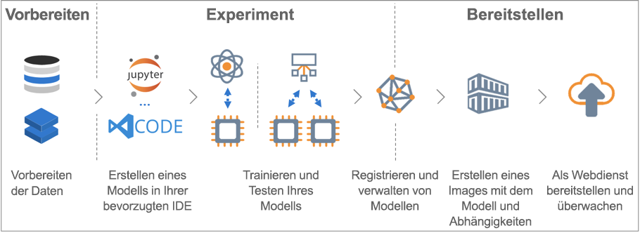

# Was ist der Azure Machine Learning-Dienst?

Der Azure Machine Learning-Dienst ist ein Clouddienst, mit dem Sie Modelle für maschinelles Lernen trainieren, bereitstellen, automatisieren und verwalten und dabei von den Vorteilen der Cloud profitieren können.

## Was ist Machine Learning?

Machine Learning ist ein Data Science-Verfahren, mit dem Computer aus vorhandenen Daten lernen können, um zukünftiges Verhalten, Ergebnisse und Trends vorherzusagen. Mithilfe von maschinellem Lernen lernen Computer ohne vorherige explizite Programmierung.

Dank solcher Vorhersagen oder Prognosen aus Machine Learning können Apps und Geräte „intelligenter“ werden. Wenn Sie beispielsweise online einkaufen, trägt maschinelles Lernen dazu bei, dass Ihnen anhand der gekauften Produkte weitere Produkte empfohlen werden, die Ihnen gefallen könnten. Ein weiteres Beispiel ist die Nutzung Ihrer Kreditkarte. Dabei wird mithilfe von maschinellem Lernen die Transaktion mit einer Transaktionsdatenbank verglichen, wodurch Betrugsfälle erkannt werden können. Auch wenn ein automatischer Staubsauger ein Zimmer saugt, wird mit maschinellem Lernen entschieden, ob die Arbeit erledigt ist.

## Was ist der Azure Machine Learning-Dienst?

Azure Machine Learning Service umfasst eine cloudbasierte Umgebung, auf die Sie zum Aufbereiten von Daten sowie zum Trainieren, Testen, Bereitstellen, Verwalten und Nachverfolgen von Machine Learning-Modellen zurückgreifen können.

[] (./media/overview-what-is-azure-ml/aml.png#lightbox)

Der Azure Machine Learning-Dienst bietet eine umfassende Unterstützung von Open-Source-Technologie. So können Sie beispielsweise mehrere zehntausend Open-Source-Python-Pakete mit Komponenten für maschinelles Lernen nutzen. Beispiele wären etwa PyTorch, TensorFlow und scikit-learn.
Dank der Unterstützung umfassender Tools können Sie Daten ganz einfach interaktiv untersuchen und aufbereiten und anschließend Modelle entwickeln und testen. Beispiele wären etwa [Jupyter Notebooks](http://jupyter.org) und die Erweiterung [Azure Machine Learning für Visual Studio Code](https://marketplace.visualstudio.com/items?itemName=ms-toolsai.vscode-ai#overview).
Zudem umfasst der Azure Machine Learning-Dienst Features zum [Automatisieren der Modellgenerierung und -optimierung](tutorial-auto-train-models.md), wodurch Sie auf einfache und effiziente Weise genaue Modelle erstellen können.

Mithilfe des Azure Machine Learning-Diensts können Sie auf Ihrem lokalen Computer mit dem Training beginnen und später die Vorteile der Cloud nutzen. Dank zahlreicher verfügbarer [Computeziele](how-to-set-up-training-targets.md) wie Azure Machine Learning Compute und [Azure Databricks](/azure/azure-databricks/what-is-azure-databricks) sowie dank [Diensten für die erweiterte Hyperparameteroptimierung](how-to-tune-hyperparameters.md) können Sie mithilfe der Cloud schneller bessere Modelle erstellen.

Wenn Sie über das richtige Modell verfügen, können Sie es ganz einfach in einem Container wie Docker bereitstellen. Dadurch wird das Bereitstellen in Azure Container Instances oder Azure Kubernetes Service zum Kinderspiel. Der Container kann aber auch in eigenen Bereitstellungen verwendet werden – entweder lokal oder in der Cloud. Weitere Informationen finden Sie im Artikel [Bereitstellen: wie und wo](how-to-deploy-and-where.md).

Sie können die bereitgestellten Modelle verwalten und mehrere Ausführungen nachverfolgen, um die bestmögliche Lösung zu finden.
Nach der Bereitstellung kann Ihr Modell Prognosen [in Echtzeit](how-to-consume-web-service.md) oder [asynchron](how-to-run-batch-predictions.md) (für große Datenmengen) zurückgeben.

Und dank erweiterter [Machine Learning-Pipelines](concept-ml-pipelines.md) können Sie bei sämtlichen Schritten für Datenaufbereitung, Modelltraining/-auswertung und Bereitstellung zusammenarbeiten.

## Wofür kann ich den Azure Machine Learning-Dienst verwenden?

Mit dem <a href="https://aka.ms/aml-sdk" target="_blank">Python-Haupt-SDK</a> und dem <a href="https://aka.ms/data-prep-sdk" target="_blank">SDK für die Datenaufbereitung</a> für Azure Machine Learning sowie mit Open-Source-Python-Paketen können Sie in einem Azure Machine Learning Service-Arbeitsbereich äußerst genaue Machine Learning- und Deep Learning-Modelle erstellen und trainieren.
Sie können aus mehreren Komponenten für maschinelles Lernen wählen, die in Open-Source-Paketen für Python enthalten sind. Hierzu zählen beispielsweise:

- <a href="https://scikit-learn.org/stable/" target="_blank">scikit-learn</a>
- <a href="https://www.tensorflow.org" target="_blank">TensorFlow</a>
- <a href="https://pytorch.org" target="_blank">PyTorch</a>
- <a href="https://www.microsoft.com/en-us/cognitive-toolkit/" target="_blank">CNTK</a>
- <a href="http://mxnet.io" target="_blank">MXNet</a>

Azure Machine Learning Service kann auch automatisch ein Modell trainieren und optimieren.
Ein Beispiel finden Sie unter [Tutorial: Erstellen Ihres Regressionsmodells mit automatisiertem Machine Learning](tutorial-auto-train-models.md).

Sobald Sie über ein Modell verfügen, können Sie es verwenden, um einen Container (beispielsweise Docker) zu erstellen, der lokal zu Testzwecken bereitgestellt werden kann. Nach Abschluss der Tests können Sie das Modell als Produktionswebdienst in Azure Container Instances oder Azure Kubernetes Service bereitstellen. Weitere Informationen finden Sie im Artikel [Bereitstellen: wie und wo](how-to-deploy-and-where.md).

Die bereitgestellten Modelle können dann über das [Azure Machine Learning SDK für Python](https://aka.ms/aml-sdk) oder über das [Azure-Portal](https://portal.azure.com/) verwaltet werden.
Sie können Modellmetriken bewerten, neue Versionen des Modells erneut trainieren und bereitstellen und gleichzeitig die Modellexperimente nachverfolgen.

Informationen zu den ersten Schritten mit dem Azure Machine Learning-Dienst finden Sie [hier](#next-steps).

## Inwiefern unterscheidet sich der Azure Machine Learning-Dienst von Machine Learning Studio?

Azure Machine Learning Studio ist ein visueller Arbeitsbereich mit Drag & Drop-Funktionalität, der sich für die Zusammenarbeit mit anderen Entwicklern und das Erstellen, Testen und Bereitstellen von Lösungen für maschinelles Lernen eignet. Dafür muss kein Code geschrieben werden. Diese Umgebung verwendet vorgefertigte und vorkonfigurierte Algorithmen für maschinelles Lernen und Module für die Verarbeitung von Daten. 

Greifen Sie auf Azure Machine Learning Studio zurück, wenn Sie auf schnelle und einfache Weise mit Machine Learning-Modellen experimentieren möchten und die integrierten Algorithmen für maschinelles Lernen für Ihre Lösungen ausreichend sind.

Verwenden Sie den Machine Learning-Dienst, wenn Sie in einer Python-Umgebung arbeiten und mehr Kontrolle über Ihre Algorithmen für maschinelles Lernen wünschen oder Open Source-Bibliotheken für maschinelles Lernen verwenden möchten.

> [!NOTE]
> Modelle, die in Azure Machine Learning Studio erstellt werden, können nicht vom Azure Machine Learning-Dienst bereitgestellt und verwaltet werden.

## Kostenlose Testversion

Wenn Sie kein Azure-Abonnement besitzen, können Sie ein kostenloses Konto erstellen, bevor Sie beginnen. Probieren Sie heute die [kostenlose oder kostenpflichtige Version des Azure Machine Learning Service](http://aka.ms/AMLFree) aus.

Sie erhalten dann eine Gutschrift, die Sie für Azure-Dienste einlösen können. Wenn das Guthaben aufgebraucht ist, können Sie das Konto behalten und weiterhin [kostenlose Azure-Dienste](https://azure.microsoft.com/free/) nutzen. Ihre Kreditkarte wird nur dann belastet, wenn Sie Ihre Einstellungen explizit ändern und mit der Berechnung von Gebühren einverstanden sind. Alternativ können Sie Ihre [Vorteile für MSDN-Abonnenten aktivieren](https://azure.microsoft.com/pricing/member-offers/msdn-benefits-details/?WT.mc_id=A261C142F). Dadurch erhalten Sie ein monatliches Guthaben, das Sie für zahlungspflichtige Azure-Dienste verwenden können.

## Nächste Schritte

- Erstellen Sie für den Einstieg einen Machine Learning Service-Arbeitsbereich – entweder über das [Azure-Portal](quickstart-get-started.md) (ohne Installation) oder in [Python](quickstart-create-workspace-with-python.md) (mit SDK-Installation).

- Umfassende Tutorials hierzu: 
  + [Tutorial: Trainieren eines Bildklassifizierungsmodells mit dem Azure Machine Learning Service](tutorial-train-models-with-aml.md) 
  + [Tutorial: Vorbereiten von Daten für die Regressionsmodellierung](tutorial-data-prep.md)
  
- Verwenden Sie zum Vorbereiten Ihrer Daten das [Azure Machine Learning Data Prep SDK](https://aka.ms/data-prep-sdk).

- Erfahren Sie mehr über [Machine Learning-Pipelines](/azure/machine-learning/service/concept-ml-pipelines) zum Erstellen, Optimieren und Verwalten Ihrer Machine Learning-Szenarien.

- Lesen Sie den ausführlichen Artikel [Funktionsweise des Azure Machine Learning-Diensts: Architektur und Konzepte](concept-azure-machine-learning-architecture.md).

- Weitere Informationen finden Sie unter [Welche Machine Learning-Produkte bietet Microsoft?](./overview-more-machine-learning.md).
