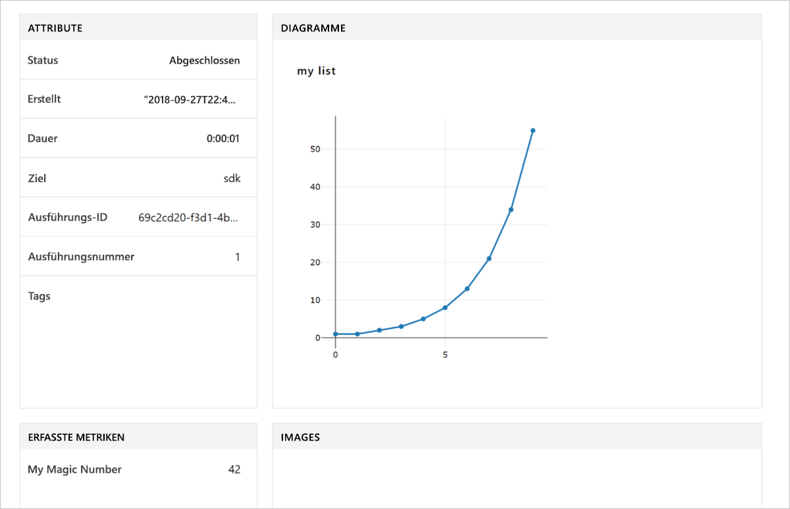

# <a name="quickstart-use-the-python-sdk-to-get-started-with-azure-machine-learning"></a>Schnellstart: Verwenden des Python SDK für die ersten Schritte mit Azure Machine Learning

In diesem Artikel verwenden Sie das Azure Machine Learning SDK für Python, um einen [Arbeitsbereich](concept-azure-machine-learning-architecture.md) für den Azure Machine Learning-Dienst zu erstellen und zu verwenden. Der Arbeitsbereich bildet die Grundlage in der Cloud zum Experimentieren, Trainieren und Bereitstellen von Machine Learning-Modellen mit Machine Learning. 

Sie beginnen mit dem Konfigurieren Ihrer eigenen Python-Umgebung und eines eigenen Jupyter Notebook-Servers. Informationen zur Ausführung ohne Installation finden Sie unter [Schnellstart: Verwenden des Azure-Portals zum Ausführen der ersten Schritte für Azure Machine Learning](quickstart-get-started.md).

> [!VIDEO https://www.microsoft.com/en-us/videoplayer/embed/RE2G9N6]

In diesem Artikel führen Sie folgende Schritte aus:
* Installieren des Python SDK.
* Erstellen eines Arbeitsbereichs in Ihrem Azure-Abonnement.
* Erstellen einer Konfigurationsdatei für diesen Arbeitsbereich zur späteren Verwendung in anderen Notebooks und Skripts
* Schreiben von Code, der Werte im Arbeitsbereich protokolliert
* Anzeigen der protokollierten Werte in Ihrem Arbeitsbereich

Sie erstellen einen Arbeitsbereich sowie eine Konfigurationsdatei, um sie als Voraussetzungen für andere Machine Learning-Tutorials und -Anleitungen zu nutzen. Genau wie bei anderen Azure-Diensten gelten auch für Machine Learning bestimmte Grenzwerte und Kontingente. [Erfahren Sie mehr zu Kontingenten und ihrer Erhöhung.](how-to-manage-quotas.md)

Folgende Azure-Ressourcen werden Ihrem Arbeitsbereich automatisch hinzugefügt, sofern sie regional verfügbar sind:
 
- [Azure Container Registry](https://azure.microsoft.com/services/container-registry/)
- [Azure Storage (in englischer Sprache)](https://azure.microsoft.com/services/storage/)
- [Azure Application Insights](https://azure.microsoft.com/services/application-insights/) 
- [Azure Key Vault](https://azure.microsoft.com/services/key-vault/)

Falls Sie kein Azure-Abonnement besitzen, können Sie ein kostenloses Konto erstellen, bevor Sie beginnen. Probieren Sie die [kostenlose oder kostenpflichtige Version von Azure Machine Learning Service](http://aka.ms/AMLFree) aus.

## <a name="install-the-sdk"></a>Installieren des SDKs

> [!IMPORTANT]
> Überspringen Sie diesen Abschnitt, wenn Sie einen virtuellen Data Science-Computer verwenden, der nach dem 27. September 2018 erstellt wurde.
> Auf nach diesem Datum erstellten virtuellen Data Science-Computern ist das Python SDK bereits vorinstalliert.

Für den Code in diesem Artikel ist mindestens Version 1.0.2 des Azure Machine Learning SDK erforderlich.

Es empfiehlt sich, vor der Installation des SDK eine isolierte Python-Umgebung zu erstellen. In diesem Artikel wird zwar [Miniconda](https://conda.io/docs/user-guide/install/index.html) verwendet, aber Sie können auch eine vollständige [Anaconda](https://www.anaconda.com/)-Installation oder [Python virtualenv](https://virtualenv.pypa.io/en/stable/) nutzen.

### <a name="install-miniconda"></a>Installieren von Miniconda

[Führen Sie den Download für Miniconda durch, und installieren Sie die Anwendung](https://conda.io/miniconda.html). Wählen Sie Python 3.7 oder höher aus. Wählen Sie nicht Python 2.x aus.

### <a name="create-an-isolated-python-environment"></a>Erstellen einer isolierten Python-Umgebung 

1. Öffnen Sie ein Befehlszeilenfenster, und erstellen Sie mit Python 3.6 eine neue Conda-Umgebung mit dem Namen *myenv*.

    ```shell
    conda create -n myenv -y Python=3.6
    ```

1. Aktivieren Sie die Umgebung.

    ```shell
    conda activate myenv
    ```

### <a name="install-the-sdk"></a>Installieren des SDKs

Installieren Sie in der aktivierten Conda-Umgebung das SDK. Dieser Code installiert die Hauptkomponenten des Machine Learning SDK. Darüber hinaus installiert er einen Jupyter Notebook-Server in der Conda-Umgebung. Der Installationsvorgang dauert abhängig von der Konfiguration Ihres Computers einige Minuten.

```sh
# Install Jupyter
conda install nb_conda

# Install the base SDK and Jupyter Notebook
pip install azureml-sdk[notebooks]
```

Sie können zusätzliche Schlüsselwörter zur Installation weiterer Komponenten des SDK verwenden:

```sh
# Install the base SDK and auto ml components
pip install azureml-sdk[automl]

# Install the base SDK and the model explainability component
pip install azureml-sdk[explain]

# Install the base SDK and experimental components
pip install azureml-sdk[contrib]
```

Verwenden Sie in der Azure Databricks-Umgebung stattdessen den folgenden Installationsbefehl:

```
# Install the base SDK and automl components in the Azure Databricks environment.
# For more information, see https://github.com/Azure/MachineLearningNotebooks/tree/master/databricks.
pip install azureml-sdk[databricks]
```


## <a name="create-a-workspace"></a>Erstellen eines Arbeitsbereichs

1. Geben Sie den folgenden Befehl ein, um Jupyter Notebook zu starten:

    ```shell
    jupyter notebook
    ```

1. Erstellen Sie im Browserfenster ein neues Notebook unter Verwendung des Standardkernels `Python 3`. 

1. Geben Sie zum Anzeigen der SDK-Version den folgenden Python-Code in eine Zelle des Notebooks ein, und führen Sie ihn dann aus:

   [!code-python[](~/aml-sdk-samples/ignore/doc-qa/quickstart-create-workspace-with-python/quickstart.py?name=import)]

1. Suchen Sie in der [Liste mit den Abonnements im Azure-Portal](https://ms.portal.azure.com/#blade/Microsoft_Azure_Billing/SubscriptionsBlade) nach einem Wert für den Parameter `<azure-subscription-id>`. Verwenden Sie ein beliebiges Abonnement, für das Sie über die Rolle „Besitzer“ oder „Mitwirkender“ verfügen.

   ```python
   from azureml.core import Workspace
   ws = Workspace.create(name='myworkspace',
                         subscription_id='<azure-subscription-id>', 
                         resource_group='myresourcegroup',
                         create_resource_group=True,
                         location='eastus2' # Or other supported Azure region   
                        )
   ```

   Wenn Sie den Code ausführen, werden Sie möglicherweise aufgefordert, sich bei Ihrem Azure-Konto anzumelden. Nachdem Sie sich angemeldet haben, wird das Authentifizierungstoken lokal zwischengespeichert.

1. Geben Sie den folgenden Code ein, um Details des Arbeitsbereichs wie etwa den zugeordneten Speicher, die Containerregistrierung und den Schlüsseltresor anzuzeigen:

    [!code-python[](~/aml-sdk-samples/ignore/doc-qa/quickstart-create-workspace-with-python/quickstart.py?name=getDetails)]


## <a name="write-a-configuration-file"></a>Schreiben einer Konfigurationsdatei

Speichern Sie die Details Ihres Arbeitsbereichs in einer Konfigurationsdatei im aktuellen Verzeichnis. Diese Datei hat den Namen *aml_config\config.json*.  

Diese Konfigurationsdatei für den Arbeitsbereich erleichtert das spätere Laden desselben Arbeitsbereichs. Sie können ihn mit anderen Notebooks und Skripts im gleichen Verzeichnis oder in einem Unterverzeichnis laden. 

[!code-python[](~/aml-sdk-samples/ignore/doc-qa/quickstart-create-workspace-with-python/quickstart.py?name=writeConfig)]

Mit dem API-Aufruf `write_config()` wird die Konfigurationsdatei im aktuellen Verzeichnis erstellt. Die Datei *config.json* enthält das folgende Skript:

```json
{
    "subscription_id": "<azure-subscription-id>",
    "resource_group": "myresourcegroup",
    "workspace_name": "myworkspace"
}
```

## <a name="use-the-workspace"></a>Verwenden des Arbeitsbereichs

Schreiben Sie Code, für den die grundlegenden APIs des SDK genutzt werden, um Experimentausführungen nachzuverfolgen.

[!code-python[](~/aml-sdk-samples/ignore/doc-qa/quickstart-create-workspace-with-python/quickstart.py?name=useWs)]

## <a name="view-logged-results"></a>Anzeigen der protokollierten Ergebnisse
Nach Abschluss der Ausführung können Sie die Experimentausführung im Azure-Portal anzeigen. Verwenden Sie den folgenden Code, um eine URL auszugeben, die zu den Ergebnissen für die letzte Ausführung navigiert:

```python
print(run.get_portal_url())
```

Verwenden Sie den Link, um die protokollierten Werte im Azure-Portal in Ihrem Browser anzuzeigen.



## <a name="clean-up-resources"></a>Bereinigen von Ressourcen 
>[!IMPORTANT]
>Sie können die hier von Ihnen erstellten Ressourcen auch in anderen Machine Learning-Tutorials und -Anleitungen verwenden.

Wenn Sie nicht planen, die in diesem Artikel erstellten Ressourcen zu verwenden, löschen Sie sie, um eventuell anfallende Kosten zu vermeiden.

[!code-python[](~/aml-sdk-samples/ignore/doc-qa/quickstart-create-workspace-with-python/quickstart.py?name=delete)]

## <a name="next-steps"></a>Nächste Schritte

In diesem Artikel haben Sie die Ressourcen erstellt, die Sie zum Experimentieren und zum Bereitstellen von Modellen benötigen. Sie haben Code in einem Notebook ausgeführt und den Ausführungsverlauf für diesen Code in Ihrem Arbeitsbereich in der Cloud untersucht.

Um den Code in Machine Learning-Tutorials verwenden zu können, benötigen Sie noch einige weitere Pakete in Ihrer Umgebung.

1. Schließen Sie Ihr Notebook im Browser.
1. Wählen Sie im Befehlszeilenfenster STRG+C aus, um den Jupyter Notebook-Server zu beenden.
1. Installieren Sie die zusätzlichen Pakete.

    ```shell
    conda install -y cython matplotlib scikit-learn pandas numpy
    pip install azureml-sdk[automl]
    ```

Absolvieren Sie nach der Installation dieser Pakete die Tutorials zum Trainieren und Bereitstellen eines Modells. 

> [!div class="nextstepaction"]
> [Tutorial: Trainieren eines Bildklassifizierungsmodells](tutorial-train-models-with-aml.md)

Sie können auch [anspruchsvollere Beispiele auf GitHub](https://aka.ms/aml-notebooks) erkunden.
