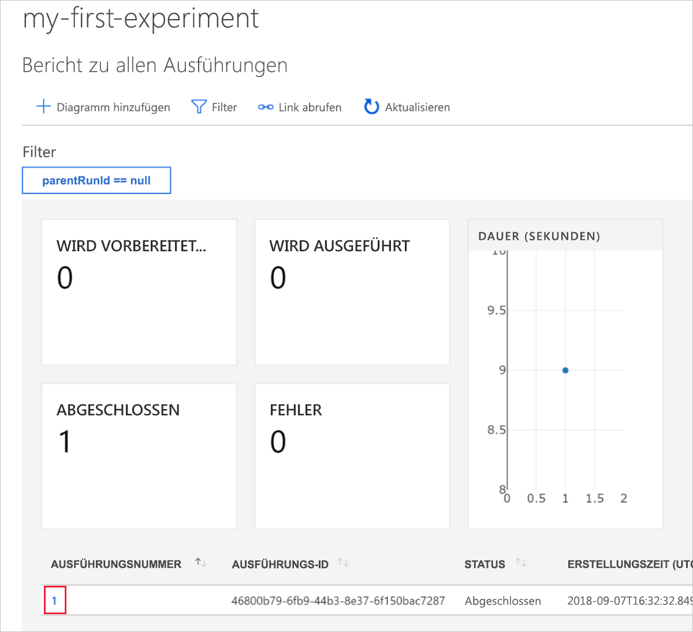
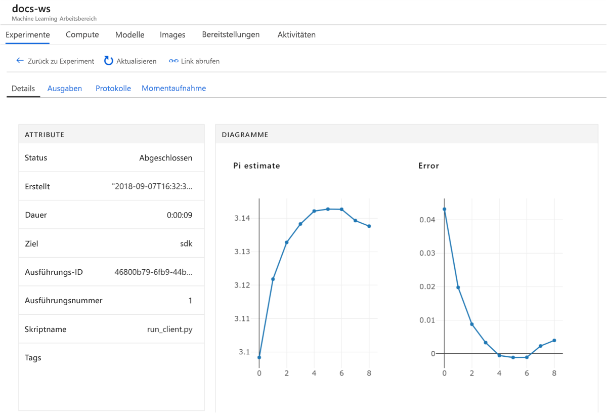

# <a name="quickstart-use-the-azure-portal-to-get-started-with-azure-machine-learning"></a>Schnellstart: Verwenden des Azure-Portals zum Ausführen der ersten Schritte für Azure Machine Learning

In dieser Schnellstartanleitung verwenden Sie das Azure-Portal, um einen Azure Machine Learning-Arbeitsbereich zu erstellen. Dieser Arbeitsbereich bildet die Grundlage in der Cloud zum Experimentieren, Trainieren und Bereitstellen von Machine Learning-Modellen mit Machine Learning. 

> [!VIDEO https://www.microsoft.com/en-us/videoplayer/embed/RE2F9Ad]

In dieser Schnellstartanleitung führen Sie die folgenden Schritte aus:

* Erstellen eines Arbeitsbereichs in Ihrem Azure-Abonnement.
* Testen mit Python in einem Azure-Notebook und Protokollieren der Werte in den unterschiedlichen Iterationen
* Anzeigen der protokollierten Werte in Ihrem Arbeitsbereich

Folgende Azure-Ressourcen werden Ihrem Arbeitsbereich automatisch hinzugefügt, sofern sie regional verfügbar sind:

  - [Azure Container Registry](https://azure.microsoft.com/services/container-registry/)
  - [Azure Storage (in englischer Sprache)](https://azure.microsoft.com/services/storage/)
  - [Azure Application Insights](https://azure.microsoft.com/services/application-insights/) 
  - [Azure Key Vault](https://azure.microsoft.com/services/key-vault/)

Die von Ihnen erstellten Ressourcen können auch in anderen Tutorials und Anleitungen für den Machine Learning-Dienst verwendet werden. Genau wie bei anderen Azure-Diensten gelten auch für bestimmte Machine Learning-Ressourcen gewisse Grenzwerte. Ein Beispiel wäre etwa die Größe des Azure Batch AI-Clusters. Informationen zu Standardgrenzwerten sowie zur Erhöhung Ihres Kontingents finden Sie in [diesem Artikel](how-to-manage-quotas.md).

Wenn Sie kein Azure-Abonnement besitzen, können Sie ein [kostenloses Konto](https://azure.microsoft.com/free/?WT.mc_id=A261C142F) erstellen, bevor Sie beginnen.


## <a name="create-a-workspace"></a>Erstellen eines Arbeitsbereichs 

[!INCLUDE [aml-create-portal](../../../includes/aml-create-in-portal.md)]

Klicken Sie auf der Seite des Arbeitsbereichs auf `Explore your Azure Machine Learning service workspace`.

 


## <a name="use-the-workspace"></a>Verwenden des Arbeitsbereichs

Sehen Sie sich nun an, wie ein Arbeitsbereich beim Verwalten Ihrer Machine Learning-Skripts hilft. In diesem Abschnitt führen Sie folgende Schritte aus:

* Öffnen eines Notebooks in Azure Notebooks
* Ausführen von Code zum Generieren von protokollierten Werten
* Anzeigen der protokollierten Werte in Ihrem Arbeitsbereich

Dieses Beispiel zeigt, wie der Arbeitsbereich Sie bei der Nachverfolgung der in einem Skript generierten Informationen unterstützt. 

### <a name="open-a-notebook"></a>Öffnen eines Notebooks 

Azure Notebooks bietet eine kostenlose Cloudplattform für Jupyter Notebooks, die mit allem vorkonfiguriert sind, was Sie für die Ausführung von Machine Learning benötigen.  

Klicken Sie auf `Open Azure Notebooks`, um Ihr erstes Experiment durchzuführen.

 

Unter Umständen müssen Sie in Ihrer Organisation zunächst die [Zustimmung des Administrators](https://notebooks.azure.com/help/signing-up/work-or-school-account/admin-consent) einholen, um sich anmelden zu können.

Nach Ihrer Anmeldung wird eine neue Registerkarte geöffnet und die Eingabeaufforderung `Clone Library` angezeigt. Wählen Sie `Clone`.


### <a name="run-the-notebook"></a>Ausführen des Notebooks

Neben zwei Notebooks sehen Sie die Datei `config.json`. Diese Konfigurationsdatei enthält Informationen zu dem Arbeitsbereich, den Sie erstellt haben.  

Klicken Sie auf `01.run-experiment.ipynb`, um das Notebook zu öffnen.

Verwenden Sie `Shift`+`Enter`, um die Zellen nacheinander auszuführen. Sie können aber auch auf `Cells` > `Run All` klicken, um das gesamte Notebook auszuführen. Wenn neben einer Zelle ein Sternchen (*) angezeigt wird, wird sie gerade ausgeführt. Nach Abschluss der Codeausführung für die Zelle wird eine Zahl angezeigt.

Sie werden unter Umständen aufgefordert, sich anzumelden. Kopieren Sie den Code aus der Nachricht. Klicken Sie anschließend auf den Link, und fügen Sie den Code in das neue Fenster ein. Achten Sie darauf, dass Sie kein Leerzeichen vor oder hinter dem Code kopieren. Melden Sie sich mit demselben Konto an, das Sie im Azure-Portal verwendet haben.

 

Im Notebook liest die zweite Zelle aus `config.json`, um eine Verbindung mit Ihrem Arbeitsbereich herzustellen.
```
ws = Workspace.from_config()
```

Die dritte Zelle im Code startet ein Experiment mit dem Namen „my-first-experiment“. Verwenden Sie diesen Namen, um in Ihrem Arbeitsbereich nach Informationen zur Ausführung zu suchen.

```
experiment = Experiment(workspace_object=ws, name = "my-first-experiment")
```

Beachten Sie in der letzten Zelle des Notebooks die Werte, die in eine Protokolldatei geschrieben werden.

```
# Log final results
run.log("Final estimate: ",pi_estimate)
run.log("Final error: ",math.pi-pi_estimate)
```

Sie können diese Werte in Ihrem Arbeitsbereich anzeigen, nachdem der Code ausgeführt wurde.

## <a name="view-logged-values"></a>Anzeigen protokollierter Werte

Kehren Sie nach der Ausführung aller Zellen des Notebooks zur Portalseite zurück.  

Wählen Sie `View Experiments` aus.


Schließen Sie das Popupelement `Reports`.

Wählen Sie `my-first-experiment` aus.

Sehen Sie sich die Informationen zu der Ausführung, die Sie gerade durchgeführt haben, an. Scrollen Sie auf der Seite nach unten, um zur Tabelle mit den Ausführungen zu gelangen. Klicken Sie auf die als Link dargestellte Ausführungsnummer.

 

Daraufhin werden Plots angezeigt, die automatisch aus den protokollierten Werten erstellt wurden.  

   

Da der Code für die Pi-Annäherung willkürliche Werte verwendet, enthalten Ihre Plots andere Werte.

## <a name="clean-up-resources"></a>Bereinigen von Ressourcen 

[!INCLUDE [aml-delete-resource-group](../../../includes/aml-delete-resource-group.md)]

Sie können die Ressourcengruppe auch behalten und einen einzelnen Arbeitsbereich löschen. Zeigen Sie die Eigenschaften des Arbeitsbereichs an, und klicken Sie auf **Löschen**.

## <a name="next-steps"></a>Nächste Schritte

Sie haben die Ressourcen erstellt, die zum Experimentieren und zum Bereitstellen von Modellen benötigt werden. Sie haben Code in einem Notebook ausgeführt. Und Sie haben den Ausführungsverlauf dieses Codes in Ihrem Arbeitsbereich in der Cloud untersucht.

Führen Sie Machine Learning-Tutorials zum Trainieren und Bereitstellen eines Modells aus, um sich ausführlicher mit dem Workflow zu beschäftigen.  

> [!div class="nextstepaction"]
> [Tutorial: Trainieren eines Imageklassifizierungsmodells](tutorial-train-models-with-aml.md)
