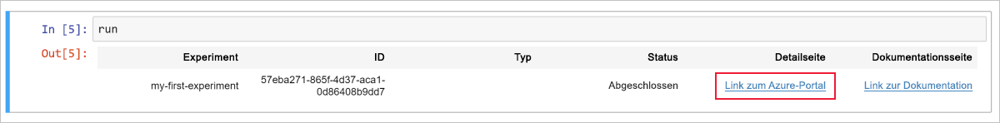

# Schnellstart: Verwenden eines cloudbasierten Notebook-Servers für die ersten Schritte mit Azure Machine Learning

In diesem Artikel verwenden Sie Azure Notebooks zum Ausführen von Code, der im [Arbeitsbereich](concept-azure-machine-learning-architecture.md) von Azure Machine Learning Service protokolliert wird. Ihr Arbeitsbereich bildet die Grundlage in der Cloud zum Experimentieren, Trainieren und Bereitstellen von Machine Learning-Modellen mit Machine Learning. 

In dieser Schnellstartanleitung werden Cloudressourcen genutzt, und es ist keine Installation erforderlich. Wenn Sie stattdessen Ihre eigene Umgebung verwenden möchten, lesen Sie die Informationen unter [Schnellstart: Verwenden Ihres eigenen Notebook-Servers für die ersten Schritte mit Azure Machine Learning](quickstart-run-local-notebook.md).  
 
Diese Schnellstartanleitung umfasst folgende Aktionen:

* Stellen Sie mithilfe von Python in einem Jupyter Notebook eine Verbindung mit Ihrem Arbeitsbereich her. Das Notebook enthält Code zum Schätzen des Pi-Werts und protokolliert Fehler bei jeder Iteration. 
* Anzeigen der protokollierten Fehlerwerte in Ihrem Arbeitsbereich

Wenn Sie kein Azure-Abonnement besitzen, können Sie ein kostenloses Konto erstellen, bevor Sie beginnen. Probieren Sie noch heute die [kostenlose oder kostenpflichtige Version von Azure Machine Learning Service](https://aka.ms/AMLFree) aus.

## Voraussetzung

1. [Erstellen Sie einen Azure Machine Learning-Arbeitsbereich](setup-create-workspace.md#portal), sofern Sie noch keinen besitzen.

1. Öffnen Sie Ihren Arbeitsbereich im [Azure-Portal](https://portal.azure.com/).  [Hier](how-to-manage-workspace.md#view) erfahren Sie, wie Sie Ihren Arbeitsbereich finden.

## Verwenden Ihrer Arbeitsbereichs

> [!VIDEO https://www.microsoft.com/en-us/videoplayer/embed/RE2F9Ad]

Sehen Sie sich an, wie ein Arbeitsbereich beim Verwalten Ihrer Machine Learning-Skripts hilft. In diesem Abschnitt führen Sie die folgenden Schritte aus:

* Öffnen eines Notebooks in Azure Notebooks
* Ausführen von Code zum Generieren von protokollierten Werten
* Anzeigen der protokollierten Werte in Ihrem Arbeitsbereich

Dieses Beispiel zeigt, wie der Arbeitsbereich Sie bei der Nachverfolgung der in einem Skript generierten Informationen unterstützt. 

### Öffnen eines Notebooks 

[Azure Notebooks](https://notebooks.azure.com) bietet eine kostenlose Cloudplattform für Jupyter Notebooks, die mit allem vorkonfiguriert ist, was Sie für die Ausführung von Machine Learning benötigen. Über Ihren Arbeitsbereich können Sie diese Plattform starten, um Ihren Azure Machine Learning Service-Arbeitsbereich zu verwenden.

1. Wählen Sie auf der Übersichtsseite des Arbeitsbereichs **Erste Schritte in Azure Notebooks** aus, um Ihr erstes Experiment in Azure Notebooks durchzuführen.  Azure Notebooks ist ein separater Dienst, mit dem Sie Jupyter Notebooks kostenlos in der Cloud ausführen können.  Wenn Sie diesen Link zum Dienst verwenden, werden der von Ihnen in Azure Notebooks erstellten Bibliothek Informationen zum Herstellen einer Verbindung mit Ihrem Arbeitsbereich hinzugefügt.

   

1. Melden Sie sich bei Azure Notebooks an.  Melden Sie sich unbedingt mit demselben Konto an, mit dem Sie sich auch beim Azure-Portal angemeldet haben. Unter Umständen müssen Sie in Ihrer Organisation zunächst die [Zustimmung des Administrators](https://notebooks.azure.com/help/signing-up/work-or-school-account/admin-consent) einholen, um sich anmelden zu können.

1. Nach Ihrer Anmeldung wird eine neue Registerkarte geöffnet und die Eingabeaufforderung `Clone Library` angezeigt. Beim Klonen dieser Bibliothek werde verschiedene Notebooks und andere Dateien in Ihrem Azure Notebooks-Konto geladen.  Mithilfe dieser Dateien können Sie die Funktionen von Azure Machine Learning Studio erkunden.

1. Deaktivieren Sie **Öffentlich**, damit Ihre Arbeitsbereichsinformationen nicht für andere Benutzer freigegeben werden.

1. Wählen Sie **Klonen** aus.

   

1. Wenn der Projektstatus „Beendet“ lautet, klicken Sie auf **Run on Free Computer** (Auf kostenlosem Computer ausführen), um den kostenlosen Notebook-Server zu verwenden.

    

### Ausführen des Notebooks

Die Liste der Dateien für dieses Projekt enthält eine Datei vom Typ `config.json`. Diese Konfigurationsdatei enthält Informationen zu dem Arbeitsbereich, den Sie im Azure-Portal erstellt haben.  Mithilfe dieser Datei kann Ihr Code eine Verbindung mit Ihrem Arbeitsbereich herstellen und ihm Informationen hinzufügen.

1. Wählen Sie **01.run-experiment.ipynb**, um das Notebook zu öffnen.

1. Im Statusbereich werden Sie angewiesen, zu warten, bis der Kernel gestartet wurde.  Die Meldung wird nicht mehr angezeigt, wenn der Kernel bereit ist.

    

1. Führen Sie die Zellen jeweils nacheinander mit **UMSCHALT+EINGABE** aus, nachdem der Kernel gestartet wurde. Sie können aber auch **Zellen** > **Alle ausführen** wählen, um das gesamte Notebook auszuführen. Wenn neben einer Zelle ein Sternchen (__*__) angezeigt wird, wird diese Zelle noch ausgeführt. Nach Abschluss der Codeausführung für die Zelle wird eine Zahl angezeigt. 

1. Befolgen Sie die Anweisungen im Notebook, um Ihr Azure-Abonnement zu authentifizieren.

Nachdem Sie die Ausführung aller Zellen im Notebook abgeschlossen haben, können Sie die protokollierten Werte in Ihrem Arbeitsbereich anzeigen.

## Anzeigen protokollierter Werte

1. Die Ausgabe der Zelle `run` enthält einen Link zum Azure-Portal, in dem Sie die Experimentergebnisse in Ihrem Arbeitsbereich anzeigen können. 

    

1. Klicken Sie auf den **Link zum Azure-Portal**, um Informationen zur Ausführung in Ihrem Arbeitsbereich anzuzeigen.  Über diesen Link wird Ihr Arbeitsbereich im Azure-Portal geöffnet.

1. Die angezeigten Plots protokollierter Werte wurden automatisch im Arbeitsbereich erstellt. Wenn Sie mehrere Werte mit dem gleichen Namensparameter protokollieren, wird für Sie automatisch ein Plot generiert.

   

Da der Code für die Pi-Annäherung willkürliche Werte verwendet, enthalten Ihre Plots andere Werte.  

## Bereinigen von Ressourcen 

[!INCLUDE [aml-delete-resource-group](../../../includes/aml-delete-resource-group.md)]

Sie können die Ressourcengruppe auch behalten und einen einzelnen Arbeitsbereich löschen. Zeigen Sie die Eigenschaften des Arbeitsbereichs an, und klicken Sie auf **Löschen**.

## Nächste Schritte

Sie haben die Ressourcen erstellt, die zum Experimentieren und zum Bereitstellen von Modellen benötigt werden. Sie haben Code in einem Notebook ausgeführt. Und Sie haben den Ausführungsverlauf dieses Codes in Ihrem Arbeitsbereich in der Cloud untersucht.

Führen Sie Machine Learning-Tutorials zum Trainieren und Bereitstellen eines Modells aus, um sich ausführlicher mit dem Workflow zu beschäftigen:  

> [!div class="nextstepaction"]
> [Tutorial: Trainieren eines Bildklassifizierungsmodells](tutorial-train-models-with-aml.md)
