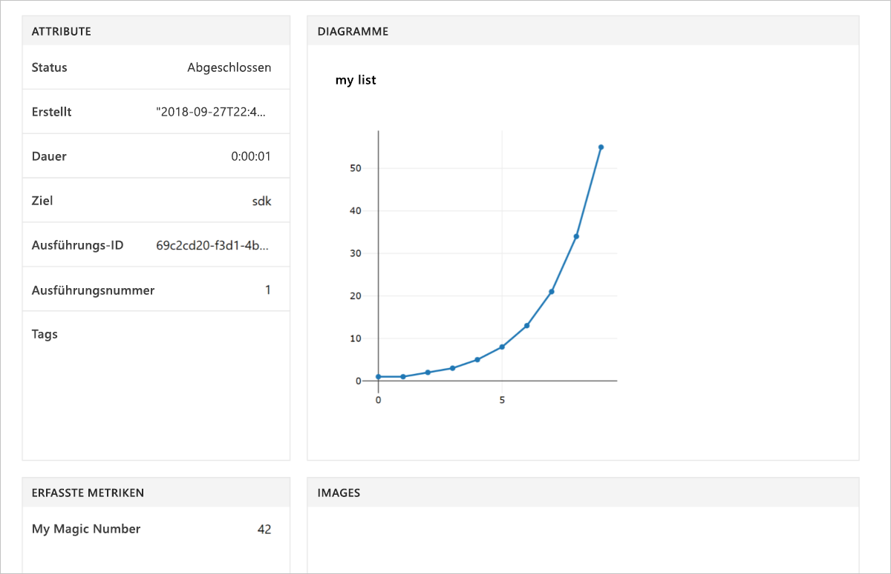

# <a name="quickstart-use-your-own-notebook-server-to-get-started-with-azure-machine-learning"></a>Schnellstart: Verwenden Ihres eigenen Notebook-Servers für die ersten Schritte mit Azure Machine Learning

In diesem Artikel verwenden Sie Ihren eigenen Notebook-Server zum Ausführen von Code, der im [Arbeitsbereich](concept-azure-machine-learning-architecture.md) von Azure Machine Learning Service protokolliert wird. Der Arbeitsbereich bildet die Grundlage in der Cloud zum Experimentieren, Trainieren und Bereitstellen von Machine Learning-Modellen mit Machine Learning.

In dieser Schnellstartanleitung verwenden Sie Ihre eigene Python-Umgebung und Ihren eigenen Jupyter Notebook-Server. Eine Schnellstartanleitung ohne Installation finden Sie unter [Schnellstart: Verwenden eines cloudbasierten Notebook-Servers für die ersten Schritte mit Azure Machine Learning](quickstart-run-cloud-notebook.md). 

Sehen Sie sich die Videoversion dieser Schnellstartanleitung an:

> [!VIDEO https://www.microsoft.com/en-us/videoplayer/embed/RE2G9N6]

In dieser Schnellstartanleitung führen Sie die folgenden Schritte aus:

* Schreiben von Code, der Werte im Arbeitsbereich protokolliert
* Anzeigen der protokollierten Werte in Ihrem Arbeitsbereich

Wenn Sie kein Azure-Abonnement besitzen, können Sie ein kostenloses Konto erstellen, bevor Sie beginnen. Probieren Sie noch heute die [kostenlose oder kostenpflichtige Version von Azure Machine Learning Service](https://aka.ms/AMLFree) aus.

## <a name="prerequisites"></a>Voraussetzungen

* Python 3.6-Notebook-Server mit installiertem Azure Machine Learning SDK
* Azure Machine Learning Service-Arbeitsbereich
* Konfigurationsdatei für den Arbeitsbereich (**aml_config/config.json**)

Diese erforderlichen Komponenten erhalten Sie unter [Create an Azure Machine Learning service workspace](setup-create-workspace.md#portal) (Erstellen eines Azure Machine Learning Service-Arbeitsbereichs).


## <a name="use-the-workspace"></a>Verwenden des Arbeitsbereichs

Erstellen Sie ein Skript, oder starten Sie ein Notebook im gleichen Verzeichnis, in dem auch die Konfigurationsdatei Ihres Arbeitsbereichs gespeichert ist. Führen Sie den Code aus, für den die grundlegenden APIs des SDK genutzt werden, um Experimentausführungen nachzuverfolgen.

1. Erstellen Sie ein Experiment im Arbeitsbereich.
1. Protokollieren Sie einen einzelnen Wert im Experiment.
1. Protokollieren Sie eine Liste mit Werten im Experiment.

[!code-python[](~/aml-sdk-samples/ignore/doc-qa/quickstart-create-workspace-with-python/quickstart.py?name=useWs)]

## <a name="view-logged-results"></a>Anzeigen der protokollierten Ergebnisse

Nach Abschluss der Ausführung können Sie die Experimentausführung im Azure-Portal anzeigen. Verwenden Sie den folgenden Code, um eine URL auszugeben, die zu den Ergebnissen für die letzte Ausführung navigiert:

```python
print(run.get_portal_url())
```

Verwenden Sie den Link, um die protokollierten Werte im Azure-Portal in Ihrem Browser anzuzeigen.



## <a name="clean-up-resources"></a>Bereinigen von Ressourcen 

>[!IMPORTANT]
>Sie können die hier von Ihnen erstellten Ressourcen auch in anderen Machine Learning-Tutorials und -Anleitungen verwenden.

Wenn Sie nicht planen, die in diesem Artikel erstellten Ressourcen zu verwenden, löschen Sie sie, um eventuell anfallende Kosten zu vermeiden.

[!code-python[](~/aml-sdk-samples/ignore/doc-qa/quickstart-create-workspace-with-python/quickstart.py?name=delete)]

## <a name="next-steps"></a>Nächste Schritte

In diesem Artikel haben Sie die Ressourcen erstellt, die Sie zum Experimentieren und zum Bereitstellen von Modellen benötigen. Sie haben Code in einem Notebook ausgeführt und den Ausführungsverlauf für diesen Code in Ihrem Arbeitsbereich in der Cloud untersucht.

> [!div class="nextstepaction"]
> [Tutorial: Trainieren eines Bildklassifizierungsmodells](tutorial-train-models-with-aml.md)

Sie können auch [anspruchsvollere Beispiele auf GitHub](https://aka.ms/aml-notebooks) erkunden oder das [SDK-Benutzerhandbuch](https://docs.microsoft.com/python/api/overview/azure/ml/intro?view=azure-ml-py) lesen.
