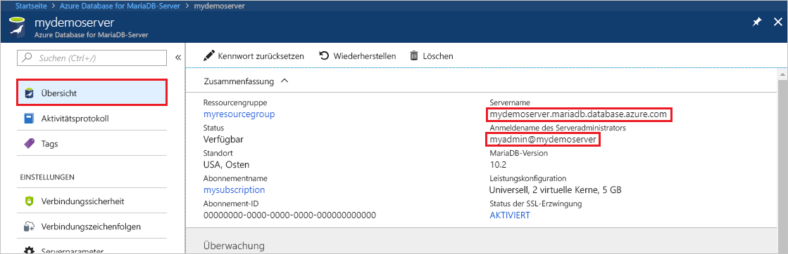
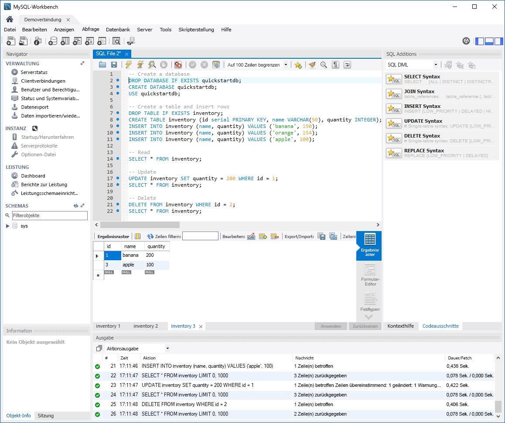

# <a name="azure-database-for-mariadb-use-mysql-workbench-to-connect-and-query-data"></a>Azure Database for MariaDB: Verwenden von MySQL Workbench zum Verbinden und Abfragen von Daten

In dieser Schnellstartanleitung erfahren Sie, wie Sie unter Verwendung von MySQL Workbench eine Verbindung mit einer Instanz von Azure Database for MariaDB herstellen. 

## <a name="prerequisites"></a>Voraussetzungen

In dieser Schnellstartanleitung werden die Ressourcen aus den folgenden Anleitungen als Ausgangspunkt verwendet:

- [Erstellen eines Azure Database for MariaDB-Servers über das Azure-Portal](./quickstart-create-mariadb-server-database-using-azure-portal.md)
- [Erstellen eines Azure Database for MariaDB-Servers mit der Azure-Befehlszeilenschnittstelle](./quickstart-create-mariadb-server-database-using-azure-cli.md)

## <a name="install-mysql-workbench"></a>Installieren von MySQL Workbench

[Laden Sie MySQL Workbench herunter](https://dev.mysql.com/downloads/workbench/), und installieren Sie es auf Ihrem Computer.

## <a name="get-connection-information"></a>Abrufen von Verbindungsinformationen

Rufen Sie die Verbindungsinformationen ab, die zum Herstellen einer Verbindung mit der Azure Database for MariaDB-Instanz erforderlich sind. Sie benötigen den vollqualifizierten Servernamen und die Anmeldeinformationen.

1. Melden Sie sich beim [Azure-Portal](https://portal.azure.com/) an.

2. Klicken Sie im Azure-Portal im Menü auf der linken Seite auf **Alle Ressourcen**. Suchen Sie nach dem Server, den Sie erstellt haben (beispielsweise **mydemoserver**).

3. Wählen Sie den Servernamen aus.

4. Notieren Sie sich auf der **Übersichtsseite** des Servers die Werte für **Servername** und **Anmeldename des Serveradministrators**. Sollten Sie Ihr Kennwort vergessen haben, können Sie es auf dieser Seite auch zurücksetzen.

 

## <a name="connect-to-the-server-by-using-mysql-workbench"></a>Herstellen einer Verbindung mit dem Server unter Verwendung von MySQL Workbench

Gehen Sie wie folgt vor, um unter Verwendung von MySQL Workbench eine Verbindung mit dem Azure Database for MariaDB-Server herzustellen:

1.  Öffnen Sie MySQL Workbench auf Ihrem Computer. 

2.  Geben Sie im Dialogfeld **Setup New Connection** (Neue Verbindung einrichten) auf der Registerkarte **Parameter** folgende Informationen ein:

    | Einstellung | Empfohlener Wert | Feldbeschreibung |
    |---|---|---|
    |   Verbindungsname | **Beispielverbindung** | Geben Sie eine Bezeichnung für diese Verbindung an. |
    | Verbindungsmethode | **Standard (TCP/IP)** | Standard (TCP/IP) ist ausreichend. |
    | Hostname | *Servername* | Geben Sie den Servernamen an, den Sie zuvor beim Erstellen der Azure Database for MariaDB-Instanz verwendet haben. Unser Beispielserver heißt **mydemoserver.mariadb.database.azure.com**. Verwenden Sie den vollqualifizierten Domänennamen (\*.mariadb.database.azure.com), wie im Beispiel gezeigt. Sollten Sie Ihren Servernamen vergessen haben, führen Sie die Schritte zum Abrufen der Verbindungsinformationen im vorherigen Abschnitt aus.  |
    | Port | **3306** | Verwenden Sie immer den Port 3306, wenn Sie eine Verbindung mit Azure Database for MariaDB herstellen. |
    | Username |  *Anmeldename des Serveradministrators* | Geben Sie den Benutzernamen für die Serveradministratoranmeldung ein, den Sie beim Erstellen der Azure Database for MariaDB-Instanz verwendet haben. Unser Beispielbenutzername lautet **myadmin@mydemoserver**. Sollten Sie den Anmeldenamen für den Serveradministrator vergessen haben, führen Sie die Schritte zum Abrufen der Verbindungsinformationen aus dem vorherigen Abschnitt aus. Zu verwendendes Format: *username@servername*.
    | Kennwort | *Ihr Kennwort* | Klicken Sie auf **In Vault speichern**, um das Kennwort zu speichern. |

    

3.   Klicken Sie auf **Verbindung testen**, um zu überprüfen, ob alle Parameter korrekt konfiguriert sind. 

4.   Klicken Sie anschließend auf **OK**, um die Verbindung zu speichern. 

5.   Klicken Sie unter **MySQL-Verbindungen** auf die Kachel für Ihren Server. Warten Sie, bis die Verbindung hergestellt wurde.

    Es wird eine neue SQL-Registerkarte mit einem leeren-Editor geöffnet, auf der Sie Ihre Abfragen eingeben können.
    
    > [!NOTE]
    > Für Ihren Azure Database for MariaDB-Server wird standardmäßig SSL-Verbindungssicherheit benötigt und erzwungen. In der Regel ist bei SSL-Zertifikaten keine zusätzliche Konfiguration erforderlich, damit MySQL Workbench eine Verbindung mit Ihrem Server herstellen kann. Es empfiehlt sich jedoch, die Zertifizierung der SSL-Zertifizierungsstelle mit MySQL Workbench zu binden. SSL kann bei Bedarf deaktiviert werden. Klicken Sie hierzu im Azure-Portal auf der Übersichtsseite des Servers im Menü auf **Verbindungssicherheit**. Wählen Sie für **SSL-Verbindung erzwingen** die Option **Deaktiviert** aus.

## <a name="create-table-and-insert-read-update-and-delete-data"></a>Erstellen von Tabellen und Einfügen, Lesen, Aktualisieren und Löschen von Daten

1. Kopieren Sie den folgenden SQL-Beispielcode, und fügen Sie ihn auf der Seite einer leeren SQL-Registerkarte ein, um einige Beispieldaten zu veranschaulichen.

    Dieser Code erstellt eine leere Datenbank namens **quickstartdb**. Anschließend wird eine Beispieltabelle namens **inventory** erstellt. Der Code fügt einige Zeilen ein und liest sie anschließend. Er ändert die Daten mit einer update-Anweisung und liest die Zeilen anschließend erneut. Abschließend löscht er eine Zeile und liest die Zeilen noch einmal.
    
    ```sql
    -- Create a database
    -- DROP DATABASE IF EXISTS quickstartdb;
    CREATE DATABASE quickstartdb;
    USE quickstartdb;
    
    -- Create a table and insert rows
    DROP TABLE IF EXISTS inventory;
    CREATE TABLE inventory (id serial PRIMARY KEY, name VARCHAR(50), quantity INTEGER);
    INSERT INTO inventory (name, quantity) VALUES ('banana', 150);
    INSERT INTO inventory (name, quantity) VALUES ('orange', 154);
    INSERT INTO inventory (name, quantity) VALUES ('apple', 100);
    
    -- Read
    SELECT * FROM inventory;
    
    -- Update
    UPDATE inventory SET quantity = 200 WHERE id = 1;
    SELECT * FROM inventory;
    
    -- Delete
    DELETE FROM inventory WHERE id = 2;
    SELECT * FROM inventory;
    ```

    Der Screenshot zeigt ein Beispiel des SQL-Codes in MySQL Workbench sowie die Ausgabe nach der Ausführung:
    
    

2. Klicken Sie zum Ausführen des SQL-Beispielcodes auf der Registerkarte **SQL-Datei** auf der Symbolleiste auf das Blitzsymbol.
3. Beachten Sie die drei im Registerkartenformat angezeigten Ergebnisse im Abschnitt **Ergebnisraster** in der Mitte der Seite. 
4. Beachten Sie auch die Liste **Ausgabe** am unteren Rand der Seite. Der Status der einzelnen Befehle wird angezeigt. 

In dieser Schnellstartanleitung haben Sie mithilfe von MySQL Workbench eine Verbindung mit Azure Database for MariaDB hergestellt und Daten per SQL-Sprache abgefragt.

<!--
## Next steps
> [!div class="nextstepaction"]
> [Migrate your database using Export and Import](./concepts-migrate-import-export.md)
-->
