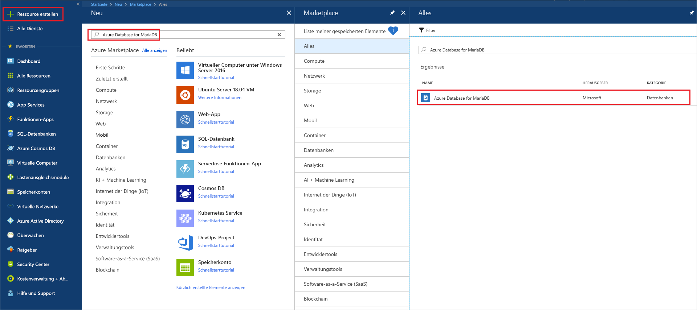
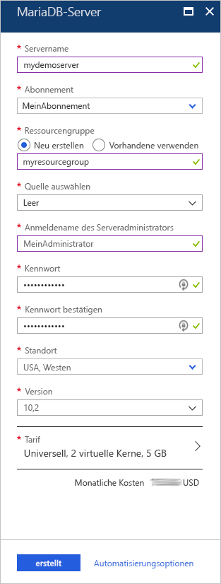
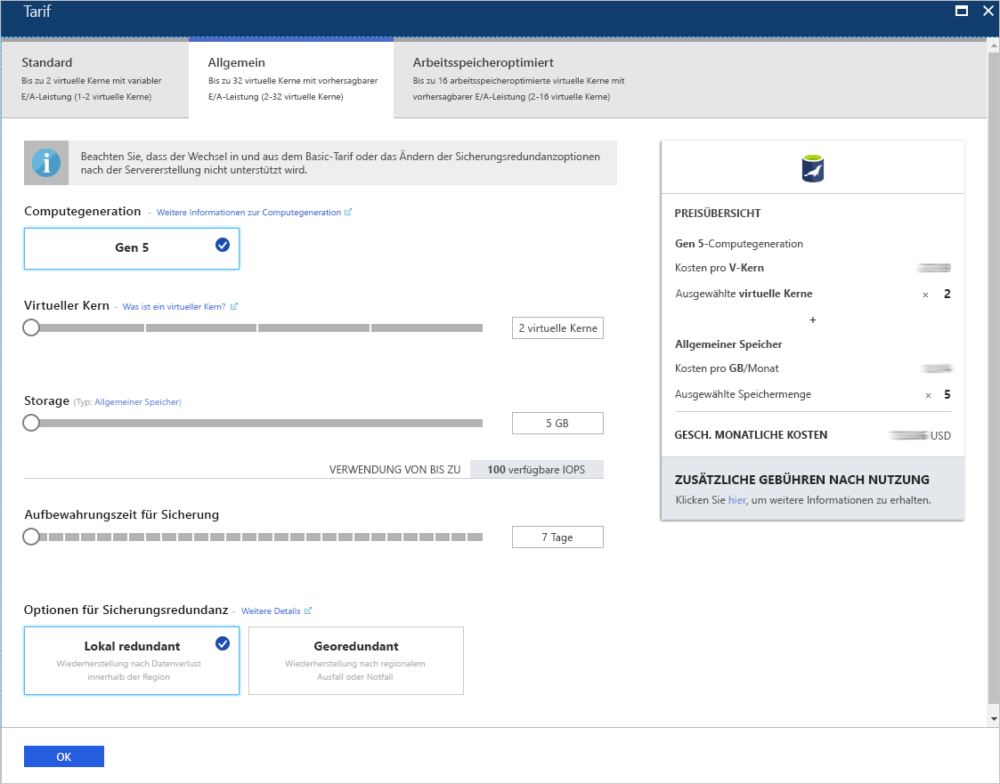
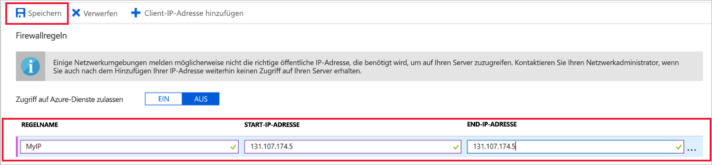
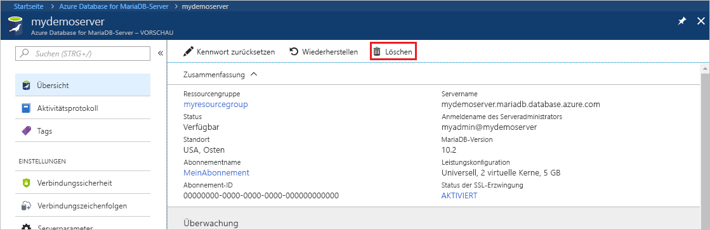

# <a name="create-an-azure-database-for-mariadb-server-by-using-the-azure-portal"></a>Erstellen eines Azure Database for MariaDB-Servers über das Azure-Portal

Azure Database for MariaDB ist ein verwalteter Dienst, mit dem Sie hochverfügbare MariaDB-Datenbanken in der Cloud ausführen, verwalten und skalieren können. In diesem Schnellstart erfahren Sie, wie Sie in etwa fünf Minuten über das Azure-Portal einen Azure Database for MariaDB-Server erstellen.  

Wenn Sie über kein Azure-Abonnement verfügen, können Sie ein [kostenloses Azure-Konto](https://azure.microsoft.com/free/) erstellen, bevor Sie beginnen.

## <a name="sign-in-to-the-azure-portal"></a>Melden Sie sich auf dem Azure-Portal an.

Wechseln Sie Ihrem Webbrowser zum [Azure-Portal](https://portal.azure.com/). Geben Sie Ihre Anmeldeinformationen ein, um sich beim Portal anzumelden. Die Standardansicht ist Ihr Dienstdashboard.

## <a name="create-an-azure-database-for-mariadb-server"></a>Erstellen eines Azure Database for MariaDB-Servers

Sie erstellen einen Azure Database for MariaDB-Server mit einer definierten Gruppe von [Compute- und Speicherressourcen](concepts-pricing-tiers.md). Der Server wird in einer [Azure-Ressourcengruppe](../azure-resource-manager/resource-group-overview.md) erstellt.

So erstellen Sie einen Azure Database for MariaDB-Server:

1. Klicken Sie in der linken oberen Ecke des Portals auf die Schaltfläche **Ressource erstellen** (+).

2. Geben Sie im Suchfeld **Azure Database for MariaDB** ein, um nach dem Dienst zu suchen.

   

3. Geben Sie die folgenden Serverdetails ein, oder wählen Sie sie aus:
   
   

    Einstellung | Empfohlener Wert | BESCHREIBUNG
    ---|---|---
    Servername | *Ein eindeutiger Servername* | Wählen Sie einen eindeutigen Namen aus, der Ihren Azure Database for MariaDB-Server identifiziert. Beispiel: **mydemoserver**. Der Domänenname *.mariadb.database.azure.com* wird an den angegebenen Servernamen angefügt. Der Servername darf nur Kleinbuchstaben, Zahlen und den Bindestrich (-) enthalten. Er muss zwischen 3 und 63 Zeichen lang sein.
    Abonnement | *Ihr Abonnement* | Wählen Sie das Azure-Abonnement aus, das Sie für Ihren Server verwenden möchten. Falls Sie über mehrere Abonnements verfügen, wählen Sie das Abonnement aus, über das die Ressource abgerechnet wird.
    Ressourcengruppe | **myresourcegroup** | Geben Sie einen neuen Ressourcengruppennamen ein, oder wählen Sie eine vorhandene Ressourcengruppe aus. 
    Quelle auswählen | **Leer** | Wählen Sie **Leer** aus, um einen neuen Server ohne Vorlage zu erstellen. (Wählen Sie **Sicherung** aus, wenn Sie einen Server auf der Grundlage einer Geosicherung eines vorhandenen Azure Database for MariaDB-Servers erstellen.)
    Serveradministratoranmeldung | **myadmin** | Ein Anmeldekonto für die Verbindungsherstellung mit dem Server. Der Administratoranmeldename darf nicht **azure_superuser**, **admin**, **administrator**, **root**, **guest** oder **public** lauten.
    Kennwort | *Beliebig* | Geben Sie ein neues Kennwort für das Serveradministratorkonto ein. Es muss zwischen acht und 128 Zeichen lang sein. Das Kennwort muss Zeichen aus drei der folgenden Kategorien enthalten: englische Großbuchstaben, englische Kleinbuchstaben, Zahlen (0-9) und nicht alphanumerische Zeichen (!, $, #, % usw.).
    Kennwort bestätigen | *Beliebig*| Bestätigen Sie das Kennwort des Administratorkontos.
    Standort | *Die Region, die Ihren Benutzern am nächsten ist*| Wählen Sie den Standort aus, der Ihren Benutzern oder Ihren anderen Azure-Anwendungen am nächsten ist.
    Version | *Die aktuelle Version*| Die aktuelle Version (es sei denn, Sie haben besondere Anforderungen, die eine andere Version erfordern).
    Tarif | Siehe Beschreibung. | Die Compute-, Speicher- und Sicherungskonfigurationen für Ihren neuen Server. Klicken Sie auf **Tarif** > **Universell**. Übernehmen Sie die Standardwerte für die folgenden Einstellungen:<br><ul><li>**Computegeneration** (Gen 5)</li><li>**Virtuelle Kerne** (zwei virtuelle Kerne)</li><li>**Speicher** (5 GB)</li><li>**Aufbewahrungszeit für Sicherung** (sieben Tage)</li></ul><br>Wählen Sie zum Aktivieren der Serversicherungen in georedundantem Speicher unter **Optionen für Sicherungsredundanz** die Option **Georedundant** aus. <br><br>Klicken Sie auf **OK**, um die Tarifauswahl zu speichern. Der nächste Screenshot zeigt die gewählten Optionen.
  
    > [!IMPORTANT]
    > Der Benutzername und das Kennwort für den Serveradministrator, die Sie hier angegeben, werden später in diesem Schnellstart zur Anmeldung beim Server und bei den zugehörigen Datenbanken benötigt. Behalten Sie diese Angaben im Kopf, oder notieren Sie sie zur späteren Verwendung.
    > 

   

4.  Wählen Sie **Erstellen** aus, um den Server bereitzustellen. Die Bereitstellung kann bis zu 20 Minuten dauern.
   
5.  Klicken Sie auf der Symbolleiste auf **Benachrichtigungen** (Glockensymbol), um den Bereitstellungsprozess zu überwachen.
   
Unter Ihrem Server werden standardmäßig folgende Datenbanken erstellt: **information_schema**, **mysql**, **performance_schema** und **sys**.


## <a name="configure-firewall-rule"></a>Konfigurieren einer Firewallregel auf Serverebene

Der Dienst „Azure Database for MariaDB“ erstellt eine Firewall auf der Serverebene. Die Firewall verhindert, dass externe Anwendungen und Tools eine Verbindung mit dem Server und den Datenbanken auf dem Server herstellen, sofern keine Firewallregel erstellt wird, um die Firewall für bestimmte IP-Adressen zu öffnen. 

So erstellen Sie eine Firewallregel auf Serverebene:

1.   Navigieren Sie nach Abschluss der Bereitstellung zu Ihrem Server. Bei Bedarf können Sie danach suchen. Wählen Sie beispielsweise im linken Menü die Option **Alle Ressourcen** aus. Geben Sie dann den Servernamen ein. Geben Sie beispielsweise **mydemoserver** ein, um nach dem neu erstellten Server zu suchen. Wählen Sie den Servernamen in der Liste mit den Suchergebnissen aus. Die Seite **Übersicht** für den Server wird geöffnet. Sie können auf dieser Seite zusätzliche Einstellungen ändern.

2. Wählen Sie auf der Übersichtsseite für den Server die Option **Verbindungssicherheit** aus.

3.  Wählen Sie unter **Firewallregeln** in der Spalte **Regelname** das leere Textfeld aus, um mit der Erstellung der Firewallregel zu beginnen. Geben Sie den genauen IP-Adressbereich der Clients an, die eine Verbindung mit diesem Server herstellen.
   
   

4. Wählen Sie auf der oberen Symbolleiste der Seite **Verbindungssicherheit** die Option **Speichern** aus. Fahren Sie erst fort, nachdem die Benachrichtigung über den erfolgreichen Abschluss der Aktualisierung angezeigt wurde. 

   > [!NOTE]
   > Die Kommunikation für Verbindungen mit Azure Database for MariaDB erfolgt über Port 3306. Wenn Sie versuchen, eine Verbindung über ein Unternehmensnetzwerk herzustellen, wird ausgehender Datenverkehr über Port 3306 unter Umständen nicht zugelassen. In diesem Fall muss Ihre IT-Abteilung Port 3306 öffnen, damit Sie eine Verbindung mit dem Server herstellen können.
   > 

## <a name="get-connection-information"></a>Abrufen von Verbindungsinformationen

Für die Verbindungsherstellung mit Ihrem Datenbankserver benötigen Sie den vollständigen Servernamen und die Administratoranmeldeinformationen. Diese Werte haben Sie möglicherweise weiter oben in diesem Artikel notiert. Falls nicht, finden Sie den Servernamen und die Anmeldeinformationen auf der Seite **Übersicht** des Servers oder auf der Seite **Eigenschaften** im Azure-Portal:

1. Wechseln Sie zur Seite **Übersicht** für Ihren Server. Notieren Sie die Werte für **Servername** und **Anmeldename des Serveradministrators**. 

2. Um die Werte zu kopieren, zeigen Sie mit dem Cursor auf das Feld, das Sie kopieren möchten. Das Symbol „Kopieren“ wird rechts neben dem Text angezeigt. Wählen Sie das Kopiersymbol aus, um die Werte zu kopieren.

In unserem Beispiel lautet der Servername **mydemoserver.mariadb.database.azure.com** und der Benutzername für die Serveradministratoranmeldung **myadmin@mydemoserver**.

## <a name="connect-to-azure-database-for-mariadb-by-using-the-mysql-command-line"></a>Herstellen einer Verbindung mit Azure Database for MariaDB mithilfe der MySQL-Befehlszeile

Es gibt verschiedene Anwendungen, die Sie zum Herstellen einer Verbindung mit Ihrem Azure Database for MariaDB-Server verwenden können.

Als Erstes verwenden wir das [MySQL](https://dev.mysql.com/doc/refman/5.7/en/mysql.html)-Befehlszeilentool, um das Herstellen einer Verbindung mit dem Server zu veranschaulichen. Sie können auch einen Webbrowser und Azure Cloud Shell verwenden, ohne Software zu installieren. Wenn das MySQL-Hilfsprogramm lokal installiert ist, können Sie es ebenfalls zum Herstellen der Verbindung verwenden.

1. Starten Sie Azure Cloud Shell über das Terminalsymbol (**>_**) auf der Symbolleiste oben rechts im Azure-Portal.


2.  Azure Cloud Shell wird in Ihrem Browser geöffnet. Sie können Bash-Shellbefehle in Cloud Shell verwenden.

   

3. Stellen Sie an der Cloud Shell-Eingabeaufforderung eine Verbindung mit Ihrem Azure Database for MariaDB-Server her, indem Sie die MySQL-Befehlszeile eingeben.

    Verwenden Sie das folgende Format, um mit dem MySQL-Hilfsprogramm eine Verbindung mit dem Azure Database for MariaDB-Server herzustellen:

    ```bash
    mysql --host <fully qualified server name> --user <server admin login name>@<server name> -p
    ```

    Mithilfe des folgenden Befehls wird beispielsweise eine Verbindung mit unserem Beispielserver hergestellt:

    ```azurecli-interactive
    mysql --host mydemoserver.mariadb.database.azure.com --user myadmin@mydemoserver -p
    ```

    mysql-Parameter |Empfohlener Wert|BESCHREIBUNG
    ---|---|---
    --host | *Servername* | Der Servername, den Sie zum Erstellen des Azure Database for MariaDB-Servers verwendet haben. Unser Beispielserver heißt **mydemoserver.mariadb.database.azure.com**. Verwenden Sie den vollqualifizierten Domänennamen (**\*.mariadb.database.azure.com**), wie im Beispiel gezeigt. Sollten Sie Ihren Servernamen vergessen haben, führen Sie die Schritte zum Abrufen der Verbindungsinformationen im vorherigen Abschnitt aus.
    --user | *Anmeldename des Serveradministrators* |Der Benutzername für die Serveradministratoranmeldung, den Sie zum Erstellen des Azure Database for MariaDB-Servers verwendet haben. Sollten Sie den Benutzernamen vergessen haben, führen Sie die Schritte zum Abrufen der Verbindungsinformationen im vorherigen Abschnitt aus. Zu verwendendes Format: *username@servername*.
    -p | *Ihr Kennwort*<br>(Warten Sie, bis Sie zur Eingabe aufgefordert werden.) |Wenn Sie zur Eingabe aufgefordert werden, geben Sie das Kennwort ein, das Sie zum Erstellen des Servers verwendet haben. Die für das Kennwort eingegebenen Zeichen werden bei der Eingabe nicht in der Bash-Eingabeaufforderung angezeigt. Drücken Sie nach der Eingabe des Kennworts die EINGABETASTE.

   Wenn das MySQL-Hilfsprogramm verbunden ist, wird eine `mysql>`-Eingabeaufforderung angezeigt. Sie können Befehle an der Eingabeaufforderung eingeben. 

   Hier sehen Sie ein Beispiel für die MySQL-Ausgabe:

    ```bash
    Welcome to the MySQL monitor.  Commands end with ; or \g.
    Your MySQL connection id is 65505
    Server version: 5.6.39.0 MariaDB Server
    
    Copyright (c) 2000, 2017, Oracle and/or its affiliates. All rights reserved.
    
    Oracle is a registered trademark of Oracle Corporation and/or its
    affiliates. Other names may be trademarks of their respective
    owners.

    Type 'help;' or '\h' for help. Type '\c' to clear the current input statement.
    
    mysql>
    ```
    
    > [!TIP]
    > Wenn die Firewall nicht zum Zulassen der IP-Adresse von Azure Cloud Shell konfiguriert ist, tritt der folgende Fehler auf:
    >
    >   FEHLER 2003 (28000): Der Client mit der IP-Adresse 123.456.789.0 hat keine Zugriffsberechtigung für den Server.
    >
    > Vergewissern Sie sich zum Beheben des Fehlers, dass die Serverkonfiguration gemäß den Schritten unter [Konfigurieren einer Firewallregel auf Serverebene](#configure-firewall-rule) durchgeführt wurde.

4. Geben Sie zum Überprüfen der Verbindung **status** an der `mysql>`-Eingabeaufforderung ein, um den Status des Servers anzuzeigen.

    ```sql
    status
    ```

   > [!TIP]
   > Zusätzliche Befehle finden Sie unter [MySQL 5.7-Referenzhandbuch – Kapitel 4.5.1](https://dev.mysql.com/doc/refman/5.7/en/mysql.html).

5.  Erstellen Sie eine leere Datenbank, indem Sie an der `mysql>`-Eingabeaufforderung den folgenden Befehl eingeben:

    ```sql
    CREATE DATABASE quickstartdb;
    ```
    Die Ausführung des Befehls kann einige Minuten dauern. 

    Sie können auf einem Azure Database for MariaDB-Server eine oder mehrere Datenbanken erstellen. Sie können nur eine Datenbank pro Server erstellen, die alle Ressourcen nutzt, oder mehrere Datenbanken, die die Ressourcen gemeinsam nutzen. Die Anzahl erstellbarer Datenbanken ist nicht begrenzt, mehrere Datenbanken nutzen jedoch gemeinsam die gleichen Serverressourcen. 

6. Geben Sie zum Auflisten der Datenbanken den folgenden Befehl an der `mysql>`-Eingabeaufforderung ein:

    ```sql
    SHOW DATABASES;
    ```

7.  Geben Sie **\q** ein, und drücken Sie die EINGABETASTE, um das MySQL-Tool zu schließen. Anschließend können Sie Azure Cloud Shell schließen.

Sie haben nun eine Verbindung mit dem Azure Database for MariaDB-Server hergestellt und eine leere Benutzerdatenbank erstellt. Im nächsten Abschnitt verwenden Sie MySQL Workbench (ein anderes gängiges Tool), um eine Verbindung mit dem gleichen Server herzustellen.

## <a name="connect-to-the-server-by-using-mysql-workbench"></a>Herstellen einer Verbindung mit dem Server unter Verwendung von MySQL Workbench

So stellen Sie mit MySQL Workbench eine Verbindung mit dem Server her:

1. Öffnen Sie MySQL Workbench auf Ihrem Clientcomputer. Sie können [MySQL Workbench hier herunterladen](https://dev.mysql.com/downloads/workbench/) und installieren.

2. Um eine neue Verbindung zu erstellen, klicken Sie auf das Pluszeichen (**+**) neben der Überschrift **MySQL Connections** (MySQL-Verbindungen).

3. Geben Sie im Dialogfeld **Setup New Connection** (Neue Verbindung einrichten) auf der Registerkarte **Parameter** die Informationen zu Ihrer Serververbindung ein. Als Beispiele werden Platzhalterwerte angezeigt. Ersetzen Sie **Hostname**, **Benutzername** und **Kennwort** durch Ihre eigenen Werte.

   

    |Einstellung |Empfohlener Wert|Feldbeschreibung|
    |---|---|---|
     Verbindungsname | **Beispielverbindung** | Eine Bezeichnung für diese Verbindung. |
    Verbindungsmethode | **Standard (TCP/IP)** | Standard (TCP/IP) ist ausreichend. |
    Hostname | *Servername* | Der Servername, den Sie zum Erstellen des Azure Database for MariaDB-Servers verwendet haben. Unser Beispielserver heißt **mydemoserver.mariadb.database.azure.com**. Verwenden Sie den vollqualifizierten Domänennamen (**\*.mariadb.database.azure.com**), wie im Beispiel gezeigt. Sollten Sie Ihren Servernamen vergessen haben, führen Sie die Schritte zum Abrufen der Verbindungsinformationen weiter oben in diesem Artikel aus.|
     Port | 3306 | Der Port, der beim Herstellen der Verbindung mit Ihrem Azure Database for MariaDB-Server verwendet werden soll. |
    Username |  *Anmeldename des Serveradministrators* | Der Benutzername für die Serveradministratoranmeldung, den Sie zum Erstellen des Azure Database for MariaDB-Servers verwendet haben. Unser Beispielbenutzername lautet **myadmin@mydemoserver**. Sollten Sie den Benutzernamen vergessen haben, führen Sie die Schritte zum Abrufen der Verbindungsinformationen weiter oben in diesem Artikel aus. Zu verwendendes Format: *username@servername*.
    Kennwort | *Ihr Kennwort* | Klicken Sie auf **In Vault speichern**, um das Kennwort zu speichern. |

4. Klicken Sie auf **Verbindung testen**, um zu überprüfen, ob alle Parameter korrekt konfiguriert sind. Klicken Sie anschließend auf **OK**, um die Verbindung zu speichern. 

    > [!NOTE]
    > SSL wird standardmäßig auf dem Server erzwungen. Daher sind einige zusätzliche Konfigurationsschritte erforderlich, um eine Verbindung herzustellen. Weitere Informationen finden Sie unter [Konfigurieren von SSL-Verbindungen in der Anwendung für eine sichere Verbindung mit Azure Database for MariaDB](./howto-configure-ssl.md). Um SSL für diesen Schnellstart zu deaktivieren, klicken Sie im Azure-Portal auf der Übersichtsseite des Servers im Menü auf **Verbindungssicherheit**. Wählen Sie für **SSL-Verbindung erzwingen** die Option **Deaktiviert** aus.
    >

## <a name="clean-up-resources"></a>Bereinigen von Ressourcen

Zum Bereinigen der Ressourcen, die Sie in diesem Schnellstart erstellt haben, stehen Ihnen zwei Methoden zur Auswahl. Sie können die [Azure-Ressourcengruppe](../azure-resource-manager/resource-group-overview.md) löschen. Bei dieser Methode werden alle Ressourcen in der Ressourcengruppe gelöscht. Falls die anderen Ressourcen erhalten bleiben sollen, löschen Sie nur die einzelne Serverressource.

> [!TIP]
> Andere Schnellstarts in dieser Sammlung bauen auf diesem Schnellstart auf. Wenn Sie weitere Schnellstarts für Azure Database for MariaDB nutzen möchten, bereinigen Sie die hier erstellten Ressourcen nicht. Falls Sie nicht mit den Schnellstarts fortfahren möchten, gehen Sie wie folgt vor, um alle Ressourcen zu löschen, die Sie im Rahmen dieses Schnellstarts erstellt haben.
>

So löschen Sie die gesamte Ressourcengruppe, einschließlich des neu erstellten Servers

1.  Navigieren Sie im Azure-Portal zu Ihrer Ressourcengruppe. Klicken Sie im Menü auf **Ressourcengruppen**, und wählen Sie anschließend den Namen Ihrer Ressourcengruppe aus (in unserem Beispiel: **myresourcegroup**).

2.  Klicken Sie auf der Seite für die Ressourcengruppe auf **Löschen**. Geben Sie dann den Namen der Ressourcengruppe ein (in unserem Beispiel **myresourcegroup**), um das Löschen zu bestätigen. Klicken Sie auf **Löschen**.

So löschen Sie ausschließlich den neu erstellten Server

1.  Navigieren Sie im Azure-Portal zu Ihrem Server, sofern Sie die zugehörige Seite noch nicht geöffnet haben. Wählen Sie im linken Menü die Option **Alle Ressourcen** aus. Suchen Sie anschließend nach dem Server, den Sie erstellt haben.

2.  Wählen Sie auf der Seite **Übersicht** die Option **Löschen** aus. 

   

3.  Bestätigen Sie den Namen des Servers, den Sie löschen möchten. Zeigen Sie die vom Löschvorgang betroffenen Datenbanken auf dem Server an. Geben Sie den Servernamen ein (in unserem Beispiel **mydemoserver**), um das Löschen zu bestätigen. Klicken Sie auf **Löschen**.

## <a name="next-steps"></a>Nächste Schritte

- [Entwerfen Ihrer ersten Azure Database for MariaDB-Datenbank](./tutorial-design-database-using-portal.md)
