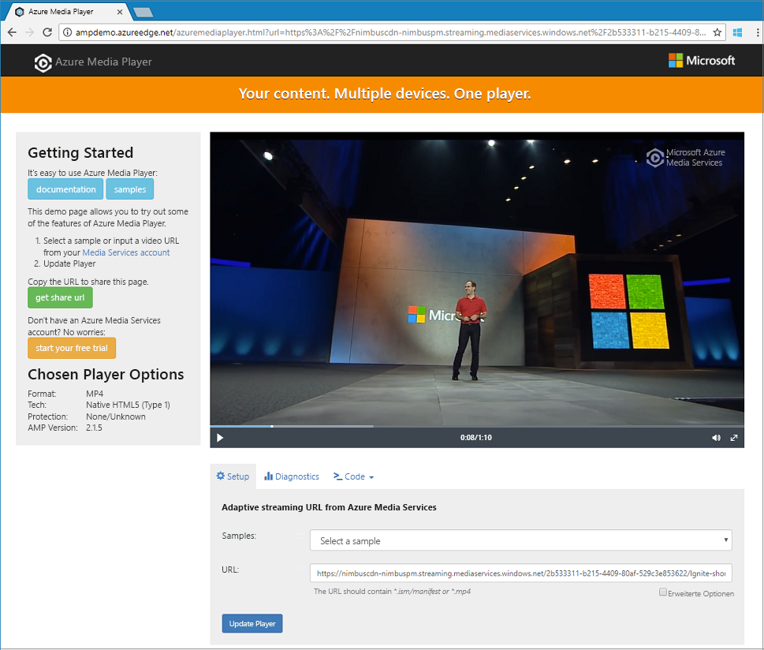

# <a name="tutorial-stream-video-files---cli"></a>Tutorial: Streamen von Videodateien: CLI

In diesem Tutorial wird veranschaulicht, wie Sie Videos auf einfache Weise mit vielen Browsern und Geräten codieren und streamen können, indem Sie Azure Media Services und die Azure CLI verwenden. Sie können eingegebenen Inhalt angeben, indem Sie HTTPS- oder SAS-URLs oder Pfade zu Dateien in Azure-Blobspeicher verwenden.

Im Beispiel in diesem Artikel werden Inhalte codiert, die Sie über eine HTTPS-URL zugänglich machen. Media Services v3 unterstützt derzeit keine segmentierte Transfercodierung über HTTPS-URLs.

Am Ende dieses Tutorials sind Sie in der Lage, ein Video zu streamen.  



[!INCLUDE [quickstarts-free-trial-note](../../../includes/quickstarts-free-trial-note.md)]

## <a name="create-a-media-services-account"></a>Erstellen eines Media Services-Kontos

Bevor Sie Medieninhalte in Azure verschlüsseln, codieren, analysieren, verwalten und streamen können, müssen Sie ein Media Services-Konto erstellen. Dieses Konto muss mindestens einem Speicherkonto zugeordnet sein.

Ihr Media Services-Konto und alle zugeordneten Speicherkonten müssen unter demselben Azure-Abonnement vorhanden sein. Es wird empfohlen, Speicherkonten zu verwenden, die sich an demselben Ort wie das Media Services-Konto befinden, um die Latenz und den Aufwand in Bezug auf ausgehenden Datenverkehr zu verringern.

### <a name="create-a-resource-group"></a>Erstellen einer Ressourcengruppe

```azurecli
az group create -n amsResourceGroup -l westus2
```

### <a name="create-an-azure-storage-account"></a>Erstellen eines Azure-Speicherkontos

In diesem Beispiel erstellen Sie ein universelles LRS-Standardkonto der Version 2.

Falls Sie mit Speicherkonten experimentieren möchten, verwenden Sie `--sku Standard_LRS`. Wenn Sie eine SKU für die Produktion auswählen, sollten Sie die Verwendung von `--sku Standard_RAGRS` erwägen, da diese Option die geografische Replikation zum Gewährleisten der Geschäftskontinuität ermöglicht. Weitere Informationen finden Sie unter [Storage accounts](https://docs.microsoft.com/cli/azure/storage/account?view=azure-cli-latest) (Speicherkonten).
 
```azurecli
az storage account create -n amsstorageaccount --kind StorageV2 --sku Standard_LRS -l westus2 -g amsResourceGroup
```

### <a name="create-an-azure-media-services-account"></a>Erstellen eines Azure Media Services-Kontos

```azurecli
az ams account create --n amsaccount -g amsResourceGroup --storage-account amsstorageaccount -l westus2
```

Sie erhalten in etwa folgende Antwort:

```
{
  "id": "/subscriptions/<id>/resourceGroups/amsResourceGroup/providers/Microsoft.Media/mediaservices/amsaccount",
  "location": "West US 2",
  "mediaServiceId": "8b569c2e-d648-4fcb-9035-c7fcc3aa7ddf",
  "name": "amsaccount",
  "resourceGroup": "amsResourceGroupTest",
  "storageAccounts": [
    {
      "id": "/subscriptions/<id>/resourceGroups/amsResourceGroup/providers/Microsoft.Storage/storageAccounts/amsstorageaccount",
      "resourceGroup": "amsResourceGroupTest",
      "type": "Primary"
    }
  ],
  "tags": null,
  "type": "Microsoft.Media/mediaservices"
}
```

## <a name="start-the-streaming-endpoint"></a>Starten des Streamingendpunkts

Mit dem folgenden Azure CLI-Befehl wird der standardmäßige **Streamingendpunkt** gestartet.

```azurecli
az ams streaming-endpoint start  -n default -a amsaccount -g amsResourceGroup
```

Sie erhalten in etwa folgende Antwort:

```
az ams streaming-endpoint start  -n default -a amsaccount -g amsResourceGroup
{
  "accessControl": null,
  "availabilitySetName": null,
  "cdnEnabled": true,
  "cdnProfile": "AzureMediaStreamingPlatformCdnProfile-StandardVerizon",
  "cdnProvider": "StandardVerizon",
  "created": "2019-02-06T21:58:03.604954+00:00",
  "crossSiteAccessPolicies": null,
  "customHostNames": [],
  "description": "",
  "freeTrialEndTime": "2019-02-21T22:05:31.277936+00:00",
  "hostName": "amsaccount-usw22.streaming.media.azure.net",
  "id": "/subscriptions/<id>/resourceGroups/amsResourceGroup/providers/Microsoft.Media/mediaservices/amsaccount/streamingendpoints/default",
  "lastModified": "2019-02-06T21:58:03.604954+00:00",
  "location": "West US 2",
  "maxCacheAge": null,
  "name": "default",
  "provisioningState": "Succeeded",
  "resourceGroup": "amsResourceGroup",
  "resourceState": "Running",
  "scaleUnits": 0,
  "tags": {},
  "type": "Microsoft.Media/mediaservices/streamingEndpoints"
}
```

Wenn der Streamingendpunkt bereits ausgeführt wird, erhalten Sie diese Meldung:

```
(InvalidOperation) The server cannot execute the operation in its current state.
```

## <a name="create-a-transform-for-adaptive-bitrate-encoding"></a>Erstellen einer Transformation für die Adaptive Bitrate-Codierung

Erstellen Sie eine **Transformation**, um allgemeine Aufgaben für die Codierung oder Analyse von Videos zu konfigurieren. In diesem Beispiel führen wir eine Adaptive Bitrate-Codierung durch. Wir übermitteln dann einen Auftrag unter der von uns erstellten Transformation. Der Auftrag ist die Anforderung an Media Services, die Transformation auf das jeweilige Video oder auf eingegebene Audioinhalte anzuwenden.

```azurecli
az ams transform create --name testEncodingTransform --preset AdaptiveStreaming --description 'a simple Transform for Adaptive Bitrate Encoding' -g amsResourceGroup -a amsaccount
```

Sie erhalten in etwa folgende Antwort:

```
{
  "created": "2019-02-15T00:11:18.506019+00:00",
  "description": "a simple Transform for Adaptive Bitrate Encoding",
  "id": "/subscriptions/<id>/resourceGroups/amsResourceGroup/providers/Microsoft.Media/mediaservices/amsaccount/transforms/testEncodingTransform",
  "lastModified": "2019-02-15T00:11:18.506019+00:00",
  "name": "testEncodingTransform",
  "outputs": [
    {
      "onError": "StopProcessingJob",
      "preset": {
        "odatatype": "#Microsoft.Media.BuiltInStandardEncoderPreset",
        "presetName": "AdaptiveStreaming"
      },
      "relativePriority": "Normal"
    }
  ],
  "resourceGroup": "amsResourceGroup",
  "type": "Microsoft.Media/mediaservices/transforms"
}
```

## <a name="create-an-output-asset"></a>Erstellen eines Ausgabemedienobjekts

Erstellen Sie ein **Medienobjekt** vom Typ „Ausgabe“, das als Ausgabe des Codierauftrags verwendet wird.

```azurecli
az ams asset create -n testOutputAssetName -a amsaccount -g amsResourceGroup
```

Sie erhalten in etwa folgende Antwort:

```
{
  "alternateId": null,
  "assetId": "96427438-bbce-4a74-ba91-e38179b72f36",
  "container": null,
  "created": "2019-02-14T23:58:19.127000+00:00",
  "description": null,
  "id": "/subscriptions/<id>/resourceGroups/amsResourceGroup/providers/Microsoft.Media/mediaservices/amsaccount/assets/testOutputAssetName",
  "lastModified": "2019-02-14T23:58:19.127000+00:00",
  "name": "testOutputAssetName",
  "resourceGroup": "amsResourceGroup",
  "storageAccountName": "amsstorageaccount",
  "storageEncryptionFormat": "None",
  "type": "Microsoft.Media/mediaservices/assets"
}
```

## <a name="start-a-job-by-using-https-input"></a>Starten eines Auftrags per HTTPS-Eingabe

Wenn Sie Aufträge zur Verarbeitung von Videos übermitteln, müssen Sie Media Services mitteilen, wo sich das Eingabevideo befindet. Eine Option ist die Angabe einer HTTPS-URL als Auftragseingabe, wie im folgenden Beispiel gezeigt.

Beim Ausführen von `az ams job start` können Sie eine Bezeichnung für die Ausgabe des Auftrags festlegen. Sie können die Bezeichnung dann verwenden, um anzugeben, wofür das Ausgabemedienobjekt bestimmt ist.

- Wenn Sie der Bezeichnung einen Wert zuweisen, legen Sie „--output-assets“ auf „assetname=label“ fest.
- Wenn Sie der Bezeichnung keinen Wert zuweisen, legen Sie „--output-assets“ auf „assetname=“ fest.

  Beachten Sie, dass wir `output-assets` den Zusatz „=“ hinzufügen.

```azurecli
az ams job start --name testJob001 --transform-name testEncodingTransform --base-uri 'https://nimbuscdn-nimbuspm.streaming.mediaservices.windows.net/2b533311-b215-4409-80af-529c3e853622/' --files 'Ignite-short.mp4' --output-assets testOutputAssetName= -a amsaccount -g amsResourceGroup 
```

Sie erhalten in etwa folgende Antwort:

```
{
  "correlationData": {},
  "created": "2019-02-15T05:08:26.266104+00:00",
  "description": null,
  "id": "/subscriptions/<id>/resourceGroups/amsResourceGroup/providers/Microsoft.Media/mediaservices/amsaccount/transforms/testEncodingTransform/jobs/testJob001",
  "input": {
    "baseUri": "https://nimbuscdn-nimbuspm.streaming.mediaservices.windows.net/2b533311-b215-4409-80af-529c3e853622/",
    "files": [
      "Ignite-short.mp4"
    ],
    "label": null,
    "odatatype": "#Microsoft.Media.JobInputHttp"
  },
  "lastModified": "2019-02-15T05:08:26.266104+00:00",
  "name": "testJob001",
  "outputs": [
    {
      "assetName": "testOutputAssetName",
      "error": null,
      "label": "",
      "odatatype": "#Microsoft.Media.JobOutputAsset",
      "progress": 0,
      "state": "Queued"
    }
  ],
  "priority": "Normal",
  "resourceGroup": "amsResourceGroup",
  "state": "Queued",
  "type": "Microsoft.Media/mediaservices/transforms/jobs"
}
```

### <a name="check-status"></a>Status überprüfen

Überprüfen Sie nach fünf Minuten den Status des Auftrags. Er sollte „Beendet“ lauten. Warten Sie noch einige Minuten, falls der Vorgang noch nicht abgeschlossen ist. Fahren Sie mit dem nächsten Schritt fort, sobald der Status „Beendet“ angezeigt wird, und erstellen Sie einen **Streaminglocator**.

```azurecli
az ams job show -a amsaccount -g amsResourceGroup -t testEncodingTransform -n testJob001
```

## <a name="create-a-streaming-locator-and-get-a-path"></a>Erstellen eines Streaminglocators und Abrufen eines Pfads

Nachdem die Codierung abgeschlossen ist, besteht der nächste Schritt darin, das Video im Ausgabeobjekt für Clients zur Wiedergabe verfügbar zu machen. Erstellen Sie hierzu zunächst einen Streaminglocator. Erstellen Sie anschließend Streaming-URLs, die von Clients verwendet werden können.

### <a name="create-a-streaming-locator"></a>Erstellen Sie eines Streaminglocators

```azurecli
az ams streaming-locator create -n testStreamingLocator --asset-name testOutputAssetName --streaming-policy-name Predefined_ClearStreamingOnly  -g amsResourceGroup -a amsaccount 
```

Sie erhalten in etwa folgende Antwort:

```
{
  "alternativeMediaId": null,
  "assetName": "output-3b6d7b1dffe9419fa104b952f7f6ab76",
  "contentKeys": [],
  "created": "2019-02-15T04:35:46.270750+00:00",
  "defaultContentKeyPolicyName": null,
  "endTime": "9999-12-31T23:59:59.999999+00:00",
  "id": "/subscriptions/<id>/resourceGroups/amsResourceGroup/providers/Microsoft.Media/mediaservices/amsaccount/streamingLocators/testStreamingLocator",
  "name": "testStreamingLocator",
  "resourceGroup": "amsResourceGroup",
  "startTime": null,
  "streamingLocatorId": "e01b2be1-5ea4-42ca-ae5d-7fe704a5962f",
  "streamingPolicyName": "Predefined_ClearStreamingOnly",
  "type": "Microsoft.Media/mediaservices/streamingLocators"
}
```

### <a name="get-streaming-locator-paths"></a>Abrufen der Streaminglocatorpfade

```azurecli
az ams streaming-locator get-paths -a amsaccount -g amsResourceGroup -n testStreamingLocator
```

Sie erhalten in etwa folgende Antwort:

```
{
  "downloadPaths": [],
  "streamingPaths": [
    {
      "encryptionScheme": "NoEncryption",
      "paths": [
        "/e01b2be1-5ea4-42ca-ae5d-7fe704a5962f/ignite.ism/manifest(format=m3u8-aapl)"
      ],
      "streamingProtocol": "Hls"
    },
    {
      "encryptionScheme": "NoEncryption",
      "paths": [
        "/e01b2be1-5ea4-42ca-ae5d-7fe704a5962f/ignite.ism/manifest(format=mpd-time-csf)"
      ],
      "streamingProtocol": "Dash"
    },
    {
      "encryptionScheme": "NoEncryption",
      "paths": [
        "/e01b2be1-5ea4-42ca-ae5d-7fe704a5962f/ignite.ism/manifest"
      ],
      "streamingProtocol": "SmoothStreaming"
    }
  ]
}
```

Kopieren Sie den Pfad für das HTTP-Livestreaming (HLS). In diesem Fall ist dies `/e01b2be1-5ea4-42ca-ae5d-7fe704a5962f/ignite.ism/manifest(format=m3u8-aapl)`.

## <a name="build-the-url"></a>Erstellen der URL 

### <a name="get-the-streaming-endpoint-host-name"></a>Abrufen des Hostnamens für den Streamingendpunkt

```azurecli
az ams streaming-endpoint list -a amsaccount -g amsResourceGroup -n default
```
Kopieren Sie den `hostName`-Wert. In diesem Fall ist dies `amsaccount-usw22.streaming.media.azure.net`.

### <a name="assemble-the-url"></a>Zusammensetzen der URL

„https://“ + &lt;hostName-Wert&gt; + &lt;Wert des Hls-Pfads&gt;

Hier sehen Sie ein Beispiel:

`https://amsaccount-usw22.streaming.media.azure.net/7f19e783-927b-4e0a-a1c0-8a140c49856c/ignite.ism/manifest(format=m3u8-aapl)`

## <a name="test-playback-by-using-azure-media-player"></a>Testen der Wiedergabe mit Azure Media Player

> [!NOTE]
> Wenn ein Player auf einer HTTPS-Website gehostet wird, sollten Sie sicherstellen, dass die URL mit „https“ beginnt.

1. Öffnen Sie einen Webbrowser, und navigieren Sie zu [https://aka.ms/azuremediaplayer/](https://aka.ms/azuremediaplayer/).
2. Fügen Sie die URL, die Sie im vorherigen Abschnitt erstellt haben, in das Feld **URL** ein. Sie können die URL im Format HLS, Dash oder Smooth einfügen. Für Azure Media Player wird automatisch ein entsprechendes Streamingprotokoll für die Wiedergabe auf Ihrem Gerät verwendet.
3. Wählen Sie **Player aktualisieren**.

>[!NOTE]
>Azure Media Player kann zum Testen verwendet werden, sollte jedoch nicht in einer Produktionsumgebung zum Einsatz kommen.

## <a name="clean-up-resources"></a>Bereinigen von Ressourcen

Wenn Sie die Ressourcen in der Ressourcengruppe einschließlich der in diesem Tutorial erstellten Media Services- und Speicherkonten nicht mehr benötigen, löschen Sie die Ressourcengruppe.

Führen Sie diesen CLI-Befehl aus:

```azurecli
az group delete --name amsResourceGroup
```

## <a name="next-steps"></a>Nächste Schritte

[Media Services: Übersicht](media-services-overview.md)

