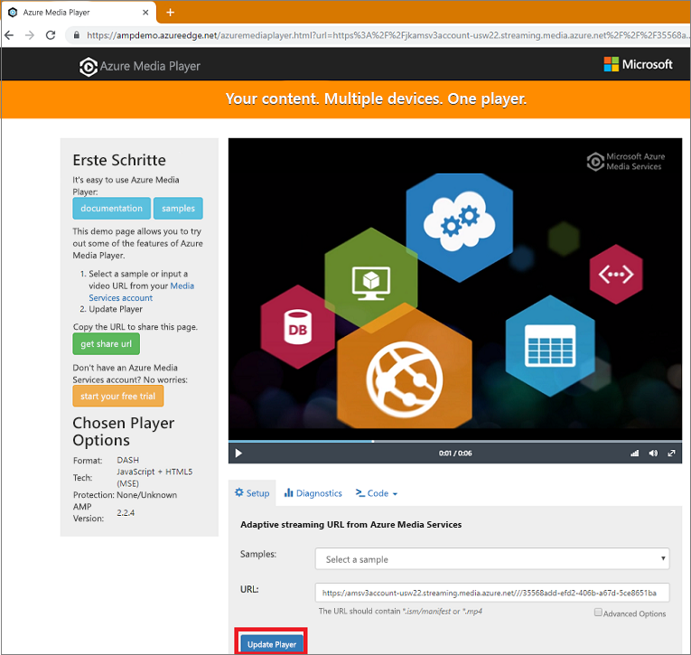

# <a name="tutorial-stream-video-files---nodejs"></a>Tutorial: Streamen von Videodateien: Node.js

Dieses Tutorial zeigt, wie einfach es ist, Videos zu codieren und mit deren Streaming für eine Vielzahl von Browsern und Geräten mit Azure Media Services zu beginnen. Ein Eingabeinhalt kann über HTTPS-URLs, SAS-URLs oder Pfade zu Dateien in Azure Blob Storage angegeben werden.

Im Beispiel in diesem Artikel werden Inhalte codiert, die Sie über eine HTTPS-URL zugänglich machen. Beachten Sie, dass AMS v3 derzeit keine segmentierte Transfercodierung über HTTPS-URLs unterstützt.

Am Ende des Tutorials sind Sie in der Lage, ein Video zu streamen.  



[!INCLUDE [quickstarts-free-trial-note](../../../includes/quickstarts-free-trial-note.md)]

## <a name="prerequisites"></a>Voraussetzungen

- Installieren von [Node.js](https://nodejs.org/en/download/)
- [Erstellen Sie ein Media Services-Konto.](create-account-cli-how-to.md)<br/>Merken Sie sich die Werte, die Sie für den Namen der Ressourcengruppe und des Media Services-Kontos verwendet haben.
- Führen Sie die Schritte unter [Zugreifen auf die Azure Media Services-API mit der Azure CLI](access-api-cli-how-to.md) aus, und speichern Sie die Anmeldeinformationen. Sie benötigen sie für den Zugriff auf die API.

## <a name="download-and-configure-the-sample"></a>Herunterladen und Konfigurieren des Beispiels

Klonen Sie mit dem folgenden Befehl ein GitHub-Repository auf Ihren Computer, das das Node.js-Streamingbeispiel enthält:  

 ```bash
 git clone https://github.com/Azure-Samples/media-services-v3-node-tutorials.git
 ```

Das Beispiel befindet sich im Ordner [StreamFilesSample](https://github.com/Azure-Samples/media-services-v3-node-tutorials/tree/master/AMSv3Samples/StreamFilesSample).

Öffnen Sie [index.js](https://github.com/Azure-Samples/media-services-v3-node-tutorials/blob/master/AMSv3Samples/StreamFilesSample/index.js#L25) in Ihrem heruntergeladenen Projekt. Ersetzen Sie die `endpoint config`-Werte durch Anmeldeinformationen, die Sie durch den [Zugriff auf APIs](access-api-cli-how-to.md) abgerufen haben.

Mit dem Beispiel werden die folgenden Aktionen durchgeführt:

1. Erstellen einer **Transformation** (nach vorheriger Überprüfung, ob die angegebene Transformation vorhanden ist) 
2. Erstellen eines **Ausgabemedienobjekts**, das als Ausgabe des **Codierungsauftrags** verwendet wird
3. Erstellen der auf einer HTTPS-URL basierenden **Auftragseingabe**
4. Übermitteln des **Codierungsauftrags** mit der zuvor erstellten Ein- und Ausgabe
5. Überprüfen des Auftragsstatus
6. Erstellen eines **Streaminglocators**
7. Erstellen von Streaming-URLs

## <a name="run-the-sample-app"></a>Ausführen der Beispiel-App

1. Die App lädt codierte Dateien herunter. Erstellen Sie einen Ordner, in dem die Ausgabedateien abgelegt werden sollen, und aktualisieren Sie in der Datei [index.js](https://github.com/Azure-Samples/media-services-v3-node-tutorials/blob/master/AMSv3Samples/StreamFilesSample/index.js#L39) den Wert der Variablen **outputFolder**.
1. Öffnen Sie die **Eingabeaufforderung**, navigieren Sie zum Verzeichnis des Beispiels, und führen Sie die folgenden Befehle aus:

    ```
    npm install 
    node index.js
    ```

Nach der Ausführung sollte etwa folgende Ausgabe angezeigt werden:


## <a name="test-with-azure-media-player"></a>Testen mit Azure Media Player

Um den Stream zu testen, wird in diesem Artikel Azure Media Player verwendet. 

> [!NOTE]
> Wenn ein Player auf einer HTTPS-Website gehostet wird, stellen Sie sicher, die URL mit „https“ zu aktualisieren.

1. Öffnen Sie einen Webbrowser, und navigieren Sie zu [https://aka.ms/azuremediaplayer/](https://aka.ms/azuremediaplayer/).
2. Fügen Sie im Feld **URL:** einen der URL-Streamingwerte ein, die Sie bei der Ausführung der Anwendung abgerufen haben. 
 
     Sie können die URL im HLS-, Dash- oder Smooth-Format einfügen. Der Azure Media Player wechselt auf Ihrem Gerät automatisch zu einem geeigneten Streamingprotokoll für die Wiedergabe.
3. Drücken Sie **Player aktualisieren**.

Azure Media Player kann zum Testen verwendet werden, sollte jedoch nicht in einer Produktionsumgebung zum Einsatz kommen. 

## <a name="clean-up-resources"></a>Bereinigen von Ressourcen

Wenn Sie die Ressourcen in der Ressourcengruppe einschließlich der in diesem Tutorial erstellten Media Services- und Speicherkonten nicht mehr benötigen, löschen Sie die Ressourcengruppe.

Führen Sie den folgenden CLI-Befehl aus:

```azurecli
az group delete --name amsResourceGroup
```

## <a name="see-also"></a>Weitere Informationen

[Auftragsfehlercodes](https://docs.microsoft.com/rest/api/media/jobs/get#joberrorcode)

## <a name="next-steps"></a>Nächste Schritte

> [!div class="nextstepaction"]
> [Media Services-Konzepte](concepts-overview.md)
