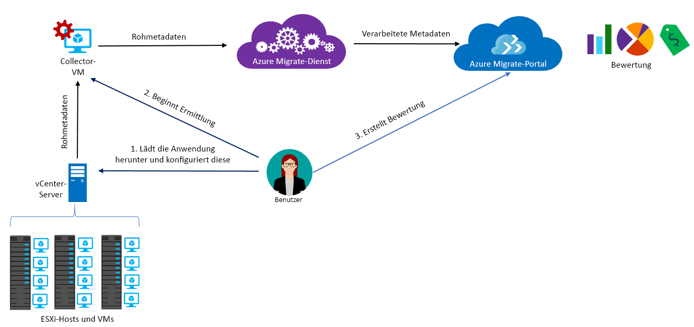

# Informationen zu Azure Migrate

Mit dem Azure Migrate-Dienst werden lokale Workloads für die Migration zu Azure bewertet. Der Dienst bewertet die Migrationseignung lokaler Computer sowie die leistungsbasierte Größenauslegung und stellt Kostenschätzungen für die Ausführung Ihrer lokalen Computer in Azure bereit. Wenn Sie die Nutzung von Lift & Shift-Migrationen erwägen oder sich in einer frühen Bewertungsphase der Migration befinden, ist dieser Dienst gut für Sie geeignet. Nach der Bewertung können Sie Dienste wie [Azure Site Recovery](https://docs.microsoft.com/azure/site-recovery/site-recovery-overview) und [Azure Database Migration Service](https://docs.microsoft.com/azure/dms/dms-overview) nutzen, um die Computer zu Azure zu migrieren.

## Gründe für die Verwendung von Azure Migrate

Azure Migrate bietet Folgendes:

- **Bewerten der Bereitschaft für Azure**: Bewerten Sie, ob Ihre lokalen Computer für die Ausführung in Azure geeignet sind.
- **Größenempfehlungen**: Nutzen Sie Größenempfehlungen für virtuelle Azure-Computer, die auf dem Leistungsverlauf lokaler virtueller Computer basieren.
- **Voraussichtliche monatliche Kosten**: Erhalten Sie Kostenschätzungen zur Ausführung lokaler Computer in Azure.  
- **Migration mit hoher Zuverlässigkeit**: Visualisieren Sie Abhängigkeiten von lokalen Computern, um Gruppen von Computern zu erstellen, die Sie gemeinsam bewerten und migrieren möchten.

## Aktuelle Einschränkungen

- Derzeit können nur lokale virtuelle VMware-Computer (Virtual Machines, VMs) für die Migration zu virtuellen Azure-Computern bewertet werden. Die virtuellen VMware-Computer müssen mit vCenter Server (Version 5.5, 6.0 oder 6.5) verwaltet werden.
- Die Unterstützung von Hyper-V ist bereits geplant. Wir empfehlen, in der Zwischenzeit den [Azure Site Recovery-Bereitstellungsplaner](http://aka.ms/asr-dp-hyperv-doc) zu verwenden, um die Migration von Hyper-V-Workloads zu planen.
- Sie können in einer einzigen Ermittlung bis zu 1.500 und in einem einzelnen Projekt bis zu 1.500 virtuelle Computer ermitteln. Außerdem können Sie in einem einzelnen Assessment bis zu 1.500 virtuelle Computer bewerten. Wenn Sie eine Ermittlung für eine größere Umgebung durchführen möchten, können Sie die Ermittlung aufteilen und mehrere Projekte erstellen. Weitere Informationen finden Sie [hier](how-to-scale-assessment.md). Azure Migrate unterstützt bis zu 20 Projekte pro Abonnement.
- Azure Migrate-Projekte können nur in der Region „USA, Westen-Mitte“ oder „USA, Osten“ erstellt werden. Dies hat aber keinerlei Auswirkung auf die Möglichkeit, Ihre Migration für einen anderen Azure-Zielstandort zu planen. Der Standort des Migrationsprojekts wird nur zum Speichern der Metadaten verwendet, die in der lokalen Umgebung ermittelt wurden.
- Azure Migrate unterstützt nur verwaltete Datenträger für die Migrationsbewertung.

## Für was muss ich zahlen?

Weitere Informationen zu den Preisen von Azure Migrate finden Sie [hier](https://azure.microsoft.com/en-in/pricing/details/azure-migrate/).

## Was umfasst eine Bewertung?

Mit einer Bewertung können Sie die Azure-Eignung lokaler virtueller Computer ermitteln sowie geeignete Größenempfehlungen und Kostenschätzungen für die Ausführung der virtuellen Computer in Azure erhalten. Bewertungen können durch Ändern der Eigenschaften an Ihre Anforderungen angepasst werden. Folgende Eigenschaften werden bei der Erstellung einer Bewertung berücksichtigt:

**Eigenschaft** | **Details**
--- | ---
**Zielstandort** | Der Azure-Standort, zu dem die Migration durchgeführt werden soll.  Azure Migrate unterstützt derzeit 30 Regionen, einschließlich „Australien, Osten“, „Australien, Südosten“, „Brasilien, Süden“, „Kanada, Mitte“, „Kanada, Osten“, „Indien, Mitte“, „USA, Mitte“, „China, Osten“, „China, Norden“, „Asien, Osten“, „USA, Osten“, „Deutschland, Mitte“, „Deutschland, Nordosten“, „USA, Osten 2“, „Japan, Osten“, „Japan, Westen“, „Südkorea, Mitte“, „Südkorea, Süden“, „USA, Norden-Mitte“, „Europa, Norden“, „USA, Süden-Mitte“, „Asien, Südosten“, „Indien, Süden“, „Vereinigtes Königreich, Süden“, „Vereinigtes Königreich, Westen“, „US Gov Arizona“, „US Gov Texas“, „US Gov Virginia“, „USA, Westen-Mitte“, „Europa, Westen“, „Indien, Westen“, „USA, Westen“ und „USA, Westen 2“. Der Zielstandort ist standardmäßig auf „USA, Westen 2“ festgelegt.
**Speichertyp** | Sie können die Art der Datenträger angeben, die Sie in Azure zuordnen möchten. Diese Eigenschaft ist bei Verwendung des Größenkriteriums „Wie lokal“ relevant. Der Zieldatenträgertyp kann als „Managed Disks Premium“ oder als „Managed Disks Standard“ angegeben werden. Standardmäßig wird „Managed Disks Premium“ verwendet. Bei der leistungsbasierten Größenanpassung werden für die Größenempfehlung automatisch die Leistungsdaten der virtuellen Computer herangezogen. Hinweis: Azure Migrate unterstützt nur verwaltete Datenträger für die Migrationsbewertung.
**Größenkriterium** | Das Kriterium, das in Azure Migrate zur Größenanpassung virtueller Computer für Azure verwendet werden soll. Sie können die Größenanpassung auf der Grundlage des *Leistungsverlaufs* der lokalen virtuellen Computer vornehmen oder die Größe der virtuellen Computer ohne Berücksichtigung des Leistungsverlaufs *an die lokale Umgebung* für Azure anpassen. Standardmäßig wird die Größenanpassung vom Typ „Wie lokal“ verwendet.
**Azure-Angebot** | Sie können das [Azure-Angebot](https://azure.microsoft.com/support/legal/offer-details/) angeben, bei dem Sie registriert sind. Dies wird dann von Azure Migrate bei der Kostenschätzung entsprechend berücksichtigt.
**Azure-Hybridvorteil** | Sie können angeben, ob Sie über Software Assurance verfügen und Anspruch auf den [Azure-Hybridvorteil](https://azure.microsoft.com/pricing/hybrid-use-benefit/) haben, um von Preisnachlässen zu profitieren.
**Reservierte Instanzen** |  Sie können auch angeben, ob Sie über [reservierte Instanzen](https://azure.microsoft.com/pricing/reserved-vm-instances/) in Azure verfügen. Dies wird dann von Azure Migrate bei der Kostenschätzung entsprechend berücksichtigt.
**VM-Betriebszeit** | Wenn Ihre virtuellen Computer nicht rund um die Uhr in Azure aktiv sind, können Sie den Zeitraum angeben, in dem sie voraussichtlich in Azure ausgeführt werden, um eine entsprechende Kostenschätzung zu erhalten.
**Preisstufe** | Sie können den [Tarif (Basic/Standard)](../virtual-machines/windows/sizes-general.md) für die virtuellen Azure-Zielcomputer angeben. Wenn Sie beispielsweise eine Produktionsumgebung migrieren möchten, sollten Sie den Standard-Tarif angeben, der virtuelle Computer mit geringer Latenz umfasst, jedoch auch kostenintensiver sein kann. Bei einer Entwicklungs- und Testumgebung sollten Sie dagegen den Basic-Tarif angeben, der virtuelle Computer mit einer höheren Latenz und geringeren Kosten umfasst. Standardmäßig wird der Tarif [Standard](../virtual-machines/windows/sizes-general.md) verwendet.
**Leistungsverlauf** | Standardmäßig bewertet Azure Migrate die Leistung lokaler Computer anhand des Leistungsverlaufs des letzten Tags mit einem 95-prozentigen Perzentilwert. Diese Werte können in den Bewertungseigenschaften geändert werden.
**VM-Serie** | Sie können die VM-Serie angeben, die Sie für die Größenanpassung berücksichtigen möchten. Wenn Sie beispielsweise eine Produktionsumgebung haben, die Sie nicht auf VMs der A-Serie in Azure migrieren möchten, können Sie die A-Serie von der Liste oder aus der Serie ausschließen, sodass die Größenanpassung nur in der ausgewählten Serie erfolgt.  
**Komfortfaktor** | Bei Azure Migrate wird während der Bewertung ein Puffer (Komfortfaktor) berücksichtigt. Dieser Puffer wird zusätzlich zu den Daten zur Computernutzung für VMs (CPU, Arbeitsspeicher, Datenträger und Netzwerk) angewendet. Beim Komfortfaktor geht es um Bereiche wie saisonale Nutzung, kurzer Leistungsverlauf und voraussichtliche zukünftige Zunahme der Nutzung.   Beispiel: Für eine VM mit zehn Kernen und 20% Auslastung ergibt sich normalerweise eine VM mit zwei Kernen. Bei einem Komfortfaktor von 2.0x ist das Ergebnis dagegen eine VM mit vier Kernen. Die Standardeinstellung für den Komfortfaktor lautet 1.3x.

## Wie funktioniert Azure Migrate?

1.  Sie erstellen ein Azure Migrate-Projekt.
2.  Für Azure Migrate wird eine lokale VM genutzt, die als „Collectorappliance“ bezeichnet wird, um Informationen zu Ihren lokalen Computern zu ermitteln. Für die Erstellung der Appliance laden Sie die Setupdatei im OVA-Format (Open Virtualization Appliance) herunter und importieren sie als virtuellen Computer auf Ihrem lokalen vCenter Server-Computer.
3.  Sie stellen über die Konsolenverbindung in vCenter Server eine Verbindung mit dem virtuellen Computer her, geben im Zuge der Verbindungsherstellung ein neues Kennwort für den virtuellen Computer an und führen dann auf dem virtuellen Computer die Collectoranwendung aus, um die Ermittlung zu initiieren.
4.  Der Collector erfasst VM-Metadaten mit VMware PowerCLI-Cmdlets. Die Ermittlung erfolgt ohne Agent, und auf VMware-Hosts oder VMs wird nichts installiert. Die gesammelten Metadaten enthalten VM-Informationen (Kerne, Arbeitsspeicher, Datenträger, Datenträgergrößen und Netzwerkadapter). Außerdem werden Leistungsdaten für VMs gesammelt, z.B. CPU- und Arbeitsspeicherauslastung, Datenträger-IOPS, Datenträgerdurchsatz (MBit/s) und Netzwerkausgabe (MBit/s).
5.  Die Metadaten werden per Pushvorgang in das Azure Migrate-Projekt übertragen. Sie können sie im Azure-Portal anzeigen.
6.  Zur Durchführung der Bewertung fassen Sie die ermittelten virtuellen Computer in Gruppen zusammen. Beispielsweise können Sie virtuelle Computer gruppieren, auf denen die gleiche Anwendung ausgeführt wird. Für eine präzisere Gruppierung können Sie mithilfe der Abhängigkeitsvisualisierung Abhängigkeiten eines bestimmten Computers anzeigen oder aber Abhängigkeiten für alle Computer in einer Gruppe anzeigen und die Gruppe weiter eingrenzen.
7.  Anschließend können Sie eine Bewertung für die gebildete Gruppe erstellen.
8.  Nach Abschluss der Bewertung können Sie das Ergebnis im Portal anzeigen oder im Excel-Format herunterladen.

  

## Wie lauten die Portanforderungen?

In der Tabelle sind die Ports zusammengefasst, die für die Azure Migrate-Kommunikation erforderlich sind.

|Komponente          |Für die Kommunikation mit     |Erforderlicher Port  |Grund   |
|-------------------|------------------------|---------------|---------|
|Collector          |Azure Migrate-Dienst   |TCP 443        |Der Collector stellt über den SSL-Port 443 eine Verbindung mit dem Dienst her.|
|Collector          |vCenter Server          |Standard 443   | Standardmäßig stellt der Collector eine Verbindung mit vCenter Server über Port 443 her. Wenn der Server an einem anderen Port lauscht, muss er auf dem virtuellen Collectorcomputer als ausgehender Port konfiguriert werden. |
|Lokale VM     | Log Analytics-Arbeitsbereich          |[TCP 443](../log-analytics/log-analytics-windows-agent.md) |Der MMA-Agent nutzt TCP 443, um eine Verbindung mit Log Analytics herzustellen. Sie benötigen diesen Port nur, wenn Sie das Feature zur Visualisierung von Abhängigkeiten verwenden und den Microsoft Monitoring Agent (MMA) installieren. |

## Was passiert nach der Bewertung?

Nachdem Sie die lokalen Computer für die Migration mit dem Azure Migrate-Dienst bewertet haben, können Sie einige Tools nutzen, um die Migration durchzuführen:

- **Azure Site Recovery**: Sie können Azure Site Recovery wie folgt für die Migration zu Azure verwenden:
  - Vorbereiten von Azure-Ressourcen, einschließlich eines Azure-Abonnements, eines virtuellen Azure-Netzwerks und eines Speicherkontos.
  - Vorbereiten Ihrer lokalen VMware-Server für die Migration. Sie überprüfen VMware-Supportanforderungen für Site Recovery, richten VMware-Server für die Ermittlung ein und bereiten die Installation des Site Recovery-Mobilitätsdiensts auf VMs vor, die Sie migrieren möchten.
  - Einrichten der Migration. Sie richten einen Recovery Services-Tresor ein, konfigurieren die Migrationseinstellungen für Quelle und Ziel, richten eine Replikationsrichtlinie ein und aktivieren die Replikation. Sie können einen Testlauf der Notfallwiederherstellung durchführen, um zu überprüfen, ob die Migration einer VM zu Azure richtig funktioniert.
  - Ausführen eines Failovers zum Migrieren von lokalen Computern zu Azure.
  - [Weitere Informationen](../site-recovery/tutorial-migrate-on-premises-to-azure.md) finden Sie im Tutorial zur Site Recovery-Migration.

- **Azure Database Migration**: Wenn Ihre lokalen Computer eine Datenbank ausführen, z.B. SQL Server, MySQL oder Oracle, können Sie den Azure Database Migration Service für die Migration verwenden. [Weitere Informationen](https://azure.microsoft.com/campaigns/database-migration/)

## Nächste Schritte

- [Arbeiten Sie ein Tutorial durch](tutorial-assessment-vmware.md), in dem es um die Erstellung einer Bewertung für eine lokale VMware-VM geht.
- [Weitere Informationen](resources-faq.md) zu den häufig gestellten Fragen für Azure Migrate
