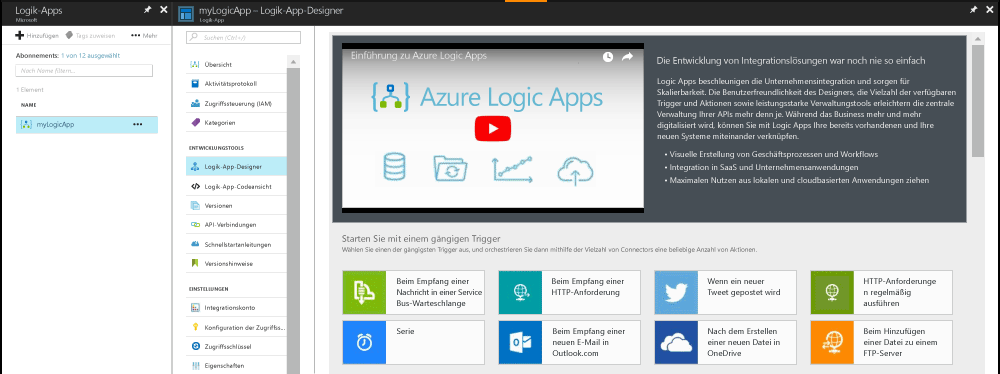
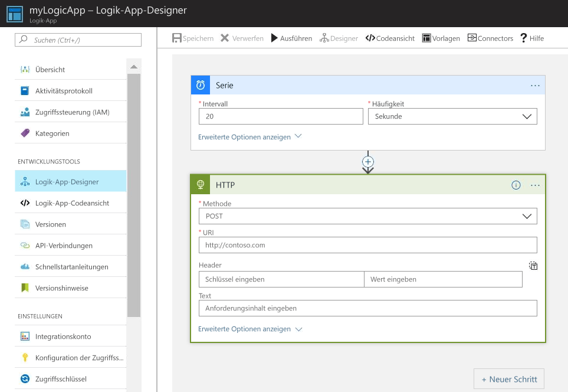
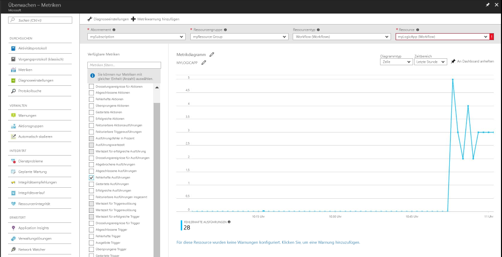
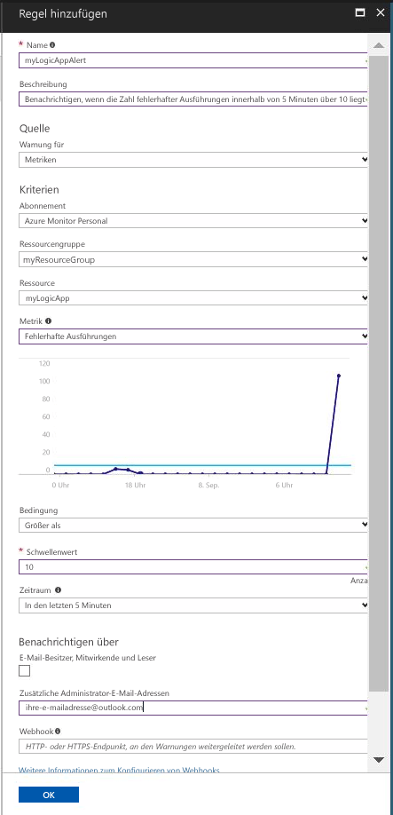

# Erhalten einer Benachrichtigung, wenn ein Metrikwert eine Bedingung erfüllt

Azure Monitor stellt Metriken für viele Azure-Ressourcen zur Verfügung. Diese Metriken liefern Informationen zur Leistung und Integrität von Ressourcen. In vielen Fällen können Metrikwerte einen Hinweis liefern, wenn Probleme für eine Ressource auftreten. Sie können Metrikwarnungen erstellen, um anormales Verhalten zu überwachen und eine Benachrichtigung zu erhalten, wenn dieses auftritt. In diesem Schnellstart werden die einzelnen Schritte beim Erstellen einer Logik-App und eines Auftrags sowie das Visualisieren der Metriken für die Logik-App beschrieben. Danach wird das Erstellen einer Warnung und das Empfangen einer Benachrichtigung für eine Metrik für die Logik-App-Ressource vorgestellt.

Weitere Informationen zu Metriken und Metrikwarnungen finden Sie unter [Azure Monitor-Metriken (Übersicht)](./monitoring-overview-metrics.md) und [Azure Monitor-Warnungen (Übersicht)](./monitoring-overview-alerts.md). 

Wenn Sie kein Azure-Abonnement besitzen, können Sie ein [kostenloses Konto](https://azure.microsoft.com/free/) erstellen, bevor Sie beginnen.

## Melden Sie sich auf dem Azure-Portal an.

Melden Sie sich auf dem [Azure-Portal](https://portal.azure.com/)an.

## Erstellen einer Logik-App

1. Klicken Sie in der linken oberen Ecke des Azure-Portals auf die Schaltfläche **Neu**.

2. Suchen Sie nach **Logik-App**, und wählen Sie diese Option aus. Erstellen Sie eine neue Ressourcengruppe namens **MyResourceGroup**. Verwenden Sie den Standardspeicherort. Klicken Sie auf die Schaltfläche **Erstellen** .

3. Geben Sie die Informationen der Logik-App ein, und überprüfen Sie die Option **An Dashboard anheften**. Klicken Sie auf **Erstellen**, wenn Sie fertig sind.

      

4. Die Logik-App sollte an Ihr Dashboard angeheftet werden. Navigieren Sie zu der Logik-App, indem Sie darauf klicken.

5. Wählen Sie im Bereich „Logik-App“ die Option **Logik-App-Designer** aus.

       

6. Richten Sie Werte wie in der folgenden Abbildung dargestellt ein.

    . 

7. Wählen Sie im Designer den Trigger **Serie** aus.

8. Legen Sie ein Intervall von 20 und die Häufigkeit auf Sekunden fest, um sicherzustellen, dass Ihre Logik-App alle 20 Sekunden ausgelöst wird.

9. Klicken Sie auf die Schaltfläche **Neuer Schritt**, und wählen Sie **Aktion hinzufügen** aus.

10. Wählen Sie die Option **HTTP** aus, und wählen Sie **HTTP-HTTP** aus.

11. Legen Sie die **Methode** auf POST und den **URI** auf eine Webadresse Ihrer Wahl fest.

12. Klicken Sie auf **Speichern**.

## Anzeigen von Metriken für die Logik-App

1. Klicken Sie im linken Navigationsbereich auf die Option **Überwachen**.

2. Wählen Sie die Registerkarte **Metriken** aus, und geben Sie die Informationen **Abonnement**, **Ressourcengruppe**, **Ressourcentyp** und **Ressource** für Ihre Logik-App an.

3. Wählen Sie **Gestartete Ausführungen** aus der Liste der Metriken aus.

4. Ändern Sie den **Zeitraum** des Diagramms so, dass Daten für die letzte Stunde angezeigt werden.

5. Jetzt sollte ein Diagramm angezeigt werden, das die Gesamtzahl der Ausführungen angibt, die Ihre Logik-App in der letzten Stunde gestartet hat.

    

## Hinzufügen einer Metrikwarnung für Ihre Logik-App

1.  Klicken Sie im oberen rechten Teil des Bereichs „Metriken“ auf die Schaltfläche **Metrikbenachrichtigung hinzufügen**.

2. Nennen Sie die Metrikwarnung „myLogicAppAlert“, und geben Sie eine kurze Beschreibung für die Warnung an.

3. Legen Sie die **Bedingung** für die Metrikwarnung auf „Größer als“, den **Schwellenwert** auf „10“ und den **Zeitraum** auf „Letzte 5 Minuten“ fest.

4. Geben Sie schließlich unter **Zusätzliche Administrator-E-Mail-Adressen** Ihre E-Mail-Adresse ein. Diese Warnung stellt sicher, dass Sie eine E-Mail erhalten, wenn für Ihre Logik-App innerhalb eines Zeitraums von 5 Minuten mehr als 10 fehlerhafte Ausführungen aufgetreten sind.

    

## Empfangen von Metrikwarnbenachrichtigungen für Ihre Logik-App
1. Nach kurzer Zeit sollten Sie eine E-Mail von „Microsoft Azure Alerts“ erhalten, um Sie zu informieren, dass die Warnung „aktiviert wurde“.

2. Navigieren Sie zurück zu Ihrer Logik-App, und ändern Sie den Serientrigger in ein Intervall von 1. Legen Sie die Häufigkeit auf „Stunde“ fest.

3. Nach einigen Minuten sollten Sie eine E-Mail von „Microsoft Azure Alerts“ erhalten, die Sie informiert, dass die Warnung „aufgelöst wurde“.

## Bereinigen von Ressourcen

Andere Schnellstarts dieser Serie bauen auf diesem Schnellstart auf. Wenn Sie planen, die nachfolgenden Schnellstarts oder Tutorials durchzuarbeiten, sollten Sie die in diesem Schnellstart erstellten Ressourcen nicht bereinigen. Falls Sie nicht fortfahren möchten, können Sie die folgenden Schritte ausführen, um alle erstellten Ressourcen dieses Schnellstarts im Azure-Portal zu löschen.

1. Klicken Sie im linken Menü im Azure-Portal auf **Überwachen**.

2. Wählen Sie die Registerkarte **Warnungen** aus, suchen Sie nach der Warnung, die Sie in diesem Schnellstartleitfaden erstellt haben, und klicken Sie darauf.

3. Klicken Sie im Bereich „Metrikwarnungen“ auf **löschen**.

4. Suchen Sie im linken Menü im Azure-Portal nach **Logik-App**, und klicken Sie dann auf **Logik-Apps**.

5. Klicken Sie im Bereich im Textfeld auf die Logik-App, die Sie in diesem Schnellstart erstellt haben, und klicken Sie dann auf **Löschen**.

## Nächste Schritte

In diesem Schnellstart haben Sie gelernt, wie eine Metrikwarnung für Ihre Ressourcen erstellt wird. Weitere Informationen zu Metrikwarnungen finden Sie in unseren Übersichten zu Warnungen.

> [!div class="nextstepaction"]
> [Azure Monitor-Abonnementaktionswarnungen](./monitor-quick-audit-notify-action-in-subscription.md )
