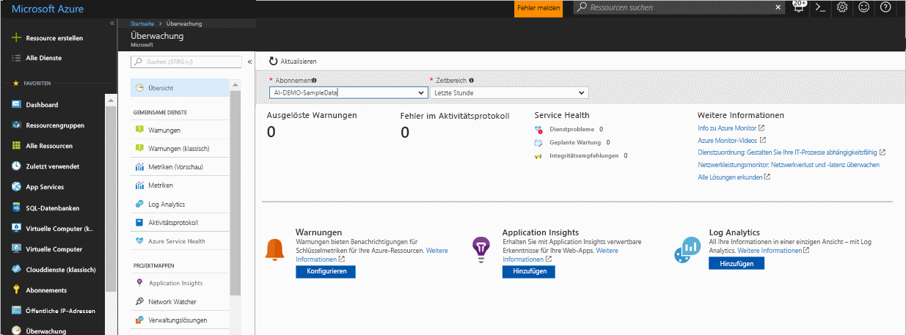
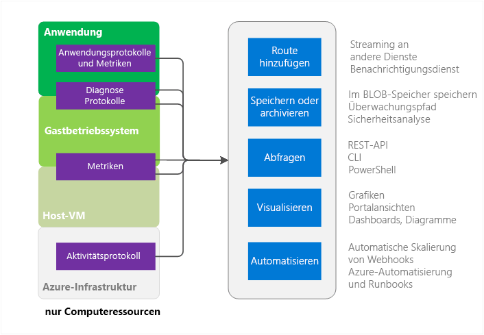
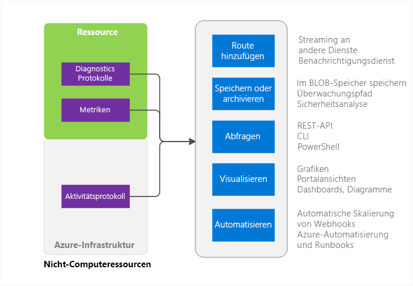

# Übersicht über Azure Monitor
Dieser Artikel bietet einen Überblick über den Azure Monitor-Dienst in Microsoft Azure. Er bietet einen Überblick über die Funktionen von Azure Monitor und stellt Verknüpfungen zu zusätzlichen Informationen über die Verwendung von Azure Monitor bereit.  Ein Einführungsvideo finden Sie über die Links im Abschnitt „Nächste Schritte“ weiter unten in diesem Artikel. 

## Azure Monitor und andere Überwachungsprodukte von Microsoft
Azure Monitor stellt grundlegende Infrastrukturmetriken und Protokolle für die meisten Dienste in Microsoft Azure bereit. Azure-Dienste, bei denen die Daten noch nicht in Azure Monitor gespeichert werden, werden in Zukunft darauf umgestellt.

Microsoft stellt zusätzliche Produkte und Dienste bereit, die zusätzliche Überwachungsfunktionen für Entwickler, DevOps oder IT-Betriebe, die auch über lokale Installationen verfügen, bieten. Eine Übersicht über die Zusammenarbeit der verschiedenen Produkte und Dienste finden Sie unter [Überwachung in Microsoft Azure](monitoring-overview.md).

## Portalübersichtsseite

Azure Monitor verfügt über eine Startseite, die Benutzer bei Folgendem unterstützt: 
- Verstehen Sie die Überwachungsfunktionen, die von Azure bereitgestellt werden.
- Entdecken, Konfigurieren und Integrieren der Azure-Plattform und der Premium-Überwachungsfunktionen.

Während der Azure Monitor-Dienst bereits veröffentlicht wurde, befindet sich die Übersicht über die Startseite noch in der Vorschauversion. 

Die Seite stellt einen Ausgangspunkt für die Navigation dar, einschließlich der Integration. Es werden ausgewählte relevante Probleme von unterschiedlichen Diensten angezeigt, außerdem wird es dem Benutzer ermöglicht, zu diesen im Kontext zu navigieren.
 

Wenn Sie die Seite öffnen, können Sie zwischen den Abonnements auswählen, für die Sie über Lesezugriff verfügen. Für ein ausgewähltes Abonnement sehen Sie Folgendes:

- **Ausgelöste Warnungen und Warnungsquellen**: Diese Tabelle zeigt eine Zusammenfassung der Anzahlen, Warnungsquellen und die Anzahl von ausgelösten Warnungen für die ausgewählte Zeitdauer an. Dies gilt für Metrik- und Aktivitätsprotokollwarnungen.
- **Aktivitätsprotokollfehler**: Wenn eine Ihrer Azure-Ressourcen Ereignisse mit dem Schweregrad „Fehler“ protokolliert, können Sie eine allgemeine Anzahl anzeigen und durch die Seite des Aktivitätsprotokolls klicken, um jedes Ereignis zu untersuchen.
- **Azure Service Health**: Ihnen wird die Anzahl von Problemen der Dienstintegrität angezeigt sowie geplante Wartungsereignisse und Integritätsempfehlungen. Azure Service Health stellt persönliche Informationen bereit, wenn sich Probleme in der Azure-Infrastruktur auf Ihre Dienste auswirken.  Weitere Informationen finden Sie unter [Azure Service Health](../service-health/service-health-overview.md).  
- **Application Insights**: Anzeige der KPIs für jede AppInsights-Ressource im aktuellen Abonnement. Die KPIs sind für die serverseitige Überwachung der Anwendungen (ASP.NET-Apps, Java, Node und allgemeine Anwendungstypen) optimiert. Diese KPIs enthalten Metriken für die Anforderungsrate, Antwortdauer, Fehlerrate und die Verfügbarkeit in Prozent. 

Wenn Sie Log Analytics oder Application Insights nicht integriert oder keine Azure-Warnungen im aktuellen Abonnement konfiguriert haben, bietet die Seite Ihnen Links, um den Integrationsvorgang zu starten.

## Azure Monitor-Quellen – Computeteilmenge

Diese Compute Services umfassen: 
- Cloud Services 
- Virtual Machines 
- Skalierungsgruppen für virtuelle Computer 
- Service Fabric

### Anwendung – Diagnoseprotokolle, Anwendungsprotokolle und Metriken
Anwendungen können zusätzlich zum Gastbetriebssystem im Computemodell ausgeführt werden. Sie geben ihre eigenen Protokollsätze und Metriken aus. Azure Monitor greift auf die Azure-Diagnoseerweiterung (Windows oder Linux) zurück, um die meisten Metriken und Protokolle auf Anwendungsebene zu sammeln. Zu den Typen zählen Folgende:

* Leistungsindikatoren
* Anwendungsprotokolle
* Windows-Ereignisprotokolle
* .NET-Ereignisquelle
* IIS-Protokolle
* Manifestbasiertes ETW
* Absturzabbilder
* Fehlerprotokolle für Kundenanwendungen

Ohne die Diagnoseerweiterung stehen nur wenige Metriken wie die CPU-Auslastung zur Verfügung. 

### Metriken von Host- und Gast-VMs
Die zuvor aufgelisteten Compute-Ressourcen sind mit einem dedizierten Host-VM und Gast-BS ausgestattet, mit denen sie interagieren. Der Host-VM und das Gast-BS entsprechen dem virtuellen Stammcomputer und der Gast-VM im Hyper-V-Hypervisormodell. Sie können auf beiden VMs Metriken sammeln. Des Weiteren können Sie auf dem Gast-BS Diagnoseprotokolle sammeln.   

### Aktivitätsprotokoll
Sie können das Aktivitätsprotokoll (zuvor als Betriebs- oder Überwachungsprotokoll bezeichnet) nach Informationen zu Ihrer Ressource aus Sicht der Azure-Infrastruktur durchsuchen. Dieses Protokoll enthält Informationen wie etwa den Erstellungs- oder Löschzeitpunkt von Ressourcen.  Weitere Informationen finden Sie in der [Übersicht über das Aktivitätsprotokoll](monitoring-overview-activity-logs.md). 

## Azure Monitor-Quellen – Sonstiges

### Ressource – Metriken und Diagnoseprotokolle
Die erfassbaren Metriken und Diagnoseprotokolle variieren je nach Ressourcentyp. Web-Apps stellen beispielsweise eine Statistik zu Datenträger-E/A und CPU-Auslastung in Prozent bereit. Für eine Service Bus-Warteschlange sind diese Metriken jedoch nicht verfügbar. Daher werden hier stattdessen Metriken wie Warteschlangengröße und Nachrichtendurchsatz bereitgestellt. Eine Liste der erfassbaren Metriken für jede Ressource finden Sie unter [Unterstützte Metriken](monitoring-supported-metrics.md). 

### Metriken von Host- und Gast-VMs
Es besteht nicht zwangsläufig eine 1:1-Zuordnung zwischen Ihrer Ressource und einer bestimmten Host- oder Gast-VM, sodass keine Metriken verfügbar sind.

### Aktivitätsprotokoll
Das Aktivitätsprotokoll entspricht dem für Compute-Ressourcen.  

## Verwendungszwecke für Überwachungsdaten
Nachdem Sie Ihre Daten erfasst haben, können Sie folgende Vorgänge für diese in Azure Monitor durchführen.

### Weiterleiten
Sie können Überwachungsdaten an andere Speicherorte streamen. 

Beispiele:

- Senden der Daten an Application Insights, um noch umfangreichere Visualisierungstools zu verwenden
- Senden der Daten an Event Hubs, um sie an Drittanbietertools weiterzuleiten 

### Speicherung und Archivierung
Einige Überwachungsdaten sind bereits gespeichert und für einen festgelegten Zeitraum in Azure Monitor verfügbar. 
- Metriken werden 30 Tage lang gespeichert. 
- Aktivitätsprotokolleinträge werden 90 Tage lang gespeichert. 
- Diagnoseprotokolle werden überhaupt nicht gespeichert. 

Wenn Sie Daten für einen längeren Zeitraum als oben angegeben speichern möchten, können Sie einen Azure Storage verwenden. Überwachungsdaten werden in Ihrem Speicherkonto basierend auf einer von Ihnen festgelegten Aufbewahrungsrichtlinie gespeichert. Der Speicherplatz, den die Daten in Azure Storage beanspruchen, ist kostenpflichtig. 

Einige Möglichkeiten, diese Daten zu nutzen:

- Sobald die Daten geschrieben wurden, können Sie andere Tools innerhalb oder außerhalb von Azure verwenden, um die Daten zu lesen und zu verarbeiten
- Sie laden die Daten in ein lokales Archiv herunter oder verändern Ihre Aufbewahrungsrichtlinie in der Cloud, um die Daten über längere Zeiträume zu speichern  
- Sie belassen die Daten für einen unbegrenzten Zeitraum zur Archivierung in Azure Storage. 

### Abfrage
Sie können die Azure Monitor-REST-API, Befehle der plattformübergreifenden Befehlszeilenschnittstelle, PowerShell-Cmdlets oder das .NET SDK verwenden, um auf die Daten im System oder in Azure Storage zuzugreifen.

Beispiele: 

* Abrufen von Daten für eine von Ihnen geschriebene, benutzerdefinierte Überwachungsanwendung
* Erstellen von benutzerdefinierten Abfragen und Senden der Daten an eine Drittanbieteranwendung

### Visualisieren
Indem Sie Ihre Überwachungsdaten in Grafiken und Diagrammen visualisieren, können Sie Trends schneller ausmachen, als wenn Sie die Daten selbst ansehen.  

Einige Beispiele für Visualisierungsmethoden:

* Verwenden des Azure-Portals
* Weiterleiten von Daten an Azure Application Insights
* Weiterleiten von Daten an Microsoft Power BI
* Weiterleiten von Daten an ein Visualisierungstool eines Drittanbieters mittels Livestreaming oder durch Lesen eines Archivs in Azure Storage

### Automatisieren
Sie können die Überwachungsdaten nutzen, um Warnungen, Ereignisse oder sogar ganze Prozesse auszulösen. Beispiele:

* Verwenden der Daten, um Compute-Instanzen je nach Anwendungslast automatisch horizontal hoch- oder herunterzuskalieren
* Senden von E-Mails, wenn eine Metrik einen vorgegebenen Schwellenwert überschreitet
* Aufrufen einer Web-URL (Webhook), um eine Aktion in einem System außerhalb von Azure auszuführen
* Starten eines Runbooks in Azure Automation, um verschiedenste Aufgaben auszuführen

## Methoden für den Zugriff auf Azure Monitor
Nachverfolgung, Routing und Abfrage von Daten können ganz allgemein mit einer der folgenden Methoden angepasst werden. Manche Methoden sind unter Umständen für bestimmte Aktionen oder Datentypen nicht verfügbar.

* [Azure-Portal](https://portal.azure.com)
* [PowerShell](insights-powershell-samples.md)  
* [Plattformübergreifende Befehlszeilenschnittstelle](insights-cli-samples.md)
* [REST-API](https://docs.microsoft.com/rest/api/monitor/)
* [.NET SDK](http://www.nuget.org/packages/Microsoft.Azure.Management.Monitor)

## Nächste Schritte
Weitere Informationen
- Ein Video mit einer exemplarischen Vorgehensweise speziell für Azure Monitor finden Sie unter  
[Get Started with Azure Monitor](https://channel9.msdn.com/Blogs/Azure-Monitoring/Get-Started-with-Azure-Monitor) (Erste Schritte mit Azure Monitor). 
- Ein Video, in dem ein Szenario zur Verwendung von Azure Monitor erläutert wird, ist unter [Explore Microsoft Azure monitoring and diagnostics (Erkunden der Microsoft Azure-Überwachung und -Diagnose)](https://channel9.msdn.com/events/Ignite/2016/BRK2234) und [Azure Monitor in a video from Ignite 2016 (Azure Monitor in einem Video von Ignite 2016)](https://myignite.microsoft.com/videos/4977) verfügbar.
- Gehen Sie die Benutzeroberfläche von Azure Monitor durch, wie unter [Erste Schritte mit Azure Monitor](monitoring-get-started.md) beschrieben wird.
- Richten Sie [Azure-Diagnoseerweiterungen](../azure-diagnostics.md) ein, wenn Sie Probleme mit Clouddiensten, virtuellen Computern, VM-Skalierungsgruppen oder Service Fabric-Anwendungen diagnostizieren möchten.
- [Application Insights](https://azure.microsoft.com/documentation/services/application-insights/) : Diagnostizieren Sie Probleme mit Ihrer App Service-Web-App.
- [Problembehandlung für Azure Storage](../storage/common/storage-e2e-troubleshooting.md) : Lösen Sie Probleme mit Storage-Blobs, Tabellen oder Warteschlangen.
- [Log Analytics](https://azure.microsoft.com/documentation/services/log-analytics/) und die [Operations Management Suite](https://www.microsoft.com/oms/)

