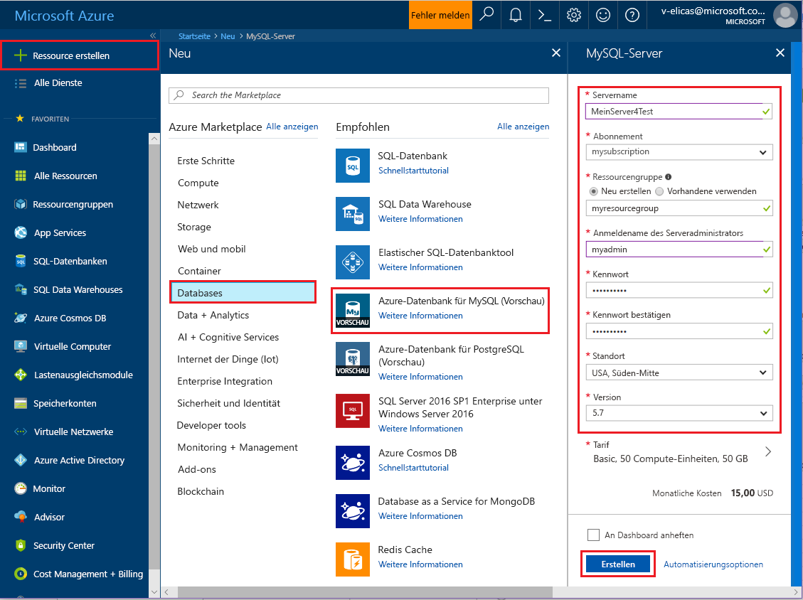
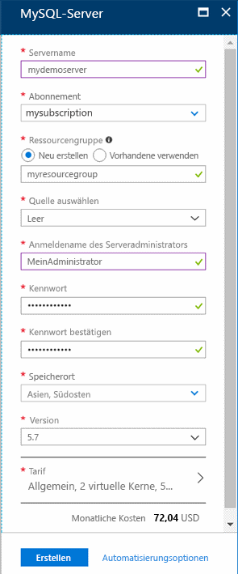
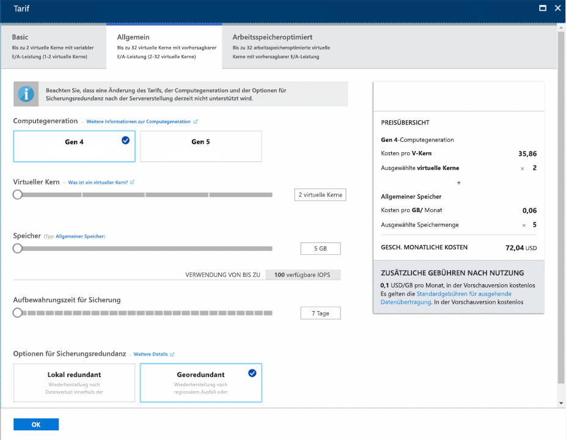
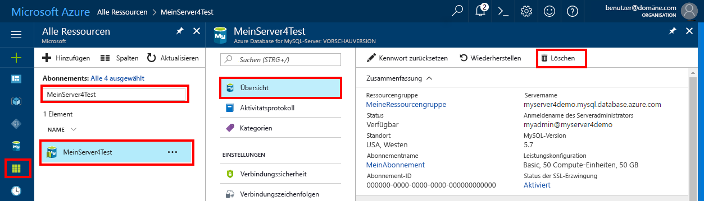

# <a name="create-an-azure-database-for-mysql-server-by-using-the-azure-portal"></a>Erstellen eines Servers für Azure-Datenbank für MySQL über das Azure-Portal

Azure-Datenbank für MySQL ist ein verwalteter Dienst, mit dem Sie hochverfügbare MySQL-Datenbanken in der Cloud ausführen, verwalten und skalieren können. In dieser Schnellstartanleitung erfahren Sie, wie Sie über das Azure-Portal in etwa fünf Minuten einen Azure Database for MySQL-Server erstellen.  

Wenn Sie über kein Azure-Abonnement verfügen, können Sie ein [kostenloses Azure-Konto](https://azure.microsoft.com/free/) erstellen, bevor Sie beginnen.

## <a name="sign-in-to-the-azure-portal"></a>Melden Sie sich auf dem Azure-Portal an.
Navigieren Sie in Ihrem Webbrowser zum [Azure-Portal](https://portal.azure.com/). Geben Sie Ihre Anmeldeinformationen ein, um sich beim Portal anzumelden. Die Standardansicht ist Ihr Dienstdashboard.

## <a name="create-an-azure-database-for-mysql-server"></a>Erstellen eines Servers für Azure-Datenbank für MySQL
Ein Server für Azure-Datenbank für MySQL wird mit einer definierten Gruppe von [Compute- und Speicherressourcen](./concepts-compute-unit-and-storage.md) erstellt. Der Server wird in einer [Azure-Ressourcengruppe](../azure-resource-manager/resource-group-overview.md) erstellt.

Führen Sie die folgenden Schritte aus, um einen Server für Azure-Datenbank für MySQL zu erstellen:

1. Klicken Sie in der linken oberen Ecke des Portals auf die Schaltfläche **Ressource erstellen** (+).

2. Wählen Sie **Datenbanken** > **Azure-Datenbank für MySQL** aus. Sie können auch **MySQL** in das Suchfeld eingeben, um nach dem Dienst zu suchen.

   

3. Geben Sie im Formular für den neuen Server folgende Informationen an:
   
   

    **Einstellung** | **Empfohlener Wert** | **Feldbeschreibung** 
    ---|---|---
    Servername | Eindeutiger Servername | Wählen Sie einen eindeutigen Namen, der Ihren Server für Azure-Datenbank für MySQL identifiziert. Beispiel: mydemoserver. Der Domänenname *.mysql.database.azure.com* wird an den angegebenen Servernamen angefügt. Der Servername darf nur Kleinbuchstaben, Zahlen und den Bindestrich (-) enthalten. Es muss zwischen drei und 63 Zeichen lang sein.
    Abonnement | Ihr Abonnement | Wählen Sie das Azure-Abonnement aus, das Sie für Ihren Server verwenden möchten. Falls Sie über mehrere Abonnements verfügen, wählen Sie das Abonnement aus, über das die Ressource abgerechnet wird.
    Ressourcengruppe | *myresourcegroup* | Geben Sie einen neuen oder vorhandenen Ressourcengruppennamen an.    Ressourcengruppe|*myresourcegroup*| Ein neuer Ressourcengruppenname oder ein bereits vorhandener Name aus Ihrem Abonnement
    Quelle auswählen | *Leer* | Wählen Sie *Leer* aus, um einen neuen Server ohne Vorlage zu erstellen. (Wählen Sie *Sicherung* aus, wenn Sie einen Server auf der Grundlage einer Geosicherung eines vorhandenen Azure Database for MySQL-Servers erstellen.)
    Serveradministratoranmeldung | myadmin | Ein Anmeldekonto für die Verbindungsherstellung mit dem Server. Der Administratoranmeldename darf nicht **azure_superuser**, **admin**, **administrator**, **root**, **guest** oder **public** lauten.
    Password | *Beliebig* | Geben Sie ein neues Kennwort für das Serveradministratorkonto an. Es muss zwischen acht und 128 Zeichen lang sein. Das Kennwort muss Zeichen aus drei der folgenden Kategorien enthalten: englische Großbuchstaben, englische Kleinbuchstaben, Zahlen (0-9) und nicht alphanumerische Zeichen (!, $, #, % usw.).
    Kennwort bestätigen | *Beliebig*| Bestätigen Sie das Kennwort des Administratorkontos.
    Speicherort | *Die Region, die Ihren Benutzern am nächsten liegt*| Wählen Sie den Standort aus, der Ihren Benutzern oder anderen Azure-Anwendungen am nächsten liegt.
    Version | *Die neueste Version*| Die neueste Version (es sei denn, Sie haben besondere Anforderungen, die eine andere Version erfordern).
    Tarif | **Universell**, **Gen 4**, **2 virtuelle Kerne**, **5 GB**, **7 Tage**, **Georedundant** | Die Compute-, Speicher- und Sicherungskonfigurationen für Ihren neuen Server. Wählen Sie **Tarif**aus. Klicken Sie als Nächstes auf die Registerkarte **Universell**. *Gen 4*, *2 virtuelle Kerne*, *5 GB* und *7 Tage* sind die Standardwerte für **Computegeneration**, **Virtueller Kern**, **Speicher** und **Aufbewahrungszeit für Sicherung**. Sie können diese Schieberegler unverändert lassen. Wählen Sie zum Aktivieren der Serversicherungen in georedundantem Speicher unter **Optionen für Sicherungsredundanz** die Option **Georedundant** aus. Klicken Sie auf **OK**, um die Tarifauswahl zu speichern. Der nächste Screenshot zeigt die gewählten Optionen.
  
    > [!IMPORTANT]
    > Der hier angegebene Benutzername und das Kennwort für den Serveradministrator werden im weiteren Verlauf dieser Schnellstartanleitung für die Anmeldung beim Server und bei den dazugehörigen Datenbanken benötigt. Behalten Sie diese Angaben im Kopf, oder notieren Sie sie zur späteren Verwendung.
    > 

   

4.  Wählen Sie **Erstellen** aus, um den Server bereitzustellen. Die Bereitstellung kann bis zu 20 Minuten dauern.
   
5.  Wählen Sie auf der Symbolleiste die Option **Benachrichtigungen** (Glockensymbol) aus, um den Bereitstellungsprozess zu überwachen.
   
  Unter Ihrem Server werden standardmäßig folgende Datenbanken erstellt: **information_schema**, **mysql**, **performance_schema** und **sys**.

## <a name="configure-a-server-level-firewall-rule"></a>Konfigurieren einer Firewallregel auf Serverebene

Der Dienst „Azure-Datenbank für MySQL“ erstellt eine Firewall auf der Serverebene. Diese Firewall verhindert, dass externe Anwendungen und Tools eine Verbindung mit dem Server und den Datenbanken auf dem Server herstellen – es sei denn, es wird eine Firewallregel erstellt, um die Firewall für bestimmte IP-Adressen zu öffnen. 

1.   Navigieren Sie nach Abschluss der Bereitstellung zu Ihrem Server. Bei Bedarf können Sie danach suchen. Wählen Sie beispielsweise im Menü auf der linken Seite die Option **Alle Ressourcen** aus. Geben Sie dann den Servernamen (beispielsweise **mydemoserver**) ein, um nach dem neu erstellten Server zu suchen. Wählen Sie den Servernamen in der Liste mit den Suchergebnissen aus. Die Seite **Übersicht** für Ihren Server wird geöffnet und enthält Optionen für die weitere Konfiguration.

2. Wählen Sie auf der Serverseite die Option **Verbindungssicherheit** aus.

3.  Wählen Sie unter der Überschrift **Firewallregeln** in der Spalte **Regelname** das leere Textfeld aus, um mit der Erstellung der Firewallregel zu beginnen. 

   Im Rahmen dieser Schnellstartanleitung lassen wir für den Server alle IP-Adressen zu, indem wir die Felder der einzelnen Spalten mit folgenden Werten versehen:

   Regelname | Start-IP | End-IP 
   ---|---|---
   AllowAllIps |  0.0.0.0 | 255.255.255.255
   
   

   Das Zulassen aller IP-Adressen stellt ein Sicherheitsrisiko dar. Hierbei handelt es sich um ein vereinfachtes Beispiel. In der Praxis müssen Sie die genauen IP-Adressbereiche kennen, die für Ihre Anwendungen und Benutzer hinzugefügt werden sollen. 

4. Wählen Sie auf der oberen Symbolleiste der Seite **Verbindungssicherheit** die Option **Speichern** aus. Warten Sie, bis die Benachrichtigung mit dem Hinweis erscheint, dass das Update erfolgreich abgeschlossen wurde, bevor Sie fortfahren. 

   > [!NOTE]
   > Die Kommunikation für Verbindungen mit Azure-Datenbank für MySQL erfolgt über Port 3306. Wenn Sie versuchen, eine Verbindung über ein Unternehmensnetzwerk herzustellen, wird ausgehender Datenverkehr über Port 3306 unter Umständen nicht zugelassen. In diesem Fall können Sie nur dann eine Verbindung mit Ihrem Server herstellen, wenn Ihre IT-Abteilung Port 3306 öffnet.
   > 

## <a name="get-the-connection-information"></a>Abrufen der Verbindungsinformationen
Für die Verbindungsherstellung mit Ihrem Datenbankserver benötigen Sie den vollständigen Servernamen und die Administratoranmeldeinformationen. Diese Werte haben Sie möglicherweise zuvor im Rahmen des Schnellstartartikels notiert. Falls nicht, finden Sie den Servernamen und die Anmeldeinformationen auf der Seite **Übersicht** des Servers oder auf der Seite **Eigenschaften** im Azure-Portal.

Führen Sie die folgenden Schritte aus, um nach diesen Werten zu suchen: 

1. Öffnen Sie die Seite **Übersicht** für Ihren Server. Notieren Sie sich den **Servernamen** und den **Anmeldenamen des Serveradministrators**. 

2. Zeigen Sie mit dem Cursor auf das jeweilige Feld. Daraufhin erscheint rechts neben dem Text ein Kopiersymbol. Wählen Sie das Kopiersymbol aus, um die Werte zu kopieren.

In diesem Beispiel lautet der Servername **mydemoserver.mysql.database.azure.com** und die Serveradministratoranmeldung **myadmin@mydemoserver**.

## <a name="connect-to-mysql-by-using-the-mysql-command-line-tool"></a>Herstellen einer Verbindung mit MySQL mithilfe des mysql-Befehlszeilentools
Es gibt verschiedene Anwendungen, mit denen Sie eine Verbindung mit Ihrem Server für Azure-Datenbank für MySQL herstellen können. 

Als Erstes verwenden wir das [mysql](https://dev.mysql.com/doc/refman/5.7/en/mysql.html)-Befehlszeilentool, um das Herstellen einer Verbindung mit dem Server zu veranschaulichen. Sie können auch wie hier beschrieben einen Webbrowser und Azure Cloud Shell verwenden, ohne zusätzliche Software zu installieren. Wenn das mysql-Hilfsprogramm lokal installiert ist, können Sie auch von dort eine Verbindung herstellen.

1. Starten Sie Azure Cloud Shell über das Terminalsymbol (**>_**), das rechts oben im Azure-Portal zur Verfügung steht.


2.  Azure Cloud Shell wird in Ihrem Browser geöffnet und ermöglicht die Eingabe von Bash-Shellbefehlen.

   

3. Stellen Sie an der Cloud Shell-Eingabeaufforderung eine Verbindung mit Ihrem Server für Azure-Datenbank für MySQL her, indem Sie die mysql-Befehlszeile eingeben.

    Verwenden Sie das folgende Format, um mit dem mysql-Hilfsprogramm eine Verbindung mit dem Server für Azure-Datenbank für MySQL herzustellen:

    ```bash
    mysql --host <fully qualified server name> --user <server admin login name>@<server name> -p
    ```

    Mithilfe des folgenden Befehls wird beispielsweise eine Verbindung mit unserem Beispielserver hergestellt:

    ```azurecli-interactive
    mysql --host mydemoserver.mysql.database.azure.com --user myadmin@mydemoserver -p
    ```

    mysql-Parameter |Empfohlener Wert|BESCHREIBUNG
    ---|---|---
    --host | *Servername* | Der Servername, den Sie zuvor beim Erstellen des Servers für Azure-Datenbank für MySQL verwendet haben. Unser Beispielserver heißt **mydemoserver.mysql.database.azure.com**. Verwenden Sie den vollqualifizierten Domänennamen (**\*.mysql.database.azure.com**), wie im Beispiel gezeigt. Sollten Sie sich nicht an Ihren Servernamen erinnern, ermitteln Sie die Verbindungsinformationen gemäß den Schritten aus dem vorherigen Abschnitt. 
    --user | *Anmeldename des Serveradministrators* |Der Anmeldename des Serveradministrators, den Sie zuvor beim Erstellen des Servers für Azure-Datenbank für MySQL verwendet haben. Sollten Sie sich nicht an Benutzernamen erinnern, ermitteln Sie die Verbindungsinformationen gemäß den Schritten aus dem vorherigen Abschnitt. Zu verwendendes Format: *username@servername*.
    -p | *Auf Eingabeaufforderung warten* |Geben Sie dann das gleiche Kennwort an, das Sie auch beim Erstellen des Servers angegeben haben. Hinweis: Die Zeichen für das Kennwort werden während der Eingabe nicht in der Bash-Eingabeaufforderung angezeigt. Drücken Sie nach Eingabe des Kennworts die **EINGABETASTE**.

   Nachdem die Verbindung hergestellt wurde, wird vom mysql-Hilfsprogramm eine `mysql>`-Eingabeaufforderung für die Befehlseingabe angezeigt. 

   Hier sehen Sie eine mysql-Beispielausgabe:

    ```bash
    Welcome to the MySQL monitor.  Commands end with ; or \g.
    Your MySQL connection id is 65505
    Server version: 5.6.26.0 MySQL Community Server (GPL)
    
    Copyright (c) 2000, 2017, Oracle and/or its affiliates. All rights reserved.
    
    Oracle is a registered trademark of Oracle Corporation and/or its
    affiliates. Other names may be trademarks of their respective
    owners.

    Type 'help;' or '\h' for help. Type '\c' to clear the current input statement.
    
    mysql>
    ```
    > [!TIP]
    > Wenn die Firewall nicht zum Zulassen der IP-Adresse von Azure Cloud Shell konfiguriert ist, tritt der folgende Fehler auf:
    >
    > FEHLER 2003 (28000): Der Client mit der IP-Adresse 123.456.789.0 hat keine Zugriffsberechtigung für den Server.
    >
    > Vergewissern Sie sich zur Behebung des Fehlers, dass die Serverkonfiguration gemäß den Schritten im Abschnitt „Konfigurieren einer Firewallregel auf Serverebene“ des Artikels durchgeführt wurde.

4. Überprüfen Sie den Serverstatus, um sicherzustellen, dass die Verbindung funktioniert, indem Sie an der an der Eingabeaufforderung „mysql>“ die Zeichenfolge `status` eingeben.

    ```sql
    status
    ```

   > [!TIP]
   > Weitere Befehle finden Sie unter [MySQL 5.7-Referenzhandbuch – Kapitel 4.5.1](https://dev.mysql.com/doc/refman/5.7/en/mysql.html).

5.  Erstellen Sie eine leere Datenbank, indem Sie an der Eingabeaufforderung **mysql>** den folgenden Befehl eingeben:
    ```sql
    CREATE DATABASE quickstartdb;
    ```
    Die Ausführung des Befehls kann einen Moment dauern. 

    Sie können in einer Instanz von Azure-Datenbank für MySQL-Server eine oder mehrere Datenbanken erstellen. Sie können eine Einzeldatenbank pro Server erstellen, die alle Ressourcen nutzt, oder Sie können mehrere Datenbanken erstellen, um die Ressourcen gemeinsam zu verwenden. Die Anzahl erstellbarer Datenbanken ist nicht begrenzt, mehrere Datenbanken verwenden jedoch die gleichen Serverressourcen. 

6. Listen Sie die Datenbanken auf, indem Sie an der Eingabeaufforderung **mysql>** den folgenden Befehl eingeben:

    ```sql
    SHOW DATABASES;
    ```

7.  Geben Sie `\q` ein, und drücken Sie anschließend die **EINGABETASTE** , um das mysql-Tool zu beenden. Anschließend können Sie Azure Cloud Shell schließen.

Sie haben nun eine Verbindung mit dem Server für Azure-Datenbank für MySQL hergestellt und eine leere Benutzerdatenbank erstellt. Im nächsten Abschnitt folgt eine ähnliche Übung. In der nächsten Übung verwenden Sie MySQL Workbench (ein anderes gängiges Tool), um eine Verbindung mit dem gleichen Server herzustellen.

## <a name="connect-to-the-server-by-using-the-mysql-workbench-gui-tool"></a>Herstellen einer Serververbindung mit dem GUI-Tool MySQL Workbench
Führen Sie die folgenden Schritte aus, um über das GUI-Tool MySQL Workbench eine Verbindung mit dem Server herzustellen:

1.  Öffnen Sie die Anwendung MySQL Workbench auf Ihrem Clientcomputer. Sie können MySQL Workbench [hier](https://dev.mysql.com/downloads/workbench/) herunterladen und installieren.

2. Erstellen Sie eine neue Verbindung. Klicken Sie neben der Überschrift **MySQL Connections** (MySQL-Verbindungen) auf das Pluszeichen (+).

3. Geben Sie im Dialogfeld **Setup New Connection** (Neue Verbindung einrichten) auf der Registerkarte **Parameter** die Informationen zu Ihrer Serververbindung ein. Als Beispiele werden Platzhalterwerte angezeigt. Ersetzen Sie Hostname, Benutzername und Kennwort durch Ihre eigenen Werte.

   

    |Einstellung |Empfohlener Wert|Feldbeschreibung|
    |---|---|---|
     Verbindungsname | Beispielverbindung | Eine Bezeichnung für diese Verbindung. |
    Verbindungsmethode | Standard (TCP/IP) | Standard (TCP/IP) ist ausreichend. |
    Hostname | *Servername* | Der Servername, den Sie weiter oben beim Erstellen des Servers für Azure-Datenbank für MySQL verwendet haben. Unser Beispielserver heißt **mydemoserver.mysql.database.azure.com**. Verwenden Sie den vollqualifizierten Domänennamen (**\*.mysql.database.azure.com**), wie im Beispiel gezeigt. Sollten Sie sich nicht an Ihren Servernamen erinnern, ermitteln Sie die Verbindungsinformationen gemäß den Schritten aus dem vorherigen Abschnitt.|
     Port | 3306 | Der Port, der beim Herstellen der Verbindung mit Ihrem Server für Azure-Datenbank für MySQL verwendet werden soll. |
    Username |  *Anmeldename des Serveradministrators* | Die Anmeldeinformationen des Serveradministrators, die Sie zuvor beim Erstellen des Servers für Azure-Datenbank für MySQL verwendet haben. Unser Beispielbenutzername lautet **myadmin@mydemoserver**. Sollten Sie sich nicht an Benutzernamen erinnern, ermitteln Sie die Verbindungsinformationen gemäß den Schritten aus dem vorherigen Abschnitt. Zu verwendendes Format: *username@servername*.
    Password | *Ihr Kennwort* | Wählen Sie die Schaltfläche **In Vault speichern** aus, um das Kennwort zu speichern. |

4. Wählen Sie **Verbindung testen** aus, um zu testen, ob alle Parameter ordnungsgemäß konfiguriert sind. Wählen Sie dann **OK** aus, um die Verbindung zu speichern. 

    > [!NOTE]
    > Auf dem Server wird standardmäßig SSL erzwungen, sodass für eine erfolgreiche Verbindungsherstellung zusätzliche Konfigurationsschritte erforderlich sind. Weitere Informationen finden Sie unter [Konfigurieren von SSL-Verbindungen in der Anwendung für eine sichere Verbindung mit Azure-Datenbank für MySQL](./howto-configure-ssl.md). Um SSL für diese Schnellstartanleitung zu deaktivieren, wechseln Sie zum Azure-Portal. Navigieren Sie zur Seite „Verbindungssicherheit“, und deaktivieren Sie SSL mithilfe der Umschaltfläche **SSL-Verbindung erzwingen**.

## <a name="clean-up-resources"></a>Bereinigen von Ressourcen
Die im Rahmen dieser Schnellstartanleitung erstellten Ressourcen können auf zwei Arten bereinigt werden. Sie können die [Azure-Ressourcengruppe](../azure-resource-manager/resource-group-overview.md) einschließlich aller darin enthaltenen Ressourcen löschen. Falls die anderen Ressourcen erhalten bleiben sollen, löschen Sie nur die einzelne Serverressource.

> [!TIP]
> Andere Schnellstartanleitungen in dieser Sammlung bauen auf dieser Schnellstartanleitung auf. Wenn Sie weitere Schnellstartanleitungen verwenden möchten, überspringen Sie die Bereinigung der in dieser Schnellstartanleitung erstellten Ressourcen. Falls Sie nicht fortfahren möchten, gehen Sie wie folgt vor, um alle Ressourcen zu löschen, die im Rahmen dieser Schnellstartanleitung erstellt wurden.
>

Führen Sie die folgenden Schritte aus, um die gesamte Ressourcengruppe (einschließlich des neu erstellten Servers) zu löschen:

1.  Navigieren Sie im Azure-Portal zu Ihrer Ressourcengruppe. Wählen Sie im Menü auf der linken Seite **Ressourcengruppen** und anschließend den Namen Ihrer Ressourcengruppe (in unserem Beispiel: **myresourcegroup**) aus.

2.  Wählen Sie auf der Ressourcengruppenseite die Option **Löschen** aus. Geben Sie dann den Namen der Ressourcengruppe (in unserem Beispiel: **myresourcegroup**) in das Feld ein, um den Löschvorgang zu bestätigen, und wählen Sie anschließend **Löschen** aus.

Wenn Sie nur den neu erstellten Server löschen möchten, gehen Sie wie folgt vor:

1.  Navigieren Sie im Azure-Portal zu Ihrem Server (sofern nicht bereits geschehen). Wählen Sie im Azure-Portal im Menü auf der linken Seite die Option **Alle Ressourcen** aus. Suchen Sie anschließend nach dem Server, den Sie erstellt haben.

2.  Wählen Sie auf der Seite **Übersicht** die Option **Löschen** aus. 

   

3.  Prüfen Sie den Namen des zu löschenden Servers, und zeigen Sie die betroffenen Datenbanken an. Geben Sie den Servernamen (in unserem Beispiel: **mydemoserver**) in das Feld ein. Klicken Sie auf **Löschen**.

## <a name="next-steps"></a>Nächste Schritte

> [!div class="nextstepaction"]
> [Entwerfen Sie Ihre erste Azure-Datenbank für MySQL-Datenbank](./tutorial-design-database-using-portal.md)

