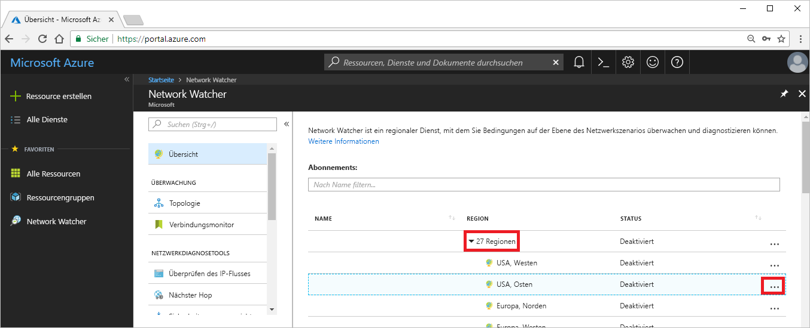

# Tutorial: Diagnostizieren von Problemen mit dem Netzwerkrouting eines virtuellen Computers über das Azure-Portal

Wenn Sie einen virtuellen Computer bereitstellen, erstellt Azure mehrere Standardrouten für ihn. Sie können benutzerdefinierte Routen erstellen, um die Standardrouten von Azure außer Kraft zu setzen. In manchen Fällen kann eine benutzerdefinierte Route dazu führen, dass ein virtueller Computer nicht mit anderen Ressourcen kommunizieren kann. In diesem Tutorial lernen Sie Folgendes:

> [!div class="checklist"]
> * Erstellen einer VM
> * Testen der Kommunikation mit einer URL mithilfe der Funktion „Nächster Hop“ von Network Watcher
> * Testen der Kommunikation mit einer IP-Adresse
> * Diagnostizieren eines Routingproblems und Informationen zur Behebung

Sie können Probleme mit dem Netzwerkrouting eines virtuellen Computers auch über die [Azure-Befehlszeilenschnittstelle](diagnose-vm-network-routing-problem-cli.md) oder [Azure PowerShell](diagnose-vm-network-routing-problem-powershell.md) diagnostizieren.

Wenn Sie kein Azure-Abonnement besitzen, können Sie ein [kostenloses Konto](https://azure.microsoft.com/free/?WT.mc_id=A261C142F) erstellen, bevor Sie beginnen.

## Anmelden an Azure

Melden Sie sich unter https://portal.azure.com beim Azure-Portal an.

## Erstellen einer VM

1. Klicken Sie im Azure-Portal links oben auf **+ Ressource erstellen**.
2. Klicken Sie auf **Compute** und anschließend auf **Windows Server 2016 Datacenter** oder auf **Ubuntu Server 17.10 VM**.
3. Geben Sie die folgenden Informationen ein, oder wählen Sie sie aus, übernehmen Sie die Standardwerte für die übrigen Einstellungen, und klicken Sie auf **OK**:

    |Einstellung|Wert|
    |---|---|
    |NAME|myVm|
    |Benutzername| Geben Sie den gewünschten Benutzernamen ein.|
    |Kennwort| Geben Sie das gewünschte Kennwort ein. Das Kennwort muss mindestens zwölf Zeichen lang sein und die [definierten Anforderungen an die Komplexität](../virtual-machines/windows/faq.md?toc=%2fazure%2fnetwork-watcher%2ftoc.json#what-are-the-password-requirements-when-creating-a-vm) erfüllen.|
    |Abonnement| Wählen Sie Ihr Abonnement aus.|
    |Ressourcengruppe| Klicken Sie auf **Neu erstellen**, und geben Sie **myResourceGroup** ein.|
    |Location| Wählen Sie **USA, Osten** aus.|

4. Wählen Sie eine Größe für den virtuellen Computer aus, und klicken Sie dann auf **Auswählen**.
5. Übernehmen Sie unter **Einstellungen** alle Standardwerte, und klicken Sie auf **OK**.
6. Wählen Sie auf der Seite **Zusammenfassung** unter **Erstellen** die Option **Erstellen**, um die Bereitstellung des virtuellen Computers zu starten. Die Bereitstellung des virtuellen Computers dauert einige Minuten. Warten Sie, bis die Bereitstellung des virtuellen Computers abgeschlossen ist, bevor Sie mit den weiteren Schritten fortfahren.

## Testen der Netzwerkkommunikation

Wenn Sie die Netzwerkkommunikation mit Network Watcher testen möchten, müssen Sie zuerst in mindestens einer Azure-Region eine Network Watcher-Instanz aktivieren, und verwenden Sie dann die Funktion „Nächster Hop“ von Network Watcher zum Testen der Kommunikation.

### Aktivieren von Network Watcher

Wenn bereits in mindestens einer Region eine Network Watcher-Instanz aktiviert ist, fahren Sie mit [Verwenden der Funktion „Nächster Hop“](#use-next-hop) fort.

1. Klicken Sie im Portal auf **Alle Dienste**. Geben Sie im Feld **Filter** die Zeichenfolge *Network Watcher* ein. Wenn **Network Watcher** in den Ergebnissen angezeigt wird, wählen Sie ihn aus.
2. Wählen Sie die **Regionen** aus, um sie zu erweitern, und wählen Sie dann **...** rechts von **USA, Osten** aus (siehe folgende Abbildung):

    

3. Klicken Sie auf **Network Watcher aktivieren**.

### Verwenden der Funktion „Nächster Hop“

Azure erstellt automatisch Routen zu Standardzielen. Sie können benutzerdefinierte Routen erstellen, mit denen die Standardrouten außer Kraft gesetzt werden. In manchen Fällen können benutzerdefinierte Routen zu Fehlern bei der Kommunikation führen. Verwenden Sie die Funktion „Nächster Hop“ von Network Watcher, um zu bestimmen, welche Route Azure zum Weiterleiten von Datenverkehr verwendet.

1. Wählen Sie im Azure-Portal unter **Network Watcher** die Option **Nächster Hop** aus.
2. Wählen Sie Ihr Abonnement aus, geben Sie die folgenden Werte an, und klicken Sie anschließend auf **Nächster Hop** (siehe folgende Abbildung):

    |Einstellung                  |Wert                                                   |
    |---------                |---------                                               |
    | Ressourcengruppe          | Wählen Sie „myResourceGroup“ aus.                                 |
    | Virtueller Computer         | Wählen Sie „myVm“ aus.                                            |
    | Netzwerkschnittstelle       | myvm (Der Name Ihrer Netzwerkschnittstelle kann anders lauten.)   |
    | Quell-IP-Adresse       | 10.0.0.4                                               |
    | IP-Zieladresse  | 13.107.21.200: Eine der Adressen für <www.bing.com> |

    

    Nach wenigen Sekunden werden Sie im Ergebnis darüber informiert, dass der nächste Hoptyp **Internet** ist und für **ID der Routingtabelle** der Wert **Systemroute** festgelegt ist. Durch dieses Ergebnis wissen Sie, dass eine gültige Systemroute zum Ziel besteht.

3. Ändern Sie die **Ziel-IP-Adresse** in *172.31.0.100*, und wählen Sie erneut **Nächster Hop** aus. Das zurückgegebene Ergebnis informiert Sie, dass **Keiner** der **Typ des nächsten Hops** ist und die **ID der Routingtabelle** ebenfalls **Systemroute** lautet. Durch dieses Ergebnis wissen Sie, dass zwar eine gültige Systemroute zum Ziel besteht, aber kein nächster Hop zum Weiterleiten des Datenverkehrs an das Ziel vorhanden ist.

## Anzeigen von Details einer Route

1. Zur weiteren Analyse des Routings überprüfen Sie die effektiven Routen für die Netzwerkschnittstelle. Geben Sie im Suchfeld oben im Portal *myvm* ein (bzw. den Namen der von Ihnen überprüften Netzwerkschnittstelle). Wenn **myvm** in den Suchergebnissen angezeigt wird, wählen Sie diesen Eintrag aus.
2. Wählen Sie unter **SUPPORT + PROBLEMBEHANDLUNG** die Option **Effektive Routen** aus (siehe folgende Abbildung):

    

    Wenn Sie den Test unter [Verwenden der Funktion „Nächster Hop“](#use-next-hop) mit 13.107.21.200 ausgeführt hatten, wurde die Route mit dem Adresspräfix 0.0.0.0/0 zum Weiterleiten von Datenverkehr an die Adresse verwendet, da keine andere Route die Adresse enthält. Standardmäßig werden alle Adressen, die nicht im Adresspräfix einer anderen Route angegeben sind, an das Internet weitergeleitet.

    Wenn Sie den Test jedoch mit 172.31.0.100 ausgeführt hatten, wurden Sie im Ergebnis darüber informiert, dass kein Typ des nächsten Hops vorhanden war. Wie Sie in der vorherigen Abbildung sehen können, ist zwar eine Standardroute zum Präfix 172.16.0.0/12 vorhanden, die die Adresse 172.31.0.100 enthält, aber der **Typ des nächsten Hops** lautet **Keiner**. Azure erstellt eine Standardroute zu 172.16.0.0/12, gibt aber einen Typ des nächsten Hops erst dann an, wenn es einen Grund dafür gibt. Wenn Sie z. B. den Adressbereich 172.16.0.0/12 zum Adressraum des virtuellen Netzwerks hinzufügen, ändert Azure den **Typ des nächsten Hops** in **Virtuelles Netzwerk** für die Route. Bei einer Überprüfung würde dann **Virtuelles Netzwerk** als **Typ des nächsten Hops** angezeigt.

## Bereinigen von Ressourcen

Löschen Sie die Ressourcengruppe mit allen ihren Ressourcen, wenn Sie sie nicht mehr benötigen:

1. Geben Sie im oben im Portal im Feld *Suche* die Zeichenfolge **myResourceGroup** ein. Wenn **myResourceGroup** in den Suchergebnissen angezeigt wird, wählen Sie diese Angabe aus.
2. Wählen Sie die Option **Ressourcengruppe löschen**.
3. Geben Sie für **Geben Sie den Ressourcengruppennamen ein:** den Namen *myResourceGroup* ein, und klicken Sie auf **Löschen**.

## Nächste Schritte

In diesem Tutorial haben Sie einen virtuellen Computer erstellt und das Netzwerkrouting vom virtuellen Computer diagnostiziert. Sie haben erfahren, dass Azure mehrere Standardrouten erstellt, und haben das Routing an zwei verschiedene Ziele getestet. Erfahren Sie mehr über das [Routing in Azure](../virtual-network/virtual-networks-udr-overview.md?toc=%2fazure%2fnetwork-watcher%2ftoc.json) und das [Erstellen benutzerdefinierter Routen](../virtual-network/manage-route-table.md?toc=%2fazure%2fnetwork-watcher%2ftoc.json#create-a-route).

Für ausgehende Verbindungen virtueller Computer können Sie auch die Latenz, den zulässigen und verweigerten Netzwerkverkehr zwischen dem virtuellen Computer und einem Endpunkt sowie die verwendete Route zu einem Endpunkt mithilfe der Funktion [Problembehandlung für Verbindung](network-watcher-connectivity-portal.md) von Network Watcher bestimmen. Erfahren Sie, wie Sie mithilfe der Verbindungsmonitorfunktion von Network Watcher die Kommunikation zwischen einem virtuellen Computer und einem Endpunkt, z. B. einer IP-Adresse oder URL, über einen Zeitraum überwachen können.

> [!div class="nextstepaction"]
> [Überwachen einer Netzwerkverbindung](connection-monitor.md)