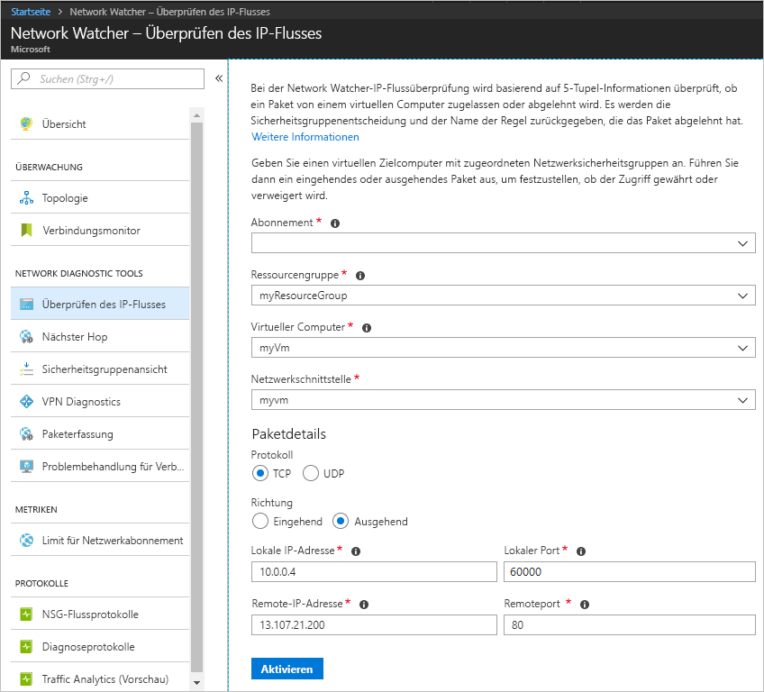
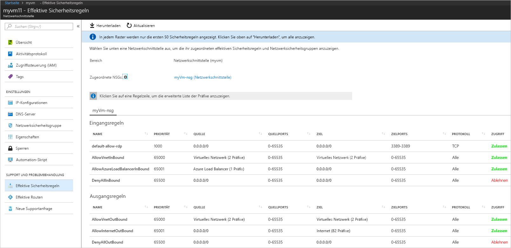
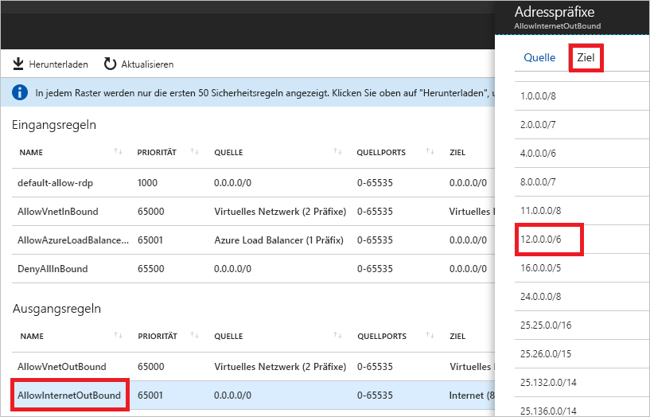

# Schnellstart: Diagnostizieren von Problemen mit dem Filter für Netzwerkdatenverkehr eines virtuellen Computers über das Azure-Portal

In dieser Schnellstartanleitung stellen Sie einen virtuellen Computer (Virtual Machine, VM) bereit und überprüfen dann die ausgehende Kommunikation für eine IP-Adresse und URL sowie die eingehende Kommunikation von einer IP-Adresse. Sie ermitteln die Ursache eines Kommunikationsfehlers und wie Sie ihn beheben können.

Wenn Sie kein Azure-Abonnement besitzen, können Sie ein [kostenloses Konto](https://azure.microsoft.com/free/?WT.mc_id=A261C142F) erstellen, bevor Sie beginnen.

## Anmelden an Azure

Melden Sie sich unter https://portal.azure.com beim Azure-Portal an.

## Erstellen einer VM

1. Klicken Sie im Azure-Portal links oben auf **+ Ressource erstellen**.
2. Wählen Sie **Compute** und anschließend **Windows Server 2016 Datacenter** oder eine Version von **Ubuntu Server**.
3. Geben Sie die folgenden Informationen ein, oder wählen Sie sie aus, übernehmen Sie die Standardwerte für die übrigen Einstellungen, und klicken Sie auf **OK**:

    |Einstellung|Wert|
    |---|---|
    |NAME|myVm|
    |Benutzername| Geben Sie den gewünschten Benutzernamen ein.|
    |Kennwort| Geben Sie das gewünschte Kennwort ein. Das Kennwort muss mindestens zwölf Zeichen lang sein und die [definierten Anforderungen an die Komplexität](../virtual-machines/windows/faq.md?toc=%2fazure%2fnetwork-watcher%2ftoc.json#what-are-the-password-requirements-when-creating-a-vm) erfüllen.|
    |Abonnement| Wählen Sie Ihr Abonnement aus.|
    |Ressourcengruppe| Klicken Sie auf **Neu erstellen**, und geben Sie **myResourceGroup** ein.|
    |Standort| Wählen Sie **USA, Osten** aus.|

4. Wählen Sie eine Größe für den virtuellen Computer aus, und klicken Sie dann auf **Auswählen**.
5. Übernehmen Sie unter **Einstellungen** alle Standardwerte, und klicken Sie auf **OK**.
6. Wählen Sie auf der Seite **Zusammenfassung** unter **Erstellen** die Option **Erstellen**, um die Bereitstellung des virtuellen Computers zu starten. Die Bereitstellung des virtuellen Computers dauert einige Minuten. Warten Sie, bis die Bereitstellung des virtuellen Computers abgeschlossen ist, bevor Sie mit den weiteren Schritten fortfahren.

## Testen der Netzwerkkommunikation

Wenn Sie die Netzwerkkommunikation mit Network Watcher testen möchten, aktivieren Sie in mindestens einer Region eine Network Watcher-Instanz, und verwenden Sie dann die IP-Flussüberprüfungsfunktion von Network Watcher.

### Aktivieren von Network Watcher

Wenn bereits in mindestens einer Region eine Network Watcher-Instanz aktiviert ist, fahren Sie mit [Verwenden der IP-Flussüberprüfung](#use-ip-flow-verify) fort.

1. Klicken Sie im Portal auf **Alle Dienste**. Geben Sie im Feld **Filter** die Zeichenfolge *Network Watcher* ein. Wenn in den Ergebnissen die Option **Network Watcher** angezeigt wird, wählen Sie sie aus.
2. Aktivieren Sie eine Network Watcher-Instanz in der Region „USA, Osten“, da der virtuelle Computer in einem vorherigen Schritt in dieser Region bereitgestellt wurde. Wählen Sie die **Regionen** aus, um sie zu erweitern, und wählen Sie dann **...** rechts von **USA, Osten** aus (siehe folgende Abbildung):

    

3. Klicken Sie auf **Network Watcher aktivieren**.

### Verwenden der IP-Flussüberprüfung

Wenn Sie einen virtuellen Computer erstellen, wird der ein- und ausgehende Netzwerkdatenverkehr des virtuellen Computers von Azure standardmäßig zugelassen bzw. abgelehnt. Die Azure-Standardeinstellungen können später außer Kraft gesetzt werden, um zusätzliche Arten von Datenverkehr zuzulassen oder abzulehnen.

1. Klicken Sie im Portal auf **Alle Dienste**. Geben Sie unter **Alle Dienste** im Feld *Filter* die Zeichenfolge *Network Watcher* ein. Wenn in den Ergebnissen die Option **Network Watcher** angezeigt wird, wählen Sie sie aus.
2. Klicken Sie unter **NETZWERKDIAGNOSETOOLS** auf **IP-Fluss überprüfen**.
3. Wählen Sie Ihr Abonnement aus, geben Sie die folgenden Werte an, und klicken Sie anschließend auf **Überprüfen**, wie in der folgenden Abbildung zu sehen:

    |Einstellung            |Wert                                                                                              |
    |---------          |---------                                                                                          |
    | Ressourcengruppe    | Wählen Sie „myResourceGroup“ aus.                                                                            |
    | Virtueller Computer   | Wählen Sie „myVm“ aus.                                                                                       |
    | Netzwerkschnittstelle | myvm (Die Netzwerkschnittstelle, die das Portal beim Erstellen des virtuellen Computers erstellt hat, hat einen anderen Namen.) |
    | Protokoll          | TCP                                                                                               |
    | Richtung         | Ausgehend                                                                                          |
    | Lokale IP-Adresse  | 10.0.0.4                                                                                          |
    | Lokaler Port      | 60000                                                                                                |
    | Remote-IP-Adresse | 13.107.21.200: Eine der Adressen für <www.bing.com>                                             |
    | Remoteport       | 80                                                                                                |

    

    Nach einigen Sekunden werden Sie im zurückgegebenen Ergebnis darüber informiert, dass der Zugriff aufgrund einer Sicherheitsregel mit dem Namen **AllowInternetOutbound** zugelassen wird. Beim Ausführen der Überprüfung wurde von Network Watcher automatisch eine Network Watcher-Instanz in der Region „USA, Osten“ erstellt, falls vor dem Ausführen der Überprüfung eine Network Watcher-Instanz in einer anderen Region vorhanden war.
4. Führen Sie Schritt 3 erneut aus, ändern Sie dabei aber die **Remote-IP-Adresse** in **172.31.0.100**. Im zurückgegebenen Ergebnis werden Sie darüber informiert, dass der Zugriff aufgrund einer Sicherheitsregel mit dem Namen **DefaultOutboundDenyAll** verweigert wird.
5. Führen Sie Schritt 3 erneut aus, ändern Sie dabei aber die **Richtung** in **Eingehend**, den Wert für **Lokaler Port** in **80** und den **Remoteport** in **60000**. Im zurückgegebenen Ergebnis werden Sie darüber informiert, dass der Zugriff aufgrund einer Sicherheitsregel mit dem Namen **DefaultInboundDenyAll** verweigert wird.

Nachdem Sie nun wissen, welche Sicherheitsregeln den ein- und ausgehenden Datenverkehr eines virtuellen Computers zulassen oder ablehnen, können Sie Lösungen für die Probleme ermitteln.

## Anzeigen von Details einer Sicherheitsregel

1. Überprüfen Sie die geltenden Sicherheitsregeln für die Netzwerkschnittstelle des virtuellen Computers, um zu ermitteln, warum die Regeln in den Schritten 3 bis 5 unter [Verwenden der IP-Flussüberprüfung](#use-ip-flow-verify) die Kommunikation zulassen oder verhindern. Geben Sie am oberen Rand des Portals den Suchbegriff *myvm* in das Suchfeld ein. Wenn die Netzwerkschnittstelle mit dem Namen **myvm** (bzw. mit dem tatsächlichen Namen Ihrer Netzwerkschnittstelle) in den Suchergebnissen angezeigt wird, wählen Sie sie aus.
2. Klicken Sie unter **SUPPORT + PROBLEMBEHANDLUNG** auf **Effektive Sicherheitsregeln**, wie in der folgenden Abbildung dargestellt:

    

    In Schritt 3 von [Verwenden der IP-Flussüberprüfung](#use-ip-flow-verify) haben Sie gelernt, dass die Kommunikation aufgrund der Regel **AllowInternetOutbound** zugelassen wurde. In der vorherigen Abbildung sehen Sie, dass **Internet** das **ZIEL** für die Regel ist. Der Zusammenhang zwischen 13.107.21.200 (die Adresse, die Sie in Schritt 3 von [Verwenden der IP-Flussüberprüfung](#use-ip-flow-verify) getestet haben) und **Internet** ist jedoch nicht klar.
3. Wählen Sie die Regel **AllowInternetOutBound** und anschließend **Ziel** aus, wie in der folgenden Abbildung gezeigt:

    

    Eines der Präfixe in der Liste ist **12.0.0.0/6**, das den IP-Adressbereich 12.0.0.1 bis 15.255.255.254 umfasst. Da 13.107.21.200 in diesem Adressbereich liegt, lässt die Regel **AllowInternetOutBound** den ausgehenden Datenverkehr zu. Darüber hinaus sind in der Abbildung in Schritt 2 keine Regeln mit einer höheren Priorität (niedrigere Zahl) vorhanden, die diese Regel außer Kraft setzen. Schließen Sie den Bereich **Adresspräfixe**. Um die ausgehende Kommunikation mit 13.107.21.200 zu verweigern, können Sie eine Sicherheitsregel mit einer höheren Priorität hinzufügen, die ausgehenden Datenverkehr über den Port 80 für die IP-Adresse verweigert.
4. Beim Ausführen der ausgehenden Überprüfung für 172.131.0.100 in Schritt 4 von [Verwenden der IP-Flussüberprüfung](#use-ip-flow-verify) haben Sie gelernt, dass die Regel **DefaultOutboundDenyAll** die Kommunikation verweigert hat. Diese Regel entspricht der Regel **DenyAllOutBound** aus der Abbildung in Schritt 2, die **0.0.0.0/0** als **ZIEL** angibt. Die Regel verweigert die ausgehende Kommunikation mit 172.131.0.100, da die Adresse nicht im **ZIEL** einer der anderen **ausgehenden Regeln** aus der Abbildung enthalten ist. Um die ausgehende Kommunikation zuzulassen, können Sie eine Sicherheitsregel mit einer höheren Priorität hinzufügen, die ausgehenden Datenverkehr über den Port 80 für die Adresse 172.131.0.100 zulässt.
5. Beim Ausführen der eingehenden Überprüfung für 172.131.0.100 in Schritt 5 von [Verwenden der IP-Flussüberprüfung](#use-ip-flow-verify) haben Sie gelernt, dass die Regel **DefaultInboundDenyAll** die Kommunikation verweigert hat. Diese Regel entspricht der Regel **DenyAllInBound** aus der Abbildung in Schritt 2. Die Regel **DenyAllInBound** wird erzwungen, da keine andere Regel mit höherer Priorität vorhanden ist, die für den virtuellen Computer eingehenden Datenverkehr von 172.31.0.100 am Port 80 zulässt. Um die eingehende Kommunikation zuzulassen, können Sie eine Sicherheitsregel mit einer höheren Priorität hinzufügen, die eingehenden Datenverkehr von 172.31.0.100 am Port 80 zulässt.

Mit den Überprüfungen in dieser Schnellstartanleitung wurde die Azure-Konfiguration getestet. Wenn die Überprüfungen zwar die erwarteten Ergebnisse zurückgeben, aber weiterhin Netzwerkprobleme auftreten, stellen Sie sicher, dass zwischen Ihrem virtuellen Computer und dem Endpunkt, mit dem Sie kommunizieren, keine Firewall vorhanden ist und das Betriebssystem auf Ihrem virtuellen Computer nicht über eine Firewall verfügt, die die Kommunikation zulässt oder verweigert.

## Bereinigen von Ressourcen

Löschen Sie die Ressourcengruppe mit allen ihren Ressourcen, wenn Sie sie nicht mehr benötigen:

1. Geben Sie im oben im Portal im Feld *Suche* die Zeichenfolge **myResourceGroup** ein. Wenn **myResourceGroup** in den Suchergebnissen angezeigt wird, wählen Sie diese Angabe aus.
2. Wählen Sie die Option **Ressourcengruppe löschen**.
3. Geben Sie für **Geben Sie den Ressourcengruppennamen ein:** den Namen *myResourceGroup* ein, und klicken Sie auf **Löschen**.

## Nächste Schritte

In dieser Schnellstartanleitung haben Sie einen virtuellen Computer erstellt sowie Filter für ein- und ausgehenden Netzwerkdatenverkehr diagnostiziert. Sie haben gelernt, dass Netzwerksicherheitsgruppen-Regeln den ein- und ausgehenden Datenverkehr eines virtuellen Computers zulassen oder verweigern. Erfahren Sie mehr über [Sicherheitsregeln](../virtual-network/security-overview.md?toc=%2fazure%2fnetwork-watcher%2ftoc.json) und das [Erstellen von Sicherheitsregeln](../virtual-network/manage-network-security-group.md?toc=%2fazure%2fnetwork-watcher%2ftoc.json#create-a-security-rule).

Auch wenn für den Netzwerkdatenverkehr die richtigen Filter vorhanden sind, kann die Kommunikation mit einem virtuellen Computer aufgrund der Routingkonfiguration fehlschlagen. Informationen zum Diagnostizieren von Routingproblemen in VM-Netzwerken finden Sie unter [Diagnostizieren von VM-Routingproblemen](diagnose-vm-network-routing-problem.md). Unter [Problembehandlung für Verbindungen](network-watcher-connectivity-portal.md) erfahren Sie außerdem, wie Sie mit nur einem Tool Probleme mit Ausgangsrouting und Wartezeiten sowie Probleme mit dem Filtern des Datenverkehrs diagnostizieren.
