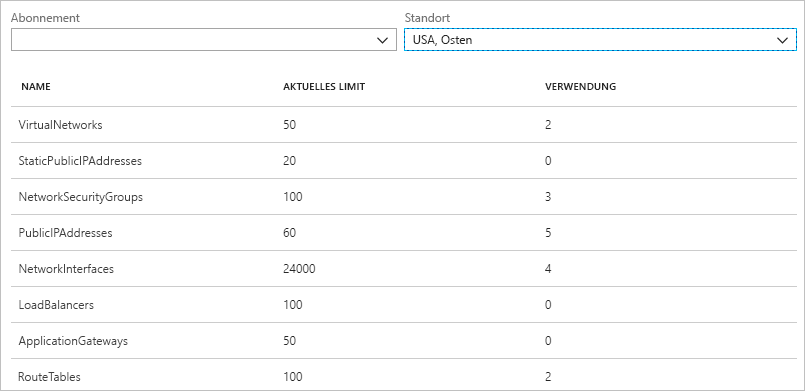
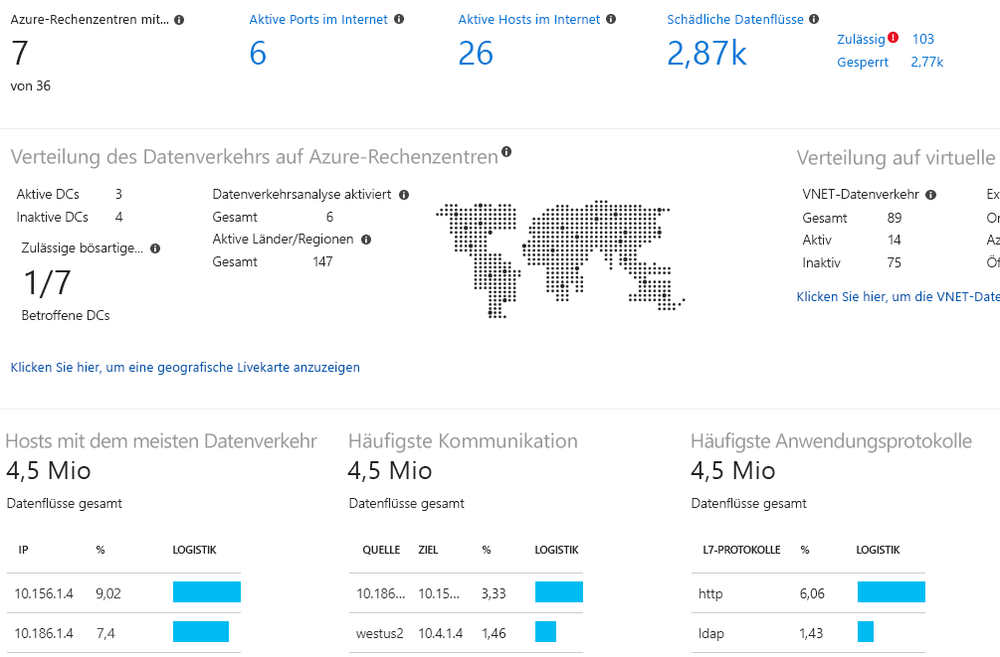

# Was ist Azure Network Watcher?

Mit Azure Network Watcher werden Tools für die Überwachung, Diagnose, Metrikanzeige und Aktivierung/Deaktivierung von Protokollen für Ressourcen in einem virtuellen Azure-Netzwerk bereitgestellt.

## Überwachung

### Überwachen der Kommunikation zwischen einem virtuellen Computer und einem Endpunkt

Bei Endpunkten kann es sich um einen anderen virtuellen Computer (VM), einen vollqualifizierten Domänennamen (FQDN), einen URI (Uniform Resource Identifier) oder eine IPv4-Adresse handeln. Mit der Funktion *Verbindungsmonitor* wird die Kommunikation in regelmäßigen Abständen überwacht, und Sie werden über Änderungen der Erreichbarkeit, Latenz und Netzwerktopologie zwischen der VM und dem Endpunkt informiert. Beispielsweise verfügen Sie ggf. über eine Webserver-VM, die mit einer Datenbankserver-VM kommuniziert. Es kann sein, dass eine andere Person in Ihrer Organisation (ohne dass Ihnen dies bekannt ist) eine benutzerdefinierte Route oder Netzwerksicherheitsregel auf die Webserver- oder Datenbankserver-VM oder das Subnetz anwendet.

Wenn ein Endpunkt nicht mehr erreichbar ist, werden Sie von der Problembehandlung der Verbindung über die Ursache informiert. Mögliche Ursachen sind ein Problem mit der DNS-Namensauflösung, die CPU, der Arbeitsspeicher oder die Firewall des Betriebssystems einer VM, der Hop-Typ einer benutzerdefinierten Route oder die Sicherheitsregel für die VM oder das Subnetz der ausgehenden Verbindung. Informieren Sie sich über [Sicherheitsregeln](../virtual-network/security-overview.md?toc=%2fazure%2fnetwork-watcher%2ftoc.json#security-rules) und [Hop-Typen von Routen](../virtual-network/virtual-networks-udr-overview.md?toc=%2fazure%2fnetwork-watcher%2ftoc.json) in Azure.

Über den Verbindungsmonitor werden auch die Werte für die minimale, durchschnittliche und maximale Latenz angegeben, die im Laufe der Zeit ermittelt wurde. Wenn Sie die Latenz für eine Verbindung kennen, stellt sich unter Umständen heraus, dass Sie sie reduzieren können, indem Sie Ihre Azure-Ressourcen in andere Azure-Regionen verschieben. Informieren Sie sich über die Ermittlung der [relativen Latenzen zwischen Azure-Regionen und Internetdienstanbietern](#determine-relative-latencies-between-azure-regions-and-internet-service-providers) und die Überwachung der Kommunikation zwischen einer VM und einem Endpunkt per [Verbindungsmonitor](connection-monitor.md). Falls Sie eine Verbindung zu einem bestimmten Zeitpunkt und nicht für einen Zeitraum testen möchten (wie mit dem Verbindungsmonitor), können Sie die Funktion [Problembehandlung für Verbindung](#connection-troubleshoot) nutzen.

Der Netzwerkleistungsmonitor ist eine Cloud-basierte hybride Netzwerküberwachungslösung, mit der Sie die Netzwerkleistung zwischen verschiedenen Punkten in Ihrer Netzwerkinfrastruktur überwachen können. Er hilft Ihnen auch, die Netzwerkkonnektivität mit Dienst- und Anwendungsendpunkten zu überwachen und die Leistung von Azure ExpressRoute zu überwachen. Der Netzwerkleistungsmonitor erkennt Netzwerkprobleme wie ins Nichts führenden Datenverkehr (Blackholing), Routingfehler und Probleme, die mit herkömmlichen Netzwerküberwachungsmethoden nicht erkannt werden können. Die Lösung generiert Warnungen und benachrichtigt Sie, sobald ein Schwellenwert für eine Netzwerkverbindung überschritten wird. Sie gewährleistet außerdem das rechtzeitige Erkennen von Leistungsproblemen im Netzwerk und ordnet die Ursache des Problems einem bestimmten Netzwerksegment oder Gerät zu. Weitere Informationen über den [Netzwerkleistungsmonitor](../azure-monitor/insights/network-performance-monitor.md?toc=%2fazure%2fnetwork-watcher%2ftoc.json).

### Anzeigen von Ressourcen in einem virtuellen Netzwerk mit den dazugehörigen Beziehungen

Wenn Ressourcen einem virtuellen Netzwerk hinzugefügt werden, kann es schwierig sein, den Überblick darüber zu behalten, welche Ressourcen sich in einem virtuellen Netzwerk befinden und wie sie miteinander in Beziehung stehen. Mit der Funktion *Topologie* können Sie eine visuelle Darstellung der Ressourcen in einem virtuellen Netzwerk mit den Beziehungen zwischen den Ressourcen generieren. Die folgende Abbildung enthält ein Beispieltopologie-Diagramm für ein virtuelles Netzwerk mit drei Subnetzen, zwei VMs, Netzwerkschnittstellen, öffentlichen IP-Adressen, Netzwerksicherheitsgruppen, Routentabellen und den Beziehungen zwischen den Ressourcen:

Sie können eine bearbeitbare Version der Abbildung im SVG-Format herunterladen. Informieren Sie sich über die [Topologieansicht](view-network-topology.md).

## Diagnose

### Diagnostizieren von Problemen mit der Filterung des Netzwerkdatenverkehrs für eine VM (in ein- und ausgehender Richtung)

Wenn Sie eine VM bereitstellen, wendet Azure mehrere Standardsicherheitsregeln auf die VM an, mit denen Datenverkehr für die VM zugelassen oder verweigert wird. Sie können die Standardregeln von Azure außer Kraft setzen oder zusätzliche Regeln erstellen. Es kann sein, dass eine VM aufgrund einer Sicherheitsregel irgendwann nicht mehr mit anderen Ressourcen kommunizieren kann. Mit der Funktion *IP-Datenflussüberprüfung* können Sie eine IPv4-Quell- und -Zieladresse, einen Port, ein Protokoll (TCP oder UDP) und die Richtung des Datenverkehrs (ein- oder ausgehend) angeben. Mit der IP-Datenflussüberprüfung wird dann die Kommunikation getestet, und Sie werden informiert, ob die Verbindungsherstellung erfolgreich war. Falls die Verbindungsherstellung nicht erfolgreich war, werden Sie über die IP-Datenflussüberprüfung benachrichtigt, welche Sicherheitsregel die Kommunikation zugelassen oder verweigert hat, damit Sie das Problem beheben können. Weitere Informationen zur IP-Datenflussüberprüfung erhalten Sie im Tutorial [Diagnostizieren von Problemen mit dem Filter für Netzwerkdatenverkehr eines virtuellen Computers über das Azure-Portal](diagnose-vm-network-traffic-filtering-problem.md).

### Diagnostizieren von Problemen mit dem Netzwerkrouting über eine VM

Wenn Sie ein virtuelles Netzwerk erstellen, erstellt Azure mehrere ausgehende Standardrouten für Netzwerkdatenverkehr. Der ausgehende Datenverkehr aller Ressourcen, z.B. VMs, die in einem virtuellen Netzwerk bereitgestellt werden, wird basierend auf den Standardrouten von Azure weitergeleitet. Sie können die Standardrouten von Azure außer Kraft setzen oder zusätzliche Routen erstellen. Es kann sein, dass eine VM aufgrund einer bestimmten Route nicht mehr mit anderen Ressourcen kommunizieren kann. Mit der Funktion *Nächster Hop* können Sie eine IPv4-Quell- und -Zieladresse angeben. Bei „Nächster Hop“ wird die Kommunikation getestet, und Sie erhalten die Information, welche Art von nächstem Hop zum Weiterleiten des Datenverkehrs verwendet wird. Sie können eine Route dann entfernen, ändern oder hinzufügen, um ein Routingproblem zu beheben. Erfahren Sie mehr zur Funktion [Nächster Hop](diagnose-vm-network-routing-problem.md).

### Diagnostizieren ausgehender Verbindungen von einer VM

Mit der Funktion *Problembehandlung für Verbindung* können Sie eine Verbindung zwischen einer VM und einer anderen VM, einem FQDN, einem URI oder einer IPv4-Adresse testen. Bei diesem Test werden ähnliche Informationen wie bei Verwendung des [Verbindungsmonitors](#connection-monitor) zurückgegeben. Für die Verbindung wird aber ein bestimmter Zeitpunkt getestet, und sie wird nicht im Zeitverlauf überwacht, wie dies beim Verbindungsmonitor der Fall ist. Informieren Sie sich über die Problembehandlung von Verbindungen mit der Funktion [Problembehandlung für Verbindung](network-watcher-connectivity-overview.md).

### Erfassen von Paketen zu und von einem virtuellen Computer

Erweiterte Filteroptionen und präzise Steuerelemente ermöglichen beispielsweise das Festlegen von Zeit- und Größeneinschränkungen und bieten damit viel Flexibilität. Die Erfassung kann in Azure Storage, auf dem Datenträger der VM oder an beiden Orten gespeichert werden. Anschließend können Sie die Erfassungsdatei analysieren, indem Sie mehrere Standardanalysetools für die Netzwerkerfassung verwenden. Erfahren Sie mehr zur [Paketerfassung](network-watcher-packet-capture-overview.md).

### Diagnostizieren von Problemen mit einem Gateway eines virtuellen Azure-Netzwerks und mit Verbindungen

Gateways eines virtuellen Netzwerks stellen die Konnektivität zwischen lokalen Ressourcen und anderen virtuellen Azure-Netzwerken bereit. Die Überwachung der Gateways und ihrer Verbindungen ist wichtig, damit die Kommunikation nicht unterbrochen wird. Die Funktion *VPN-Diagnose* ermöglicht die Diagnose von Gateways und Verbindungen. Per VPN-Diagnose wird die Integrität des Gateways bzw. der Gatewayverbindung diagnostiziert, und Sie werden informiert, ob ein Gateway und Gatewayverbindungen verfügbar sind. Falls das Gateway oder die Verbindung nicht verfügbar sind, teilt die VPN-Diagnose Ihnen den Grund dafür mit, damit Sie das Problem beheben können. Weitere Informationen zur VPN-Diagnose erhalten Sie im Tutorial [Diagnostizieren eines Problems mit der Kommunikation zwischen Netzwerken mit dem Azure-Portal](diagnose-communication-problem-between-networks.md).

### Bestimmen von relativen Latenzen zwischen Azure-Regionen und Internetdienstanbietern

Sie können über Network Watcher Latenzinformationen zwischen Azure-Regionen und für Internetdienstanbieter abfragen. Wenn Ihnen die Latenzen zwischen Azure-Regionen und für Internetdienstanbieter bekannt sind, können Sie Azure-Ressourcen bereitstellen, um die Antwortzeit des Netzwerks zu optimieren. Informieren Sie sich über [relative Latenzen](view-relative-latencies.md).

### Anzeigen der Sicherheitsregeln für eine Netzwerkschnittstelle

Die geltenden Sicherheitsregeln für eine Netzwerkschnittstelle stellen eine Kombination aller Sicherheitsregeln, die auf die Netzwerkschnittstelle angewendet werden, und des Subnetzes der Netzwerkschnittstelle dar.  Mit der Funktion *Sicherheitsgruppenansicht* werden alle Sicherheitsregeln, die auf die Netzwerkschnittstelle angewendet werden, das Subnetz, in dem sich die Netzwerkschnittstelle befindet, und die entsprechende Aggregierung angezeigt. Wenn Sie wissen, welche Regeln auf eine Netzwerkschnittstelle angewendet werden, können Sie Regeln hinzufügen, entfernen oder ändern, falls damit Datenverkehr zugelassen oder verweigert wird und Sie dies ändern möchten. Erfahren Sie mehr zur [Sicherheitsgruppenansicht](network-watcher-security-group-view-overview.md).

## Metriken

Es gibt [Grenzwerte](../azure-subscription-service-limits.md?toc=%2fazure%2fnetwork-watcher%2ftoc.json#azure-resource-manager-virtual-networking-limits) für die Anzahl von Netzwerkressourcen, die Sie in einem Azure-Abonnement und einer Region erstellen können. Wenn Sie die Grenzwerte erreicht haben, ist es nicht möglich, unter dem Abonnement oder in der Region weitere Ressourcen zu erstellen. Bei der Funktion *Limit für Netzwerkabonnement* wird eine Zusammenfassung dazu angezeigt, wie viele der einzelnen Netzwerkressourcen Sie für ein Abonnement und eine Region jeweils bereitgestellt haben und welche Grenzen für eine Ressource gelten. In der folgenden Abbildung ist die Teilausgabe für Netzwerkressourcen dargestellt, die in der Region „USA, Osten“ für ein Beispielabonnement bereitgestellt wurden:

Die Informationen sind für die Planung von Bereitstellungen zukünftiger Ressourcen hilfreich.

## Protokolle

### Analysieren des Datenverkehrs zu oder von einer Netzwerksicherheitsgruppe

Über Netzwerksicherheitsgruppen (NSG) wird ein- oder ausgehender Datenverkehr einer Netzwerkschnittstelle auf einer VM zugelassen oder verweigert. Mit der Funktion *NSG-Flussprotokollierung* können Sie die IP-Quell- und -Zieladresse, den Port und das Protokoll erfassen (und ob Datenverkehr von einer NSG zugelassen oder verweigert wurde). Sie können Protokolle mit vielen verschiedenen Tools analysieren, z.B. Power BI und der Funktion *Datenverkehrsanalyse*. Bei der Datenverkehrsanalyse werden umfassende Visualisierungen von Daten bereitgestellt, die in NSG-Flussprotokolle geschrieben werden. In der folgenden Abbildung sind einige Informationen und Visualisierungen dargestellt, die über die Datenverkehrsanalyse aus den Daten des NSG-Flussprotokolls bereitgestellt werden:

Weitere Informationen zur NSG-Flussprotokollierung erhalten Sie im Tutorial [Protokollieren des Netzwerkdatenverkehrs zu und von einem virtuellen Computer über das Azure-Portal](network-watcher-nsg-flow-logging-portal.md). Informationen zur Implementierung der Datenverkehrsanalyse finden Sie [hier](traffic-analytics.md).

### Anzeigen von Diagnoseprotokollen für Netzwerkressourcen

Sie können die Diagnoseprotokollierung für Azure-Netzwerkressourcen aktivieren, z.B. Netzwerksicherheitsgruppen, öffentliche IP-Adressen, Lastenausgleichsmodule, Gateways eines virtuellen Netzwerks und Anwendungsgateways. Die Funktion *Diagnoseprotokolle* verfügt über eine Benutzeroberfläche zum Aktivieren und Deaktivieren von Diagnoseprotokollen für alle vorhandenen Netzwerkressourcen, die ein Diagnoseprotokoll generieren. Sie können Diagnoseprotokolle anzeigen, indem Sie Tools wie Microsoft Power BI und Azure Log Analytics verwenden. Weitere Informationen zur Analyse von Azure-Netzwerkdiagnoseprotokollen finden Sie unter [Azure-Netzwerküberwachungslösungen in Log Analytics](../azure-monitor/insights/azure-networking-analytics.md?toc=%2fazure%2fnetwork-watcher%2ftoc.json).

## Automatische Aktivierung von Network Watcher
Beim Erstellen oder Aktualisieren eines virtuellen Netzwerks in Ihrem Abonnement wird Network Watcher automatisch in der Region Ihres virtuellen Netzwerks aktiviert. Die automatische Aktivierung von Network Watcher hat keine Auswirkungen auf Ihre Ressourcen oder die damit verbundene Gebühr. Weitere Informationen finden Sie unter [Erstellen einer Azure Network Watcher-Instanz](network-watcher-create.md).

## Nächste Schritte

Sie haben jetzt einen Überblick über Azure Network Watcher erhalten. Als Einstieg in die Nutzung von Network Watcher können Sie ein häufiges Kommunikationsproblem für einen virtuellen Computer diagnostizieren, indem Sie die IP-Datenflussüberprüfung verwenden. Informationen hierzu finden Sie in der Schnellstartanleitung [Diagnostizieren von Problemen mit dem Filter für Netzwerkdatenverkehr eines virtuellen Computers](diagnose-vm-network-traffic-filtering-problem.md).
