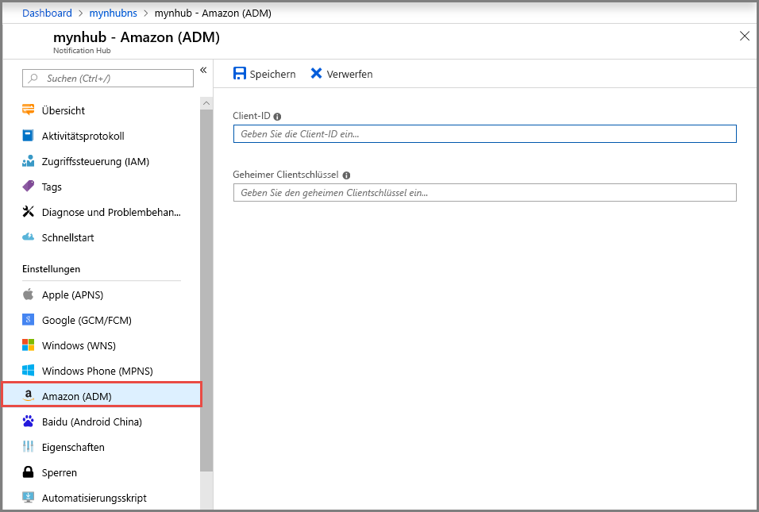

# Konfigurieren von Android Device Messaging-Einstellungen (ADM) für einen Notification Hub im Azure Portal
In diesem Artikel wird gezeigt, wie Sie Android Device Messaging-Einstellungen (ADM) für einen Azure Notification Hub über das Azure Portal konfigurieren. 

## Voraussetzungen
Wenn Sie noch keinen Notification Hub erstellt haben, erstellen Sie ihn jetzt. Weitere Informationen finden Sie unter [Erstellen einer Azure Notification Hub-Instanz über das Azure-Portal](create-notification-hub-portal.md). 

## Konfigurieren von Android Device Messaging

Die folgende Vorgehensweise beschreibt die Schritte zum Konfigurieren der Amazon Device Messaging-Einstellungen (ADM) für einen Notification Hub: 

1. Wählen Sie im Azure-Portal auf der Seite **Notification Hub** im linken Menü die Option **Amazon (ADM)** aus.
2. Geben Sie Werte für **Client-ID** und **Geheimer Clientschlüssel** ein.
3. Wählen Sie **Speichern** aus.
    
   

## Nächste Schritte
Ein Tutorial mit einer Schritt-für-Schritt-Anleitung zum Pushen von Benachrichtigungen an Android-Geräte über Azure Notification Hubs und Android Device Messaging (ADM) finden Sie unter [Erste Schritte mit Notification Hubs für Kindle-Apps](notification-hubs-kindle-amazon-adm-push-notification.md).

