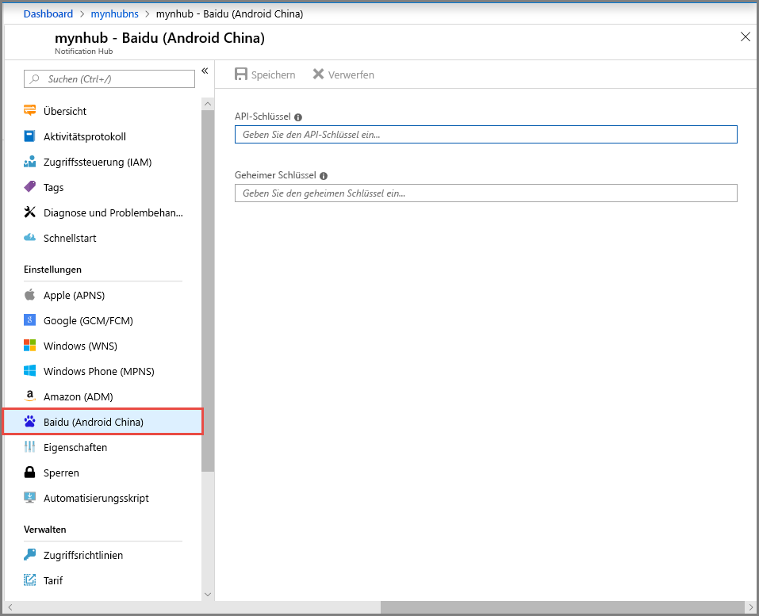

# <a name="get-started-with-notification-hubs-using-baidu"></a>Erste Schritte mit Notification Hubs mit Baidu
[!INCLUDE [notification-hubs-selector-get-started](../../includes/notification-hubs-selector-get-started.md)]

Baidu Cloud Push ist ein chinesischer Clouddienst, mit dem Sie Pushbenachrichtigungen an mobile Geräte senden können. 

Da Google Play und FCM (Firebase Cloud Messaging) in China nicht verfügbar sind, müssen andere App-Stores und Pushdienste verwendet werden. Baidu ist einer davon. Er wird momentan von Notification Hub verwendet.

## <a name="prerequisites"></a>Voraussetzungen
Für dieses Tutorial ist Folgendes erforderlich:

* Android SDK (wir gehen davon aus, dass Sie Android Studio verwenden), das Sie von der <a href="http://go.microsoft.com/fwlink/?LinkId=389797">Android-Website</a> herunterladen können
* [Baidu Push Android SDK]

> [!NOTE]
> Sie benötigen ein aktives Azure-Konto, um dieses Lernprogramm abzuschließen. Wenn Sie über kein Konto verfügen, können Sie in nur wenigen Minuten ein kostenloses Testkonto erstellen. Ausführliche Informationen finden Sie unter [Einen Monat kostenlos testen](https://azure.microsoft.com/pricing/free-trial/?WT.mc_id=A0E0E5C02&amp;returnurl=http%3A%2F%2Fazure.microsoft.com%2Fen-us%2Fdocumentation%2Farticles%2Fnotification-hubs-baidu-get-started%2F).
> 
> 

## <a name="create-a-baidu-account"></a>Erstellen eines Baidu-Kontos
Zum Verwenden von Baidu müssen Sie über ein Baidu-Konto verfügen. Wenn Sie bereits ein Konto haben, melden Sie sich beim [Baidu-Portal] an, und fahren Sie mit dem nächsten Schritt fort. Andernfalls finden Sie nachfolgend die entsprechenden Anweisungen zum Erstellen eines Baidu-Kontos.  

1. Wechseln Sie zum [Baidu-Portal], und klicken Sie auf den Link **登录** (**Anmeldung**). Klicken Sie auf **立即注册** (**Jetzt registrieren**), um den Registrierungsprozess für ein Konto zu starten.
   
    

2. Geben Sie die erforderlichen Details (Telefonnummer, E-Mail-Adresse, Kennwort und Überprüfungscode) ein, und klicken Sie auf **注册** (Registrieren).
   
    

3. Sie erhalten unter der eingegebenen E-Mail-Adresse eine E-Mail mit einem Link zur Aktivierung Ihres Baidu-Kontos.
   
    

4. Melden Sie sich bei Ihrem E-Mail-Konto an, öffnen Sie die Baidu-Aktivierungsmail, und klicken Sie auf den Aktivierungslink, um Ihr Baidu-Konto zu aktivieren.
   
    

Nachdem Sie Ihr Baidu-Konto aktiviert haben, melden Sie sich beim [Baidu-Portal]an.

## <a name="create-a-baidu-cloud-push-project"></a>Erstellen eines Baidu-Cloud-Push-Projekts
Wenn Sie ein Baidu-Cloud-Push-Projekt erstellen, erhalten Sie Ihre App-ID, einen API-Schlüssel und einen geheimen Schlüssel.

1. Klicken Sie nach dem Anmelden am [Baidu-Portal] auf **更多>>** (**Mehr**).
   
    

2. Scrollen Sie im Abschnitt **站长与开发者服务** (**Webmaster- und Entwicklerdienste**) nach unten, und klicken Sie auf **百度云推送** (**Baidu-Cloud-Push**).
   
    

3. Klicken Sie auf der nächsten Seite rechts oben auf **登录** (**Anmelden**).
   
    

4. Klicken Sie auf der Seite anschließend auf **创建应用** (**Anwendung erstellen**).

    

5. Klicken Sie auf der nächsten Seite auf **创建新应用** (Neue Anwendung erstellen).
   
    

6. Geben Sie einen Anwendungsnamen ein, und klicken Sie auf **创建** (Erstellen).
   
    

7. Nach erfolgreicher Erstellung eines Baidu Cloud Push-Projekts wird eine Seite mit **App-ID**, **API-Schlüssel** und **Geheimer Schlüssel** angezeigt. Notieren Sie sich den API-Schlüssel und den geheimen Schlüssel für später.
   
    

8. Konfigurieren Sie das Projekt für Pushbenachrichtigungen, indem Sie im linken Bereich auf **创建通知** (Benachrichtigung erstellen) klicken.
   
    


## <a name="configure-a-new-notification-hub"></a>Konfigurieren eines neuen Notification Hubs
[!INCLUDE [notification-hubs-portal-create-new-hub](../../includes/notification-hubs-portal-create-new-hub.md)]


&emsp;&emsp;6. Klicken Sie in Ihrem Notification Hub auf **Notification Services** und anschließend auf **Baidu (Android China)**.

&emsp;&emsp;

&emsp;&emsp;7. Scrollen Sie nach unten zum Abschnitt mit den Baidu-Benachrichtigungseinstellungen. Geben Sie den API-Schlüssel und den geheimen Schlüssel aus der Baidu-Konsole in das Baidu Cloud Push-Projekt ein. Klicken Sie anschließend auf „Speichern“.

&emsp;&emsp;

Ihr Notification Hub ist jetzt für die Zusammenarbeit mit Baidu konfiguriert. Außerdem verfügen Sie über die **Verbindungszeichenfolgen**, um Ihre App für das Senden und Empfangen von Pushbenachrichtigungen zu registrieren.

Notieren Sie sich die Werte für `DefaultListenSharedAccessSignature` und `DefaultFullSharedAccessSignature` aus dem Fenster „Verbindungsinformationen aufrufen“.

## <a name="connect-your-app-to-the-notification-hub"></a>Verbinden Ihrer App mit dem Notification Hub
1. Erstellen Sie in Android Studio ein neues Android-Projekt („Datei“ > „Neu“ > „Neues Projekt“).

    

2.  Geben Sie einen Anwendungsnamen ein, und vergewissern Sie sich, dass die erforderliche SDK-Mindestversion auf „API 16: Android 4.1“ festgelegt ist. **Vergewissern Sie sich außerdem, dass Ihr Paketname (应用包名) mit dem Namen im Baidu Cloud Push-Portal übereinstimmt.**

    
    

3.  Klicken Sie auf „Weiter“, und befolgen Sie die Anweisungen des Assistenten, bis das Fenster „Aktivität erstellen“ angezeigt wird. Vergewissern Sie sich, dass „Blank Activity“ (Leere Aktivität) ausgewählt ist, und klicken Sie abschließend auf „Fertig stellen“, um eine neue Android-Anwendung zu erstellen.

    

4.  Vergewissern Sie sich, dass das Buildziel des Projekts korrekt festgelegt ist.

5.  Fügen Sie anschließend Azure Notification Hubs-Bibliotheken hinzu. Fügen Sie in der Datei `Build.Gradle` für die App im Abschnitt „dependencies“ die folgenden Zeilen hinzu:

    ```javascript
    compile 'com.microsoft.azure:notification-hubs-android-sdk:0.4@aar'
    compile 'com.microsoft.azure:azure-notifications-handler:1.0.1@aar'
    ```

    Fügen Sie nach dem Abschnitt „dependencies“ das folgende Repository hinzu:

    ```javascript
    repositories {
        maven {
            url "http://dl.bintray.com/microsoftazuremobile/SDK"
        }
    }
    ```

    Zu Vermeidung des Listenkonflikts müssen wir in **Manifest.xml** den folgenden Code hinzufügen:

    ```xml
    <manifest package="YOUR.PACKAGE.NAME"
    xmlns:tools="http://schemas.android.com/tools"
    xmlns:android="http://schemas.android.com/apk/res/android">
    ```

    Im Tag `<application/>` muss außerdem folgender Code eingefügt werden:

    ```xml
    <application
        tools:replace="android:allowBackup,icon,theme,label">
    ```

6.  Laden Sie das [Baidu Push Android SDK] herunter, und entzippen Sie es. Kopieren Sie die Datei `pushservice-x.y.z jar` in den Ordner „libs“. Kopieren Sie anschließend die Dateien mit der Dateinamenerweiterung `.so` in die Ordner vom Typ `src/main/jniLibs` Ihrer Android-Anwendung. (Erstellen Sie hierzu einen neuen Ordner.)

    

7. Klicken Sie mit der rechten Maustaste im Ordner „libs“ auf die Datei „pushervice-x.y.z.jar“, und klicken Sie auf „Add as Library“ (Als Bibliothek hinzufügen), um diese Bibliothek in das Projekt einzuschließen.

    

8. Öffnen Sie die Datei **AndroidManifest.xml** Ihres Android-Projekts, und fügen Sie die Berechtigungen hinzu, die für das Baidu SDK erforderlich sind. **Ersetzen Sie `YOURPACKAGENAME` durch Ihren Paketnamen.**

    ```xml
    <uses-permission android:name="android.permission.INTERNET" />
    <uses-permission android:name="android.permission.READ_PHONE_STATE" />
    <uses-permission android:name="android.permission.ACCESS_NETWORK_STATE" />
    <uses-permission android:name="android.permission.RECEIVE_BOOT_COMPLETED" />
    <uses-permission android:name="android.permission.WRITE_SETTINGS" />
    <uses-permission android:name="android.permission.VIBRATE" />
    <uses-permission android:name="android.permission.WRITE_EXTERNAL_STORAGE" />
    <uses-permission android:name="android.permission.DISABLE_KEYGUARD" />
    <uses-permission android:name="android.permission.ACCESS_COARSE_LOCATION" />
    <uses-permission android:name="android.permission.ACCESS_WIFI_STATE" />
    <uses-permission android:name="android.permission.ACCESS_DOWNLOAD_MANAGER" />
    <uses-permission android:name="android.permission.DOWNLOAD_WITHOUT_NOTIFICATION" />
    <uses-permission android:name="android.permission.EXPAND_STATUS_BAR" />
    !! <uses-permission android:name="baidu.push.permission.WRITE_PUSHINFOPROVIDER.YOURPACKAGENAME" />
    !!<permission android:name="baidu.push.permission.WRITE_PUSHINFOPROVIDER.YOURPACKAGENAME"android:protectionLevel="normal" />

    ```

9. Fügen Sie innerhalb des Anwendungselements nach dem Aktivitätselement `.MainActivity` die folgende Konfiguration hinzu, und ersetzen Sie dabei *yourprojectname* durch Ihren Projektnamen (beispielsweise `com.example.BaiduTest`):

    ```xml
    <activity
        android:name="com.baidu.android.pushservice.richmedia.MediaViewActivity"
        android:configChanges="orientation|keyboardHidden"
        android:label="MediaViewActivity" />
    <activity
        android:name="com.baidu.android.pushservice.richmedia.MediaListActivity"
        android:configChanges="orientation|keyboardHidden"
        android:label="MediaListActivity"
        android:launchMode="singleTask" />
 
    <!-- Push application definition message -->
    <receiver android:name=".MyPushMessageReceiver">
        <intent-filter>

            <!-- receive push message-->
            <action android:name="com.baidu.android.pushservice.action.MESSAGE" />
            <!-- receive bind,unbind,fetch,delete.. message-->
            <action android:name="com.baidu.android.pushservice.action.RECEIVE" />
            <action android:name="com.baidu.android.pushservice.action.notification.CLICK" />
        </intent-filter>
    </receiver>

    <receiver
        android:name="com.baidu.android.pushservice.PushServiceReceiver"
        android:process=":bdservice_v1">
        <intent-filter>
            <action android:name="android.intent.action.BOOT_COMPLETED" />
            <action android:name="android.net.conn.CONNECTIVITY_CHANGE" />
            <action android:name="com.baidu.android.pushservice.action.notification.SHOW" />
            <action android:name="com.baidu.android.pushservice.action.media.CLICK" />
            <action android:name="android.intent.action.MEDIA_MOUNTED" />
            <action android:name="android.intent.action.USER_PRESENT" />
            <action android:name="android.intent.action.ACTION_POWER_CONNECTED" />
            <action android:name="android.intent.action.ACTION_POWER_DISCONNECTED" />
        </intent-filter>
    </receiver>

    <receiver
        android:name="com.baidu.android.pushservice.RegistrationReceiver"
        android:process=":bdservice_v1">
        <intent-filter>
            <action android:name="com.baidu.android.pushservice.action.METHOD" />
            <action android:name="com.baidu.android.pushservice.action.BIND_SYNC" />
        </intent-filter>
        <intent-filter>
            <action android:name="android.intent.action.PACKAGE_REMOVED" />

            <data android:scheme="package" />
        </intent-filter>
    </receiver>

    <service
        android:name="com.baidu.android.pushservice.PushService"
        android:exported="true"
        android:process=":bdservice_v1">
        <intent-filter>
            <action android:name="com.baidu.android.pushservice.action.PUSH_SERVICE" />
        </intent-filter>
    </service>

    <service
        android:name="com.baidu.android.pushservice.CommandService"
        android:exported="true" />

    <!-- Adapt the ContentProvider declaration required for the Android N system, and the write permissions include the application package name-->
    <provider
        android:name="com.baidu.android.pushservice.PushInfoProvider"
        android:authorities="com.baidu.push.example.bdpush"
        android:exported="true"
        android:protectionLevel="signature"
        android:writePermission="baidu.push.permission.WRITE_PUSHINFOPROVIDER. yourprojectname  " />

    <!-- API Key of the Baidu application -->
    <meta-data
        android:name="api_key"
        !!   android:value="api_key" />
    </application>
    ```

10. Fügen Sie dem Projekt eine neue Klasse namens `ConfigurationSettings.java` hinzu.

    ```java
    public class ConfigurationSettings {
        public static String API_KEY = "...";
        public static String NotificationHubName = "...";
        public static String NotificationHubConnectionString = "...";
    }
    ```
    
    Legen Sie den Wert der `API_KEY`-Zeichenfolge auf den API-Schlüssel aus dem Baidu-Cloudprojekt fest.
    
    Legen Sie den Wert der `NotificationHubName`-Zeichenfolge auf Ihren Notification Hub-Namen aus dem [Azure-Portals] und anschließend `NotificationHubConnectionString` auf `DefaultListenSharedAccessSignature` aus dem [Azure-Portals] fest.

11. Öffnen Sie „MainActivity.java“, und fügen Sie der onCreate-Methode Folgendes hinzu:

    ```java
    PushManager.startWork(this, PushConstants.LOGIN_TYPE_API_KEY,  API_KEY );
    ```

12. Fügen Sie eine neue Klasse namens `MyPushMessageReceiver.java` sowie den folgenden Code dafür hinzu. Dies ist die Klasse, die die vom Baidu-Push-Server empfangenen Pushbenachrichtigungen verarbeitet.

    ```java
    package your.package.name;

    import android.content.Context;
    import android.content.Intent;
    import android.os.AsyncTask;
    import android.text.TextUtils;
    import android.util.Log;

    import com.baidu.android.pushservice.PushMessageReceiver;
    import com.microsoft.windowsazure.messaging.NotificationHub;
    import org.json.JSONException;
    import org.json.JSONObject;

    import java.util.List;

    public class MyPushMessageReceiver extends PushMessageReceiver {

        public static final String TAG = MyPushMessageReceiver.class
                .getSimpleName();
        public static NotificationHub hub = null;
        public static String mChannelId, mUserId;

        @Override
        public void onBind(Context context, int errorCode, String appid,
                        String userId, String channelId, String requestId) {
            String responseString = "onBind errorCode=" + errorCode + " appid="
                    + appid + " userId=" + userId + " channelId=" + channelId
                    + " requestId=" + requestId;
            Log.d(TAG, responseString);

            if (errorCode == 0) {
                // Binding successful
                Log.d(TAG, " Binding successful");
            }
            try {
                if (hub == null) {
                    hub = new NotificationHub(
                            ConfigurationSettings.NotificationHubName,
                            ConfigurationSettings.NotificationHubConnectionString,
                            context);
                    Log.i(TAG, "Notification hub initialized");
                }
            } catch (Exception e) {
                Log.e(TAG, e.getMessage());
            }
            mChannelId = channelId;
            mUserId = userId;

            registerWithNotificationHubs();
        }
        private void registerWithNotificationHubs() {

            new AsyncTask<Void, Void, Void>() {
                @Override
                protected Void doInBackground(Void... params) {
                    try {
                        hub.registerBaidu(mUserId, mChannelId);
                        Log.i(TAG, "Registered with Notification Hub - '"
                                + ConfigurationSettings.NotificationHubName + "'"
                                + " with UserId - '"
                                + mUserId + "' and Channel Id - '"
                                + mChannelId + "'");
                    } catch (Exception e) {
                        Log.e(TAG, e.getMessage());
                    }
                    return null;
                }
            }.execute(null, null, null);
        }

        @Override
        public void onMessage(Context context, String message,
                            String customContentString) {
            String messageString = " onMessage=\"" + message
                    + "\" customContentString=" + customContentString;
            Log.d(TAG, messageString);
            if (!TextUtils.isEmpty(customContentString)) {
                JSONObject customJson = null;
                try {
                    customJson = new JSONObject(customContentString);
                    String myvalue = null;
                    if (!customJson.isNull("mykey")) {
                        myvalue = customJson.getString("mykey");
                    }
                } catch (JSONException e) {
                    e.printStackTrace();
                }
            }

        }

        @Override
        public void onNotificationArrived(Context context, String title, String description, String customContentString) {
            String notifyString = " Notice Arrives onNotificationArrived  title=\"" + title
                    + "\" description=\"" + description + "\" customContent="
                    + customContentString;
            Log.d(TAG, notifyString);
            if (!TextUtils.isEmpty(customContentString)) {
                JSONObject customJson = null;
                try {
                    customJson = new JSONObject(customContentString);
                    String myvalue = null;
                    if (!customJson.isNull("mykey")) {
                        myvalue = customJson.getString("mykey");
                    }
                } catch (JSONException e) {
                    // TODO Auto-generated catch block
                    e.printStackTrace();
                }
            }
        }

        @Override
        public void onNotificationClicked(Context context, String title, String description, String customContentString) {
            String notifyString = " onNotificationClicked title=\"" + title + "\" description=\""
                    + description + "\" customContent=" + customContentString;
            Log.d(TAG, notifyString);
            Intent intent = new Intent(context.getApplicationContext(),MainActivity.class);
            intent.putExtra("title",title);
            intent.putExtra("description",description);
            intent.putExtra("isFromNotify",true);
            intent.addFlags(Intent.FLAG_ACTIVITY_NEW_TASK);
            context.getApplicationContext().startActivity(intent);

        }

        @Override
        public void onSetTags(Context context, int errorCode,
                            List<String> successTags, List<String> failTags, String requestId) {
            String responseString = "onSetTags errorCode=" + errorCode
                    + " successTags=" + successTags + " failTags=" + failTags
                    + " requestId=" + requestId;
            Log.d(TAG, responseString);

        }

        @Override
        public void onDelTags(Context context, int errorCode,
                            List<String> successTags, List<String> failTags, String requestId) {
            String responseString = "onDelTags errorCode=" + errorCode
                    + " successTags=" + successTags + " failTags=" + failTags
                    + " requestId=" + requestId;
            Log.d(TAG, responseString);

        }

        @Override
        public void onListTags(Context context, int errorCode, List<String> tags,
                            String requestId) {
            String responseString = "onListTags errorCode=" + errorCode + " tags="
                    + tags;
            Log.d(TAG, responseString);

        }

        @Override
        public void onUnbind(Context context, int errorCode, String requestId) {
            String responseString = "onUnbind errorCode=" + errorCode
                    + " requestId = " + requestId;
            Log.d(TAG, responseString);

            if (errorCode == 0) {
                // Unbinding is successful
                Log.d(TAG, " Unbinding is successful ");
            }
        }
    }
    ```

## <a name="send-notifications-to-your-app"></a>Senden von Benachrichtigungen an Ihre App

Sie können den Empfang von Benachrichtigungen über das [Azure-Portals] testen. Verwenden Sie dazu die Schaltfläche **Senden** auf dem Notification Hub-Konfigurationsbildschirm, wie auf den folgenden Screenshots zu sehen:


Pushbenachrichtigungen werden normalerweise in einem Back-End-Dienst wie z. B. Mobile Services oder ASP.NET mit einer kompatiblen Bibliothek gesendet. Falls für Ihr Back-End keine Bibliothek verfügbar ist, können Sie Benachrichtigungsmeldungen direkt über die REST-API senden.

Der Einfachheit halber wird in diesem Tutorial das Senden einer Benachrichtigung mit dem .NET SDK über eine Konsolen-App gezeigt. Es empfiehlt sich jedoch, als Nächstes das Tutorial [Verwenden von Notification Hubs für Pushbenachrichtigungen an Benutzer](notification-hubs-aspnet-backend-windows-dotnet-wns-notification.md) zum Senden von Benachrichtigungen über ein ASP.NET-Back-End zu absolvieren. 

Benachrichtigungen können auf unterschiedliche Weise gesendet werden:
* **REST-Schnittstelle**: Sie können die Benachrichtigung auf allen Back-End-Plattformen unterstützen, indem Sie die [REST-Schnittstelle](http://msdn.microsoft.com/library/windowsazure/dn223264.aspx) verwenden.
* **Microsoft Azure Notification Hubs .NET SDK**: Führen Sie im Nuget-Paket-Manager für Visual Studio die Option [Install-Package Microsoft.Azure.NotificationHubs](https://www.nuget.org/packages/Microsoft.Azure.NotificationHubs/)aus.
* **Node.js**: [Verwenden von Notification Hubs mit Node.js](notification-hubs-nodejs-push-notification-tutorial.md)
* **Mobile Apps**: Ein Beispiel für das Senden von Benachrichtigungen von einem Back-End für Azure Mobile App Service-Apps, das in Notification Hubs integriert ist, finden Sie unter [Hinzufügen von Pushbenachrichtigungen zu Ihrer App](../app-service-mobile/app-service-mobile-windows-store-dotnet-get-started-push.md).
* **Java/PHP**: Ein Beispiel zum Senden von Benachrichtigungen über die REST-APIs finden Sie unter „Verwenden von Notification Hubs von Java/PHP“ ([Java](notification-hubs-java-push-notification-tutorial.md) | [PHP](notification-hubs-php-push-notification-tutorial.md)).

## <a name="optional-send-notifications-from-a-net-console-app"></a>(Optional) Senden von Benachrichtigungen aus einer .NET-Konsolenanwendung
In diesem Abschnitt zeigen wir das Senden einer Benachrichtigung über eine .NET-Konsolen-App.

1. Erstellen einer neuen Visual C#-Konsolenanwendung:
   
    

2. Legen Sie im Fenster der Paket-Manager-Konsole als **Standardprojekt** das neue Konsolenanwendungsprojekt fest, und führen Sie dann im Konsolenfenster den folgenden Befehl aus:
   
        Install-Package Microsoft.Azure.NotificationHubs
   
    Diese Anweisung fügt mithilfe des <a href="http://www.nuget.org/packages/Microsoft.Azure.NotificationHubs/">Microsoft.Azure.NotificationHubs-NuGet-Pakets</a> einen Verweis auf das Azure Notification Hubs-SDK hinzu.
   
    

3. Öffnen Sie die Datei `Program.cs`, und fügen Sie die folgende using-Anweisung hinzu:
   
    ```csharp
    using Microsoft.Azure.NotificationHubs;
    ```

4. Fügen Sie in Ihrer `Program`-Klasse die folgende Methode hinzu, und ersetzen Sie `DefaultFullSharedAccessSignatureSASConnectionString` und `NotificationHubName` durch Ihre Werte.
   
    ```csharp
    private static async void SendNotificationAsync()
    {
        NotificationHubClient hub = NotificationHubClient.CreateClientFromConnectionString("DefaultFullSharedAccessSignatureSASConnectionString", "NotificationHubName");
        string message = "{\"title\":\"((Notification title))\",\"description\":\"Hello from Azure\"}";
        var result = await hub.SendBaiduNativeNotificationAsync(message);
    }
    ```

5. Fügen Sie folgende Zeilen zur `Main` -Methode hinzu:

    ```csharp
    SendNotificationAsync();
    Console.ReadLine();
    ```

## <a name="test-your-app"></a>Testen Ihrer App

Um die App mit einem Telefon zu testen, müssen Sie dieses über ein USB-Kabel mit Ihrem Computer verbinden. Dadurch wird die App auf das Telefon geladen.

Um die App mit dem Emulator zu testen, klicken Sie in der oberen Symbolleiste von Android Studio auf **Ausführen**, und wählen Sie die App aus: Der Emulator wird gestartet, und die App wird geladen und ausgeführt.

Die App ruft `userId` und `channelId` vom Baidu-Pushbenachrichtigungsdienst ab und registriert sich beim Notification Hub.

Über die Registerkarte „Debuggen“ des [Azure-Portals] können Sie eine Testbenachrichtigung senden. Wenn Sie die .NET-Konsolenanwendung für Visual Studio entwickelt haben, drücken Sie einfach in Visual Studio die Taste F5, um die Anwendung auszuführen. Die Anwendung sendet eine Benachrichtigung, die im oberen Infobereich des Geräts oder Emulators angezeigt wird.

<!-- URLs. -->
[Mobile Services Android SDK]: https://go.microsoft.com/fwLink/?LinkID=280126&clcid=0x409
[Baidu Push Android SDK]: http://push.baidu.com/sdk/push_client_sdk_for_android
[Azure-Portals]: https://portal.azure.com/
[Baidu-Portal]: http://www.baidu.com/
