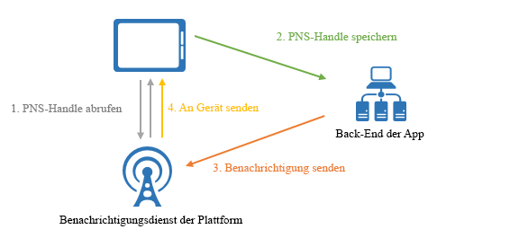

# Was ist Azure Notification Hubs?

Azure Notification Hubs bietet ein benutzerfreundliches, horizontal skalierbares Pushmodul, mit dem Sie von einem beliebigen Back-End (cloudbasiert oder lokal) Benachrichtigungen an sämtliche Plattformen (iOS, Android, Windows, Kindle, Baidu usw.) senden können. Notification Hubs eignet sich sowohl für Unternehmens- als auch Privatkundenszenarien. Es folgen einige Beispielszenarios:

- Senden von Benachrichtigungen zu brandaktuellen Nachrichten an Millionen von Empfängern mit niedriger Latenz
- Senden standortbasierter Gutscheine an interessierte Kundengruppen
- Senden von Ereignisbenachrichtigungen an Benutzer oder Gruppen für Medien-/Sport-/Finanz-/Spieleanwendungen
- Pushübertragung von Werbeinhalten an Anwendungen, um Kunden anzusprechen und zum Kauf anzuregen
- Benachrichtigen von Benutzer zu Unternehmensereignissen wie neue Nachrichten und Arbeitselementen
- Senden von Codes für die mehrstufige Authentifizierung

## Was sind Pushbenachrichtigungen?

Pushbenachrichtigungen sind eine Form der Kommunikation zwischen einer App und Benutzern, bei der Benutzer mobiler Apps zu bestimmten gewünschten Informationen benachrichtigt werden, meist in einem Popupfenster oder Dialogfeld auf einem mobilen Gerät. Benutzer haben im Allgemeinen die Wahl, die Nachricht anzuzeigen oder zu verwerfen. Bei Anzeige wird die mobile Anwendung geöffnet, die die Benachrichtigung kommuniziert hat. Einige Benachrichtigungen sind stumm – sie werden für die Verarbeitung hinter den Kulissen an die App übermittelt, die dann entscheidet, was zu tun ist.

Pushbenachrichtigungen sind bei Privatkunden-Apps zum Steigern der App-Nutzung und bei Unternehmens-Apps zum Verbreiten aktueller Geschäftsinformationen von Bedeutung. Dies ist die beste Lösung für die Kommunikation zwischen App und Benutzer, da sie für Mobilgeräte energieeffizient, für die Absender von Benachrichtigungen flexibel und verfügbar ist, wenn entsprechende Apps nicht aktiv sind.

Weitere Informationen zu Pushbenachrichtigungen für einige gängige Plattformen finden Sie in den folgenden Themen:

- [Android](https://developer.android.com/guide/topics/ui/notifiers/notifications.html)
- [iOS](https://developer.apple.com/notifications/)
- [Windows](https://msdn.microsoft.com/library/windows/apps/hh779725.aspx)

## Funktionsweise von Pushbenachrichtigungen

Pushbenachrichtigungen werden über plattformspezifische Infrastrukturen übermittelt, die *Platform Notification Systems* (PNS, Plattformbenachrichtigungssystem) genannt werden. Sie bieten schlanke Pushfunktionen für die Übermittlung von Nachrichten an ein Gerät mittels eines bereitgestellten Handles und haben keine gemeinsame Schnittstelle. Zum Senden einer Benachrichtigung an alle Benutzer der Android-, iOS- und Windows-Versionen einer App muss der Entwickler separat mit APNS (Apple Push Notification Service), FCM (Firebase Cloud Messaging) und WNS (Windows Notification Service) arbeiten.

Aus allgemeiner Sicht funktionieren Pushbenachrichtigungen wie folgt:

1. Eine Anwendung entscheidet, dass sie Benachrichtigungen empfangen möchte, daher wendet sie sich an das Plattformbenachrichtigungssystem der Zielplattform, auf der die App ausgeführt wird, und fordert ein eindeutiges und temporäres Push-Handle an. Der Handletyp hängt vom System ab (WNS verwendet z.B URIs, während APNS mit Token arbeitet).
2. Die Client-App speichert dieses Handle zur späteren Verwendung im Back-End oder Anbieter.
3. Um eine Pushbenachrichtigung zu senden, nimmt das Back-End der App über den Handle Kontakt mit dem PNS auf, um eine bestimmte Client-App als Ziel zu wählen.
4. Das PNS leitet die Benachrichtigung an das vom Handle angegebene Gerät weiter.

## Die Herausforderungen von Pushbenachrichtigungen

PNS-Systeme sind leistungsstark. Der App-Entwickler hat jedoch immer noch sehr viel Arbeit, selbst wenn er nur allgemeine Pushbenachrichtigungsszenarien wie das Übertragungen von Pushbenachrichtigungen an in Segmente eingeteilte Benutzer implementieren möchte.

Pushbenachrichtigungen erfordern eine komplexe Infrastruktur, die nicht in Bezug zur Hauptgeschäftslogik der Anwendung steht. Es folgen einige der Herausforderungen an die Infrastruktur:

- **Plattformabhängigkeit**
  - Das Back-End erfordert komplexe und schwer zu verwaltende plattformabhängige Logik zum Senden von Benachrichtigungen an Geräte auf verschiedenen Plattformen, da PNS-Systeme nicht vereinheitlicht sind.
- **Skalieren**
  - Gemäß PNS-Richtlinien müssen Gerätetoken bei jedem Start einer App aktualisiert werden. Das Back-End muss sehr viel Datenverkehr und Datenbankzugriffe bewältigen, bloß damit die Token aktuell bleiben. Wenn die Anzahl der Geräte auf Hunderte, Tausende oder Millionen wächst, sind die Kosten der Erstellung und Wartung dieser Infrastruktur beträchtlich.
  - Die meisten PNS-Systeme unterstützten keine Übertragung an mehrere Geräte. Eine einfache Übertragung an eine Million Geräte mündet in einer Million Aufrufe an die PNS-Systeme. Das Skalieren dieses Datenverkehrsvolumens mit minimaler Latenz ist keine einfache Aufgabe.
- **Routing**
  - Obwohl PNS-Systeme eine Möglichkeit zum Senden von Nachrichten an Geräte bieten, richten sich die meisten App-Benachrichtigungen zielgerichtet an Benutzer oder Interessengruppen. Das Back-End muss eine Registrierung verwalten, um Geräte Interessengruppen, Benutzern, Eigenschaften usw. zuzuordnen. Dieser Aufwand kommt noch zur Markteinführungszeit und zu den Wartungskosten einer App hinzu.

## Gründe für die Verwendung von Azure Notification Hubs

Notification Hubs nimmt Ihnen die gesamte Komplexität des eigenständigen Bereitstellens von Pushbenachrichtigungen von Ihrem App-Back-End ab. Die horizontal skalierte Pushbenachrichtigungsinfrastruktur für mehrere Plattformen reduziert den Code für Pushvorgänge und vereinfacht Ihr Back-End. Bei Notification Hubs sind Geräte lediglich zuständig für das Registrieren ihrer PNS-Handles bei einem Hub, während das Back-End Nachrichten an Benutzer oder Interessengruppen sendet (siehe die folgende Abbildung):

Notification Hubs ist Ihre einsatzbereite Push-Engine mit den folgenden Vorteilen:

- **Plattformübergreifend**
  - Unterstützung für alle wichtigen Pushplattformen, einschließlich iOS, Android, Windows, Kindle und Baidu.
  - Eine gemeinsame Schnittstelle für Pushbenachrichtigungen an alle Plattformen in plattformspezifischen oder plattformunabhängigen Formaten ohne plattformspezifische Aufgaben.
  - Zentrale Verwaltung von Gerätehandles.
- **Back-End-übergreifend**
  - Cloud oder lokal
  - .NET, Node.js, Java, usw.
- **Umfangreiche Bereitstellungsmuster**
  - Übertragung an eine oder mehrere Plattformen: Über einen einzigen API-Aufruf können Sie Millionen von Geräten auf verschiedenen Plattformen erreichen.
  - Push an Gerät: Sie können Benachrichtigungen an einzelne Geräte richten.
  - Push an Benutzer: Die Features „Tags“ und „Vorlagen“ helfen Ihnen, alle Geräte eines Benutzers auf verschiedenen Plattformen zu erreichen.
  - Push an Segment mit dynamischen Tags: Das Feature „Tags“ hilft Ihnen, Geräte zu segmentieren und sie per Push gemäß Ihren Anforderungen zu erreichen, ganz gleich, ob Sie an ein Segment oder an einen Ausdruck von Segmenten senden (Beispiel: aktiv UND lebt in Stuttgart NICHT neuer Benutzer). Anstatt auf Veröffentlichung/Abonnements beschränkt zu sein, können Sie Gerätetags jederzeit und überall aktualisieren.
  - Lokalisierte Pushbenachrichtigungen: Das Feature „Vorlagen“ verhilft Ihnen zu einer Lokalisierung, ohne sich auf den Back-End-Code auszuwirken.
  - Automatische Pushbenachrichtigungen: Sie können das Push-Pull-Muster aktivieren, indem Sie automatische Benachrichtigungen an Geräte senden, um auszulösen, dass sie bestimmte Pullvorgänge oder Aktionen ausführen.
  - Geplante Pushbenachrichtigungen: Sie können jederzeit das Senden von Benachrichtigungen planen.
  - Direkte Pushbenachrichtigungen: Sie können das Registrieren von Geräten beim Notification Hubs-Dienst überspringen und direkte Pushbenachrichtigungen im Batch an eine Liste von Gerätehandles auslösen.
  - Personalisierte Pushbenachrichtigungen: Pushvariablen für Geräte helfen Ihnen beim Senden gerätespezifischer, personalisierter Pushbenachrichtigungen mit angepassten Schlüssel-Wert-Paaren.
- **Umfangreiche Telemetrie**
  - Allgemeine Telemetriedaten zu Pushbenachrichtigungen, Geräten, Fehlern und Betrieb stehen im Azure-Portal und programmgesteuert zur Verfügung.
  - Nachrichtenbasierte Telemetrie dient zum Nachverfolgen jedes Pushvorgangs von Ihrem anfänglichen Anforderungsaufruf an den Notification Hubs-Dienst, der die Pushbenachrichtigungen als Batch erfolgreich verarbeitet.
  - Das Feedback zum Plattformbenachrichtigungssystem dient zum Kommunizieren des gesamten Feedbacks zum Plattformbenachrichtigungssystem, um das Debuggen zu erleichtern.
- **Skalierbarkeit**
  - Senden Sie Nachrichten schnell an Millionen von Geräten, ohne die Architektur umzubauen oder ein Sharding von Geräten durchzuführen.
- **Sicherheit**
  - Gemeinsamer geheimer Zugriffsschlüssel (Shared Access Secret, SAS) oder Verbundauthentifizierung.

## Nächste Schritte

Informationen zu den ersten Schritten beim Erstellen und Verwenden eines Benachrichtigungshubs finden Sie unter [Tutorial: Senden von Pushbenachrichtigungen an Android-Geräte mit Azure Notification Hubs und Google Firebase Cloud Messaging](notification-hubs-android-push-notification-google-fcm-get-started.md).

[0]: ./media/notification-hubs-overview/registration-diagram.png
[1]: ./media/notification-hubs-overview/notification-hub-diagram.png

[How customers are using Notification Hubs]: https://azure.microsoft.com/services/notification-hubs
[Notification Hubs tutorials and guides]: https://azure.microsoft.com/documentation/services/notification-hubs
[iOS]: https://azure.microsoft.com/documentation/articles/notification-hubs-ios-get-started
[Android]: https://azure.microsoft.com/documentation/articles/notification-hubs-android-get-started
[Windows Universal]: https://azure.microsoft.com/documentation/articles/notification-hubs-windows-store-dotnet-get-started
[Windows Phone]: https://azure.microsoft.com/documentation/articles/notification-hubs-windows-phone-get-started
[Kindle]: https://azure.microsoft.com/documentation/articles/notification-hubs-kindle-get-started
[Xamarin.iOS]: https://azure.microsoft.com/documentation/articles/partner-xamarin-notification-hubs-ios-get-started
[Xamarin.Android]: https://azure.microsoft.com/documentation/articles/partner-xamarin-notification-hubs-android-get-started
[Microsoft.WindowsAzure.Messaging.NotificationHub]: https://msdn.microsoft.com/library/microsoft.windowsazure.messaging.notificationhub.aspx
[Microsoft.ServiceBus.Notifications]: https://msdn.microsoft.com/library/microsoft.servicebus.notifications.aspx
[App Service Mobile Apps]: https://azure.microsoft.com/documentation/articles/app-service-mobile-value-prop/
[templates]: notification-hubs-templates-cross-platform-push-messages.md
[Azure portal]: https://portal.azure.com
[tags]: (https://msdn.microsoft.com/library/azure/dn530749.aspx)
