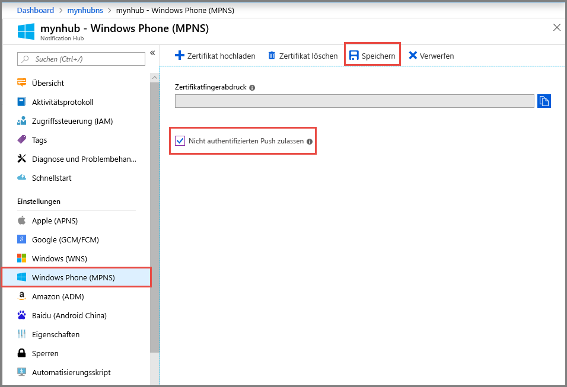

# Tutorial: Erste Schritte mit Azure Notification Hubs für Windows Phone-Apps
[!INCLUDE [notification-hubs-selector-get-started](../../includes/notification-hubs-selector-get-started.md)]

In diesem Tutorial wird gezeigt, wie Sie mit Azure Notification Hubs Pushbenachrichtigungen an eine Windows Phone 8- oder Windows Phone 8.1 Silverlight-Anwendung senden können. Informationen zu Windows Phone 8.1 (nicht Silverlight) finden Sie in der [Windows Universal](notification-hubs-windows-store-dotnet-get-started-wns-push-notification.md)-Version dieses Tutorials.

In diesem Lernprogramm erstellen Sie eine leere Windows Phone 8-App, die Pushbenachrichtigungen mithilfe des Microsoft-Pushbenachrichtigungsdienstes (Microsoft Push Notification Service, MPNS) erhält. Nach Erstellen der App können Sie über Ihren Notification Hub Pushbenachrichtigungen an alle Geräte senden, die Ihre App ausführen.

> [!NOTE]
> Im Windows Phone-SDK von Notification Hubs wird die Verwendung des Windows-Pushbenachrichtigungsdienstes (Windows Push Notification Service, WNS) mit Windows Phone 8.1 Silverlight-Apps nicht unterstützt. Um WNS (anstelle von MPNS) mit Windows Phone 8.1-Silverlight-Apps zu verwenden, führen Sie das Tutorial für [Notification Hubs – Windows Phone Silverlight]aus, in dem REST-APIs verwendet werden.

In diesem Tutorial lernen Sie Folgendes: 

> [!div class="checklist"]
> * Erstellen eines Notification Hubs
> * Erstellen einer Windows Phone-Anwendung
> * Testsendevorgang einer Benachrichtigung 

## Voraussetzungen

- **Azure-Abonnement**. Wenn Sie kein Azure-Abonnement besitzen, können Sie ein [kostenloses Konto](https://azure.microsoft.com/free/) erstellen, bevor Sie beginnen.
- [Visual Studio 2015 Express mit Mobilentwicklungskomponenten](https://www.visualstudio.com/vs/older-downloads/)

Das Abschließen dieses Lernprogramms ist eine Voraussetzung für alle anderen Notification Hubs-Lernprogramme für Windows Phone 8-Apps.

## Erstellen Ihres Notification Hub
[!INCLUDE [notification-hubs-portal-create-new-hub](../../includes/notification-hubs-portal-create-new-hub.md)]

### Konfigurieren von Windows Phone-Einstellungen (MPNS)
1. Wählen Sie **Windows Phone (MPNS)** unter **BENACHRICHTIGUNGSEINSTELLUNGEN** aus.
2. Wählen Sie **Authentifizierungspushbenachrichtigungen aktivieren** aus.
3. Wählen Sie auf der Symbolleiste **Speichern** aus.

    

    Der Hub ist jetzt erstellt und so konfiguriert, dass nicht authentifizierte Benachrichtigungen für Windows Phone gesendet werden.

    > [!NOTE]
    > Dieses Lernprogramm verwendet MPNS im nicht authentifizierten Modus. Im nicht authentifizierten MPNS-Modus liegen Einschränkungen für Benachrichtigungen vor, die Sie an jeden Kanal senden können. Notification Hubs unterstützt den [authentifizierten MPNS-Modus](https://msdn.microsoft.com/library/windowsphone/develop/ff941099.aspx) , wodurch Sie Ihr Zertifikat hochladen können.

## Erstellen einer Windows Phone-Anwendung
In diesem Abschnitt erstellen Sie eine Windows Phone-Anwendung, die sich selbst bei Ihrem Notification Hub registriert. 

1. Erstellen Sie in Visual Studio eine neue Windows Phone 8-Anwendung. 
   
    ![Visual Studio – Neues Projekt – Windows Phone-App][13]
   
    In Visual Studio 2013 Update 2 oder höher erstellen Sie stattdessen eine Windows Phone Silverlight-Anwendung.
   
    ![Visual Studio – Neues Projekt – Leere App – Windows Phone Silverlight][11]
2. Klicken Sie in Visual Studio mit der rechten Maustaste auf die Projektmappe, und klicken Sie dann auf **NuGet-Pakete verwalten**.
3. Suchen Sie nach `WindowsAzure.Messaging.Managed` , klicken Sie auf **Installieren**, und akzeptieren Sie die Nutzungsbedingungen.
   
    ![Visual Studio – NuGet-Paket-Manager][20]
4. Öffnen Sie die Datei "App.xaml.cs", und fügen Sie die folgenden `using` -Anweisungen hinzu:
   
        using Microsoft.Phone.Notification;
        using Microsoft.WindowsAzure.Messaging;
5. Fügen Sie den folgenden Code oben in der Methode **Application_Launching** in „App.xaml.cs“ ein:
   
        private void Application_Launching(object sender, LaunchingEventArgs e)
        {

            var channel = HttpNotificationChannel.Find("MyPushChannel");
            if (channel == null)
            {
                channel = new HttpNotificationChannel("MyPushChannel");
                channel.Open();
                channel.BindToShellToast();
            }
       
            channel.ChannelUriUpdated += new EventHandler<NotificationChannelUriEventArgs>(async (o, args) =>
            {
                var hub = new NotificationHub("<hub name>", "<connection string>");
                var result = await hub.RegisterNativeAsync(args.ChannelUri.ToString());
       
                System.Windows.Deployment.Current.Dispatcher.BeginInvoke(() =>
                {
                    MessageBox.Show("Registration :" + result.RegistrationId, "Registered", MessageBoxButton.OK);
                });
            });
        }
   
   > [!NOTE]
   > Der Wert **MyPushChannel** ist ein Index, der verwendet wird, um nach einem vorhandenen Kanal in der Sammlung [HttpNotificationChannel](https://msdn.microsoft.com/library/windows/apps/microsoft.phone.notification.httpnotificationchannel.aspx) zu suchen. Wenn kein Kanal vorhanden ist, erstellen Sie einen neuen Eintrag mit diesem Namen.
   > 
   > 
   
    Fügen Sie den Namen des Hubs und die Verbindungszeichenfolge **DefaultListenSharedAccessSignature** ein, die Sie im vorigen Abschnitt erhalten haben.
    Dieser Code ruft den Kanal-URI für die App von MPNS ab und registriert dann diesen Kanal-URI bei Ihrem Benachrichtigungshub. Er sorgt außerdem dafür, dass der Kanal-URI in Ihrem Benachrichtigungshub registriert ist, sobald die Anwendung gestartet wird.
   
   > [!NOTE]
   > Dieses Lernprogramm sendet eine Popupbenachrichtigung an das Gerät. Wenn Sie eine Kachelbenachrichtigung senden, müssen Sie stattdessen die **BindToShellTile** -Methode für den Kanal aufrufen. Um Popup- und Kachelbenachrichtigungen zu unterstützen, rufen Sie beide Methoden, **BindToShellTile** und **BindToShellToast**, auf.
   > 
   > 
6. Erweitern Sie im Projektmappen-Explorer **Eigenschaften**, öffnen Sie die Datei `WMAppManifest.xml`, klicken Sie auf die Registerkarte **Funktionen**, und aktivieren Sie die Funktion **ID_CAP_PUSH_NOTIFICATION**. Ihre App kann jetzt Pushbenachrichtigungen empfangen. 
   
    ![Visual Studio – Windows Phone-App-Funktionen][14]    
7. Drücken Sie `F5` , um die App auszuführen.
   
    In der App wird eine Registrierungsmeldung angezeigt.
8. Schließen Sie die App, oder wechseln Sie zur Startseite. 
   
   > [!NOTE]
   > Zum Empfangen einer Popup-Pushbenachrichtigung muss die Anwendung nicht im Vordergrund ausgeführt werden.

## Testsendevorgang einer Benachrichtigung 

1. Wechseln Sie im Azure-Portal zur Registerkarte „Übersicht“.
2. Wählen Sie **Testsendevorgang** aus.

    
3. Führen Sie im Fenster **Testsendevorgang** die folgenden Schritte aus:

    1. Wählen Sie für **Plattformen** die Option **Windows Phone** aus. 
    2. Wählen Sie für **Benachrichtigungstyp** die Option **Popup** aus. 
    3. Wählen Sie **Senden** aus.
    4. Sie sehen das **Ergebnis** in der Liste am unteren Rand des Fensters. 

            
4. Vergewissern Sie sich im Windows Phone-Emulator oder auf dem Windows-Telefon, dass die Benachrichtigung angezeigt wird. 

    

## Nächste Schritte
In diesem einfachen Beispiel haben Sie Pushbenachrichtigungen an all Ihre Windows Phone 8-Geräte übertragen. Fahren Sie mit dem folgenden Tutorial fort, um zu erfahren, wie Sie Pushbenachrichtigungen an bestimmte Geräte senden:

> [!div class="nextstepaction"]
>[Senden von Pushbenachrichtigungen an bestimmte Geräte](notification-hubs-windows-phone-push-xplat-segmented-mpns-notification.md)

<!-- Images. -->
[6]: ./media/notification-hubs-windows-phone-get-started/notification-hub-create-console-app.png
[7]: ./media/notification-hubs-windows-phone-get-started/notification-hub-create-from-portal.png
[8]: ./media/notification-hubs-windows-phone-get-started/notification-hub-create-from-portal2.png
[9]: ./media/notification-hubs-windows-phone-get-started/notification-hub-select-from-portal.png
[10]: ./media/notification-hubs-windows-phone-get-started/notification-hub-select-from-portal2.png
[11]: ./media/notification-hubs-windows-phone-get-started/notification-hub-create-wp-silverlight-app.png
[12]: ./media/notification-hubs-windows-phone-get-started/notification-hub-connection-strings.png

[13]: ./media/notification-hubs-windows-phone-get-started/notification-hub-create-wp-app.png
[14]: ./media/notification-hubs-windows-phone-get-started/mobile-app-enable-push-wp8.png
[15]: ./media/notification-hubs-windows-phone-get-started/notification-hub-pushauth.png
[20]: ./media/notification-hubs-windows-phone-get-started/notification-hub-windows-universal-app-install-package.png
[213]: ./media/notification-hubs-windows-phone-get-started/notification-hub-create-console-app.png

<!-- URLs. -->
[Notification Hubs Guidance]: http://msdn.microsoft.com/library/jj927170.aspx
[MPNS authenticated mode]: http://msdn.microsoft.com/library/windowsphone/develop/ff941099(v=vs.105).aspx
[Use Notification Hubs to push notifications to users]: notification-hubs-aspnet-backend-windows-dotnet-wns-notification.md
[Use Notification Hubs to send breaking news]: notification-hubs-windows-phone-push-xplat-segmented-mpns-notification.md
[toast catalog]: http://msdn.microsoft.com/library/windowsphone/develop/jj662938(v=vs.105).aspx
[tile catalog]: http://msdn.microsoft.com/library/windowsphone/develop/hh202948(v=vs.105).aspx
[Notification Hubs – Windows Phone Silverlight]: https://github.com/Azure/azure-notificationhubs-samples/tree/master/PushToSLPhoneApp

