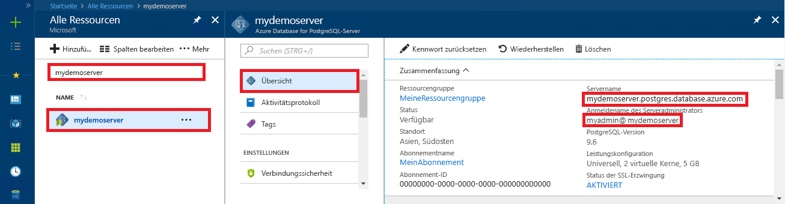

# <a name="azure-database-for-postgresql---single-server-use-net-c-to-connect-and-query-data"></a>Azure Database for PostgreSQL-Einzelserver: Verwenden von .NET (C#) zum Herstellen einer Verbindung und Abfragen von Daten
Dieser Schnellstart zeigt, wie Sie mit einer C#-Anwendung eine Verbindung mit einer Azure-Datenbank für PostgreSQL herstellen. Es wird veranschaulicht, wie Sie SQL-Anweisungen zum Abfragen, Einfügen, Aktualisieren und Löschen von Daten in der Datenbank verwenden. Bei den Schritten in diesem Artikel wird davon ausgegangen, dass Sie mit der C#-Entwicklung vertraut sind und noch keine Erfahrung mit Azure-Datenbank für PostgreSQL haben.

## <a name="prerequisites"></a>Voraussetzungen
In diesem Schnellstart werden die Ressourcen, die in den folgenden Anleitungen erstellt wurden, als Startpunkt verwendet:
- [Erstellen einer Datenbank – Portal](quickstart-create-server-database-portal.md)
- [Erstellen einer Datenbank – CLI](quickstart-create-server-database-azure-cli.md)

Außerdem benötigen Sie Folgendes:
- Installieren Sie das [.NET Framework](https://www.microsoft.com/net/download). Führen Sie die Schritte aus dem verlinkten Artikel durch, um .NET für Ihre Plattform (Windows, Ubuntu Linux oder macOS) zu installieren. 
- Installieren Sie [Visual Studio](https://www.visualstudio.com/downloads/) oder Visual Studio Code für die Eingabe und Bearbeitung von Code.
- Fügen Sie einen Verweis auf das NuGet-Paket [Npgsql](https://www.nuget.org/packages/Npgsql/) hinzu.

## <a name="get-connection-information"></a>Abrufen von Verbindungsinformationen
Rufen Sie die Verbindungsinformationen ab, die zum Herstellen einer Verbindung mit der Azure-Datenbank für PostgreSQL erforderlich sind. Sie benötigen den vollqualifizierten Servernamen und die Anmeldeinformationen.

1. Melden Sie sich beim [Azure-Portal](https://portal.azure.com/)an.
2. Klicken Sie im Azure-Portal im linken Menü auf **Alle Ressourcen**, und suchen Sie dann nach dem soeben erstellten Server, z.B. **mydemoserver**.
3. Klicken Sie auf den Servernamen.
4. Notieren Sie sich im Bereich **Übersicht** des Servers den **Servernamen** und den **Anmeldenamen des Serveradministrators**. Wenn Sie Ihr Kennwort vergessen haben, können Sie es in diesem Bereich auch zurücksetzen.
 

## <a name="connect-create-table-and-insert-data"></a>Herstellen der Verbindung, Erstellen der Tabelle und Einfügen von Daten
Verwenden Sie den folgenden Code, um eine Verbindung herzustellen und die Daten zu laden, indem Sie die SQL-Anweisungen **CREATE TABLE** und **INSERT INTO** verwenden. Im Code wird die NpgsqlCommand-Klasse mit der [Open()](https://www.npgsql.org/doc/api/Npgsql.NpgsqlConnection.html#Npgsql_NpgsqlConnection_Open)-Methode verwendet, um eine Verbindung mit der PostgreSQL-Datenbank einzurichten. Anschließend wird im Code die [CreateCommand()](https://www.npgsql.org/doc/api/Npgsql.NpgsqlConnection.html#Npgsql_NpgsqlConnection_CreateCommand)-Methode verwendet, die CommandText-Eigenschaft festgelegt und die [ExecuteNonQuery()](https://www.npgsql.org/doc/api/Npgsql.NpgsqlCommand.html#Npgsql_NpgsqlCommand_ExecuteNonQuery)-Methode aufgerufen, um die Datenbankbefehle auszuführen. 

Ersetzen Sie die Parameter „Host“, „DBName“, „User“ und „Password“ durch die Werte, die Sie beim Erstellen des Servers und der Datenbank angegeben haben. 

```csharp
using System;
using Npgsql;

namespace Driver
{
    public class AzurePostgresCreate
    {
        // Obtain connection string information from the portal
        //
        private static string Host = "mydemoserver.postgres.database.azure.com";
        private static string User = "mylogin@mydemoserver";
        private static string DBname = "mypgsqldb";
        private static string Password = "<server_admin_password>";
        private static string Port = "5432";

        static void Main(string[] args)
        {
            // Build connection string using parameters from portal
            //
            string connString =
                String.Format(
                    "Server={0};Username={1};Database={2};Port={3};Password={4};SSLMode=Prefer",
                    Host,
                    User,
                    DBname,
                    Port,
                    Password);


            using (var conn = new NpgsqlConnection(connString))

            {
                Console.Out.WriteLine("Opening connection");
                conn.Open();

                using (var command = new NpgsqlCommand("DROP TABLE IF EXISTS inventory", conn))
                { 
                    command.ExecuteNonQuery();
                    Console.Out.WriteLine("Finished dropping table (if existed)");

                }

                using (var command = new NpgsqlCommand("CREATE TABLE inventory(id serial PRIMARY KEY, name VARCHAR(50), quantity INTEGER)", conn))
                {
                    command.ExecuteNonQuery();
                    Console.Out.WriteLine("Finished creating table");
                }

                using (var command = new NpgsqlCommand("INSERT INTO inventory (name, quantity) VALUES (@n1, @q1), (@n2, @q2), (@n3, @q3)", conn))
                {
                    command.Parameters.AddWithValue("n1", "banana");
                    command.Parameters.AddWithValue("q1", 150);
                    command.Parameters.AddWithValue("n2", "orange");
                    command.Parameters.AddWithValue("q2", 154);
                    command.Parameters.AddWithValue("n3", "apple");
                    command.Parameters.AddWithValue("q3", 100);
                    
                    int nRows = command.ExecuteNonQuery();
                    Console.Out.WriteLine(String.Format("Number of rows inserted={0}", nRows));
                }
            }

            Console.WriteLine("Press RETURN to exit");
            Console.ReadLine();
        }
    }
}
```

## <a name="read-data"></a>Lesen von Daten
Verwenden Sie den folgenden Code, um die Daten mit einer **SELECT**-SQL-Anweisung zu verbinden und zu lesen. Im Code wird die NpgsqlCommand-Klasse mit der [Open()](https://www.npgsql.org/doc/api/Npgsql.NpgsqlConnection.html#Npgsql_NpgsqlConnection_Open)-Methode verwendet, um eine Verbindung mit PostgreSQL einzurichten. Anschließend werden im Code die Methoden [CreateCommand()](https://www.npgsql.org/doc/api/Npgsql.NpgsqlConnection.html#Npgsql_NpgsqlConnection_CreateCommand) und [ExecuteReader()](https://www.npgsql.org/doc/api/Npgsql.NpgsqlCommand.html#Npgsql_NpgsqlCommand_ExecuteReader) verwendet, um die Datenbankbefehle auszuführen. Als Nächstes wird im Code [Read()](https://www.npgsql.org/doc/api/Npgsql.NpgsqlDataReader.html#Npgsql_NpgsqlDataReader_Read) verwendet, um auf den Datensatz in den Ergebnissen zuzugreifen. Abschließend werden mithilfe von [GetInt32()](https://www.npgsql.org/doc/api/Npgsql.NpgsqlDataReader.html#Npgsql_NpgsqlDataReader_GetInt32_System_Int32_) und [GetString()](https://www.npgsql.org/doc/api/Npgsql.NpgsqlDataReader.html#Npgsql_NpgsqlDataReader_GetString_System_Int32_) im Code dann die Werte im Datensatz analysiert.

Ersetzen Sie die Parameter „Host“, „DBName“, „User“ und „Password“ durch die Werte, die Sie beim Erstellen des Servers und der Datenbank angegeben haben. 

```csharp
using System;
using Npgsql;

namespace Driver
{
    public class AzurePostgresRead
    {
        // Obtain connection string information from the portal
        //
        private static string Host = "mydemoserver.postgres.database.azure.com";
        private static string User = "mylogin@mydemoserver";
        private static string DBname = "mypgsqldb";
        private static string Password = "<server_admin_password>";
        private static string Port = "5432";

        static void Main(string[] args)
        {
            // Build connection string using parameters from portal
            //
            string connString =
                String.Format(
                    "Server={0}; User Id={1}; Database={2}; Port={3}; Password={4};SSLMode=Prefer",
                    Host,
                    User,
                    DBname,
                    Port,
                    Password);

            using (var conn = new NpgsqlConnection(connString))
            {

                Console.Out.WriteLine("Opening connection");
                conn.Open();


                using (var command = new NpgsqlCommand("SELECT * FROM inventory", conn))
                {

                    var reader = command.ExecuteReader();
                    while (reader.Read())
                    {
                        Console.WriteLine(
                            string.Format(
                                "Reading from table=({0}, {1}, {2})",
                                reader.GetInt32(0).ToString(),
                                reader.GetString(1),
                                reader.GetInt32(2).ToString()
                                )
                            );
                    }
                }
            }

            Console.WriteLine("Press RETURN to exit");
            Console.ReadLine();
        }
    }
}
```


## <a name="update-data"></a>Aktualisieren von Daten
Verwenden Sie den folgenden Code, um eine Verbindung herzustellen und die Daten mit der SQL-Anweisung **UPDATE** zu aktualisieren. Im Code wird die NpgsqlCommand-Klasse mit der [Open()](https://www.npgsql.org/doc/api/Npgsql.NpgsqlConnection.html#Npgsql_NpgsqlConnection_Open)-Methode verwendet, um eine Verbindung mit PostgreSQL einzurichten. Anschließend wird im Code die [CreateCommand()](https://www.npgsql.org/doc/api/Npgsql.NpgsqlConnection.html#Npgsql_NpgsqlConnection_CreateCommand)-Methode verwendet, die CommandText-Eigenschaft festgelegt und die [ExecuteNonQuery()](https://www.npgsql.org/doc/api/Npgsql.NpgsqlCommand.html#Npgsql_NpgsqlCommand_ExecuteNonQuery)-Methode aufgerufen, um die Datenbankbefehle auszuführen.

Ersetzen Sie die Parameter „Host“, „DBName“, „User“ und „Password“ durch die Werte, die Sie beim Erstellen des Servers und der Datenbank angegeben haben. 

```csharp
using System;
using Npgsql;

namespace Driver
{
    public class AzurePostgresUpdate
    {
        // Obtain connection string information from the portal
        //
        private static string Host = "mydemoserver.postgres.database.azure.com";
        private static string User = "mylogin@mydemoserver";
        private static string DBname = "mypgsqldb";
        private static string Password = "<server_admin_password>";
        private static string Port = "5432";

        static void Main(string[] args)
        {
            // Build connection string using parameters from portal
            //
            string connString =
                String.Format(
                    "Server={0}; User Id={1}; Database={2}; Port={3}; Password={4};SSLMode=Prefer",
                    Host,
                    User,
                    DBname,
                    Port,
                    Password);

            using (var conn = new NpgsqlConnection(connString))
            {

                Console.Out.WriteLine("Opening connection");
                conn.Open();

                using (var command = new NpgsqlCommand("UPDATE inventory SET quantity = @q WHERE name = @n", conn))
                {
                    command.Parameters.AddWithValue("n", "banana");
                    command.Parameters.AddWithValue("q", 200);
                    
                    int nRows = command.ExecuteNonQuery();
                    Console.Out.WriteLine(String.Format("Number of rows updated={0}", nRows));
                }
            }

            Console.WriteLine("Press RETURN to exit");
            Console.ReadLine();
        }
    }
}


```


## <a name="delete-data"></a>Löschen von Daten
Verwenden Sie den folgenden Code, um die Daten mit einer **DELETE**-SQL-Anweisung zu verbinden und zu löschen. 

Im Code wird die NpgsqlCommand-Klasse mit der [Open()](https://www.npgsql.org/doc/api/Npgsql.NpgsqlConnection.html#Npgsql_NpgsqlConnection_Open)-Methode verwendet, um eine Verbindung mit der PostgreSQL-Datenbank einzurichten. Anschließend wird im Code die [CreateCommand()](https://www.npgsql.org/doc/api/Npgsql.NpgsqlConnection.html#Npgsql_NpgsqlConnection_CreateCommand)-Methode verwendet, die CommandText-Eigenschaft festgelegt und die [ExecuteNonQuery()](https://www.npgsql.org/doc/api/Npgsql.NpgsqlCommand.html#Npgsql_NpgsqlCommand_ExecuteNonQuery)-Methode aufgerufen, um die Datenbankbefehle auszuführen.

Ersetzen Sie die Parameter „Host“, „DBName“, „User“ und „Password“ durch die Werte, die Sie beim Erstellen des Servers und der Datenbank angegeben haben. 

```csharp
using System;
using Npgsql;

namespace Driver
{
    public class AzurePostgresDelete
    {
        // Obtain connection string information from the portal
        //
        private static string Host = "mydemoserver.postgres.database.azure.com";
        private static string User = "mylogin@mydemoserver";
        private static string DBname = "mypgsqldb";
        private static string Password = "<server_admin_password>";
        private static string Port = "5432";

        static void Main(string[] args)
        {
            // Build connection string using parameters from portal
            //
            string connString =
                String.Format(
                    "Server={0}; User Id={1}; Database={2}; Port={3}; Password={4};SSLMode=Prefer",
                    Host,
                    User,
                    DBname,
                    Port,
                    Password);

            using (var conn = new NpgsqlConnection(connString))
            {
                Console.Out.WriteLine("Opening connection");
                conn.Open();

                using (var command = new NpgsqlCommand("DELETE FROM inventory WHERE name = @n", conn))
                {
                    command.Parameters.AddWithValue("n", "orange");

                    int nRows = command.ExecuteNonQuery();
                    Console.Out.WriteLine(String.Format("Number of rows deleted={0}", nRows));
                }
            }

            Console.WriteLine("Press RETURN to exit");
            Console.ReadLine();
        }
    }
}

```

## <a name="next-steps"></a>Nächste Schritte
> [!div class="nextstepaction"]
> [Migrieren der Datenbank mit Export und Import](./howto-migrate-using-export-and-import.md)
