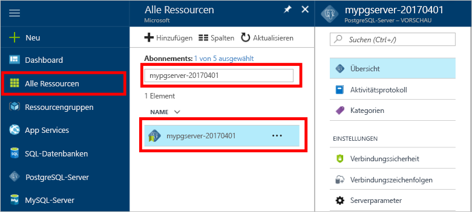

# Sichern und Wiederherstellen eines Servers in Azure Database for PostgreSQL mit dem Azure-Portal

## Automatische Sicherung
Bei der Verwendung von Azure Database for PostgreSQL erstellt der Datenbankdienst automatisch alle fünf Minuten eine Sicherung des Servers. 

Die Sicherungen sind im Basic-Tarif sieben Tage und im Standard-Tarif 35 Tage lang verfügbar. Weitere Informationen finden Sie im Artikel zu den [Dienstebenen für Azure-Datenbank für PostgreSQL](concepts-service-tiers.md).

Mithilfe dieses automatischen Sicherungsfeatures können Sie einen früheren Zustand des Servers und aller seiner Datenbanken wiederherstellen.

## Wiederherstellen im Azure-Portal
Mit Azure-Datenbank für PostgreSQL können Sie den Zustand des Servers zu einem bestimmten Zeitpunkt und auf einer neuen Kopie des Servers wiederherstellen. Sie können diesen neuen Server zur Wiederherstellung Ihrer Daten verwenden. 

Beispiel: Wenn eine Tabelle heute um 12 Uhr versehentlich gelöscht wurde, können Sie den Zustand von kurz vor 12 Uhr wiederherstellen und die fehlende Tabelle und die Daten von dieser neuen Kopie des Servers abrufen.

Mithilfe der folgenden Schritte wird der Status des Beispielservers zu einem bestimmten Zeitpunkt wiederhergestellt:
1. Melden Sie sich beim [Azure-Portal](https://portal.azure.com/) an.
2. Suchen Sie den Server für Azure-Datenbank für PostgreSQL. Klicken Sie im Azure-Portal im linken Menü auf **All Resources** (Alle Ressourcen), und geben Sie den Namen des Servers ein (z.B. **mypgserver-20170401**), um nach dem vorhandenen Server zu suchen. Klicken Sie auf den im Suchergebnis aufgelisteten Servernamen. Die Seite **Übersicht** für Ihren Server wird geöffnet und enthält Optionen für die weitere Konfiguration.

   

3. Klicken Sie auf der Symbolleiste des Serverübersichtsblatts auf **Wiederherstellen**. Das Blatt „Wiederherstellen“ wird geöffnet.

   

4. Geben Sie im Formular „Wiederherstellen“ die erforderlichen Informationen ein:

   
  - **Wiederherstellungspunkt**: Wählen Sie einen Zeitpunkt vor der Änderung des Servers aus.
  - **Zielserver**: Geben Sie einen neuen Servernamen für die Wiederherstellung ein.
  - **Standort**: Sie können die Region nicht auswählen. Standardmäßig ist dieser Wert mit dem Wert für den Quellserver identisch.
  - **Tarif**: Sie können diesen Wert beim Wiederherstellen eines Servers nicht ändern. Er ist mit dem Wert für den Quellserver identisch. 

5. Klicken Sie auf **OK**, um den Zustand eines Servers zu einem bestimmten Zeitpunkt wiederherzustellen. 

6. Suchen Sie nach Abschluss der Wiederherstellung den neuen erstellten Server, um zu überprüfen, ob die Daten wie erwartet wiederhergestellt wurden.

## Nächste Schritte
- [Datenverbindungsbibliotheken für die Azure-Datenbank für PostgreSQL](concepts-connection-libraries.md)
