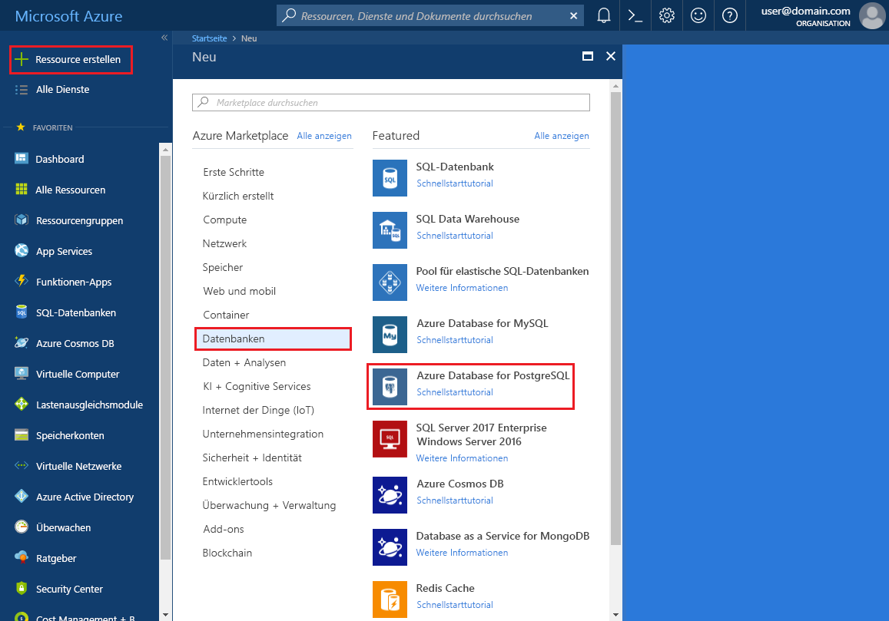
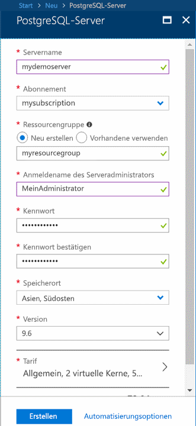
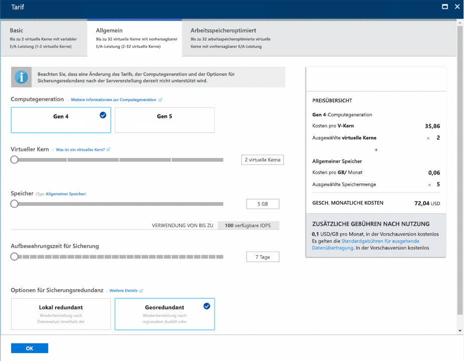
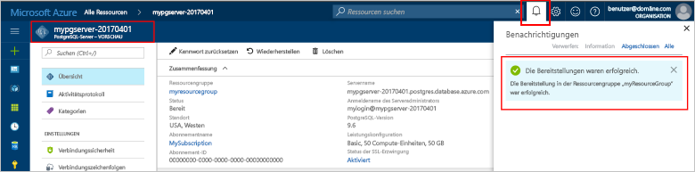
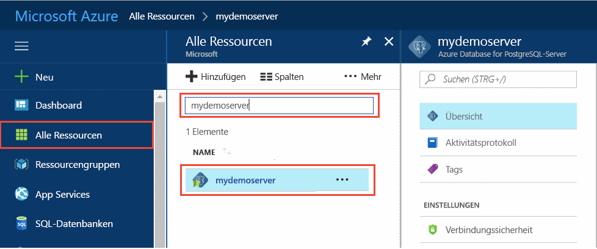
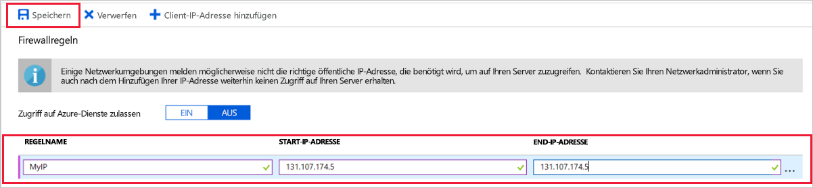
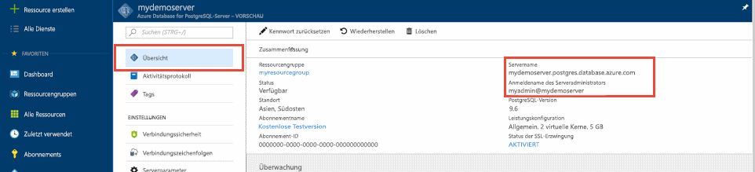
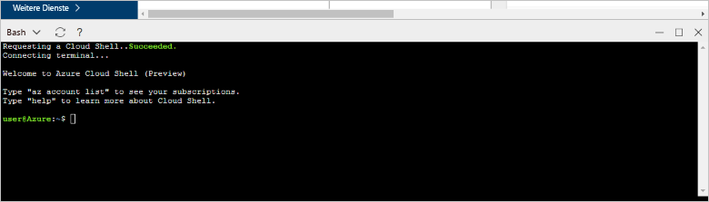
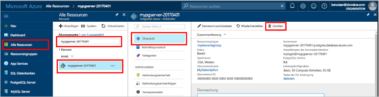

# <a name="quickstart-create-an-azure-database-for-postgresql-server-in-the-azure-portal"></a>Schnellstartanleitung: Erstellen eines Azure Database for PostgreSQL-Servers im Azure-Portal

Azure-Datenbank für PostgreSQL ist ein verwalteter Dienst, mit dem Sie hochverfügbare PostgreSQL-Datenbanken in der Cloud ausführen, verwalten und skalieren können. In dieser Schnellstartanleitung erfahren Sie, wie Sie über das Azure-Portal in etwa fünf Minuten einen Azure Database for PostgreSQL-Server erstellen.

Wenn Sie über kein Azure-Abonnement verfügen, können Sie ein [kostenloses Azure-Konto](https://azure.microsoft.com/free/) erstellen, bevor Sie beginnen.

## <a name="sign-in-to-the-azure-portal"></a>Melden Sie sich auf dem Azure-Portal an.
Browsen Sie zum [Portal](https://portal.azure.com/). Geben Sie Ihre Anmeldeinformationen ein, um sich beim Portal anzumelden. Die Standardansicht ist Ihr Dienstdashboard.

## <a name="create-an-azure-database-for-postgresql-server"></a>Erstellen einer Azure-Datenbank für PostgreSQL-Server

Ein Azure Database for PostgreSQL-Server wird mit einer konfigurierten Gruppe von [Compute- und Speicherressourcen](./concepts-pricing-tiers.md) erstellt. Der Server wird in einer [Azure-Ressourcengruppe](../azure-resource-manager/resource-group-overview.md) erstellt.

Führen Sie die folgenden Schritte aus, um einen Azure-Datenbank für PostgreSQL-Server zu erstellen:
1. Klicken Sie in der linken oberen Ecke des Portals auf die Schaltfläche **Ressource erstellen** (+).

2. Wählen Sie **Datenbanken** > **Azure-Datenbank für PostgreSQL** aus.

    

3. Geben Sie im Formular für den neuen Server folgende Informationen an:

    

    Einstellung|Empfohlener Wert|BESCHREIBUNG
    ---|---|---
    Servername |*mydemoserver*|Ein eindeutiger Name, der Ihren Azure-Datenbank für PostgreSQL-Server identifiziert. Der Domänenname *postgres.database.azure.com* wird an den angegebenen Servernamen angefügt. Der Servername darf nur Kleinbuchstaben, Zahlen und den Bindestrich (-) enthalten. Er muss 3 bis 63 Zeichen umfassen.
    Abonnement|Ihr Abonnementname|Das Azure-Abonnement, das Sie für Ihren Server verwenden möchten. Falls Sie über mehrere Abonnements verfügen, wählen Sie das Abonnement aus, über das die Ressource abgerechnet wird.
    Ressourcengruppe|*myresourcegroup*| Ein neuer Ressourcengruppenname oder ein bereits vorhandener Name aus Ihrem Abonnement
    Quelle auswählen | *Leer* | Wählen Sie *Leer* aus, um einen neuen Server ohne Vorlage zu erstellen. (Die Option *Sicherung* können Sie auswählen, wenn Sie einen Server auf der Grundlage einer Geosicherung eines vorhandenen Azure Database for PostgreSQL-Servers erstellen.)
    Serveradministratoranmeldung |*myadmin*| Ihr eigenes Anmeldekonto für die Verbindungsherstellung mit dem Server. Der Administratoranmeldename darf nicht **azure_superuser**, **azure_pg_admin**, **admin**, **administrator**, **root**, **guest**, oder **public** lauten. Er kann nicht mit **pg_** beginnen.
    Password |Ihr Kennwort| Ein neues Kennwort für das Serveradministratorkonto. Es muss zwischen acht und 128 Zeichen lang sein. Das Kennwort muss Zeichen aus drei der folgenden Kategorien enthalten: englische Großbuchstaben, englische Kleinbuchstaben, Zahlen (0–9) und nicht alphanumerische Zeichen (!, $, #, % usw.).
    Standort|Die Region, die Ihren Benutzern am nächsten liegt| Der Standort, der Ihren Benutzern am nächsten ist.
    Version|Die neueste Version| Die neueste PostgreSQL-Version (es sei denn, Sie haben besondere Anforderungen).
    Tarif | **Universell**, **Gen 4**, **2 virtuelle Kerne**, **5 GB**, **7 Tage**, **Georedundant** | Die Compute-, Speicher- und Sicherungskonfigurationen für Ihren neuen Server. Wählen Sie **Tarif**aus. Klicken Sie als Nächstes auf die Registerkarte **Universell**. *Gen 4*, *2 virtuelle Kerne*, *5 GB* und *7 Tage* sind die Standardwerte für **Computegeneration**, **Virtueller Kern**, **Speicher** und **Aufbewahrungszeit für Sicherung**. Sie können diese Schieberegler unverändert lassen. Wählen Sie zum Aktivieren der Serversicherungen in georedundantem Speicher unter **Optionen für Sicherungsredundanz** die Option **Georedundant** aus. Klicken Sie auf **OK**, um die Tarifauswahl zu speichern. Der nächste Screenshot zeigt die gewählten Optionen.

    > [!IMPORTANT]
    > Der hier angegebene Benutzername und das Kennwort für den Serveradministrator sind erforderlich, um später in diesem Schnellstart die Anmeldung auf dem Server und in den zugehörigen Datenbanken durchzuführen. Behalten Sie diese Angaben im Kopf, oder notieren Sie sie zur späteren Verwendung.

    

4. Wählen Sie **Erstellen** aus, um den Server bereitzustellen. Dieser Vorgang kann einige Minuten dauern.

5. Klicken Sie auf der Symbolleiste auf das Symbol **Benachrichtigungen** (eine Glocke), um den Bereitstellungsprozess zu überwachen. Nach Abschluss der Bereitstellung können Sie auf **An Dashboard anheften** klicken, um auf Ihrem Azure-Portal-Dashboard eine Kachel für diesen Server zu erstellen, über die Sie direkt zur **Übersicht** des Servers gelangen. Wenn Sie auf **Zu Ressource wechseln** klicken, wird die **Übersicht** des Servers geöffnet.

    
   
   Standardmäßig werden **postgres**-Datenbanken unter dem Server erstellt. Die [postgres](https://www.postgresql.org/docs/9.6/static/app-initdb.html)-Datenbank ist eine Standarddatenbank für die Verwendung durch Benutzer, Hilfsprogramme und Drittanbieteranwendungen. (Die andere Standarddatenbank ist **azure_maintenance**. Ihre Funktion besteht darin, die Prozesse verwalteter Dienste von Benutzeraktionen zu trennen. Sie können auf diese Datenbank nicht zugreifen.

## <a name="configure-a-server-level-firewall-rule"></a>Konfigurieren einer Firewallregel auf Serverebene

Azure-Datenbank für PostgreSQL erstellt eine Firewall auf Serverebene. Sie verhindert, dass externe Anwendungen und Tools eine Verbindung mit dem Server oder Datenbanken auf dem Server herstellen – es sei denn, Sie erstellen eine Regel, um die Firewall für bestimmte IP-Adressen zu öffnen. 

1. Navigieren Sie nach Abschluss der Bereitstellung zu Ihrem Server. Bei Bedarf können Sie danach suchen. Wählen Sie beispielsweise im Menü auf der linken Seite die Option **Alle Ressourcen** aus. Geben Sie den Servernamen (beispielsweise **mydemoserver**) ein, um nach dem neu erstellten Server zu suchen. Wählen Sie den Servernamen in der Liste mit den Suchergebnissen aus. Die Seite **Übersicht** für Ihren Server wird geöffnet und enthält Optionen für die weitere Konfiguration.
 
    

2. Wählen Sie auf der Serverseite die Option **Verbindungssicherheit** aus.

3. Klicken Sie unter **Firewallregeln** in der Spalte **Regelname** auf das leere Textfeld, um mit der Erstellung der Firewallregel zu beginnen. 

    In dieser Schnellstartanleitung lassen Sie auf dem Server alle IP-Adressen zu. Füllen Sie das Textfeld in jeder Spalte mit den folgenden Werten aus:

    Regelname | Start-IP | End-IP 
    ---|---|---
    AllowAllIps | 0.0.0.0 | 255.255.255.255

     
     
      > [!NOTE]
      > Bei Produktionsinstanzen sollten Sie die Firewallregeln so festlegen, dass sie ausschließlich eingehende Anforderungen von bekannten IP-Adressen akzeptieren.  Diese Einstellungen dienen nur als Beispiel.
      >

4. Wählen Sie auf der oberen Symbolleiste der Seite **Verbindungssicherheit** die Option **Speichern** aus. Warten Sie, bis die Benachrichtigung mit dem Hinweis angezeigt wird, dass das Update der Verbindungssicherheit erfolgreich abgeschlossen wurde, bevor Sie fortfahren.

    > [!NOTE]
    > Die Kommunikation für Verbindungen mit Azure-Datenbank für PostgreSQL erfolgt über Port 5432. Wenn Sie versuchen, eine Verbindung von einem Unternehmensnetzwerk aus herzustellen, wird der ausgehende Datenverkehr über Port 5432 von der Firewall Ihres Netzwerks unter Umständen nicht zugelassen. In diesem Fall können Sie nur dann eine Verbindung mit Ihrem Server herstellen, wenn Ihre IT-Abteilung Port 5432 öffnet.
    >

## <a name="get-the-connection-information"></a>Abrufen der Verbindungsinformationen

Wenn wir unseren Azure-Datenbank für PostgreSQL-Server erstellt haben, wird eine Standarddatenbank namens **postgres** erstellt. Für die Verbindungsherstellung mit Ihrem Datenbankserver benötigen Sie den vollständigen Servernamen und die Administratoranmeldeinformationen. Diese Werte haben Sie möglicherweise zuvor im Rahmen des Schnellstartartikels notiert. Andernfalls finden Sie den Servernamen und die Anmeldeinformationen im Portal auf der Seite **Übersicht** für Ihren Server.

Öffnen Sie die Seite **Übersicht** für Ihren Server. Notieren Sie sich den **Servernamen** und den **Anmeldenamen des Serveradministrators**. Zeigen Sie mit dem Cursor auf das jeweilige Feld. Daraufhin wird rechts neben dem Text ein Kopiersymbol angezeigt. Wählen Sie das Kopiersymbol aus, um die Werte zu kopieren.

 

## <a name="connect-to-the-postgresql-database-by-using-psql-in-cloud-shell"></a>Herstellen einer Verbindung mit der PostgreSQL-Datenbank mithilfe von psql in Cloud Shell

Es gibt verschiedene Anwendungen, mit denen Sie eine Verbindung mit Ihrem Azure-Datenbank für PostgreSQL-Server herstellen können. Als Erstes verwenden wir das psql-Befehlszeilenprogramm, um das Herstellen einer Verbindung mit dem Server zu veranschaulichen. Sie können wie hier beschrieben einen Webbrowser und Azure Cloud Shell verwenden, ohne zusätzliche Software zu installieren. Wenn das psql-Hilfsprogramm lokal auf Ihrem eigenen Computer installiert ist, können Sie auch von dort eine Verbindung herstellen.

1. Wählen Sie oben im Navigationsbereich das Terminalsymbol aus, um Cloud Shell zu öffnen.

   

2. Cloud Shell wird in Ihrem Browser geöffnet und ermöglicht die Eingabe von Bash-Shellbefehlen.

   

3. Stellen Sie an der Cloud Shell-Eingabeaufforderung eine Verbindung mit einer Datenbank auf Ihrem Azure-Datenbank für PostgreSQL-Server her, indem Sie die psql-Befehlszeile eingeben.

    Verwenden Sie das folgende Format, um mit dem Hilfsprogramm [psql](https://www.postgresql.org/docs/9.6/static/app-psql.html) eine Verbindung mit einem Azure-Datenbank für PostgreSQL-Server herzustellen:
    ```bash
    psql --host=<yourserver> --port=<port> --username=<server admin login> --dbname=<database name>
    ```

    Mithilfe des folgenden Befehls wird beispielsweise eine Verbindung mit einem Beispielserver hergestellt:

    ```bash
    psql --host=mydemoserver.postgres.database.azure.com --port=5432 --username=myadmin@mydemoserver --dbname=postgres
    ```

    psql-Parameter |Wert|BESCHREIBUNG
    ---|---|---
    --host | Servername | Der Servername, den Sie weiter oben beim Erstellen des Azure-Datenbank für PostgreSQL-Servers verwendet haben. Der dargestellte Beispielserver heißt **mydemoserver.postgres.database.azure.com**. Verwenden Sie den vollqualifizierten Domänennamen (**\*.postgres.database.azure.com**), wie im Beispiel gezeigt. Sollten Sie sich nicht an Ihren Servernamen erinnern, ermitteln Sie die Verbindungsinformationen gemäß den Schritten aus dem vorherigen Abschnitt. 
    --port | 5432 | Der Port zum Herstellen einer Verbindung mit dem Azure-Datenbank für PostgreSQL-Server 
    --username | Anmeldename des Serveradministrators |Der Anmeldename des Serveradministrators, den Sie zuvor beim Erstellen des Azure-Datenbank für PostgreSQL-Servers verwendet haben. Sollten Sie sich nicht an den Benutzernamen erinnern, können Sie die Verbindungsinformationen anhand der Schritten im vorherigen Abschnitt ermitteln. Zu verwendendes Format: *username@servername*.
    --dbname | *postgres* | Der für die erste Verbindung vom System generierte Standarddatenbankname. Später erstellen Sie dann Ihre eigene Datenbank.

    Nachdem Sie den psql-Befehl mit Ihren eigenen Parameterwerten ausgeführt haben, werden Sie zur Eingabe des Serveradministratorkennworts aufgefordert. Hierbei handelt es sich um das Kennwort, das Sie beim Erstellen des Servers angegeben haben. 

    psql-Parameter |Empfohlener Wert|BESCHREIBUNG
    ---|---|---
    password | Ihr Administratorkennwort | Die für das Kennwort eingegebenen Zeichen werden in der Bash-Eingabeaufforderung nicht angezeigt. Drücken Sie nach der Eingabe aller Zeichen die EINGABETASTE, um die Authentifizierung durchzuführen und die Verbindung herzustellen.

    Nachdem die Verbindung hergestellt wurde, wird vom psql-Hilfsprogramm eine PostgreSQL-Eingabeaufforderung für die Eingabe von SQL-Befehlen angezeigt. In der Ausgabe der Erstverbindung wird unter Umständen eine Warnung angezeigt, wenn die Version des psql-Programms in Cloud Shell von der Version des Azure Database for PostgreSQL-Servers abweicht. 
    
    psql-Beispielausgabe:
    ```bash
    psql (9.5.7, server 9.6.2)
    WARNING: psql major version 9.5, server major version 9.6.
        Some psql features might not work.
    SSL connection (protocol: TLSv1.2, cipher: ECDHE-RSA-AES256-SHA384, bits: 256, compression: off)
    Type "help" for help.
   
    postgres=> 
    ```

    > [!TIP]
    > Wenn die Firewall nicht zum Zulassen der IP-Adresse von Cloud Shell konfiguriert ist, tritt der folgende Fehler auf:
    > 
    > "psql: FATAL:  no pg_hba.conf entry for host "0.0.0.0", user "myadmin", database "postgres", SSL on FATAL: SSL connection is required. Specify SSL options and retry.
    > 
    > Vergewissern Sie sich zur Behebung des Fehlers, dass die Serverkonfiguration gemäß den Schritten im Abschnitt „Konfigurieren einer Firewallregel auf Serverebene“ in diesem Artikel durchgeführt wurde.

4. Erstellen Sie eine leere Datenbank namens „mypgsqldb“, indem Sie an der Eingabeaufforderung den folgenden Befehl eingeben:
    ```bash
    CREATE DATABASE mypgsqldb;
    ```
    Die Ausführung des Befehls kann einige Minuten dauern. 

5. Führen Sie an der Eingabeaufforderung den folgenden Befehl zum Wechseln der Verbindung zur neu erstellten Datenbank **mypgsqldb** aus:
    ```bash
    \c mypgsqldb
    ```

6. Geben Sie `\q` ein, und drücken Sie anschließend die EINGABETASTE, um psql zu beenden. Anschließend können Sie Cloud Shell schließen.

Sie haben über psql in Cloud Shell eine Verbindung mit dem Azure Database for PostgreSQL-Server hergestellt und eine leere Benutzerdatenbank erstellt. Im nächsten Abschnitt stellen Sie eine Verbindung über pgAdmin (ein anderes gängiges Tool) her.

## <a name="connect-to-the-postgresql-server-using-pgadmin"></a>Herstellen einer Verbindung mit dem PostgreSQL-Server mithilfe von pgAdmin

pgAdmin ist ein Open-Source-Tool, das zusammen mit PostgreSQL verwendet wird. Sie können pgAdmin von der [pgAdmin-Website](http://www.pgadmin.org/) installieren. Ihre pgAdmin-Version unterscheidet sich unter Umständen von der Version aus dieser Schnellstartanleitung. Weitere Informationen finden Sie bei Bedarf in der pgAdmin-Dokumentation.

1. Öffnen Sie die Anwendung pgAdmin auf dem Clientcomputer.

2. Navigieren Sie über die Symbolleiste zu **Objekt**, zeigen Sie auf **Erstellen**, und klicken Sie auf **Server**.

3. Geben Sie im Dialogfeld **Erstellen – Server** auf der Registerkarte **Allgemein** einen eindeutigen Anzeigenamen für den Server ein (z.B. **mydemoserver**).

    

4. Füllen Sie im Dialogfeld **Erstellen – Server** auf der Registerkarte **Verbindung** die folgende Einstellungstabelle aus.

   

    pgAdmin-Parameter |Wert|BESCHREIBUNG
    ---|---|---
    Hostname/Adresse | Servername | Der Servername, den Sie weiter oben beim Erstellen des Azure-Datenbank für PostgreSQL-Servers verwendet haben. Unser Beispielserver heißt **mydemoserver.postgres.database.azure.com**. Verwenden Sie den vollqualifizierten Domänennamen (**\*.postgres.database.azure.com**), wie im Beispiel gezeigt. Sollten Sie sich nicht an Ihren Servernamen erinnern, ermitteln Sie die Verbindungsinformationen gemäß den Schritten aus dem vorherigen Abschnitt. 
    Port | 5432 | Der Port zum Herstellen einer Verbindung mit dem Azure-Datenbank für PostgreSQL-Server 
    Wartungsdatenbank | *postgres* | Der vom System generierte Standardname der Datenbank
    Username | Anmeldename des Serveradministrators | Der Anmeldename des Serveradministrators, den Sie zuvor beim Erstellen des Azure-Datenbank für PostgreSQL-Servers verwendet haben. Sollten Sie sich nicht an Benutzernamen erinnern, ermitteln Sie die Verbindungsinformationen gemäß den Schritten aus dem vorherigen Abschnitt. Zu verwendendes Format: *username@servername*.
    Password | Ihr Administratorkennwort | Das Kennwort, das Sie beim Erstellen des Servers weiter oben in dieser Schnellstartanleitung ausgewählt haben
    Rolle | Nicht ausfüllen | Zu diesem Zeitpunkt müssen Sie keinen Rollennamen angeben. Lassen Sie das Feld leer.
    SSL-Modus | *Anfordern* | Der SSL-Modus kann auf der Registerkarte „SSL“ von PgAdmin festgelegt werden. In der Standardeinstellung werden alle Azure Database for PostgreSQL-Server mit aktivierter SSL-Erzwingung erstellt. Informationen zum Deaktivieren der SSL-Erzwingung finden Sie unter [Konfigurieren von SSL-Konnektivität in Azure Database for PostgreSQL](./concepts-ssl-connection-security.md).
    
5. Wählen Sie **Speichern**aus.

6. Erweitern Sie im linken Bereich **Browser** den Knoten **Server**. Wählen Sie Ihren Server aus (z.B. **mydemoserver**). Durch Klicken stellen Sie eine Verbindung her.

7. Erweitern Sie den Serverknoten und anschließend darunter den Eintrag **Datenbanken**. Die Liste sollte Ihre Datenbank vom Typ *postgres* sowie andere Datenbanken enthalten, die Sie ggf. erstellt haben. Mit Azure Database for PostgreSQL können mehrere Datenbanken pro Server erstellt werden.

8. Klicken Sie mit der rechten Maustaste auf **Datenbanken**, wählen Sie das Menü **Erstellen** und dann **Datenbank** aus.

9. Geben Sie im Feld **Datenbank** einen Datenbanknamen Ihrer Wahl ein (z.B. **mypgsqldb2**).

10. Wählen Sie im Listenfeld den **Besitzer** der Datenbank aus. Wählen Sie den Anmeldenamen des Serveradministrators aus (in diesem Beispiel **my admin**).

   

11. Wählen Sie **Speichern** aus, um eine neue leere Datenbank zu erstellen.

12. Die erstellte Datenbank wird im Bereich **Browser** in der Liste mit den Datenbanken unter Ihrem Servernamen angezeigt.


## <a name="clean-up-resources"></a>Bereinigen von Ressourcen
Die im Rahmen dieser Schnellstartanleitung erstellten Ressourcen können auf zwei Arten bereinigt werden. Sie können die [Azure-Ressourcengruppe](../azure-resource-manager/resource-group-overview.md) einschließlich aller darin enthaltenen Ressourcen löschen. Falls die anderen Ressourcen erhalten bleiben sollen, löschen Sie nur die Serverressource.

> [!TIP]
> Andere Schnellstartanleitungen in dieser Sammlung bauen auf dieser Schnellstartanleitung auf. Wenn Sie weitere Schnellstartanleitungen verwenden möchten, überspringen Sie die Bereinigung der in dieser Schnellstartanleitung erstellten Ressourcen. Falls Sie nicht fortfahren möchten, können Sie die in dieser Schnellstartanleitung erstellten Ressourcen anhand der folgenden Schritte im Azure-Portal löschen.

So löschen Sie die gesamte Ressourcengruppe, einschließlich des neu erstellten Servers
1. Navigieren Sie im Portal zu Ihrer Ressourcengruppe. Wählen Sie im Menü auf der linken Seite **Ressourcengruppen** aus. Wählen Sie anschließend den Namen Ihrer Ressourcengruppe (in diesem Beispiel **myresourcegroup**) aus.

2. Wählen Sie auf der Ressourcengruppenseite die Option **Löschen** aus. Geben Sie dann den Namen der Ressourcengruppe (in diesem Beispiel **myresourcegroup**) in das Textfeld ein, um das Löschen zu bestätigen. Klicken Sie auf **Löschen**.

So löschen Sie ausschließlich den neu erstellten Server
1. Navigieren Sie im Portal zu Ihrem Server, falls er nicht geöffnet ist. Wählen Sie im Menü auf der linken Seite die Option **Alle Ressourcen** aus. Suchen Sie anschließend nach dem Server, den Sie erstellt haben.

2. Wählen Sie auf der Seite **Übersicht** die Option **Löschen** aus.

    

3. Bestätigen Sie den Namen des Servers, den Sie löschen möchten, und zeigen Sie die betroffenen Datenbanken auf diesem Server an. Geben Sie den Servernamen (in diesem Beispiel **mydemoserver**) in das Textfeld ein. Klicken Sie auf **Löschen**.

## <a name="next-steps"></a>Nächste Schritte
> [!div class="nextstepaction"]
> [Migrieren der Datenbank mit Export und Import](./howto-migrate-using-export-and-import.md)
