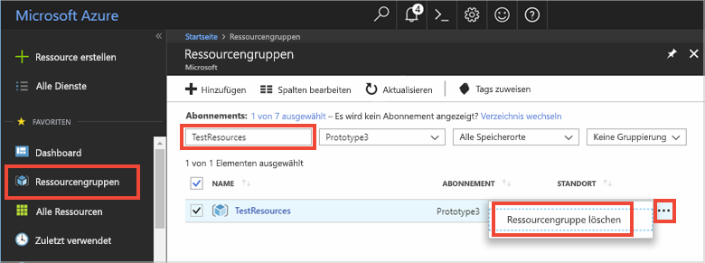

# <a name="quickstart-how-to-use-azure-redis-cache-with-nodejs"></a>Schnellstart: Verwenden von Azure Redis Cache mit Node.js


Azure Redis Cache bietet Zugriff auf einen sicheren dedizierten Redis-Cache, der von Microsoft verwaltet wird. Auf Ihren Cache kann in jeder Anwendung in Microsoft Azure zugegriffen werden.

Dieses Thema beschreibt die ersten Schritte mit Azure Redis Cache und Node.js. 

Sie können einen beliebigen Code-Editor nutzen, um die Schritte dieser Schnellstartanleitung auszuführen. [Visual Studio Code](https://code.visualstudio.com/) ist aber eine hervorragende Option, die auf Windows-, macOS- und Linux-Plattformen verfügbar ist.


[!INCLUDE [quickstarts-free-trial-note](../../includes/quickstarts-free-trial-note.md)]


## <a name="prerequisites"></a>Voraussetzungen
Installieren Sie [node_redis](https://github.com/mranney/node_redis):

    npm install redis

In diesem Tutorial wird [node_redis](https://github.com/mranney/node_redis) verwendet. Beispiele für die Verwendung anderer Node.js-Clients finden Sie in der entsprechenden Dokumentation für die [hier](http://redis.io/clients#nodejs)aufgeführten Node.js-Clients.


## <a name="create-a-cache"></a>Erstellen eines Caches
[!INCLUDE [redis-cache-create](../../includes/redis-cache-create.md)]

[!INCLUDE [redis-cache-access-keys](../../includes/redis-cache-access-keys.md)]


Fügen Sie Umgebungsvariablen für Ihren **HOSTNAMEN** und Ihren **primären** Zugriffsschlüssel hinzu. Diese Variablen werden verwendet, damit solche vertraulichen Informationen nicht direkt in den Code eingefügt werden müssen.

```
set REDISCACHEHOSTNAME=contosoCache.redis.cache.windows.net
set REDISCACHEKEY=XXXXXXXXXXXXXXXXXXXXXXXXXXXXXXXXXXXXXXXXXXXX
```


## <a name="connect-to-the-cache"></a>Herstellen einer Verbindung mit dem Cache

Die neuesten Builds von [node_redis](https://github.com/mranney/node_redis) unterstützen das Herstellen einer SSL-Verbindung mit Azure Redis Cache. Das folgende Beispiel veranschaulicht das Herstellen einer Verbindung mit Azure Redis Cache unter Verwendung des SSL-Endpunkts 6380. 

```js
var redis = require("redis");

// Add your cache name and access key.
var client = redis.createClient(6380, process.env.REDISCACHEHOSTNAME,
    {auth_pass: process.env.REDISCACHEKEY, tls: {servername: process.env.REDISCACHEHOSTNAME}});
```

Erstellen Sie in Ihrem Code nicht für jeden Vorgang eine neue Verbindung. Verwenden Sie Verbindungen stattdessen möglichst häufig wieder. 

## <a name="create-a-new-nodejs-app"></a>Erstellen einer neuen Node.js-App

Erstellen Sie eine neue Skriptdatei namens *redistest.js*.

Fügen Sie den folgenden JavaScript-Beispielcode in die Datei ein. Dieser Code zeigt, wie Sie unter Verwendung der Umgebungsvariablen für Cachehostname und Schlüssel eine Verbindung mit einer Azure Redis Cache-Instanz herstellen. Der Code speichert auch einen Zeichenfolgenwert im Cache und ruft ihn ab. Außerdem werden die Befehle `PING` und `CLIENT LIST` ausgeführt. Weitere Beispiele für die Verwendung von Redis mit dem [node_redis](https://github.com/mranney/node_redis)-Client finden Sie unter [http://redis.js.org/](http://redis.js.org/).

```js
var redis = require("redis");
var bluebird = require("bluebird");

bluebird.promisifyAll(redis.RedisClient.prototype);
bluebird.promisifyAll(redis.Multi.prototype);

async function testCache() {

    // Connect to the Redis cache over the SSL port using the key.
    var cacheConnection = redis.createClient(6380, process.env.REDISCACHEHOSTNAME, 
        {auth_pass: process.env.REDISCACHEKEY, tls: {servername: process.env.REDISCACHEHOSTNAME}});
        
    // Perform cache operations using the cache connection object...

    // Simple PING command
    console.log("\nCache command: PING");
    console.log("Cache response : " + await cacheConnection.pingAsync());

    // Simple get and put of integral data types into the cache
    console.log("\nCache command: GET Message");
    console.log("Cache response : " + await cacheConnection.getAsync("Message"));    

    console.log("\nCache command: SET Message");
    console.log("Cache response : " + await cacheConnection.setAsync("Message",
        "Hello! The cache is working from Node.js!"));    

    // Demostrate "SET Message" executed as expected...
    console.log("\nCache command: GET Message");
    console.log("Cache response : " + await cacheConnection.getAsync("Message"));    

    // Get the client list, useful to see if connection list is growing...
    console.log("\nCache command: CLIENT LIST");
    console.log("Cache response : " + await cacheConnection.clientAsync("LIST"));    
}

testCache();
```

Führen Sie das Skript mit Node.js aus.

```
node redistest.js
```

Im folgenden Beispiel können Sie sehen, dass der `Message`-Schlüssel zuvor einen zwischengespeicherten Wert aufgewiesen hat, der im Azure-Portal über die Redis-Konsole festgelegt wurde. Die App hat diesen zwischengespeicherten Wert aktualisiert. Außerdem hat die App die Befehle `PING` und `CLIENT LIST` ausgeführt.


## <a name="clean-up-resources"></a>Bereinigen von Ressourcen

Falls Sie mit dem nächsten Tutorial fortfahren möchten, können Sie die in dieser Schnellstartanleitung erstellten Ressourcen beibehalten und wiederverwenden.

Wenn Sie die Schnellstart-Beispielanwendung nicht mehr benötigen, können Sie die in dieser Schnellstartanleitung erstellten Azure-Ressourcen löschen, um das Anfallen von Kosten zu vermeiden. 

> [!IMPORTANT]
> Das Löschen einer Ressourcengruppe kann nicht rückgängig gemacht werden. Die Ressourcengruppe und alle darin enthaltenen Ressourcen werden also dauerhaft gelöscht. Achten Sie daher darauf, dass Sie nicht versehentlich die falsche Ressourcengruppe oder die falschen Ressourcen löschen. Falls Sie die Ressourcen zum Hosten dieses Beispiels in einer vorhandenen Ressourcengruppe erstellt haben, die beizubehaltende Ressourcen enthält, können Sie die Ressourcen einzeln über das jeweilige Blatt löschen, statt die Ressourcengruppe zu löschen.
>

Melden Sie sich beim [Azure-Portal](https://portal.azure.com) an, und klicken Sie auf **Ressourcengruppen**.

Geben Sie im Textfeld **Nach Name filtern...** den Namen Ihrer Ressourcengruppe ein. In diesem Artikel wurde eine Ressourcengruppe mit dem Namen *TestResources* verwendet. Klicken Sie in Ihrer Ressourcengruppe in der Ergebnisliste auf **...** und dann auf **Ressourcengruppe löschen**.



Sie werden aufgefordert, das Löschen der Ressourcengruppe zu bestätigen. Geben Sie den Namen der entsprechenden Ressourcengruppe ein, und klicken Sie auf **Löschen**.

Daraufhin werden die Ressourcengruppe und alle darin enthaltenen Ressourcen gelöscht.


## <a name="next-steps"></a>Nächste Schritte

In dieser Schnellstartanleitung wurde beschrieben, wie Sie Azure Redis Cache für eine Node.js-Anwendung verwenden. In der nächsten Schnellstartanleitung erfahren Sie, wie Sie Redis Cache mit einer ASP.NET-Web-App verwenden.

> [!div class="nextstepaction"]
> [Schnellstart: Erstellen einer ASP.NET-Web-App mit Redis Cache](./cache-web-app-howto.md)


