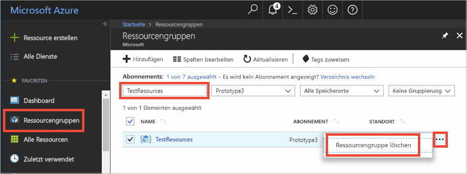

# <a name="quickstart-use-azure-redis-cache-with-python"></a>Schnellstart: Verwenden von Azure Redis Cache mit Python


## <a name="introduction"></a>Einführung

In dieser Schnellstartanleitung wird gezeigt, wie Sie eine Azure Redis Cache-Instanz mit Python verbinden, um das Lesen und Schreiben in einen Cache zu ermöglichen. 


[!INCLUDE [quickstarts-free-trial-note](../../includes/quickstarts-free-trial-note.md)]

## <a name="prerequisites"></a>Voraussetzungen

* Installation einer [Python 2- oder Python 3-Umgebung](https://www.python.org/downloads/) mit [pip](https://pypi.org/project/pip/) 

## <a name="create-a-redis-cache-on-azure"></a>Erstellen eines Redis-Caches in Azure
[!INCLUDE [redis-cache-create](../../includes/redis-cache-create.md)]

[!INCLUDE [redis-cache-create](../../includes/redis-cache-access-keys.md)]

## <a name="install-redis-py"></a>Installieren von redis-py

[Redis-py](https://github.com/andymccurdy/redis-py) ist eine Python-Schnittstelle für Redis Cache. Verwenden Sie das Python-Pakettool *pip*, um das redis-py-Paket zu installieren. 

Im folgenden Beispiel wird *pip3* für Python3 verwendet, um das redis-py-Paket unter Windows 10 zu installieren, indem eine Visual Studio 2017 Developer-Eingabeaufforderung mit erhöhten Administratorrechten verwendet wird.

    pip3 install redis


## <a name="read-and-write-to-the-cache"></a>Lese- und Schreibvorgänge für den Cache

Führen Sie Python aus, und testen Sie die Cachenutzung über die Befehlszeile. Ersetzen Sie `<Your Host Name>` und `<Your Access Key>` durch die Werte für Ihre Redis Cache-Instanz. 

```python
>>> import redis
>>> r = redis.StrictRedis(host='<Your Host Name>.redis.cache.windows.net',
        port=6380, db=0, password='<Your Access Key>', ssl=True)
>>> r.set('foo', 'bar')
True
>>> r.get('foo')
b'bar'
```

## <a name="create-a-python-script"></a>Erstellen eines Python-Skripts

Erstellen Sie eine neue Skripttextdatei mit dem Namen *PythonApplication1.py*.

Fügen Sie das folgende Skript der Datei *PythonApplication1.py* hinzu, und speichern Sie die Datei. Mit diesem Skript wird der Cachezugriff getestet. Ersetzen Sie `<Your Host Name>` und `<Your Access Key>` durch die Werte für Ihre Redis Cache-Instanz. 

```python
import redis

myHostname = "<Your Host Name>.redis.cache.windows.net"
myPassword = "<Your Access Key>"

r = redis.StrictRedis(host=myHostname, port=6380,password=myPassword,ssl=True)

result = r.ping()
print("Ping returned : " + str(result))

result = r.set("Message", "Hello!, The cache is working with Python!")
print("SET Message returned : " + str(result))

result = r.get("Message")
print("GET Message returned : " + result.decode("utf-8"))

result = r.client_list()
print("CLIENT LIST returned : ") 
for c in result:
    print("id : " + c['id'] + ", addr : " + c['addr'])
```

Führen Sie das Skript mit Python aus.


## <a name="clean-up-resources"></a>Bereinigen von Ressourcen

Falls Sie mit einem anderen Tutorial fortfahren möchten, können Sie die in dieser Schnellstartanleitung erstellten Ressourcen beibehalten und wiederverwenden.

Wenn Sie die Schnellstart-Beispielanwendung nicht mehr benötigen, können Sie die in dieser Schnellstartanleitung erstellten Azure-Ressourcen löschen, um das Anfallen von Kosten zu vermeiden. 

> [!IMPORTANT]
> Das Löschen einer Ressourcengruppe kann nicht rückgängig gemacht werden. Die Ressourcengruppe und alle darin enthaltenen Ressourcen werden also dauerhaft gelöscht. Achten Sie daher darauf, dass Sie nicht versehentlich die falsche Ressourcengruppe oder die falschen Ressourcen löschen. Falls Sie die Ressourcen zum Hosten dieses Beispiels in einer vorhandenen Ressourcengruppe erstellt haben, die beizubehaltende Ressourcen enthält, können Sie die Ressourcen einzeln über das jeweilige Blatt löschen, statt die Ressourcengruppe zu löschen.
>

Melden Sie sich beim [Azure-Portal](https://portal.azure.com) an, und klicken Sie auf **Ressourcengruppen**.

Geben Sie im Textfeld **Nach Name filtern...** den Namen Ihrer Ressourcengruppe ein. In diesem Artikel wurde eine Ressourcengruppe mit dem Namen *TestResources* verwendet. Klicken Sie in Ihrer Ressourcengruppe in der Ergebnisliste auf **...** und dann auf **Ressourcengruppe löschen**.



Sie werden aufgefordert, das Löschen der Ressourcengruppe zu bestätigen. Geben Sie den Namen der entsprechenden Ressourcengruppe ein, und klicken Sie auf **Löschen**.

Daraufhin werden die Ressourcengruppe und alle darin enthaltenen Ressourcen gelöscht.


## <a name="next-steps"></a>Nächste Schritte

> [!div class="nextstepaction"]
> [Gewusst wie: Erstellen einer Web-App mit Redis Cache](./cache-web-app-howto.md)


<!--Image references-->
[1]: ./media/cache-python-get-started/redis-cache-new-cache-menu.png
[2]: ./media/cache-python-get-started/redis-cache-cache-create.png
