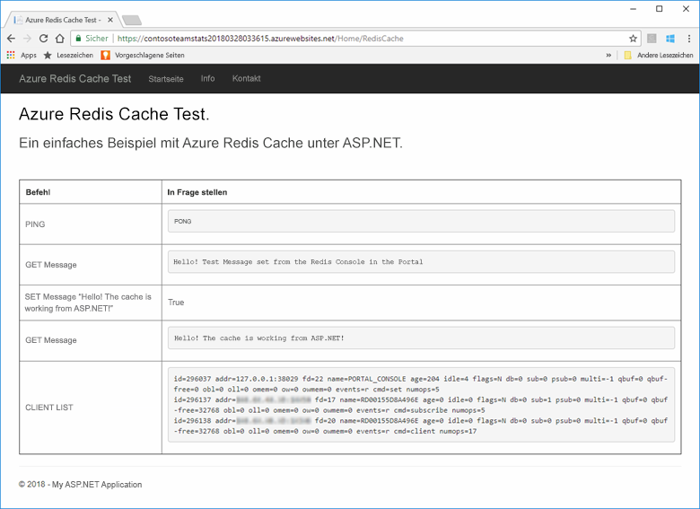
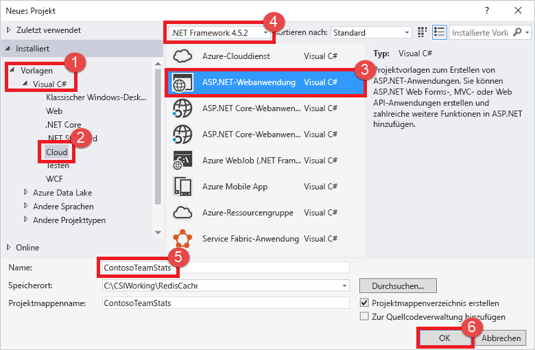
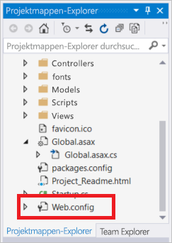
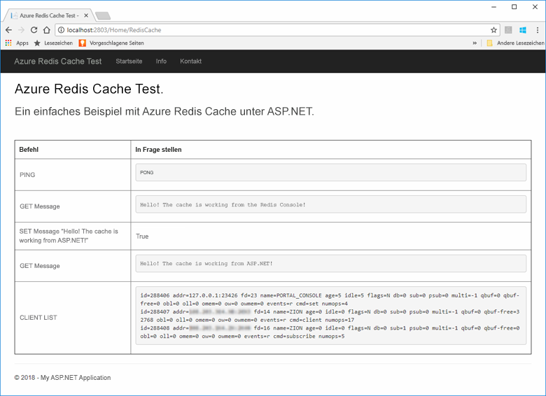
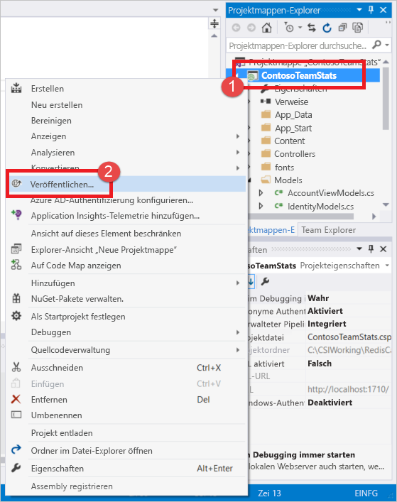
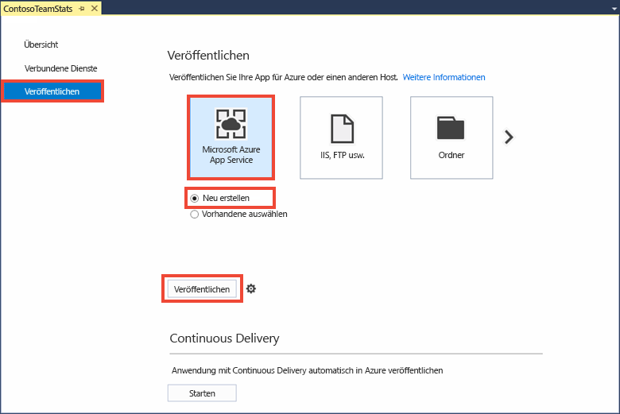
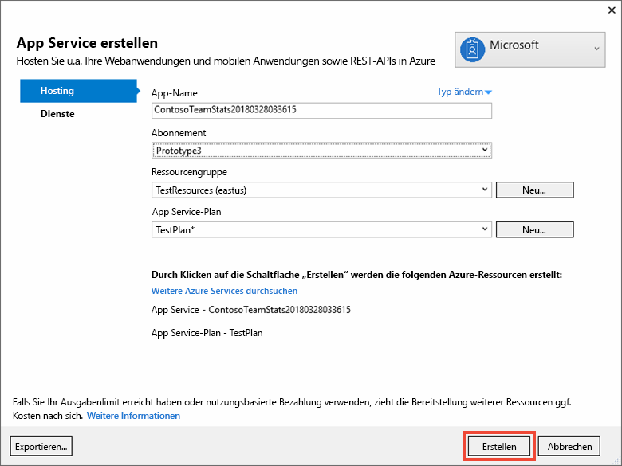
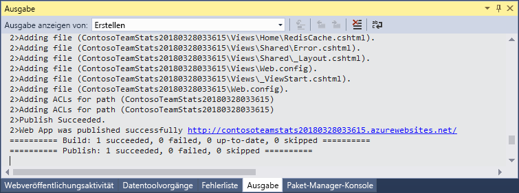
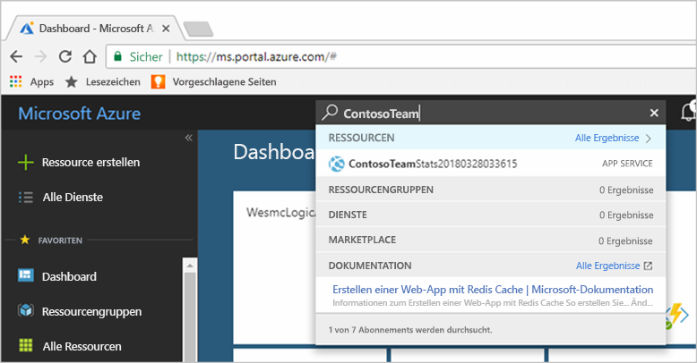
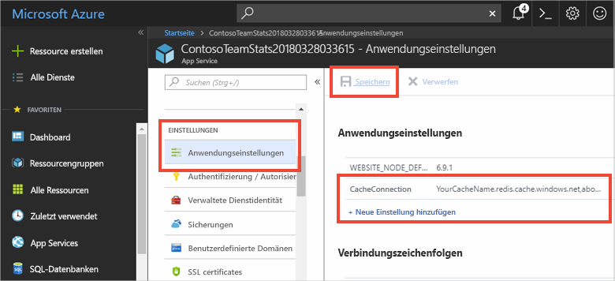

# <a name="quickstart-create-a-aspnet-web-app-with-redis-cache"></a>Schnellstart: Erstellen einer ASP.NET-Web-App mit Redis Cache

> [!div class="op_single_selector"]
> * [.NET](cache-dotnet-how-to-use-azure-redis-cache.md)
> * [ASP.NET](cache-web-app-howto.md)
> * [Node.js](cache-nodejs-get-started.md)
> * [Java](cache-java-get-started.md)
> * [Python](cache-python-get-started.md)
>

## <a name="introduction"></a>Einführung

In dieser Schnellstartanleitung wird erörtert, wie Sie mit Visual Studio 2017 eine ASP.NET-Webanwendung erstellen und für Azure App Service bereitstellen. Die Beispielanwendung stellt eine Verbindung mit einem Azure Redis Cache her, um Daten aus dem Cache abzurufen zu speichern. Nach der Ausführung der in dieser Schnellstartanleitung beschriebenen Schritte verfügen Sie über eine funktionsfähige, in Azure gehostete Web-App, die Lese- und Schreibvorgänge in einem Azure Redis Cache ausführt.



## <a name="prerequisites"></a>Voraussetzungen

Für die Ausführung der in dieser Schnellstartanleitung beschriebenen Schritte müssen die folgenden Voraussetzungen erfüllt sein:

* Installieren Sie [Visual Studio 2017](https://www.visualstudio.com/downloads/) mit den folgenden Workloads:
    * ASP.NET und Webentwicklung
    * Azure-Entwicklung

[!INCLUDE [quickstarts-free-trial-note](../../includes/quickstarts-free-trial-note.md)]

## <a name="create-the-visual-studio-project"></a>Erstellen des Visual Studio-Projekts

Öffnen Sie Visual Studio, und klicken Sie auf **Datei** > **Neu** > **Projekt**.



Führen Sie im Dialogfeld „Neues Projekt“ die folgenden Schritte aus:

1. Erweitern Sie in der Liste **Vorlagen** den Knoten **Visual C#**.
1. Wählen Sie **Cloud** aus.
1. Klicken Sie auf **ASP.NET-Webanwendung**.
1. Stellen Sie sicher, dass **.NET Framework 4.5.2** oder höher ausgewählt ist.
1. Geben Sie im Textfeld **Name** einen Namen für das Projekt ein. In diesem Beispiel verwenden wir **ContosoTeamStats**.
1. Klicken Sie auf **OK**.

Es wird ein Bildschirm „Neue ASP.NET-Webanwendung“ angezeigt:


Wählen Sie als Projekttyp die Option **MVC** aus.

Stellen Sie sicher, dass für die Einstellungen unter **Authentifizierung** die Option **Keine Authentifizierung** angegeben ist. Je nach Ihrer Version von Visual Studio kann der Standardwert auch anders lauten. Um dies zu ändern, klicken Sie auf **Authentifizierung ändern** und wählen **Keine Authentifizierung**.

Klicken Sie auf **OK**, um das Projekt zu erstellen.

## <a name="create-a-cache"></a>Erstellen eines Caches

Als Nächstes erstellen Sie den Cache für die App.

[!INCLUDE [redis-cache-create](../../includes/redis-cache-create.md)]

[!INCLUDE [redis-cache-access-keys](../../includes/redis-cache-access-keys.md)]

Erstellen Sie auf Ihrem Computer eine Datei namens *CacheSecrets.config*, und platzieren Sie die Datei an einem Speicherort, an dem sie nicht mit dem Quellcode Ihrer Beispielanwendung eingecheckt wird. In diesem Schnellstart befindet sich die Datei *CacheSecrets.config* im Verzeichnis *C:\AppSecrets\CacheSecrets.config*.

Bearbeiten Sie die Datei *CacheSecrets.config*, und fügen Sie ihr folgende Inhalte hinzu:

```xml
<appSettings>
    <add key="CacheConnection" value="<cache-name>.redis.cache.windows.net,abortConnect=false,ssl=true,password=<access-key>"/>
</appSettings>
```

Ersetzen Sie `<cache-name>` durch den Cachehostnamen.

Ersetzen Sie `<access-key>` durch den Primärschlüssel für Ihren Cache.

> [!TIP]
> Der sekundäre Zugriffsschlüssel wird bei der Schlüsselrotation als alternativer Schlüssel verwendet, während Sie den primären Zugriffsschlüssel neu generieren.
>

Speichern Sie die Datei.

## <a name="update-the-mvc-application"></a>Aktualisieren der MVC-Anwendung

In diesem Abschnitt aktualisieren Sie die Anwendung, um eine neue Ansicht zu unterstützen, in der ein einfacher Test für einen Azure Redis Cache angezeigt wird.

* [Aktualisieren der Datei „Web.config“ mit einer App-Einstellung für den Cache](#Update-the-webconfig-file-with-an-app-setting-for-the-cache)
* [Konfigurieren der Anwendung für die Verwendung des Clients „StackExchange.Redis“](#configure-the-application-to-use-stackexchangeredis)
* [Aktualisieren von HomeController und Layout](#update-the-homecontroller-and-layout)
* [Hinzufügen einer neuen RedisCache-Ansicht](#add-a-new-rediscache-view)

### <a name="update-the-webconfig-file-with-an-app-setting-for-the-cache"></a>Aktualisieren der Datei „Web.config“ mit einer App-Einstellung für den Cache

Wenn Sie die Anwendung lokal ausführen, werden die Informationen in der Datei *CacheSecrets.config* verwendet, um eine Verbindung mit Ihrer Azure Redis Cache-Instanz herzustellen. Später stellen Sie diese Anwendung für Azure bereit. Zu diesem Zeitpunkt konfigurieren Sie eine App-Einstellung in Azure, die von der Anwendung verwendet wird, um die Cacheverbindungsinformationen anstelle dieser Datei abzurufen. Weil die Datei *CacheSecrets.config* nicht mit Ihrer Anwendung in Azure bereitgestellt wird, verwenden Sie die Datei nur, wenn Sie die Anwendung lokal testen. Sie möchten diese Informationen so gut wie möglich schützen, um missbräuchlichen Zugriff auf Ihre Cachedaten zu verhindern.

Doppelklicken Sie im **Projektmappen-Explorer** auf die Datei *Web.config*, um sie zu öffnen.



Suchen Sie in der Datei *Web.config* nach dem Element `<appSetting>`, und fügen Sie das folgende `file`-Attribut hinzu. Falls Sie einen anderen Dateinamen oder -speicherort verwendet haben, müssen die Werte aus dem Beispiel durch diese Werte ersetzt werden.

* Vorher: `<appSettings>`
* Nachher: ` <appSettings file="C:\AppSecrets\CacheSecrets.config">`

Die ASP.NET-Laufzeit führt die Inhalte der externen Datei mit dem Markup im `<appSettings>`-Element zusammen. Falls die angegebene Datei nicht gefunden wird, wird das Dateiattribut ignoriert. Ihre vertraulichen Daten (die Verbindungszeichenfolge für Ihren Cache) sind nicht Bestandteil des Quellcodes für die Anwendung. Wenn Sie Ihre Web-App für Azure bereitstellen, wird die Datei *CacheSecrets.config* nicht bereitgestellt.

### <a name="configure-the-application-to-use-stackexchangeredis"></a>Konfigurieren der Anwendung für die Verwendung von „StackExchange.Redis“

Um die App für die Verwendung des [StackExchange.Redis](https://github.com/StackExchange/StackExchange.Redis)-NuGet-Pakets für Visual Studio zu konfigurieren, klicken Sie auf **Extras > NuGet-Paket-Manager > Paket-Manager-Konsole**.

Führen Sie im Fenster `Package Manager Console` den folgenden Befehl aus:

```powershell
Install-Package StackExchange.Redis
```

Das NuGet-Paket wird heruntergeladen und fügt die benötigten Assemblyverweise zu Ihrer Clientanwendung hinzu, um mithilfe des StackExchange.Redis-Cacheclients auf den Azure Redis Cache zuzugreifen. Installieren Sie das Paket `StackExchange.Redis.StrongName`, wenn Sie es vorziehen, eine Version der `StackExchange.Redis`-Clientbibliothek mit sicheren Namen zu verwenden.

### <a name="update-the-homecontroller-and-layout"></a>Aktualisieren von HomeController und Layout

Erweitern Sie im **Projektmappen-Explorer** den Ordner **Controller**, und öffnen Sie die Datei *HomeController.cs*.

Fügen Sie am Anfang der Datei die folgenden zwei `using`-Anweisungen hinzu, um die Cacheclient- und App-Einstellungen zu unterstützen.

```csharp
using System.Configuration;
using StackExchange.Redis;
```

Fügen Sie der `HomeController`-Klasse die folgende Methode hinzu, um eine neue `RedisCache`-Aktion zu unterstützen, die einige Befehle für den neuen Cache ausführt.

```csharp
    public ActionResult RedisCache()
    {
        ViewBag.Message = "A simple example with Azure Redis Cache on ASP.NET.";

        var lazyConnection = new Lazy<ConnectionMultiplexer>(() =>
        {
            string cacheConnection = ConfigurationManager.AppSettings["CacheConnection"].ToString();
            return ConnectionMultiplexer.Connect(cacheConnection);
        });

        // Connection refers to a property that returns a ConnectionMultiplexer
        // as shown in the previous example.
        IDatabase cache = lazyConnection.Value.GetDatabase();

        // Perform cache operations using the cache object...

        // Simple PING command
        ViewBag.command1 = "PING";
        ViewBag.command1Result = cache.Execute(ViewBag.command1).ToString();

        // Simple get and put of integral data types into the cache
        ViewBag.command2 = "GET Message";
        ViewBag.command2Result = cache.StringGet("Message").ToString();

        ViewBag.command3 = "SET Message \"Hello! The cache is working from ASP.NET!\"";
        ViewBag.command3Result = cache.StringSet("Message", "Hello! The cache is working from ASP.NET!").ToString();

        // Demostrate "SET Message" executed as expected...
        ViewBag.command4 = "GET Message";
        ViewBag.command4Result = cache.StringGet("Message").ToString();

        // Get the client list, useful to see if connection list is growing...
        ViewBag.command5 = "CLIENT LIST";
        ViewBag.command5Result = cache.Execute("CLIENT", "LIST").ToString().Replace(" id=", "\rid=");

        lazyConnection.Value.Dispose();

        return View();
    }
```

Erweitern Sie im **Projektmappen-Explorer** den Ordner **Ansichten**>**Freigegeben**, und öffnen Sie die Datei *_Layout.cshtml*.

Ersetzen Sie:

```csharp
@Html.ActionLink("Application name", "Index", "Home", new { area = "" }, new { @class = "navbar-brand" })
```

durch:

```csharp
@Html.ActionLink("Azure Redis Cache Test", "RedisCache", "Home", new { area = "" }, new { @class = "navbar-brand" })
```

### <a name="add-a-new-rediscache-view"></a>Hinzufügen einer neuen RedisCache-Ansicht

Erweitern Sie im **Projektmappen-Explorer** den Ordner **Ansichten**, und klicken Sie dann mit der rechten Maustaste auf den Ordner **Home**. Wählen Sie **Hinzufügen** > **Ansicht...** aus.

Geben Sie im Dialogfeld **Ansicht hinzufügen** den Ansichtsnamen „RedisCache“ ein, und klicken Sie dann auf **Hinzufügen**.

Ersetzen Sie den Code in der Datei *RedisCache.cshtml* durch den folgenden Code:

```csharp
@{
    ViewBag.Title = "Azure Redis Cache Test";
}

<h2>@ViewBag.Title.</h2>
<h3>@ViewBag.Message</h3>
<br /><br />
<table border="1" cellpadding="10">
    <tr>
        <th>Command</th>
        <th>Result</th>
    </tr>
    <tr>
        <td>@ViewBag.command1</td>
        <td><pre>@ViewBag.command1Result</pre></td>
    </tr>
    <tr>
        <td>@ViewBag.command2</td>
        <td><pre>@ViewBag.command2Result</pre></td>
    </tr>
    <tr>
        <td>@ViewBag.command3</td>
        <td><pre>@ViewBag.command3Result</pre></td>
    </tr>
    <tr>
        <td>@ViewBag.command4</td>
        <td><pre>@ViewBag.command4Result</pre></td>
    </tr>
    <tr>
        <td>@ViewBag.command5</td>
        <td><pre>@ViewBag.command5Result</pre></td>
    </tr>
</table>
```

## <a name="run-the-app-locally"></a>Lokales Ausführen der App

Standardmäßig ist das Projekt für das lokale Hosten der App in [IIS Express](https://docs.microsoft.com/iis/extensions/introduction-to-iis-express/iis-express-overview) zum Testen und Debuggen konfiguriert.

Klicken Sie in Visual Studio im Menü auf **Debuggen** > **Debugging starten**, um die App zum Testen und Debuggen lokal zu erstellen und zu starten.

Klicken Sie im Browser auf der Navigationsleiste auf **Azure Redis Cache-Test**.

Im folgenden Beispiel können Sie sehen, dass der `Message`-Schlüssel zuvor einen zwischengespeicherten Wert aufwies, der im Portal über die Redis-Konsole festgelegt wurde. Die App hat diesen zwischengespeicherten Wert aktualisiert. Außerdem hat die App die Befehle `PING` und `CLIENT LIST` ausgeführt.



## <a name="publish-and-run-in-azure"></a>Veröffentlichen und Ausführen in Azure

Nachdem Sie die App erfolgreich lokal getestet haben, stellen Sie die App für Azure bereit und führen sie in der Cloud aus.

### <a name="publish-the-app-to-azure"></a>Veröffentlichen der App in Azure

Klicken Sie in Visual Studio im Projektmappen-Explorer mit der rechten Maustaste auf den Projektknoten, und wählen Sie **Veröffentlichen** aus.



Klicken Sie auf **Microsoft Azure App Service**, wählen Sie **Neu erstellen** aus, und klicken Sie dann auf **Veröffentlichen**.



Nehmen Sie im Dialogfeld **App Service erstellen** die folgenden Änderungen vor:

| Einstellung | Empfohlener Wert | Beschreibung |
| ------- | :---------------: | ----------- |
| **App-Name** | Verwenden Sie den Standardwert. | Bei der Bereitstellung der App für Azure wird der App-Name als Hostname für die App verwendet. Dem Namen kann bei Bedarf ein Zeitstempelsuffix hinzugefügt werden, um ihn eindeutig zu machen. |
| **Abonnement** | Wählen Sie Ihr Azure-Abonnement aus. | Für dieses Abonnement werden alle damit verbundenen Hostinggebühren berechnet. Wenn Sie über mehrere Azure-Abonnements verfügen, stellen Sie sicher, dass das gewünschte Abonnement ausgewählt ist.|
| **Ressourcengruppe** | Verwenden Sie die Ressourcengruppe, in der Sie den Cache erstellt haben. Beispiel: *TestResourceGroup*. | Die Ressourcengruppe hilft Ihnen, alle Ressourcen als Gruppe zu verwalten. Wenn Sie die App später löschen möchten, können Sie die Gruppe einfach löschen. |
| **App Service-Plan** | Klicken Sie auf **Neu**, und erstellen Sie einen neuen App Service-Plan mit dem Namen *TestingPlan*. <br />Verwenden Sie den gleichen **Speicherort**, den Sie beim Erstellen Ihres Caches verwendet haben. <br />Wählen Sie **Free** für die Größe aus. | Mit einem App Service-Plan wird ein Satz von Computeressourcen für die Ausführung einer Web-App definiert. |



Klicken Sie nach dem Konfigurieren der App Service-Hostingeinstellungen auf **Erstellen**, um einen neuen App Service für Ihre App zu erstellen.

Überwachen Sie in Visual Studio das Fenster **Ausgabe**, um den Status der Veröffentlichung in Azure anzuzeigen. Bei erfolgreichem Abschluss der Veröffentlichung wird die URL für den App Service wie unten dargestellt protokolliert:



### <a name="add-the-app-setting-for-the-cache"></a>Hinzufügen der App-Einstellung für den Cache

Nachdem die Veröffentlichung für den neuen App Service abgeschlossen wurde, können Sie eine neue App-Einstellung hinzufügen. Diese Einstellung wird zum Speichern der Cacheverbindungsinformationen verwendet. Geben Sie oben im Azure-Portal in der Suchleiste den App-Namen ein, um nach dem neuen App Service zu suchen, den Sie gerade erstellt haben.



Fügen Sie eine neue App-Einstellung mit dem Namen **CacheConnection** hinzu, die von der App zum Herstellen einer Verbindung mit dem Cache verwendet wird. Verwenden Sie den gleichen Wert, den Sie für `CacheConnection` in der Datei *CacheSecrets.config* konfiguriert haben. Der Wert enthält den Cachehostnamen und den Zugriffsschlüssel.



### <a name="run-the-app-in-azure"></a>Ausführen der App in Azure

Navigieren Sie in Ihrem Browser zur URL für den App Service. Die URL wird in Visual Studio im Fenster „Ausgabe“ in den Ergebnissen des Veröffentlichungsvorgangs angezeigt. Sie wird auch im Azure-Portal auf der Seite „Übersicht“ des von Ihnen erstellten App Service angegeben.

Klicken Sie auf der Navigationsleiste auf **Azure Redis Cache-Test**, um den Cachezugriff zu testen.


## <a name="clean-up-resources"></a>Bereinigen von Ressourcen

Falls Sie mit dem nächsten Tutorial fortfahren möchten, können Sie die in dieser Schnellstartanleitung erstellten Ressourcen beibehalten und wiederverwenden.

Wenn Sie die Schnellstart-Beispielanwendung nicht mehr benötigen, können Sie die in dieser Schnellstartanleitung erstellten Azure-Ressourcen löschen, um das Anfallen von Kosten zu vermeiden. 

> [!IMPORTANT]
> Das Löschen einer Ressourcengruppe kann nicht rückgängig gemacht werden. Die Ressourcengruppe und alle darin enthaltenen Ressourcen werden also dauerhaft gelöscht. Achten Sie daher darauf, dass Sie nicht versehentlich die falsche Ressourcengruppe oder die falschen Ressourcen löschen. Falls Sie die Ressourcen zum Hosten dieses Beispiels in einer vorhandenen Ressourcengruppe erstellt haben, die beizubehaltende Ressourcen enthält, können Sie die Ressourcen einzeln über das jeweilige Blatt löschen, statt die Ressourcengruppe zu löschen.
>

Melden Sie sich beim [Azure-Portal](https://portal.azure.com) an, und klicken Sie auf **Ressourcengruppen**.

Geben Sie im Textfeld **Nach Name filtern...** den Namen Ihrer Ressourcengruppe ein. In den Anweisungen zu diesem Thema wurde eine Ressourcengruppe namens *TestResources* verwendet. Klicken Sie in Ihrer Ressourcengruppe in der Ergebnisliste auf **...** und dann auf **Ressourcengruppe löschen**.


Sie werden aufgefordert, das Löschen der Ressourcengruppe zu bestätigen. Geben Sie zur Bestätigung den Namen Ihrer Ressourcengruppe ein, und klicken Sie auf **Löschen**.

Daraufhin werden die Ressourcengruppe und alle darin enthaltenen Ressourcen gelöscht.

## <a name="next-steps"></a>Nächste Schritte

In unserem nächsten Tutorial verwenden Sie Azure Redis Cache in einem realitätsnäheren Szenario zur Verbesserung der Leistung einer App. Sie werden diese Anwendung zum Zwischenspeichern von Leaderboard-Ergebnissen anhand des cachefremden Musters mit ASP.NET und einer Datenbank aktualisieren.

> [!div class="nextstepaction"]
> [Erstellen eines cachefremden Leaderboards in ASP.NET](cache-web-app-cache-aside-leaderboard.md)
