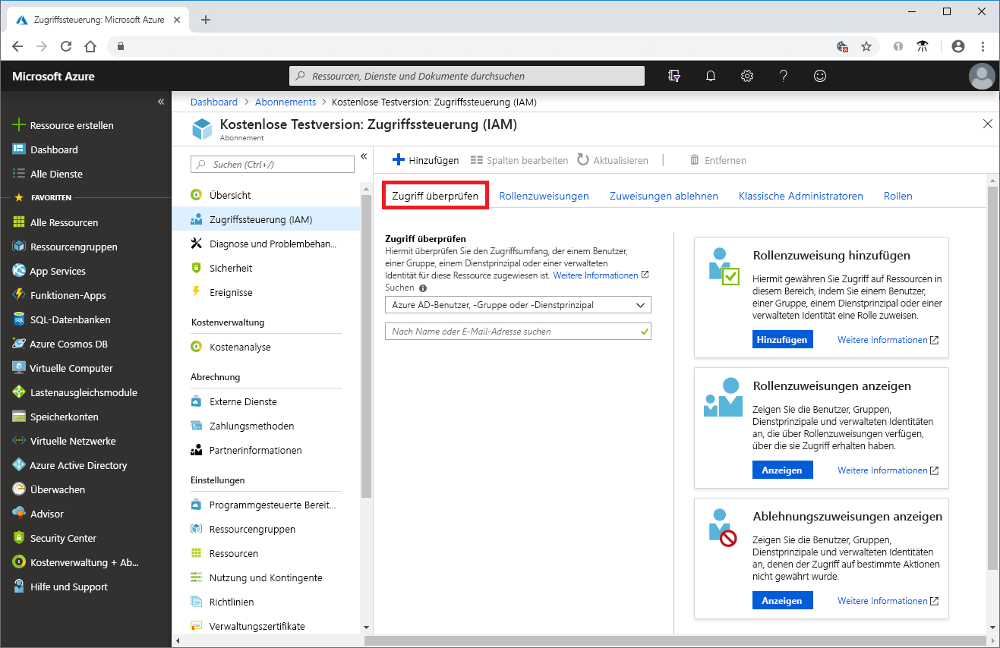
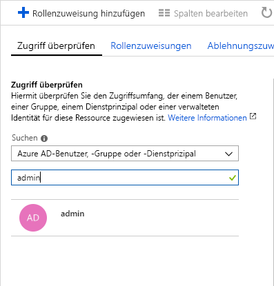

# Schnellstart: Anzeigen, welchen Zugriff ein Benutzer auf Azure-Ressourcen hat

Sie können das Blatt **Zugriffssteuerung (IAM)** der [rollenbasierten Zugriffssteuerung (RBAC)](overview.md) verwenden, um anzuzeigen, welchen Zugriff ein Benutzer oder ein anderer Sicherheitsprinzipal auf Azure-Ressourcen hat. Manchmal möchten Sie jedoch unter Umständen nur schnell den Zugriff für einen einzelnen Benutzer oder einen anderen Sicherheitsprinzipal anzeigen. Die einfachste Möglichkeit ist hierbei die Verwendung der Funktion **Zugriff überprüfen** im Azure-Portal.

## Anzeigen von Rollenzuweisungen

 Um den Zugriff für einen Benutzer anzuzeigen, müssen Sie dessen Rollenzuweisungen auflisten. Führen Sie diese Schritte aus, um die Rollenzuweisungen für einzelne Benutzer, Gruppen, Dienstprinzipale oder verwaltete Identitäten auf Abonnementebene anzuzeigen.

1. Klicken Sie im Azure-Portal auf **Alle Dienste** und anschließend auf **Abonnements**.

1. Klicken Sie auf Ihr Abonnement.

1. Klicken Sie auf **Zugriffssteuerung (IAM)**.

1. Klicken Sie auf die Registerkarte **Zugriff überprüfen**.

    

1. Wählen Sie in der Liste **Finden** den Typ des Sicherheitsprinzipals aus, für den Sie den Zugriff überprüfen möchten.

1. Geben Sie in das Suchfeld eine Zeichenfolge ein, nach der das Verzeichnis durchsucht werden soll. Sie können nach Anzeigenamen, E-Mail-Adressen oder Objektbezeichnern suchen.

    

1. Klicken Sie auf den Sicherheitsprinzipal, um den Bereich **Zuweisungen** zu öffnen.

    

    In diesem Bereich werden die Rollen angezeigt, die dem ausgewählten Sicherheitsprinzipal für den Bereich zugewiesen sind. Wenn Ablehnungszuweisungen für diesen Bereich oder an diesen Bereich vererbte Ablehnungszuweisungen vorhanden sind, werden diese angezeigt.

## Nächste Schritte

> [!div class="nextstepaction"]
> [Tutorial: Gewähren des Zugriffs für einen Benutzer mithilfe von RBAC und Azure-Portal](quickstart-assign-role-user-portal.md)
