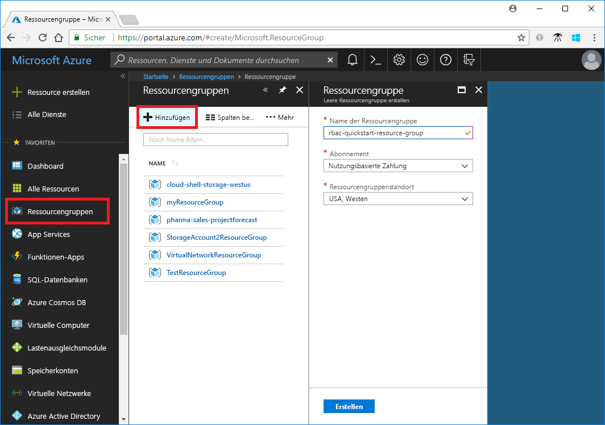
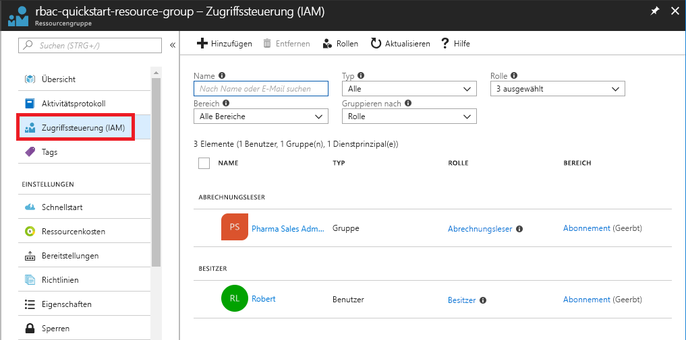
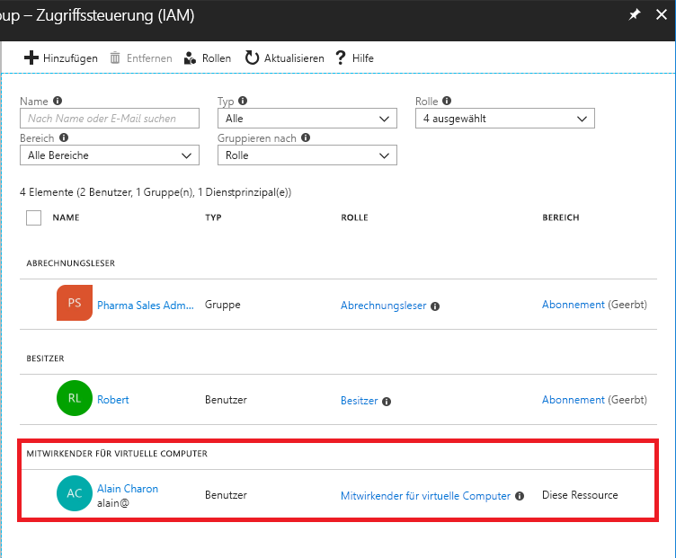
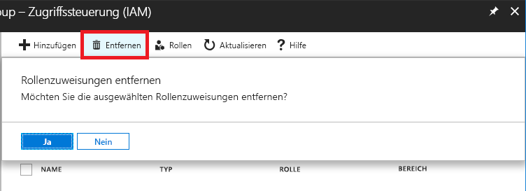
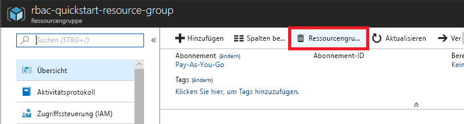

# Tutorial: Gewähren des Zugriffs auf Azure-Ressourcen für einen Benutzer mit RBAC und dem Azure-Portal

Der Zugriff auf Azure-Ressourcen wird mithilfe der [rollenbasierten Zugriffssteuerung (RBAC)](overview.md) verwaltet. In diesem Tutorial gewähren Sie einem Benutzer Zugriff, um virtuelle Computer in einer Ressourcengruppe zu erstellen und zu verwalten.

In diesem Tutorial lernen Sie Folgendes:

> [!div class="checklist"]
> * Gewähren des Zugriffs für einen Benutzer im Ressourcengruppenbereich
> * Zugriff entfernen

Wenn Sie kein Azure-Abonnement besitzen, können Sie ein [kostenloses Konto](https://azure.microsoft.com/free/?WT.mc_id=A261C142F) erstellen, bevor Sie beginnen.

## Anmelden bei Azure

Melden Sie sich unter http://portal.azure.com beim Azure-Portal an.

## Erstellen einer Ressourcengruppe

1. Wählen Sie in der Navigationsliste die Option **Ressourcengruppen** aus.

1. Wählen Sie **Hinzufügen**, um das Blatt **Ressourcengruppe** zu öffnen.

   

1. Geben Sie für **Ressourcengruppenname** die Zeichenfolge **rbac-resource-group** ein.

1. Wählen Sie ein Abonnement und einen Standort aus.

1. Wählen Sie **Erstellen** aus, um die Ressourcengruppe zu erstellen.

1. Wählen Sie **Aktualisieren** aus, um die Liste der Ressourcengruppen zu aktualisieren.

   Die neue Ressourcengruppe wird in der Liste Ihrer Ressourcengruppen angezeigt.

   

## Gewähren von Zugriff

In RBAC erstellen Sie zum Gewähren des Zugriffs eine Rollenzuweisung.

1. Wählen Sie in der Liste der **Ressourcengruppen** die neue Ressourcengruppe **rbac-resource-group** aus.

1. Klicken Sie auf **Zugriffssteuerung (IAM)**.

1. Wählen Sie die Registerkarte **Rollenzuweisungen** aus, um die aktuelle Liste mit den Rollenzuweisungen anzuzeigen.

   

1. Wählen Sie die Registerkarte **Rollenzuweisung hinzufügen** aus, um den Bereich „Rollenzuweisung hinzufügen“ zu öffnen.

   Wenn Sie keine Berechtigungen zum Zuweisen von Rollen haben, ist die Option „Rollenzuweisung hinzufügen“ deaktiviert.

   

1. Wählen Sie in der Dropdownliste **Rolle** die Rolle **Mitwirkender für virtuelle Computer** aus.

1. Wählen Sie in der Liste **Auswählen** sich selbst oder einen anderen Benutzer aus.

1. Wählen Sie **Speichern** aus, um die Rollenzuweisung zu erstellen.

   Nach einigen Augenblicken wird dem Benutzer die Rolle „Mitwirkender für virtuelle Computer“ im Bereich der Ressourcengruppe „rbac-resource-group“ zugewiesen.

   

## Zugriff entfernen

In RBAC entfernen Sie eine Rollenzuweisung, um den Zugriff zu entfernen.

1. Fügen Sie in der Liste der Rollenzuweisungen ein Häkchen neben dem Benutzer mit der Rolle „Mitwirkender für virtuelle Computer“ hinzu.

1. Klicken Sie auf **Entfernen**.

   

1. Klicken Sie in der Nachricht zum Entfernen der Rollenzuweisung auf **Ja**.

## Bereinigen

1. Wählen Sie in der Navigationsliste die Option **Ressourcengruppen** aus.

1. Wählen Sie **rbac-resource-group** aus, um die Ressourcengruppe zu öffnen.

1. Wählen Sie **Ressourcengruppe löschen** aus, um die Ressourcengruppe zu löschen.

   

1. Geben Sie auf dem Blatt **Löschvorgang bestätigen**  den Namen der Ressourcengruppe ein: **rbac-resource-group**.

1. Wählen Sie **Löschen** aus, um die Ressourcengruppe zu löschen.

## Nächste Schritte

> [!div class="nextstepaction"]
> [Tutorial: Gewähren des Zugriffs auf Azure-Ressourcen für einen Benutzer mit RBAC und Azure PowerShell](tutorial-role-assignments-user-powershell.md)

