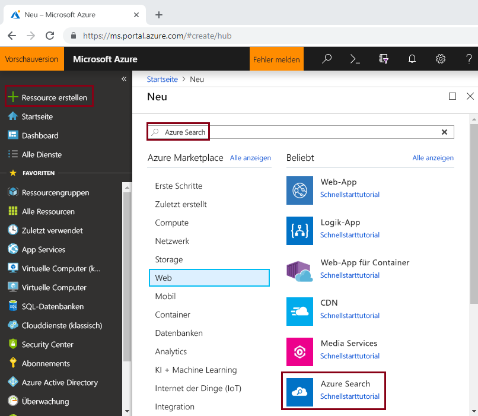
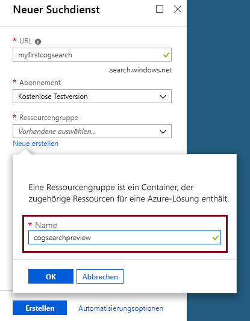
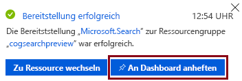
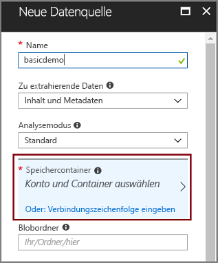
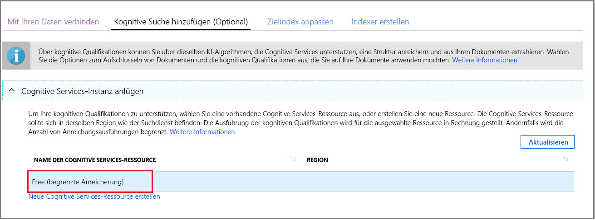
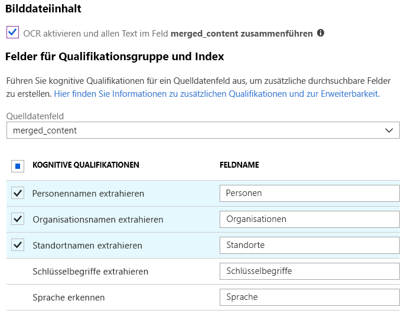
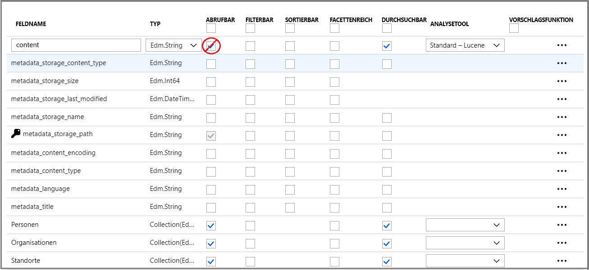
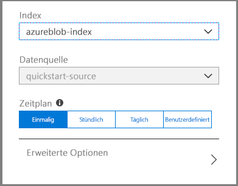
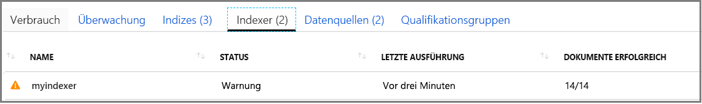

# Schnellstart: Erstellen einer Pipeline für die kognitive Suche mithilfe von Qualifikationen und Beispieldaten

Die kognitive Suche (Vorschau) fügt einer Indizierungspipeline von Azure Search Qualifikationen zur Extrahierung von Daten, Verarbeitung von natürlicher Sprache (Natural Language Processing, NLP) und Bildverarbeitung hinzu und macht nicht durchsuchbare oder unstrukturierte Inhalte besser durchsuchbar. 

Eine Pipeline für die kognitive Suche bindet [Cognitive Services-Ressourcen](https://azure.microsoft.com/services/cognitive-services/), z.B. [OCR](cognitive-search-skill-ocr.md), [Sprachenerkennung](cognitive-search-skill-language-detection.md) und [Entitätserkennung](cognitive-search-skill-entity-recognition.md), in einen Indizierungsprozess ein. Mithilfe der KI-Algorithmen von Cognitive Services wird nach Mustern, Funktionen und Merkmalen in den Quelldaten gesucht, und es werden Strukturen und Textinhalte zurückgegeben, die in Lösungen für die Volltextsuche basierend auf Azure Search verwendet werden können.

In dieser Schnellstartanleitung erstellen Sie Ihre erste Anreicherungspipeline im [Azure-Portal](https://portal.azure.com), bevor Sie auch nur eine Zeile Code schreiben:

> [!div class="checklist"]
> * Beginnen Sie mit Beispieldaten in Azure Blob Storage
> * Konfigurieren Sie den [**Datenimport-Assistenten**](search-import-data-portal.md) für kognitive Indizierung und Anreicherung 
> * Führen Sie den Assistenten aus (eine Entitäts-Qualifikation erkennt Personen, Orte und Organisationen)
> * Verwenden Sie den [**Suchexplorer**](search-explorer.md), um die angereicherten Daten abzufragen

##  Unterstützte Regionen

Sie können die kognitive Suche in einem Azure Search-Dienst ausprobieren, der in den folgenden Regionen erstellt wurde:

* USA, Westen-Mitte
* USA Süd Mitte
* USA (Ost)
* USA (Ost) 2
* USA, Westen 2
* Kanada, Mitte
* Europa, Westen
* UK, Süden
* Nordeuropa
* Brasilien Süd
* Asien, Südosten
* Indien, Mitte
* Australien (Osten)

Wenn Sie kein Azure-Abonnement besitzen, können Sie ein [kostenloses Konto](https://azure.microsoft.com/free/?WT.mc_id=A261C142F) erstellen, bevor Sie beginnen.

> [!NOTE]
> Ab dem 21. Dezember 2018 können Sie Cognitive Services-Ressourcen einer Azure Search-Qualifikationsgruppe zuordnen. Dies ermöglicht uns, für die Ausführung von Qualifikationsgruppen mit der Gebührenberechnung zu beginnen. Außerdem beginnen wir an diesem Datum damit, die Bildextraktion als Teil der Aufschlüsselung von Dokumenten zu berechnen. Die Textextraktion aus Dokumenten wird weiterhin ohne Zusatzkosten angeboten.
>
> Die Ausführung interner Qualifikationen wird nach dem bestehenden [nutzungsbasierten Preis für Cognitive Services](https://azure.microsoft.com/pricing/details/cognitive-services/) berechnet. Die Preise für die Bildextraktion entsprechen den Vorschaupreisen. Sie werden auf der [Preisseite von Azure Search](https://go.microsoft.com/fwlink/?linkid=2042400) beschrieben. [Weitere Informationen](cognitive-search-attach-cognitive-services.md).

## Voraussetzungen

[„What is cognitive search?“](cognitive-search-concept-intro.md) (Was ist kognitive Suche?) stellt die Architektur und die Komponenten für die Anreicherung vor. 

In diesem Szenario werden ausschließlich Azure-Dienste verwendet. Das Erstellen der benötigten Dienste ist Teil der Vorbereitung.

+ [Azure Blob Storage](https://azure.microsoft.com/services/storage/blobs/) stellt die Quelldaten bereit.
+ [Cognitive Services](https://azure.microsoft.com/services/cognitive-services/) stellt KI bereit (Sie können diese Ressourcen inline erstellen, wenn Sie die Pipeline angeben).
+ [Azure Search](https://azure.microsoft.com/services/search/) stellt die Pipeline für angereicherte Indizierung und eine Oberfläche für die umfassenden Freitextsuche in benutzerdefinierten Apps bereit.

### Einrichten von Azure Search

Registrieren Sie sich zunächst beim Azure Search-Dienst. 

1. Wechseln Sie zum [Azure-Portal](https://portal.azure.com), und melden Sie sich mit Ihrem Azure-Konto an.

1. Klicken Sie auf **Ressource erstellen**, suchen Sie nach Azure Search, und klicken Sie auf **Erstellen**. Wenn Sie zum ersten Mal einen Suchdienst einrichten und dazu weitere Hilfe benötigen, lesen Sie [Erstellen eines Azure Search-Diensts im Portal](search-create-service-portal.md).

  

1. Erstellen Sie unter „Ressourcengruppe“ eine neue Ressourcengruppe zur Aufnahme aller Ressourcen, die Sie im Rahmen dieses Schnellstarts erstellen. Das macht Ihnen das Bereinigen der Ressourcen nach dem Abschluss des Schnellstarts leichter.

1. Wählen Sie unter „Standort“ eine der [unterstützten Regionen](#supported-regions) für die kognitive Suche aus.

1. Für die Preisstufe können Sie einen **kostenlosen** Dienst erstellen, um Tutorials und Schnellstarts zu absolvieren. Wenn Sie eine gründlichere Untersuchung unter Verwendung Ihrer eigenen Daten wünschen, erstellen Sie einen [kostenpflichtigen Dienst](https://azure.microsoft.com/pricing/details/search/), wie etwa **Basic** oder **Standard**. 

  Ein kostenloser Dienst ist auf 3 Indizes, eine maximale Blobgröße von 16 MB und Indizierungsvorgänge von 2 Minuten Dauer beschränkt, was zum vollständigen Nutzen der Möglichkeiten der kognitiven Suche unzureichend ist. Informationen zum Überprüfen der Grenzwerte für verschiedene Stufen finden Sie unter [Diensteinschränkungen](search-limits-quotas-capacity.md).

  

  > [!NOTE]
  > Die kognitive Suche befindet sich derzeit in der öffentlichen Vorschauphase. Die Ausführung von Qualifikationsgruppen ist zurzeit in allen Stufen verfügbar, einschließlich der kostenlosen. Ohne die Zuordnung einer kostenpflichtigen Cognitive Services-Ressource, können Sie eine begrenzte Anzahl von Anreicherungen durchführen. [Weitere Informationen](cognitive-search-attach-cognitive-services.md).

1. Heften Sie den Dienst zwecks schnellem Zugriff auf Dienstinformationen an das Dashboard an.

  

### Einrichten des Azure Blob-Diensts und Laden von Beispieldaten

Die Anreicherungspipeline ruft mit Unterstützung von [Azure Search-Indexern](search-indexer-overview.md) aus Azure-Datenquellen ab. Bitte beachten Sie, dass der Azure-Tabellenspeicher für die kognitive Suche nicht unterstützt wird. Für diese Übung verwenden wir Blobspeicher, um verschiedene Inhaltstypen anschaulich vorzustellen.

1. [Laden Sie die Beispieldaten herunter](https://1drv.ms/f/s!As7Oy81M_gVPa-LCb5lC_3hbS-4), die aus einem kleinen Satz Dateien verschiedener Typen bestehen. 

1. Registrieren Sie sich für Azure Blob-Speicher, erstellen Sie ein Speicherkonto, öffnen Sie die Blobdienstseiten, und erstellen Sie einen Container. Legen Sie im Container als öffentliche Zugriffsebene **Container** fest. Weitere Informationen finden Sie im [Abschnitt „Erstellen eines Containers“](../storage/blobs/storage-unstructured-search.md#create-a-container) im Tutorial zum *Suchen von unstrukturierten Daten*.

1. Klicken Sie im von Ihnen erstellten Container auf **Hochladen**, um die in einem vorherigen Schritt heruntergeladenen Beispieldateien hochzuladen.

  

## Erstellen der Anreicherungspipeline

Kehren Sie zur Dashboardseite des Azure Search-Diensts zurück, und klicken Sie auf der Befehlsleiste auf **Daten importieren**, um die kognitive Anreicherung in vier Schritten einzurichten.

  

### Schritt 1: Erstellen einer Datenquelle

Wählen Sie unter **Verbindung mit Ihren Daten herstellen** die Option **Azure Blob Storage** sowie das erstellte Konto und den erstellten Container aus. Geben Sie der Datenquelle einen Namen, und verwenden Sie für alles andere die Standardwerte. 

  

Wechseln Sie zur nächsten Seite.

  

### Schritt 2: Hinzufügen von kognitiven Qualifikationen

Fügen Sie als nächstes der Indizierungspipeline Anreicherungsschritte hinzu. Wenn Sie über keine Cognitive Services-Ressource verfügen, können Sie sich für eine kostenlose Version registrieren, die Ihnen täglich 20 Transaktionen bietet. Die Beispieldaten umfassen 14 Dateien, sodass Ihr tägliches Kontingent zumeist aufgebraucht ist, sobald Sie diesen Assistenten ausführen.

1. Erweitern Sie **Cognitive Services-Instanz anfügen**, um Optionen für Ressourcen für Cognitive Services-APIs anzuzeigen. In diesem Tutorial können Sie die Ressource **Free** verwenden.

  

2. Erweitern Sie **Anreicherungen hinzufügen**, und wählen Sie Qualifikationen aus, die eine Verarbeitung natürlicher Sprache ausführen. Wählen Sie für diesen Schnellstart Entitätserkennung für Personen, Organisationen und Orte aus.

  

  Das Portal bietet integrierte Qualifikationen für die OCR-Verarbeitung und Textanalyse. Im Portal arbeitet eine Qualifikationsgruppe auf einem einzelnen Quellfeld. Das sieht vielleicht nach einer sehr bescheidenen Zielsetzung aus, aber im Fall von Azure-Blobs enthält das Feld `content` den größten Teil des Blob-Dokuments (beispielsweise ein Word-Dokument oder einen PowerPoint-Foliensatz). Daher stellt dieses Feld die ideale Eingabe dar, da sich hier alle Inhalte eines Blobs finden.

3. Wechseln Sie zur nächsten Seite.

  

> [!NOTE]
> Qualifikationen für die Verarbeitung natürlicher Sprache arbeiten auf Textinhalten im Beispieldatenset. Da die OCR-Option nicht ausgewählt wurde, werden die JPEG- und PNG-Dateien im Beispieldatenset im Rahmen dieses Schnellstarts nicht verarbeitet. 

### Schritt 3: Konfigurieren des Index

Der Assistent kann in der Regel einen Standardindex ableiten. In diesem Schritt können Sie das generierte Indexschema anzeigen und ggf. Einstellungen überarbeiten. Unten sehen Sie den für das Blobdataset der Demo erstellten Standardindex.

Für diesen Schnellstart legt der Assistent sinnvolle Standardwerte fest: 

+ Der Standardname lautet *azureblob-index*.
+ Der Standardschlüssel ist *metadata_storage_path* (dieses Feld enthält eindeutige Werte).
+ Standarddatentypen und -attribute gelten für Szenarien der Volltextsuche.

Löschen Sie ggf. **Abrufbar** aus dem Feld `content`. In Blobs kann dieses Feld Tausende von Zeilen ergeben. Sie können sich vorstellen, wie schwierig es wäre, Dateien mit viel Inhalt, z.B. Word-Dokumente oder PowerPoint-Foliensätze, im JSON-Format in einer Liste mit Suchergebnissen anzuzeigen. 

Da Sie eine Qualifikationsgruppe definiert haben, geht der Assistent davon aus, dass es Ihnen um das ursprüngliche Quelldatenfeld zuzüglich der von der kognitiven Pipeline erstellten Ausgabefelder geht. Aus diesem Grund fügt das Portal Indexfelder für `content`, `people`, `organizations` und `locations` hinzu. Beachten Sie, dass der Assistent diese Felder automatisch als **Abrufbar** und **Durchsuchbar** festlegt. **Durchsuchbar** gibt an, dass ein Feld durchsucht werden kann. **Abrufbar** bedeutet, dass es in Ergebnissen zurückgegeben werden kann. 

  
  
Wechseln Sie zur nächsten Seite.

  

### Schritt 4: Konfigurieren des Indexers

Der Indexer ist eine allgemeine Ressource, die den Indizierungsvorgang antreibt. Er gibt den Datenquellennamen, einen Zielindex und die Häufigkeit der Ausführung an. Das Endergebnis des **Datenimport**-Assistenten ist immer ein Indexer, der separat ausgeführt werden kann.

Auf der Seite **Indexer** können Sie den Standardnamen übernehmen und die Zeitplanoption **Einmal ausführen** zur sofortigen Ausführung verwenden. 

  

Klicken Sie auf **Senden**, um den Indexer zu erstellen und gleichzeitig auszuführen.

## Überwachen der Indizierung

Anreicherungsschritte nehmen mehr Zeit in Anspruch als das übliche textbasierte Indizieren. Der Assistent sollte die Liste „Indexer“ auf der Übersichtsseite öffnen, damit Sie den Status nachverfolgen können. Zur eigenen Navigation wechseln Sie zur Seite „Übersicht“, und klicken Sie auf **Indexer**.

Die Warnung wird angezeigt, da JPG- und PNG-Dateien Bilddateien sind und die OCR-Qualifikation bei dieser Pipeline ausgelassen wurde. Sie finden auch Benachrichtigungen über Kürzungen. Azure Search beschränkt die Extraktion auf 32.000 Zeichen für den Free-Tarif.

  

Indizierung und Anreicherung können zeitaufwändig sein, was der Grund dafür ist, dass wir fürs erste Kennenlernen kleinere Datensets empfehlen. 

## Abfragen im Suchexplorer

Nach der Erstellung eines Index können Sie Abfragen senden, um Dokumente aus dem Index zurückzugeben. Verwenden Sie im Portal den **Suchexplorer**, um Abfragen auszuführen und Ergebnisse anzuzeigen. 

1. Klicken Sie auf der Dashboardseite des Suchdiensts auf der Befehlsleiste auf **Suchexplorer**.

1. Wählen Sie oben **Index ändern** aus, um den von Ihnen erstellten Index auszuwählen.

1. Geben Sie eine Suchzeichenfolge ein, um den Index abzufragen, z.B. `search=Microsoft&searchFields=organizations`.

Die Ergebnisse werden in JSON zurückgegeben, was sehr ausführlich und schwierig zu lesen sein kann, insbesondere bei langen Dokumenten, die aus Azure-Blobs stammen. Wenn Sie die Ergebnisse nicht komfortabel durchsuchen können, verwenden Sie STRG-F, um in Dokumenten zu suchen. Bei dieser Abfrage können Sie im JSON-Code nach bestimmten Begriffen suchen. 

STRG-F kann Ihnen darüber hinaus helfen, zu ermitteln, wie viele Dokumente sich in einem bestimmten Resultset befinden. Für Azure-Blobs wählt das Portal „metadata_storage_path“ als Schlüssel aus, das jeder Wert für das Dokument eindeutig ist. Suchen Sie mithilfe von STRG-F nach „metadata_storage_path“, um die Anzahl der Dokumente zu erhalten. 

  

## Wesentliche Punkte

Sie haben jetzt Ihre erste Übung mit kognitiv angereicherter Indizierung abgeschlossen. Der Zweck dieses Schnellstarts bestand darin, Ihnen wichtige Konzepte vorzustellen und Sie praktisch durch den Assistenten zu führen, damit Sie schnell einen Prototypen einer kognitiven Suchlösung für Ihre eigenen Daten erstellen können.

Einige wichtige Konzepte, von denen wir hoffen, dass Sie sie verinnerlicht haben, schließen die Abhängigkeit von Azure-Datenquellen ein. Die Anreicherung der kognitiven Suche ist an Indexer gebunden, und Indexer sind Azure- und quellenspezifisch. Dieser Schnellstart verwendet Azure Blob Storage, jedoch sind auch andere Azure-Datenquellen möglich. Weitere Informationen finden Sie unter [Indexer in Azure Search](search-indexer-overview.md).

Ein anderes wichtiges Konzept ist, dass Qualifikationen auf Eingabefeldern arbeiten. Im Portal müssen Sie ein einzelnes Quellfeld für alle Qualifikationen auswählen. Im Code können andere Felder oder die Ausgabe einer Upstreamqualifikation als Eingaben dienen.

 Eingaben für eine Qualifikation werden einem Ausgabefeld in einem Index zugeordnet. Intern richtet das Portal [Anmerkungen](cognitive-search-concept-annotations-syntax.md) ein und definiert eine [Qualifikationsgruppe](cognitive-search-defining-skillset.md), um die Reihenfolge der Vorgänge und den allgemeinen Ablauf festzulegen. Diese Schritte sind im Portal ausgeblendet, werden aber wichtig, wenn Sie selbst mit der Erstellung von Code beginnen.

Schließlich haben Sie gelernt, dass das Anzeigen von Ergebnissen durch Abfragen des Index erreicht wird. Was Azure Search bereitstellt, ist ein durchsuchbarer Index, den Sie entweder mit der [einfachen](https://docs.microsoft.com/rest/api/searchservice/simple-query-syntax-in-azure-search) oder mit der [vollständig erweiterten Abfragesyntax](https://docs.microsoft.com/rest/api/searchservice/lucene-query-syntax-in-azure-search) abfragen können. Ein Index, der angereicherte Felder enthält, ist wie jeder andere. Wenn Sie Standard- oder [benutzerdefinierte Analysetools](search-analyzers.md), [Bewertungsprofile](https://docs.microsoft.com/rest/api/searchservice/add-scoring-profiles-to-a-search-index), [Synonyme](search-synonyms.md), [facettierte Filter](search-filters-facets.md), geografische Suche oder andere Funktionen von Azure Search einbeziehen möchten, stehen Ihnen alle Wege offen.

## Bereinigen von Ressourcen

Wenn Sie Ihre Erkundung abgeschlossen haben, besteht die schnellste Möglichkeit, das System aufzuräumen, im Löschen der Ressourcengruppe, die den Azure Search-Dienst und den Azure Blob-Dienst enthält.  

Unter der Annahme, dass Sie beide Dienste in der gleichen Gruppe platziert haben, löschen Sie nun einfach die Ressourcengruppe, um endgültig ihren gesamten Inhalt zu löschen, einschließlich der Dienste und aller gespeicherten Inhalte, die Sie für diese Übung erstellt haben. Im Portal finden Sie den Namen der Ressourcengruppe auf der Seite „Übersicht“ der einzelnen Dienste.

## Nächste Schritte

Experimentieren Sie je nach Art der Bereitstellung der Cognitive Services-Ressource mit Indizierung und Anreicherung, indem Sie den Assistenten mit verschiedenen Qualifikationen und Quelldatenfeldern erneut ausführen. Um diese Schritte zu wiederholen, löschen Sie den Index und den Indexer, und erstellen Sie den Indexer mit einer neuen Mischung von Optionen neu.

+ Wählen Sie unter **Übersicht** > **Indizes** den von Ihnen erstellten Index aus, und klicken Sie dann auf **Löschen**.

+ Doppelklicken Sie unter **Übersicht** auf die Kachel **Indexer**. Suchen Sie den von Ihnen erstellten Indexer, und löschen Sie ihn.

Alternativ können Sie die erstellten Beispieldaten und Dienste wiederverwenden und im nächsten Tutorial lernen, wie Sie diese Aufgaben programmgesteuert erledigen. 

> [!div class="nextstepaction"]
> [Tutorial: Erlernen der REST-APIs für kognitive Suche](cognitive-search-tutorial-blob.md)
