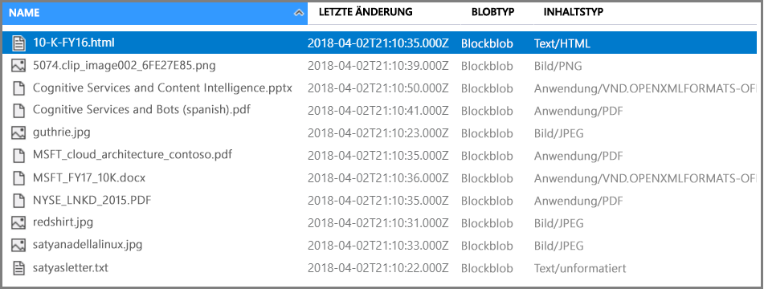

# <a name="rest-tutorial-call-cognitive-services-apis-in-an-azure-search-indexing-pipeline"></a>REST-Tutorial: Aufrufen von Cognitive Services-APIs in einer Azure Search-Indizierungspipeline

In diesem Tutorial lernen Sie die Mechanismen des Programmierens von Datenanreicherung in Azure Search mithilfe von *kognitiven Qualifikationen* kennen. Qualifikationen werden durch die Verarbeitung von natürlicher Sprache und Bildanalysefunktionen in Cognitive Services unterstützt. Durch die Zusammenstellung und Konfiguration von Qualifikationsgruppen können Sie Text und Textdarstellungen eines Bilds oder einer gescannten Dokumentdatei extrahieren. Sie können außerdem Sprachen, Entitäten, Schlüsselbegriffe und mehr erkennen. Das Endergebnis besteht in reichhaltigen zusätzlichen Inhalten in einem Azure Search-Index, die von einer KI-unterstützten Indizierungspipeline erstellt wurden. 

In diesem Tutorial werden Sie die folgenden Aufgaben mithilfe von REST-API-Aufrufen ausführen:

> [!div class="checklist"]
> * Erstellen einer Indizierungspipeline, die Beispieldaten auf dem Weg in einen Index anreichert
> * Anwenden von integrierten Qualifikationen: Entitätserkennung, Spracherkennung, Textbearbeitung und Schlüsselbegriffserkennung
> * Erfahren Sie, wie Qualifikationen miteinander verkettet werden, indem die Eingänge den Ausgängen in einer Qualifikationsgruppe zugeordnet werden
> * Ausführen von Anforderungen und Überprüfen von Ergebnissen
> * Zurücksetzen des Index und der Indexer für die weitere Entwicklung

Die Ausgabe ist ein durchsuchbarer Volltextindex auf Azure Search. Sie können den Index mit weiteren Standardfunktionen erweitern, wie etwa [Synonymen](search-synonyms.md), [Bewertungsprofilen](https://docs.microsoft.com/rest/api/searchservice/add-scoring-profiles-to-a-search-index), [Analysetools](search-analyzers.md) und [Filtern](search-filters.md).

In diesem Tutorial wird der kostenlose Dienst verwendet. Die Anzahl kostenloser Transaktionen ist allerdings auf 20 Dokumente pro Tag beschränkt. Falls Sie dieses Tutorial mehrmals am gleichen Tag ausführen möchten, verwenden Sie einen kleineren Dateisatz, um mehr Ausführungen zu ermöglichen.

> [!NOTE]
> Wenn Sie den Umfang erweitern, indem Sie die Verarbeitungsfrequenz erhöhen oder weitere Dokumente oder KI-Algorithmen hinzufügen, müssen Sie [eine kostenpflichtige Cognitive Services-Ressource anfügen](cognitive-search-attach-cognitive-services.md). Gebühren fallen beim Aufrufen von APIs in Cognitive Services sowie für die Bildextraktion im Rahmen der Dokumentaufschlüsselungsphase in Azure Search an. Für die Textextraktion aus Dokumenten fallen keine Gebühren an.
>
> Die Ausführung integrierter Qualifikationen wird nach dem bestehenden [nutzungsbasierten Preis für Cognitive Services](https://azure.microsoft.com/pricing/details/cognitive-services/) berechnet. Die Preise für die Bildextraktion werden auf der [Preisseite von Azure Search](https://go.microsoft.com/fwlink/?linkid=2042400) beschrieben.

Wenn Sie kein Azure-Abonnement besitzen, können Sie ein [kostenloses Konto](https://azure.microsoft.com/free/?WT.mc_id=A261C142F) erstellen, bevor Sie beginnen.

## <a name="prerequisites"></a>Voraussetzungen

In diesem Tutorial werden die folgenden Dienste, Tools und Daten verwendet. 

+ [Erstellen Sie ein Azure-Speicherkonto](https://docs.microsoft.com/azure/storage/common/storage-quickstart-create-account) zum Speichern der Beispieldaten. Stellen Sie sicher, dass sich das Speicherkonto in der gleichen Region wie Azure Search befindet.

+ REST-Aufrufe für Azure Search werden mithilfe der [Postman-Desktop-App](https://www.getpostman.com/) durchgeführt.

+ Die [Beispieldaten](https://1drv.ms/f/s!As7Oy81M_gVPa-LCb5lC_3hbS-4) bestehen aus einem kleinen Satz Dateien verschiedenen Typs. 

+ [Erstellen Sie einen Azure Search-Dienst](search-create-service-portal.md), oder suchen Sie in Ihrem aktuellen Abonnement [nach einem vorhandenen Dienst](https://ms.portal.azure.com/#blade/HubsExtension/BrowseResourceBlade/resourceType/Microsoft.Search%2FsearchServices). In diesem Tutorial können Sie einen kostenlosen Dienst verwenden.

## <a name="get-a-key-and-url"></a>Abrufen eines Schlüssels und einer URL

Für REST-Aufrufe sind die Dienst-URL und ein Zugriffsschlüssel für jede Anforderung erforderlich. Hierfür wird jeweils ein Suchdienst erstellt. Wenn Sie Azure Search also Ihrem Abonnement hinzugefügt haben, können Sie diese Schritte ausführen, um die erforderlichen Informationen zu erhalten:

1. [Melden Sie sich beim Azure-Portal an](https://portal.azure.com/), und rufen Sie auf der Seite **Übersicht** Ihres Suchdiensts die URL ab. Ein Beispiel für einen Endpunkt ist `https://mydemo.search.windows.net`.

1. Rufen Sie unter **Einstellungen** > **Schlüssel** einen Administratorschlüssel ab, um Vollzugriff auf den Dienst zu erhalten. Es gibt zwei austauschbare Administratorschlüssel – diese wurden zum Zweck der Geschäftskontinuität bereitgestellt, falls Sie einen Rollover für einen Schlüssel durchführen müssen. Für Anforderungen zum Hinzufügen, Ändern und Löschen von Objekten können Sie den primären oder den sekundären Schlüssel verwenden.


Für alle an Ihren Dienst gesendeten Anforderungen ist ein API-Schlüssel erforderlich. Ein gültiger Schlüssel stellt anforderungsbasiert eine Vertrauensstellung her zwischen der Anwendung, die die Anforderung versendet, und dem Dienst, der sie verarbeitet.

## <a name="prepare-sample-data"></a>Vorbereiten der Beispieldaten

Die Anreicherungspipeline lädt per Pull aus Azure-Datenquellen herunter. Quelldaten müssen von einem unterstützten Datenquellentyp eines [Azure Search-Indexers](search-indexer-overview.md) stammen. Azure Table Storage wird für die kognitive Suche nicht unterstützt. Für diese Übung verwenden wir Blobspeicher, um verschiedene Inhaltstypen anschaulich vorzustellen.

1. [Melden Sie sich beim Azure-Portal an](https://portal.azure.com), navigieren Sie zu Ihrem Azure-Speicherkonto, klicken Sie auf **BLOBs** und dann auf **+ Container**.

1. [Erstellen Sie einen Blobcontainer](https://docs.microsoft.com/azure/storage/blobs/storage-quickstart-blobs-portal) für die Beispieldaten. Sie können die öffentliche Zugriffsebene auf beliebige gültige Werte festlegen.

1. Öffnen Sie den Container nach der Erstellung, und wählen Sie in der Befehlsleiste die Option **Hochladen**, um die Beispieldateien hochzuladen, die Sie in einem vorherigen Schritt heruntergeladen haben.

   

1. Nachdem die Beispieldateien geladen wurden, rufen Sie den Containernamen und eine Verbindungszeichenfolge für Ihren Blobspeicher ab. Dazu können Sie im Azure-Portal zu Ihrem Speicherkonto navigieren. Auf **Zugriffsschlüssel**, und kopieren Sie dann das Feld **Verbindungszeichenfolge**.

   Bei der Verbindungszeichenfolge sollte es sich um eine URL ähnlich dem folgenden Beispiel handeln:

      ```http
      DefaultEndpointsProtocol=https;AccountName=cogsrchdemostorage;AccountKey=<your account key>;EndpointSuffix=core.windows.net
      ```

Es gibt andere Möglichkeiten zum Angeben der Verbindungszeichenfolge, etwa das Bereitstellen einer Shared Access Signature (SAS). Weitere Informationen über Anmeldeinformationen für Datenquellen finden Sie unter [Indizieren von Azure Blob Storage](search-howto-indexing-azure-blob-storage.md#Credentials).

## <a name="set-up-postman"></a>Einrichten von Postman

Starten Sie Postman, und richten Sie eine HTTP-Anforderung ein. Wenn Sie mit diesem Tool nicht vertraut sind, lesen Sie [Untersuchen von Azure Search-REST-APIs mit Postman oder Fiddler](search-fiddler.md).

Die in diesem Tutorial verwendeten Anforderungsmethoden sind **POST**, **PUT** und **GET**. Die Headerschlüssel sind „Content-type“ mit der Einstellung „application/json“ und „api-key“ mit der Einstellung auf einen Administratorschlüssel Ihres Azure Search-Diensts. Im Text ordnen Sie den eigentlichen Inhalt Ihres Aufrufs an. 

  

Wir nutzen Postman zum Senden von vier API-Aufrufen an Ihren Suchdienst, um eine Datenquelle, eine Qualifikationsgruppe, einen Index und einen Indexer zu erstellen. Die Datenquelle enthält einen Zeiger auf Ihr Speicherkonto und Ihre JSON-Daten. Ihr Suchdienst stellt die Verbindung beim Laden der Daten her.


## <a name="create-a-data-source"></a>Erstellen einer Datenquelle

Jetzt, da Ihre Dienste und Datenquellen vorbereitet sind, beginnen Sie damit, die Komponenten Ihrer Indizierungspipeline zusammenzustellen. Beginnen Sie mit einem [Datenquellenobjekt](https://docs.microsoft.com/rest/api/searchservice/create-data-source), das Azure Search anweist, wie die externen Quelldaten abzurufen sind.

Geben Sie im Anforderungsnamen den Dienstnamen, den Sie beim Erstellen des Azure Search-Diensts verwendet haben, und den für Ihren Suchdienst generierten API-Schlüssel an. Geben Sie im Hauptteil der Anforderung den Namen des Blobcontainers und die Verbindungszeichenfolge an.

### <a name="sample-request"></a>Beispiel für eine Anforderung
```http
POST https://[service name].search.windows.net/datasources?api-version=2019-05-06
Content-Type: application/json
api-key: [admin key]
```
#### <a name="request-body-syntax"></a>Syntax des Anforderungstexts
```json
{
  "name" : "demodata",
  "description" : "Demo files to demonstrate cognitive search capabilities.",
  "type" : "azureblob",
  "credentials" :
  { "connectionString" :
    "DefaultEndpointsProtocol=https;AccountName=<your account name>;AccountKey=<your account key>;"
  },
  "container" : { "name" : "<your blob container name>" }
}
```
Senden Sie die Anforderung. Das Web Test-Tool sollte den Erfolg durch Rückgabe von Statuscode 201 bestätigen. 

Da es sich hier um Ihre erste Anforderung handelt, überprüfen Sie im Azure-Portal, ob die Datenquelle in Azure Search erstellt wurde. Überprüfen Sie auf der Dashboard-Seite des Suchdiensts, ob die Liste „Datenquellen“ einen neuen Eintrag enthält. Möglicherweise müssen Sie einige Minuten warten, bis die Portalseite aktualisiert wurde. 

  

Wenn der Fehler 403 oder 404 angezeigt wird, überprüfen Sie die Konstruktion der Anforderung: `api-version=2019-05-06` sollte im Endpunkt vorhanden sein, `api-key` sollte im Header hinter `Content-Type` vorhanden sein, und sein Wert muss für einen Suchdienst gültig sein. Sie können den Header für die verbleibenden Schritte in diesem Tutorial wiederverwenden.

## <a name="create-a-skillset"></a>Erstellen eines Skillsets

In diesem Schritt definieren Sie eine Reihe von Anreicherungsschritten, die Sie auf Ihre Daten anwenden möchten. Jeder Anreicherungsschritt wird als *Qualifikation* und der Satz von Anreicherungsschritten als *Qualifikationsgruppe* bezeichnet. In diesem Tutorial werden für die Qualifikationsgruppe [integrierte kognitive Qualifikationen](cognitive-search-predefined-skills.md) verwendet:

+ [Spracherkennung](cognitive-search-skill-language-detection.md), um die Sprache der Inhalte zu bestimmen.

+ [Text unterteilen](cognitive-search-skill-textsplit.md), um große Inhalte vor dem Aufrufen der Schlüsselbegriffserkennungs-Qualifikation in kleinere Stücke aufzuteilen. Die Schlüsselbegriffserkennung akzeptiert Eingaben von 50.000 Zeichen oder weniger. Für einige der Beispieldateien ist eine Aufteilung erforderlich, um diesen Grenzwert zu erfüllen.

+ [Entitätserkennung](cognitive-search-skill-entity-recognition.md), um die Namen von Organisationen aus Inhalten im Blobcontainer zu extrahieren.

+ [Schlüsselbegriffserkennung](cognitive-search-skill-keyphrases.md), um die wichtigsten Schlüsselbegriffe herauszuziehen. 

### <a name="sample-request"></a>Beispiel für eine Anforderung
Bevor Sie diesen REST-Aufruf ausführen, achten Sie darauf, den Dienstnamen und den Administratorschlüssel in der Anforderung unten zu ersetzen, wenn Ihr Tool den Anforderungsheader beim Wechsel des Aufrufs nicht beibehält. 

Mit dieser Anforderung wird eine Qualifikationsgruppe erstellt. Verweisen Sie für den verbleibenden Teil dieses Tutorials auf den Namen der Qualifikationsgruppe ```demoskillset```.

```http
PUT https://[servicename].search.windows.net/skillsets/demoskillset?api-version=2019-05-06
api-key: [admin key]
Content-Type: application/json
```
#### <a name="request-body-syntax"></a>Syntax des Anforderungstexts
```json
{
  "description":
  "Extract entities, detect language and extract key-phrases",
  "skills":
  [
    {
      "@odata.type": "#Microsoft.Skills.Text.EntityRecognitionSkill",
      "categories": [ "Organization" ],
      "defaultLanguageCode": "en",
      "inputs": [
        {
          "name": "text", "source": "/document/content"
        }
      ],
      "outputs": [
        {
          "name": "organizations", "targetName": "organizations"
        }
      ]
    },
    {
      "@odata.type": "#Microsoft.Skills.Text.LanguageDetectionSkill",
      "inputs": [
        {
          "name": "text", "source": "/document/content"
        }
      ],
      "outputs": [
        {
          "name": "languageCode",
          "targetName": "languageCode"
        }
      ]
    },
    {
      "@odata.type": "#Microsoft.Skills.Text.SplitSkill",
      "textSplitMode" : "pages",
      "maximumPageLength": 4000,
      "inputs": [
        {
          "name": "text",
          "source": "/document/content"
        },
        {
          "name": "languageCode",
          "source": "/document/languageCode"
        }
      ],
      "outputs": [
        {
          "name": "textItems",
          "targetName": "pages"
        }
      ]
    },
    {
      "@odata.type": "#Microsoft.Skills.Text.KeyPhraseExtractionSkill",
      "context": "/document/pages/*",
      "inputs": [
        {
          "name": "text", "source": "/document/pages/*"
        },
        {
          "name":"languageCode", "source": "/document/languageCode"
        }
      ],
      "outputs": [
        {
          "name": "keyPhrases",
          "targetName": "keyPhrases"
        }
      ]
    }
  ]
}
```

Senden Sie die Anforderung. Das Web Test-Tool sollte den Erfolg durch Rückgabe von Statuscode 201 bestätigen. 

#### <a name="explore-the-request-body"></a>Untersuchen des Anforderungstexts

Beachten Sie, in welcher Weise die Schlüsselbegriffserkennungs-Qualifikation für die einzelnen Seiten angewendet wird. Durch Festlegen des Kontexts auf ```"document/pages/*"``` führen Sie diesen Anreicherungsschritt für jedes Element des Dokument-/Seitenarrays (für jede Seite im Dokument) aus.

Jede Qualifikation wird auf den Inhalten des Dokuments ausgeführt. Während der Verarbeitung bricht Azure Search jedes Dokument auf, um die Inhalte aus verschiedenen Dateiformaten zu lesen. Gefundener Text, der aus der Quelldatei stammt, wird in einem generierten Feld ```content``` gespeichert, einem für jedes Dokument. Legen Sie die Eingabe daher auf ```"/document/content"``` fest.

Unten finden Sie eine grafische Darstellung der Qualifikationsgruppe. 


Ausgaben können einem Index zugeordnet, als Eingabe einer Downstream-Qualifikation verwendet oder in beider Weise zugleich eingesetzt werden, wie etwa bei Sprachcode. Im Index ist ein Sprachcode zu Filterungszwecken nützlich. Als Eingabe wird ein Sprachcode von Qualifikationen zur Textanalyse verwendet, um die Linguistikregeln über Wörtertrennung zu informieren.

Weitere Informationen zu den Grundlagen von Qualifikationsgruppen finden Sie unter [How to define a skillset](cognitive-search-defining-skillset.md) (Definieren von Qualifikationsgruppen).

## <a name="create-an-index"></a>Erstellen eines Index

In diesem Abschnitt definieren Sie das Indexschema, indem Sie angeben, welche Felder in den durchsuchbaren Index aufgenommen und mit welchen Suchattributen die einzelnen Felder versehen werden sollen. Felder besitzen einen Typ und können Attribute annehmen, die bestimmen, wie das Feld verwendet wird (durchsuchbar, sortierbar usw.). Feldname in einem Index müssen nicht exakt mit den Feldnamen in der Quelle übereinstimmen. In einem späteren Schritt fügen Sie in einem Indexer Feldzuordnungen hinzu, um die Quell- und Zielfelder zu verbinden. Definieren Sie für diesen Schritt den Index mit Feldbenennungskonventionen, die für Ihre Suchanwendung angemessen sind.

In dieser Übung werden die folgenden Felder und Feldtypen verwendet:

| Feldnamen: | `id`       | Inhalt   | languageCode | keyPhrases         | organizations     |
|--------------|----------|-------|----------|--------------------|-------------------|
| field-types: | Edm.String|Edm.String| Edm.String| List<Edm.String>  | List<Edm.String>  |


### <a name="sample-request"></a>Beispiel für eine Anforderung
Bevor Sie diesen REST-Aufruf ausführen, achten Sie darauf, den Dienstnamen und den Administratorschlüssel in der Anforderung unten zu ersetzen, wenn Ihr Tool den Anforderungsheader beim Wechsel des Aufrufs nicht beibehält. 

Mit dieser Anforderung wird ein Index erstellt. Verwenden Sie den Indexnamen ```demoindex``` für den verbleibenden Teil dieses Tutorials.

```http
PUT https://[servicename].search.windows.net/indexes/demoindex?api-version=2019-05-06
api-key: [api-key]
Content-Type: application/json
```
#### <a name="request-body-syntax"></a>Syntax des Anforderungstexts

```json
{
  "fields": [
    {
      "name": "id",
      "type": "Edm.String",
      "key": true,
      "searchable": true,
      "filterable": false,
      "facetable": false,
      "sortable": true
    },
    {
      "name": "content",
      "type": "Edm.String",
      "sortable": false,
      "searchable": true,
      "filterable": false,
      "facetable": false
    },
    {
      "name": "languageCode",
      "type": "Edm.String",
      "searchable": true,
      "filterable": false,
      "facetable": false
    },
    {
      "name": "keyPhrases",
      "type": "Collection(Edm.String)",
      "searchable": true,
      "filterable": false,
      "facetable": false
    },
    {
      "name": "organizations",
      "type": "Collection(Edm.String)",
      "searchable": true,
      "sortable": false,
      "filterable": false,
      "facetable": false
    }
  ]
}
```
Senden Sie die Anforderung. Das Web Test-Tool sollte den Erfolg durch Rückgabe von Statuscode 201 bestätigen. 

Weitere Informationen zum Definieren eines Index finden Sie unter [Index erstellen (Azure Search REST-API)](https://docs.microsoft.com/rest/api/searchservice/create-index).


## <a name="create-an-indexer-map-fields-and-execute-transformations"></a>Erstellen eines Indexers, Zuordnen von Feldern und Ausführen von Transformationen

Bisher haben Sie eine Datenquelle, eine Qualifikationsgruppe und einen Index erstellt. Diese drei Komponenten werden Teil eines [Indexers](search-indexer-overview.md), der jedes einzelne Stück per Pull in einen einzelnen mehrstufigen Vorgang herunterlädt. Um diese in einem Indexer zusammenzuführen, müssen Sie Feldzuordnungen definieren. 

+ fieldMappings werden vor der Qualifikationsgruppe verarbeitet, und die Quellfelder der Datenquelle werden Zielfeldern in einem Index zugeordnet. Wenn die Feldnamen und -typen auf beiden Seiten gleich sind, ist keine Zuordnung erforderlich.

+ outputFieldMappings werden nach der Qualifikationsgruppe verarbeitet. Es wird auf nicht vorhandene sourceFieldNames verwiesen, bis diese per Dokumententschlüsselung oder Anreicherung erstellt werden. targetFieldName ist ein Feld in einem Index.

Neben dem Verknüpfen von Ein- und Ausgaben können Sie auch Feldzuordnungen nutzen, um Datenstrukturen zu vereinfachen. Weitere Informationen finden Sie unter [Zuordnen angereicherter Felder zu einem durchsuchbaren Index](cognitive-search-output-field-mapping.md).

### <a name="sample-request"></a>Beispiel für eine Anforderung

Bevor Sie diesen REST-Aufruf ausführen, achten Sie darauf, den Dienstnamen und den Administratorschlüssel in der Anforderung unten zu ersetzen, wenn Ihr Tool den Anforderungsheader beim Wechsel des Aufrufs nicht beibehält. 

Geben Sie außerdem den Namen Ihres Indexers an. Sie können auf ihn für den Rest dieses Tutorials als ```demoindexer``` verweisen.

```http
PUT https://[servicename].search.windows.net/indexers/demoindexer?api-version=2019-05-06
api-key: [api-key]
Content-Type: application/json
```
#### <a name="request-body-syntax"></a>Syntax des Anforderungstexts

```json
{
  "name":"demoindexer", 
  "dataSourceName" : "demodata",
  "targetIndexName" : "demoindex",
  "skillsetName" : "demoskillset",
  "fieldMappings" : [
    {
      "sourceFieldName" : "metadata_storage_path",
      "targetFieldName" : "id",
      "mappingFunction" :
        { "name" : "base64Encode" }
    },
    {
      "sourceFieldName" : "content",
      "targetFieldName" : "content"
    }
  ],
  "outputFieldMappings" :
  [
    {
      "sourceFieldName" : "/document/organizations",
      "targetFieldName" : "organizations"
    },
    {
      "sourceFieldName" : "/document/pages/*/keyPhrases/*",
      "targetFieldName" : "keyPhrases"
    },
    {
      "sourceFieldName": "/document/languageCode",
      "targetFieldName": "languageCode"
    }
  ],
  "parameters":
  {
    "maxFailedItems":-1,
    "maxFailedItemsPerBatch":-1,
    "configuration":
    {
      "dataToExtract": "contentAndMetadata",
      "imageAction": "generateNormalizedImages"
    }
  }
}
```

Senden Sie die Anforderung. Das Web Test-Tool sollte die erfolgreiche Verarbeitung durch Rückgabe von Statuscode 201 bestätigen. 

Sie sollten damit rechnen, dass die Ausführung dieses Schritts mehrere Minuten in Anspruch nimmt. Das Dataset ist zwar klein, Analysequalifikationen sind aber rechenintensiv. Einige Qualifikationen, wie etwa die Bildanalyse, weisen lange Ausführungszeiten auf.

> [!TIP]
> Die Pipeline wird durch Erstellen eines Indexers aufgerufen. Wenn beim Zugriff auf die Daten, dem Zuordnen von Ein- und Ausgaben oder der Reihenfolge der Vorgänge Probleme bestehen, äußern sie sich in dieser Phase. Um die Pipeline mit Code- oder Skriptänderungen auszuführen, müssen Sie möglicherweise zuerst Objekte löschen. Weitere Informationen finden Sie unter [Reset and re-run](#reset) (Zurücksetzen und erneut Ausführen).

#### <a name="explore-the-request-body"></a>Untersuchen des Anforderungstexts

Das Skript legt ```"maxFailedItems"``` auf -1 fest, was die Indexengine anweist, Fehler beim Datenimport zu ignorieren. Dies ist nützlich, weil die Demodatenquelle nur wenige Dokumente enthält. Für eine größere Datenquelle sollten Sie den Wert größer als 0 festlegen.

Achten Sie außerdem auf die Anweisung ```"dataToExtract":"contentAndMetadata"``` in den Konfigurationsparametern. Diese Anweisung weist den Indexer an, die Inhalte aus verschiedenen Dateiformaten sowie die den einzelnen Dateien zugeordneten Metadaten automatisch zu extrahieren. 

Wenn die Inhalte extrahiert werden, können Sie ```imageAction``` darauf festlegen, Text aus in der Datenquelle gefundenen Bildern zu extrahieren. Die Konfiguration ```"imageAction":"generateNormalizedImages"``` in Kombination mit der OCR- und der Textzusammenführungsqualifikation weist den Indexer an, Text aus den Bildern zu extrahieren (beispielsweise das Wort „Stop“ aus einem Stoppschild) und ihn als Teil des Inhaltsfelds einzubetten. Dieses Verhalten betrifft sowohl die in den Dokumenten eingebetteten Bilder (denken Sie etwa an Bilder in PDF-Dateien) als auch die in der Datenquelle gefundenen Bilder, z.B. eine JPG-Datei.

## <a name="check-indexer-status"></a>Überprüfen des Indexerstatus

Nachdem der Indexer definiert wurde, wird er automatisch ausgeführt, wenn Sie die Anforderung senden. Abhängig von den kognitiven Qualifikationen, die Sie definiert haben, kann die Indizierung länger als erwartet dauern. Um herauszufinden, ob der Indexer noch ausgeführt wird, senden Sie die folgende Anforderung, um den Indexerstatus zu überprüfen.

```http
GET https://[servicename].search.windows.net/indexers/demoindexer/status?api-version=2019-05-06
api-key: [api-key]
Content-Type: application/json
```

Aus der Antwort erfahren Sie, ob der Indexer noch ausgeführt wird. Verwenden Sie nach dem Abschluss der Indizierung einen weiteren HTTP GET-Aufruf an den STATUS-Endpunkt (wie oben), um Berichte über eventuelle Fehler und Warnungen anzuzeigen, die während der Anreicherung aufgetreten sind.  

Warnungen sind bei bestimmten Kombinationen aus Quelldatei und Qualifikation häufig und weisen nicht immer auf ein Problem hin. Im Rahmen dieses Tutorials sind die Warnungen gutartig (z.B. keine Texteingaben aus den JPEG-Dateien). Sie können die Statusantwort für ausführliche Informationen über Warnungen überprüfen, die während der Indizierung ausgegeben wurden.
 
## <a name="query-your-index"></a>Abfragen Ihres Index

Führen Sie nach dem Abschluss der Indizierung Abfragen aus, die die Inhalte einzelner Felder zurückgeben. Standardmäßig gibt Azure Search die obersten 50 Ergebnisse zurück. Die Beispieldaten sind klein, so dass die Standardeinstellung gut funktioniert. Beim Arbeiten mit größeren Datensets müssen Sie jedoch möglicherweise Parameter in die Abfragezeichenfolge aufnehmen, um mehr Ergebnisse zurückzugeben. Anweisungen finden Sie unter [How to page results in Azure Search](search-pagination-page-layout.md) (Seitenweise Ausgabe von Ergebnissen in Azure Search).

Fragen Sie als Überprüfungsschritt den Index nach allen Feldern ab.

```http
GET https://[servicename].search.windows.net/indexes/demoindex?api-version=2019-05-06
api-key: [api-key]
Content-Type: application/json
```

Die Ausgabe ist das Indexschema mit dem Namen, dem Typ und den Attributen für jedes Feld.

Senden Sie eine zweite Abfrage nach `"*"`, um alle Inhalte eines einzelnen Felds zurückzugeben, z.B. `organizations`.

```http
GET https://[servicename].search.windows.net/indexes/demoindex/docs?search=*&$select=organizations&api-version=2019-05-06
api-key: [api-key]
Content-Type: application/json
```

Wiederholen Sie das Verfahren in dieser Übung für weitere Felder: „content“, „languageCode“, „keyPhrases“ und „organizations“. Mithilfe von `$select` können Sie unter Einsatz einer durch Trennzeichen getrennten Liste mehrere Felder zurückgeben.

Sie können GET oder POST verwenden, abhängig von der Komplexität und Länge der Abfragezeichenfolge. Weitere Informationen finden Sie unter [Abfragen mithilfe der REST-API](https://docs.microsoft.com/rest/api/searchservice/search-documents).


<a name="reset"></a>

## <a name="reset-and-rerun"></a>Zurücksetzen und erneut ausführen

In den frühen, experimentellen Phasen der Pipelineentwicklung besteht der praktikabelste Ansatz für den Übergang von einer Entwurfsphase zur nächsten darin, die Objekt aus Azure Search zu löschen und Ihrem Code zu erlauben, sie neu zu erstellen. Ressourcennamen sind eindeutig. Wenn Sie ein Objekt löschen, können Sie es unter dem gleichen Namen neu erstellen.

So indizieren Sie Ihre Dokumente mit den neuen Definitionen erneut:

1. Löschen Sie den Index, um persistente Daten zu entfernen. Löschen Sie den Indexer, um ihn für Ihren Dienst neu zu erstellen.
2. Ändern Sie eine Qualifikationsgruppe und die Indexdefinition.
3. Führen Sie eine Neuerstellung eines Index und des Indexers für den Dienst aus, um die Pipeline auszuführen. 

Sie können das Portal verwenden, um Indizes, Indexer und Qualifikationsgruppen zu löschen.

```http
DELETE https://[servicename].search.windows.net/skillsets/demoskillset?api-version=2019-05-06
api-key: [api-key]
Content-Type: application/json
```

Nach erfolgreichem Löschen wird der Statuscode 204 zurückgegeben.

In dem Maß, da Ihr Code reift, kann es sinnvoll sein, die Neuerstellungsstrategie neu zu definieren. Weitere Informationen finden  Sie unter [Neuerstellen eines Indexes](search-howto-reindex.md).

## <a name="takeaways"></a>Wesentliche Punkte

Dieses Tutorial veranschaulicht die grundlegenden Schritte beim Erstellen einer erweiterten Indizierungspipeline durch Erstellung von Komponenten: eine Datenquelle, eine Qualifikationsgruppe, ein Index und ein Indexer.

Es wurden [vordefinierte Qualifikationen](cognitive-search-predefined-skills.md) im Zusammenhang mit der Qualifikationsgruppendefinition und den Mechanismen zum Verketten von Qualifikationen mithilfe von Eingängen und Ausgängen vorgestellt. Sie haben darüber hinaus erfahren, dass `outputFieldMappings` in der Indexerdefinition erforderlich ist, um angereicherte Werte aus der Pipeline in einen durchsuchbaren Index in einem Azure Search-Dienst weiterzuleiten.

Ferner haben Sie erfahren, wie die Ergebnisse getestet werden und das System für weitere Entwicklungsschritte zurückgesetzt wird. Sie haben gelernt, dass das Ausgeben von Abfragen auf den Index die von der angereicherten Indizierungspipeline erstellte Ausgabe zurückgibt. In dieser Version ist ein Mechanismus zum Anzeigen von internen Konstrukten (vom System erstellten angereicherten Dokumenten) verfügbar. Darüber hinaus haben Sie die Überprüfung des Indexerstatus und das Löschen von Objekten vor der erneuten Ausführung einer Pipeline gelernt.

## <a name="clean-up-resources"></a>Bereinigen von Ressourcen

Die schnellste Möglichkeit, das System nach einem Tutorial aufzuräumen, besteht im Löschen der Ressourcengruppe, die den Azure Search-Dienst und den Azure Blob-Dienst enthält. Unter der Annahme, dass Sie beide Dienste in der gleichen Gruppe platziert haben, löschen Sie nun einfach die Ressourcengruppe, um endgültig ihren gesamten Inhalt zu löschen, einschließlich der Dienste und aller gespeicherten Inhalte, die Sie für dieses Tutorial erstellt haben. Im Portal finden Sie den Namen der Ressourcengruppe auf der Seite „Übersicht“ der einzelnen Dienste.

## <a name="next-steps"></a>Nächste Schritte

Anpassen oder Erweitern der Pipeline mit benutzerdefinierten Qualifikationen. Das Erstellen einer benutzerdefinierten Qualifikation die Sie einer Qualifikationsgruppe hinzufügen, ermöglicht Ihnen, eigene, von Ihnen selbst erstellte Text- oder Bildanalysen einzubeziehen. 

> [!div class="nextstepaction"]
> [Beispiel: Erstellen einer benutzerdefinierten Qualifikation](cognitive-search-create-custom-skill-example.md)
