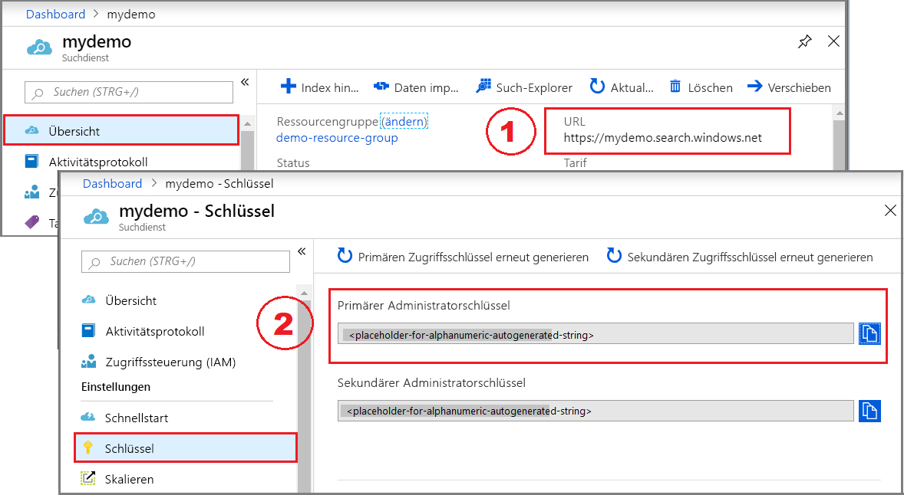

# <a name="how-to-get-started-with-knowledge-store-in-azure-search"></a>Erste Schritte mit Wissensspeichern in Azure Search

> [!Note]
> Wissensspeicher befinden sich in der Vorschau und sind nicht für die Produktion ausgelegt. Dieses Feature wird durch die [REST-API-Version 2019-05-06-Preview](search-api-preview.md) bereitgestellt. Das .NET SDK wird derzeit nicht unterstützt.
>

In [Wissensspeichern](knowledge-store-concept-intro.md) werden KI-Anreicherungen gespeichert, die bei der Indizierung in Ihrem Azure Storage-Konto für das Knowledge Mining in nachgeschalteten anderen Apps erstellt werden. Sie können auch gespeicherte Anreicherungen verwenden, um eine Azure Search-Indizierungspipeline zu verstehen und zu optimieren.

Ein Wissensspeicher wird durch eine Qualifikationsgruppe definiert. In Azure Search-Szenarien mit einer regulären Volltextsuche soll die Qualifikationsgruppe KI-Anreicherungen bereitstellen, um die Durchsuchbarkeit des Inhalts zu verbessern. Für Knowledge Mining-Szenarien besteht die Rolle einer Qualifikationsgruppe darin, mehrere Datenstrukturen zur Analyse oder Modellierung in anderen Apps und Prozessen zu erstellen, aufzufüllen und zu speichern.

Sie beginnen in dieser Übung mit Beispieldaten, -diensten und -tools, um den grundlegenden Workflow zum Erstellen und Verwenden Ihres ersten Wissensspeichers und dabei insbesondere die Bedeutung von Qualifikationsgruppendefinitionen kennenzulernen.

## <a name="prerequisites"></a>Voraussetzungen

In diesem Schnellstart werden die folgenden Dienste, Tools und Daten verwendet. 

+ [Erstellen Sie einen Azure Search-Dienst](search-create-service-portal.md), oder suchen Sie in Ihrem aktuellen Abonnement [nach einem vorhandenen Dienst](https://ms.portal.azure.com/#blade/HubsExtension/BrowseResourceBlade/resourceType/Microsoft.Search%2FsearchServices). In diesem Tutorial können Sie einen kostenlosen Dienst verwenden. 

+ [Erstellen Sie ein Azure-Speicherkonto](https://docs.microsoft.com/azure/storage/common/storage-quickstart-create-account) zum Speichern der Beispieldaten. Ihr Wissensspeicher wird in Azure Storage gespeichert. 

+ [Erstellen Sie eine Cognitive Services-Ressource](https://docs.microsoft.com/azure/cognitive-services/cognitive-services-apis-create-account) im S0-Tarif mit nutzungsbasierter Bezahlung, um umfassenden Zugriff auf das gesamte Spektrum der Qualifikationen für KI-Anreicherungen zu erhalten. Diese Ressource und Ihr Azure Search-Dienst müssen sich in der gleichen Region befinden.

+ [Postman-Desktop-App](https://www.getpostman.com/) zum Senden von Anforderungen an Azure Search.

+ [Postman-Sammlung](https://github.com/Azure-Samples/azure-search-postman-samples/tree/master/Caselaw) mit vorbereiteten Anforderungen zum Erstellen von Datenquelle, Index, Qualifikationsgruppe und Indexer. Mehrere Objektdefinitionen sind zu lang, um in diesem Artikel behandelt zu werden. Sie benötigen diese Sammlung, damit Sie die Index- und Qualifikationsgruppendefinitionen vollständig sehen können.

+ [Caselaw-Beispieldaten](https://github.com/Azure-Samples/azure-search-sample-data/tree/master/caselaw) aus dem [Caselaw Access-Projekt](https://case.law/bulk/download/) mit Downloadseite für den Massendownload. In dieser Übung werden die ersten 10 Dokumente aus dem ersten Download (Arkansas) verwendet. Wir haben ein Beispiel mit 10 Dokumenten für diese Übung auf GitHub hochgeladen.

## <a name="get-a-key-and-url"></a>Abrufen eines Schlüssels und einer URL

Für REST-Aufrufe sind die Dienst-URL und ein Zugriffsschlüssel für jede Anforderung erforderlich. Hierfür wird jeweils ein Suchdienst erstellt. Wenn Sie Azure Search also Ihrem Abonnement hinzugefügt haben, können Sie diese Schritte ausführen, um die erforderlichen Informationen zu erhalten:

1. [Melden Sie sich beim Azure-Portal an](https://portal.azure.com/), und rufen Sie auf der Seite **Übersicht** Ihres Suchdiensts die URL ab. Ein Beispiel für einen Endpunkt ist `https://mydemo.search.windows.net`.

1. Rufen Sie unter **Einstellungen** > **Schlüssel** einen Administratorschlüssel ab, um Vollzugriff auf den Dienst zu erhalten. Es gibt zwei austauschbare Administratorschlüssel – diese wurden zum Zweck der Geschäftskontinuität bereitgestellt, falls Sie einen Rollover für einen Schlüssel durchführen müssen. Für Anforderungen zum Hinzufügen, Ändern und Löschen von Objekten können Sie den primären oder den sekundären Schlüssel verwenden.

    

Für alle an Ihren Dienst gesendeten Anforderungen ist ein API-Schlüssel erforderlich.

## <a name="prepare-sample-data"></a>Vorbereiten der Beispieldaten

1. [Melden Sie sich beim Azure-Portal an](https://portal.azure.com), navigieren Sie zu Ihrem Azure-Speicherkonto, klicken Sie auf **BLOBs** und dann auf **+ Container**.

1. [Erstellen Sie einen Blobcontainer](https://docs.microsoft.com/azure/storage/blobs/storage-quickstart-blobs-portal) für die Beispieldaten. Verwenden Sie den Containernamen „caselaw-test“. Sie können die öffentliche Zugriffsebene auf beliebige gültige Werte festlegen.

1. Nachdem der Container erstellt wurde, öffnen Sie ihn, und wählen Sie auf der Befehlsleiste die Option **Hochladen** aus.

   

1. Navigieren Sie zu dem Ordner mit der Beispieldatei **caselaw-sample.json**. Wählen Sie die Datei aus, und klicken Sie dann auf **Hochladen**.


## <a name="set-up-postman"></a>Einrichten von Postman

Starten Sie Postman, und importieren Sie die Sammlung „Caselaw Postman“. Richten Sie alternativ eine Reihe von HTTP-Anforderungen ein. Wenn Sie mit diesem Tool nicht vertraut sind, lesen Sie [Untersuchen von Azure Search-REST-APIs mit Postman oder Fiddler](search-fiddler.md).

+ Für alle Aufrufe in dieser exemplarischen Vorgehensweise wird die Anforderungsmethode **PUT** oder **POST** verwendet.
+ Anforderungsheader (2) enthalten Folgendes: „Content-type“ ist auf „application/json“ und „api-key“ ist auf Ihren Administratorschlüssel (ein Platzhalter für Ihren Primärschlüssel für die Suche) festgelegt. 
+ Im Anforderungstext ordnen Sie den eigentlichen Inhalt Ihres Aufrufs an. 

  

Wir nutzen Postman zum Senden von vier API-Aufrufen an Ihren Suchdienst, um eine Datenquelle, einen Index, eine Qualifikationsgruppe und einen Indexer zu erstellen – in dieser Reihenfolge. Die Datenquelle enthält einen Zeiger auf Ihr Azure-Speicherkonto und Ihre JSON-Daten. Ihr Suchdienst stellt die Verbindung beim Importieren der Daten her.

Der Schwerpunkt dieser exemplarischen Vorgehensweise liegt auf dem [Erstellen einer Qualifikationsgruppe](#create-skillset): Sie gibt die Schritte für die Anreicherung an und wie Daten in einem Wissensspeicher aufbewahrt werden.

Im URL-Endpunkt muss eine API-Version angegeben werden, und für jeden Aufruf sollte **201 Created** zurückgegeben werden. Die Vorschauversion der API für das Erstellen einer Qualifikationsgruppe mit Unterstützung von Wissensspeichern ist `2019-05-06-Preview` (Berücksichtigung von Groß-/Kleinbuchstaben).

Führen Sie die folgenden API-Aufrufe über Ihren REST-Client aus.

## <a name="create-a-data-source"></a>Erstellen einer Datenquelle

Die [API zum Erstellen einer Datenquelle](https://docs.microsoft.com/rest/api/searchservice/create-data-source) erstellt ein Azure Search-Objekt, das angibt, welche Daten indiziert werden sollen.

Der Endpunkt dieses Aufrufs lautet `https://[service name].search.windows.net/datasources?api-version=2019-05-06-Preview`. 

1. Ersetzen Sie `[service name]` durch den Namen Ihres Suchdiensts. 

2. Für diesen Aufruf muss der Anforderungstext die Verbindungszeichenfolge Ihres Speicherkontos und den Namen des Blobcontainers enthalten. Sie finden die Verbindungszeichenfolge im Azure-Portal unter den **Zugriffsschlüsseln** Ihres Speicherkontos. 

   Ersetzen Sie die Verbindungszeichenfolge und den Namen des Blobcontainers im Anforderungstext unbedingt, bevor Sie den Aufruf ausführen.

    ```json
    {
        "name": "caselaw-ds",
        "description": null,
        "type": "azureblob",
        "subtype": null,
        "credentials": {
            "connectionString": "DefaultEndpointsProtocol=https;AccountName=<YOUR-STORAGE-ACCOUNT>;AccountKey=<YOUR-STORAGE-KEY>;EndpointSuffix=core.windows.net"
        },
        "container": {
            "name": "<YOUR-BLOB-CONTAINER-NAME>",
            "query": null
        },
        "dataChangeDetectionPolicy": null,
        "dataDeletionDetectionPolicy": null
    }
    ```

3. Senden Sie die Anforderung. Die Antwort sollte **201** lauten, und der Antworttext sollte mit der von Ihnen angegebenen Anforderungsnutzlast nahezu identisch sein.

    ```json
    {
        "name": "caselaw-ds",
        "description": null,
        "type": "azureblob",
        "subtype": null,
        "credentials": {
            "connectionString": "DefaultEndpointsProtocol=https;AccountName=<your storage account>;AccountKey=<your storage key>;EndpointSuffix=core.windows.net"
        },
        "container": {
            "name": "<your blob container name>",
            "query": null
        },
        "dataChangeDetectionPolicy": null,
        "dataDeletionDetectionPolicy": null
    }
    ```

## <a name="create-an-index"></a>Erstellen eines Index
    
Beim zweiten Aufruf wird die [API zum Erstellen eines Index](https://docs.microsoft.com/rest/api/searchservice/create-data-source) aufgerufen, die einen Azure Search-Index mit allen durchsuchbaren Daten erstellt. Ein Index gibt alle Felder, Parameter und Attribute an.

Sie benötigen für das Knowledge Mining nicht unbedingt einen Index, es wird aber nur dann ein Indexer ausgeführt, wenn ein Index angegeben wird. 

Die URL für diesen Aufruf lautet `https://[service name].search.windows.net/indexes?api-version=2019-05-06-Preview`.

1. Ersetzen Sie `[service name]` durch den Namen Ihres Suchdiensts.

2. Kopieren Sie die Indexdefinition aus der Anforderung für die Indexerstellung in der Postman-Sammlung in den Anforderungstext. Die Indexdefinition ist mehrere hundert Zeilen lang und kann daher hier nicht wiedergegeben werden. 

   Die äußere Ebene eines Index besteht aus den folgenden Elementen. 

   ```json
   {
      "name": "caselaw",
      "defaultScoringProfile": null,
      "fields": [],
      "scoringProfiles": [],
      "corsOptions": null,
      "suggesters": [],
      "analyzers": [],
      "tokenizers": [],
      "tokenFilters": [],
      "charFilters": [],
      "encryptionKey": null
   }
   ```

3. Die Sammlung `fields` enthält den größten Teil der Indexdefinition. Sie enthält einfache Felder, [komplexe Felder](search-howto-complex-data-types.md) mit geschachtelten Unterstrukturen und Sammlungen.

   Sehen Sie sich die Felddefinition für `casebody` in den Zeilen 302–384 an. Beachten Sie, dass ein komplexes Feld nur dann andere komplexe Felder enthalten kann, wenn hierarchische Darstellungen benötigt werden.

   ```json
   {
    "name": "casebody",
    "type": "Edm.ComplexType",
    "fields": [
        {
            "name": "status",
            "type": "Edm.String",
            "searchable": true,
            "filterable": true,
            "retrievable": true,
            "sortable": true,
            "facetable": true,
            "key": false,
            "indexAnalyzer": null,
            "searchAnalyzer": null,
            "analyzer": null,
            "synonymMaps": []
        },
        {
            "name": "data",
            "type": "Edm.ComplexType",
            "fields": [
                {
                    "name": "head_matter",
                    "type": "Edm.String",
                    "searchable": true,
                    "filterable": false,
                    "retrievable": true,
                    "sortable": false,
                    "facetable": false,
                    "key": false,
                    "indexAnalyzer": null,
                    "searchAnalyzer": null,
                    "analyzer": null,
                    "synonymMaps": []
                },
                {
                    "name": "opinions",
                    "type": "Collection(Edm.ComplexType)",
                    "fields": [
                        {
                            "name": "author",
                            "type": "Edm.String",
                            "searchable": true,
                            "filterable": true,
                            "retrievable": true,
                            "sortable": false,
                            "facetable": true,
                            "key": false,
                            "indexAnalyzer": null,
                            "searchAnalyzer": null,
                            "analyzer": null,
                            "synonymMaps": []
                        },
                        {
                            "name": "text",
                            "type": "Edm.String",
                            "searchable": true,
                            "filterable": false,
                            "retrievable": true,
                            "sortable": false,
                            "facetable": false,
                            "key": false,
                            "indexAnalyzer": null,
                            "searchAnalyzer": null,
                            "analyzer": null,
                            "synonymMaps": []
                        },
                        {
                            "name": "type",
                            "type": "Edm.String",
                            "searchable": true,
                            "filterable": true,
                            "retrievable": true,
                            "sortable": false,
                            "facetable": true,
                            "key": false,
                            "indexAnalyzer": null,
                            "searchAnalyzer": null,
                            "analyzer": null,
                            "synonymMaps": []
                        }
                    ]
                },
    . . .
   ```

4. Senden Sie die Anforderung. 

   Die Antwort sollte **201** lauten und dem folgenden Beispiel ähneln, in dem die ersten Felder gezeigt werden:

    ```json
    {
        "name": "caselaw",
        "defaultScoringProfile": null,
        "fields": [
            {
                "name": "id",
                "type": "Edm.String",
                "searchable": true,
                "filterable": true,
                "retrievable": true,
                "sortable": true,
                "facetable": true,
                "key": true,
                "indexAnalyzer": null,
                "searchAnalyzer": null,
                "analyzer": null,
                "synonymMaps": []
            },
            {
                "name": "name",
                "type": "Edm.String",
                "searchable": true,
                "filterable": true,
                "retrievable": true,
                "sortable": true,
                "facetable": true,
                "key": false,
                "indexAnalyzer": null,
                "searchAnalyzer": null,
                "analyzer": null,
                "synonymMaps": []
            },
      . . .
    ```

<a name="create-skillset"></a>

## <a name="create-a-skillset-and-knowledge-store"></a>Erstellen von Qualifikationsgruppen und Wissensspeichern

Die [API zum Erstellen einer Qualifikationsgruppe](https://docs.microsoft.com/rest/api/searchservice/create-skillset) erstellt ein Azure Search-Objekt, das angibt, welche kognitiven Qualifikationen aufgerufen werden sollen, wie die Qualifikationen verkettet werden sollen und wie ein Wissensspeicher angegeben wird (für diese exemplarische Vorgehensweise besonders wichtig).

Der Endpunkt dieses Aufrufs lautet `https://[service name].search.windows.net/skillsets?api-version=2019-05-06-Preview`.

1. Ersetzen Sie `[service name]` durch den Namen Ihres Suchdiensts.

2. Kopieren Sie die Definition der Qualifikationsgruppe aus der Anforderung für die Qualifikationsgruppenerstellung in der Postman-Sammlung in den Anforderungstext. Die Definition der Qualifikationsgruppe ist mehrere hundert Zeilen lang, und kann daher hier nicht gezeigt werden – sie ist aber für diese exemplarische Vorgehensweise besonders wichtig.

   Die äußere Ebene einer Qualifikationsgruppe besteht aus den folgenden Elementen. Die Sammlung `skills` definiert die speicherinternen Anreicherungen, während die `knowledgeStore`-Definition angibt, wie die Ausgabe gespeichert wird. Die `cognitiveServices`-Definition ist Ihre Verbindung mit den Engines zur KI-Anreicherung.

   ```json
   {
    "name": "caselaw-ss",
    "description": null,
    "skills": [],
    "cognitiveServices": [],
    "knowledgeStore": []
   }
   ```

3. Legen Sie zunächst Schlüssel und Verbindungszeichenfolge für `cognitiveServices` und `knowledgeStore` fest. In diesem Beispiel stehen diese Zeichenfolgen hinter der Definition der Qualifikationsgruppe am Ende des Anforderungstexts. Verwenden Sie eine Cognitive Services-Ressource, die auf der Dienstebene S0 bereitgestellt wird und sich in der gleichen Region wie Azure Search befindet.

    ```json
    "cognitiveServices": {
        "@odata.type": "#Microsoft.Azure.Search.CognitiveServicesByKey",
        "description": "YOUR-SAME-REGION-S0-COGNITIVE-SERVICES-RESOURCE",
        "key": "YOUR-COGNITIVE-SERVICES-KEY"
    },
    "knowledgeStore": {
        "storageConnectionString": "YOUR-STORAGE-ACCOUNT-CONNECTION-STRING",
    ```

3. Überprüfen Sie die Sammlung der Qualifikationsgruppe – insbesondere die Shaper-Qualifikationen in den Zeilen 85 und 170. Die Qualifikation „Shaper“ ist wichtig, da sie die Datenstrukturen für das Knowledge Mining umfasst. Während der Ausführung der Qualifikationsgruppe befinden sich diese Strukturen ausschließlich im Arbeitsspeicher. Sie werden aber im nächsten Schritt sehen, dass diese Ausgabe für die weitere Untersuchung in einem Wissensspeicher gespeichert werden kann.

   Der folgende Codeausschnitt stammt aus Zeile 217. 

    ```json
    "name": "Opinions",
    "source": null,
    "sourceContext": "/document/casebody/data/opinions/*",
    "inputs": [
        {
            "name": "Text",
            "source": "/document/casebody/data/opinions/*/text"
        },
        {
            "name": "Author",
            "source": "/document/casebody/data/opinions/*/author"
        },
        {
            "name": "Entities",
            "source": null,
            "sourceContext": "/document/casebody/data/opinions/*/text/pages/*/entities/*",
            "inputs": [
                {
                    "name": "Entity",
                    "source": "/document/casebody/data/opinions/*/text/pages/*/entities/*/value"
                },
                {
                    "name": "EntityType",
                    "source": "/document/casebody/data/opinions/*/text/pages/*/entities/*/category"
                }
            ]
        }
    ]
   . . .
   ```

3. Sehen Sie sich das `projections`-Element in `knowledgeStore` an, das ab Zeile 262 beginnt. Projektionen geben die Zusammensetzung des Wissensspeichers an. Projektionen werden in Tabelle-Objekt-Paaren angegeben – derzeit jedoch nur einzeln. Wie Sie in der ersten Projektion sehen können, ist `tables` angegeben, `objects` aber nicht. Im zweiten Fall ist es umgekehrt.

   In Azure Storage werden die von Ihnen erstellten Tabellen im Tabellenspeicher gespeichert, und jedes Objekt erhält einen Container in Blob Storage.

   Blobobjekte enthalten in der Regel den vollständigen Ausdruck einer Anreicherung. Tabellen enthalten in der Regel teilweise Anreicherungen in Kombinationen, die Sie für bestimmte Zwecke festlegen. Dieses Beispiel zeigt die Tabellen „Cases“ und „Opinions“, nicht gezeigt werden jedoch andere Tabellen wie „Entities“, „Attorneys“ „Judges“ und „Parties“.

    ```json
    "projections": [
        {
            "tables": [
                {
                    "tableName": "Cases",
                    "generatedKeyName": "CaseId",
                    "source": "/document/Case"
                },
                {
                    "tableName": "Opinions",
                    "generatedKeyName": "OpinionId",
                    "source": "/document/Case/OpinionsSnippets/*"
                }
            ],
            "objects": []
        },
        {
            "tables": [],
            "objects": [
                {
                    "storageContainer": "enrichedcases",
                    
                    "source": "/document/CaseFull"
                }
            ]
        }
    ]
    ```

5. Senden Sie die Anforderung. Die Antwort sollte **201** lauten und dem folgenden Beispiel ähneln, in dem der erste Teil der Antwort gezeigt wird:

    ```json
    {
    "name": "caselaw-ss",
    "description": null,
    "skills": [
        {
            "@odata.type": "#Microsoft.Skills.Text.SplitSkill",
            "name": "SplitSkill#1",
            "description": null,
            "context": "/document/casebody/data/opinions/*/text",
            "defaultLanguageCode": "en",
            "textSplitMode": "pages",
            "maximumPageLength": 5000,
            "inputs": [
                {
                    "name": "text",
                    "source": "/document/casebody/data/opinions/*/text
                }
            ],
            "outputs": [
                {
                    "name": "textItems",
                    "targetName": "pages"
                }
            ]
        },
        . . .
    ```

## <a name="create-and-run-an-indexer"></a>Erstellen und Ausführen eines Indexers

Die [API zum Erstellen eines Indexers](https://docs.microsoft.com/rest/api/searchservice/create-indexer) erstellt einen Indexer und führt diesen sofort aus. Alle Definitionen, die Sie bisher erstellt haben, werden in diesem Schritt gestartet. Der Indexer wird sofort ausgeführt, da er nicht im Dienst enthalten ist. Wenn er vorhanden ist, stellt ein POST-Aufruf an einen vorhandenen Indexer einen Updatevorgang dar.

Der Endpunkt dieses Aufrufs lautet `https://[service name].search.windows.net/indexers?api-version=2019-05-06-Preview`.

1. Ersetzen Sie `[service name]` durch den Namen Ihres Suchdiensts. 

2. Der Anforderungstext für diesen Aufruf gibt den Namen des Indexers an. Für den Indexer sind eine Datenquelle und ein Index erforderlich. Eine Qualifikationsgruppe ist für einen Indexer optional, bei KI-Anreicherungen aber erforderlich.

    ```json
    {
        "name": "caselaw-idxr",
        "description": null,
        "dataSourceName": "caselaw-ds",
        "skillsetName": "caselaw-ss",
        "targetIndexName": "caselaw",
        "disabled": null,
        "schedule": null,
        "parameters": {
            "batchSize": 1,
            "maxFailedItems": null,
            "maxFailedItemsPerBatch": null,
            "base64EncodeKeys": null,
            "configuration": {
                "parsingMode": "jsonLines"
            }
        },
        "fieldMappings": [],
        "outputFieldMappings": [
            {
                "sourceFieldName": "/document/casebody/data/opinions/*/text/pages/*/people/*",
                "targetFieldName": "people",
                "mappingFunction": null
            },
            {
                "sourceFieldName": "/document/casebody/data/opinions/*/text/pages/*/organizations/*",
                "targetFieldName": "orginizations",
                "mappingFunction": null
            },
            {
                "sourceFieldName": "/document/casebody/data/opinions/*/text/pages/*/locations/*",
                "targetFieldName": "locations",
                "mappingFunction": null
            },
            {
                "sourceFieldName": "/document/Case/OpinionsSnippets/*/Entities/*",
                "targetFieldName": "entities",
                "mappingFunction": null
            },
            {
                "sourceFieldName": "/document/casebody/data/opinions/*/text/pages/*/keyPhrases/*",
                "targetFieldName": "keyPhrases",
                "mappingFunction": null
            }
        ]
    }
    ```

3. Senden Sie die Anforderung. Die Antwort sollte **201** lauten, und der Antworttext sollte mit der von Ihnen angegebenen Anforderungsnutzlast nahezu identisch sein (der Übersichtlichkeit halber gekürzt).

    ```json
    {
        "name": "caselaw-idxr",
        "description": null,
        "dataSourceName": "caselaw-ds",
        "skillsetName": "caselaw-ss",
        "targetIndexName": "caselaw",
        "disabled": null,
        "schedule": null,
        "parameters": {
            "batchSize": 1,
            "maxFailedItems": null,
            "maxFailedItemsPerBatch": null,
            "base64EncodeKeys": null,
            "configuration": {
                "parsingMode": "jsonLines"
            }
        },
        "fieldMappings": [],
        "outputFieldMappings": [
            {
                "sourceFieldName": "/document/casebody/data/opinions/*/text/pages/*/people/*",
                "targetFieldName": "people",
                "mappingFunction": null
            }
        ]
    }
    ```

## <a name="explore-knowledge-store"></a>Erkunden von Wissensspeichern

Sie können mit dem Erkunden beginnen, sobald das erste Dokument importiert wurde. Verwenden Sie für diese Aufgabe den [**Storage-Explorer**](https://docs.microsoft.com/azure/storage/blobs/storage-quickstart-blobs-storage-explorer) im Portal.

Es ist wichtig zu wissen, dass ein Wissensspeicher vollständig von Azure Search unabhängig ist. Sowohl der Azure Search-Index als auch der Wissensspeicher enthalten die Datendarstellung und die Inhalte, aber bei allem anderen unterscheiden sie sich. Verwenden Sie den Index für Volltextsuchen, gefilterte Suchen und alle Szenarien, die in Azure Search unterstützt werden. Oder arbeiten Sie im Weiteren ausschließlich mit Ihrem Wissensspeicher, und fügen Sie andere zum Analysieren von Inhalten an.

## <a name="takeaways"></a>Wesentliche Punkte

Sie haben nun Ihren ersten Wissensspeicher in Azure Storage erstellt und mit Storage-Explorer die Anreicherungen angezeigt. Dies sind die grundlegenden Schritte für die Arbeit mit gespeicherten Anreicherungen. 

## <a name="next-steps"></a>Nächste Schritte

Die Qualifikation „Shaper“ erledigt die meisten Aufgaben für das Erstellen von granularen Datenformen, die in neuen Formen kombiniert werden können. Sehen Sie sich als Nächstes die Referenzseite für diese Qualifikation an, um Einzelheiten zu ihrer Verwendung zu erfahren.

> [!div class="nextstepaction"]
> [Referenz der Qualifikation „Shaper“](cognitive-search-skill-shaper.md)


<!---
## Keep This

How to convert unformatted JSON into an indented JSON document structure that allows you to quickly identify nested structures. Useful for creating an index that includes complex types.

1. Use Visual Studio Code.
2. Open data.jsonl
--->