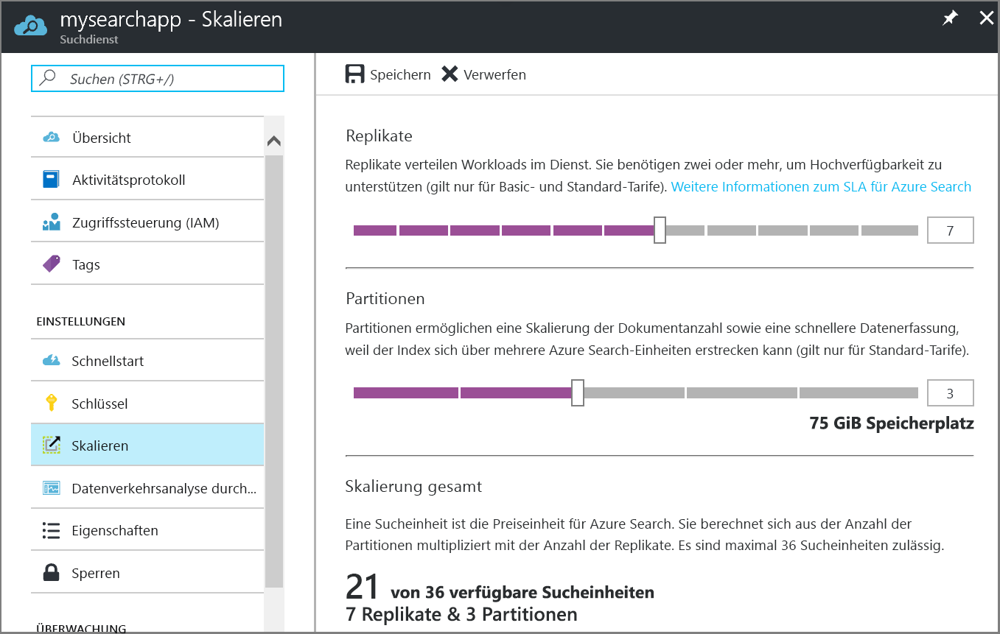

# Erstellen eines Azure-Suchdiensts im portal

Dieser Artikel beschreibt die Vorgehensweise beim Erstellen oder Bereitstellen eines Azure-Suchdiensts im Portal. PowerShell-Anweisungen finden Sie unter [Verwalten von Azure Search mit PowerShell](search-manage-powershell.md).

## Abonnieren Sie (kostenlos oder bezahlt)

[Öffnen Sie ein kostenloses Azure-Konto](https://azure.microsoft.com/pricing/free-trial/?WT.mc_id=A261C142F) und verwenden Sie kostenlose Guthaben, probieren Sie ein kostenpflichtiges Azure-Dienste. Nach dem Guthaben aufgebraucht sind, behalten Sie das Konto und kostenlose Azure-Diensten wie Websites verwenden. Ihre Kreditkarte wird nie in Rechnung gestellt, wenn Sie explizit ändern Sie die Einstellungen, und bitten Sie in Rechnung gestellt.

Alternativ können Sie [MSDN-abonnentenvorteile aktivieren](https://azure.microsoft.com/pricing/member-offers/msdn-benefits-details/?WT.mc_id=A261C142F). Ein MSDN-Abonnement bietet Ihnen Gutschriften jedes Monats, den Sie für kostenpflichtige Azure-Dienste verwenden können. 

## Suchen Sie die Azure-Suchdienst
1. Melden Sie sich beim [Azure-Portal](https://portal.azure.com/) an.
2. Klicken Sie auf das Pluszeichen ("+") in der oberen linken Ecke.
3. Wählen Sie **Web + Mobil** > **Azure Search**.

## Benennen Sie den Dienst und den URL-Endpunkt

Ein Dienstname ist Teil der URL-Endpunkt für die API-Aufrufe ausgegeben werden. Geben Sie den Dienstnamen in der **URL** Feld. 

Anforderungen an den Namen:
   * 2 und 60 Zeichen lang sein
   * Kleinbuchstaben, Ziffern oder Bindestriche ("-")
   * keine Bindestriche ("-") als die ersten 2 Zeichen oder die letzten Einzelzeichen
   * keine aufeinander folgenden Bindestriche ("--")

## Wählen Sie ein Abonnement
Wenn Sie über mehrere Abonnements verfügen, wählen Sie einen, der auch Daten oder Storage Services verfügt. Azure Search kann automatische Erkennung Azure Tabellen- und Blob-Speicher, SQL-Datenbank und Azure-Cosmos-Datenbank für die Indizierung über *Indexer*, sondern nur für Dienste im selben Abonnement.

## Wählen Sie eine Ressourcengruppe ein.
Eine Ressourcengruppe handelt es sich um eine Sammlung von Azure-Dienste und Ressourcen, die zusammen verwendet werden. Wenn Sie Azure Search zum Indizieren einer SQL-Datenbank verwenden, sollten beide Dienste z. B. Teil der gleichen Ressourcengruppe sein.

> [!TIP]
> Durch das Löschen einer Ressourcengruppe werden auch die Dienste darin gelöscht. Bei Prototypprojekten mit mehreren Diensten erleichtert versetzen alle von ihnen in der gleichen Ressourcengruppe Cleanup nach Abschluss des Projekts. 

## Wählen Sie einen Speicherort hosting 
Als Azure-Dienst kann Azure Search in Rechenzentren weltweit gehostet werden. Beachten Sie, dass [Preise können sich unterscheiden,](https://azure.microsoft.com/pricing/details/search/) nach Geografie.

## Wählen Sie einen Tarif (SKU)
[Azure-Suchdienst wird derzeit in mehrere Preisstufen angeboten](https://azure.microsoft.com/pricing/details/search/): kostenlos, Basic oder Standard. Jede Ebene hat ein eigenes [Kapazität und Grenzwerte](search-limits-quotas-capacity.md). Finden Sie unter [wählen Sie eine Preisstufe Ebene oder SKU](search-sku-tier.md) Anleitungen.

In dieser exemplarischen Vorgehensweise haben wir die Standard-Ebene für den Dienst.

## Erstellen Sie den Dienst

Denken Sie daran, den Dienst für das Dashboard für den leichteren Zugriff anheften, wenn Sie sich anmelden.

## Ihr Dienst skalieren
Es kann einige Minuten zum Erstellen eines Diensts (15 Minuten oder mehr, je nach der Ebene). Nachdem der Dienst bereitgestellt wurde, können Sie darauf, um Ihren Bedürfnissen skalieren. Da Sie die Standard-Ebene für den Azure Search-Dienst ausgewählt haben, können Sie Ihren Dienst skalieren, in zwei Dimensionen: Replikate und Partitionen. Sie die Basisebene ausgewählt haben, können Sie nur Replikate hinzufügen. Wenn Sie den kostenlosen Dienst bereitgestellt haben, ist die Skalierung nicht verfügbar.

***Partitionen*** ermöglichen Sie Ihren Dienst zum Speichern und weitere Dokumente durchsuchen.

***Replikate*** ermöglichen Sie Ihren Dienst um eine höhere Auslastung von Suchabfragen zu behandeln.

> [!Important]
> Ein Dienst benötigen [2 Replikate für nur-Lese SLA und 3 Replikate für Lese-/Schreibzugriff SLA](https://azure.microsoft.com/support/legal/sla/search/v1_0/).

1. Fahren Sie mit der Search-Dienst Blatt im Azure-Portal.
2. Wählen Sie im linken Navigationsbereich **Einstellungen** > **Skalierung**.
3. Verwenden Sie die Slidebar, Replikate oder Partitionen hinzufügen.

> [!Note] 
> Jede Ebene hat unterschiedliche [Grenzwerte](search-limits-quotas-capacity.md) auf die Gesamtzahl der Sucheinheiten in einem einzigen Dienst zulässig (Replikate * Partitionen = insgesamt Sucheinheiten).

## Beim Hinzufügen eines zweiten-Diensts

Überwiegende Mehrheit der Kunden verwenden Sie nur ein Dienst bereitgestellt, die auf einer Ebene, die bietet die [Saldo von Ressourcen mit der rechten Maustaste](search-sku-tier.md). Ein Dienst kann mehrere Indizes, unterliegen hosten die [maximalen Anzahl der Ebene der Auswahl](search-capacity-planning.md), mit jedem Index voneinander isoliert. In Azure Search können Anforderungen nur an einen Index, minimieren das Risiko von versehentliche oder vorsätzliche Datenabruf von anderen Indizes im selben Dienst weitergeleitet.

Obwohl die meisten Kunden nur einem Dienst verwenden, möglicherweise Dienst Redundanz erforderlich, wenn operational Anforderungen Folgendes einschließen:

+ Wiederherstellung im Notfall (Ausfall des Rechenzentrums). Azure Search bietet keine sofortiges Failover bei einem Ausfall. Empfehlungen und Anleitungen finden Sie unter [-Service-Verwaltung](search-manage.md).
+ Die Untersuchung der mehrinstanzenfähigkeit Modellierung hat ergeben, dass zusätzliche Dienste den optimalen Entwurf. Weitere Informationen finden Sie unter [Entwurf für mehrinstanzenfähigkeit](search-modeling-multitenant-saas-applications.md).
+ Für Global bereitgestellte Anwendungen müssen Sie möglicherweise eine Instanz von Azure Search in mehreren Regionen Latenz von Ihrer Anwendung internationale Datenverkehr zu minimieren.

> [!NOTE]
> In Azure Search kann nicht Indizierung und Abfragen von Arbeitslasten Verwaltungsrechte werden; Deshalb würden Sie niemals mehrere Dienste für separater Arbeitslasten erstellen. Ein Index wird immer abgefragt, auf dem Dienst in der sie erstellt wurde (Sie können nicht in einem Dienst einen Index erstellen und kopieren Sie ihn in einen anderen).
>

Ein zweiter Dienst ist nicht für hohe Verfügbarkeit erforderlich. Hoher Verfügbarkeit für Abfragen wird erreicht, bei der Verwendung von 2 oder mehr Replikate im selben Dienst. Replikat-Updates sind sequenziell, was bedeutet, dass mindestens ein betriebsbereit ist, wenn ein Update-Dienst bereitgestellt wird. Weitere Informationen zur Verfügbarkeit finden Sie unter [Service Level Agreements](https://azure.microsoft.com/support/legal/sla/search/v1_0/).

## Nächste Schritte
Nach der Bereitstellung eines Azure-Suchdiensts, sind Sie bereit für [Index definieren](search-what-is-an-index.md) damit können Sie hoch- und Ihre Daten zu suchen.

Geben Sie die URL, um den Dienstzugriff über Code oder Skript (*Dienstname*..Search.Windows.NET"lauten) und einen Schlüssel. Administratorschlüssel uneingeschränkten Zugriff gewähren; Abfrageschlüssel nur-Lese-Zugriff zu gewähren. Finden Sie unter [Verwendung von Azure Search in .NET](search-howto-dotnet-sdk.md) um zu beginnen.

Finden Sie unter [erstellen und Ihren ersten Index Abfragen](search-get-started-portal.md) für ein kurzes Lernprogramm für portalbasierter.

