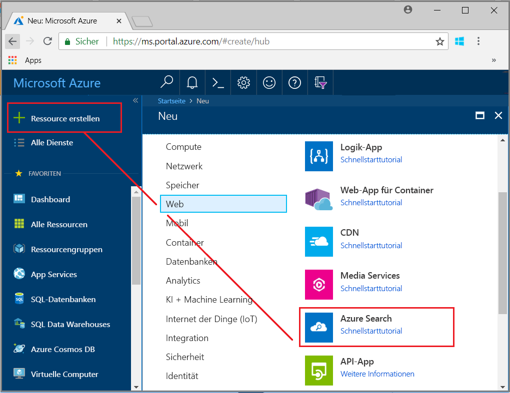
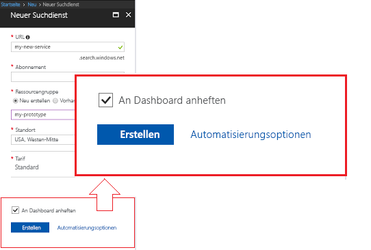
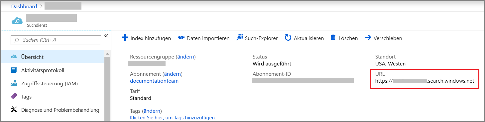
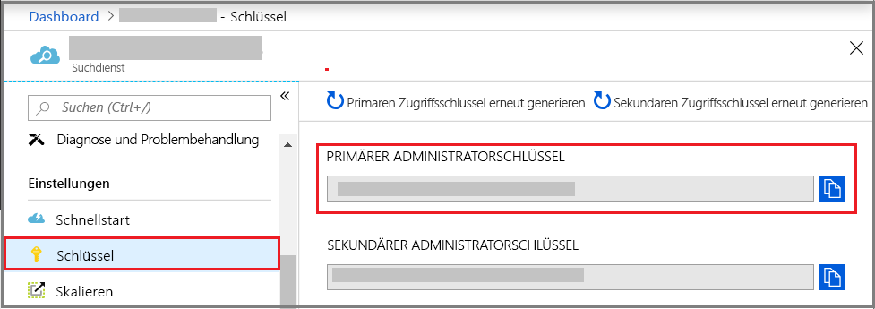

# Erstellen eines Azure Search-Diensts im Portal

Azure Search ist eine eigenständige Ressource, die zum Hinzufügen einer Suchoberfläche zu benutzerdefinierten Apps verwendet wird. Azure Search kann problemlos in andere Azure-Dienste integriert werden, kann aber auch alleine, mit auf Netzwerkservern gehosteten Apps oder mit auf anderen Cloudplattformen ausgeführter Software verwendet werden.

In diesem Artikel erfahren Sie, wie Sie eine Azure Search-Ressource im [Azure-Portal](https://portal.azure.com/) erstellen.

Bevorzugen Sie PowerShell? Verwenden Sie die Azure Resource Manager-[Dienstvorlage](https://azure.microsoft.com/resources/templates/101-azure-search-create/). Hilfe zu den ersten Schritten finden Sie unter [Verwalten des Azure Search-Diensts mit PowerShell](search-manage-powershell.md).

## Abonnieren (kostenlos oder kostenpflichtig)

[Erstellen Sie ein kostenloses Azure-Konto](https://azure.microsoft.com/pricing/free-trial/?WT.mc_id=A261C142F), und verwenden Sie das kostenlose Guthaben, um unsere kostenpflichtigen Azure-Dienste zu testen. Wenn das Guthaben aufgebraucht ist, können Sie das Konto behalten und weiterhin kostenlose Azure-Dienste wie z.B. Websites verwenden. Ihre Kreditkarte wird nur dann belastet, wenn Sie Ihre Einstellungen explizit ändern und mit der Berechnung von Gebühren einverstanden sind.

Alternativ dazu können Sie Ihre [Vorteile für MSDN-Abonnenten aktivieren](https://azure.microsoft.com/pricing/member-offers/msdn-benefits-details/?WT.mc_id=A261C142F). Ihr MSDN-Abonnement beinhaltet ein monatliches Guthaben, das Sie für kostenpflichtige Azure-Dienste verwenden können. 

## Aufrufen von Azure Search

1. Melden Sie sich beim [Azure-Portal](https://portal.azure.com/) an.
2. Klicken Sie in der oberen linken Ecke auf das Pluszeichen („+ Ressource erstellen“).
3. Suchen Sie mithilfe der Suchleiste nach „Azure Search“, oder navigieren über **Web** > **Azure Search** zu der Ressource.

## Benennen des Diensts und des URL-Endpunkts

Ein Dienstname ist Teil eines URL-Endpunkts, für den API-Aufrufe ausgegeben werden: `https://your-service-name.search.windows.net`. Geben Sie den Dienstnamen im Feld **URL** ein.

Wenn der Endpunkt beispielsweise `https://my-app-name-01.search.windows.net` sein soll, geben Sie `my-app-name-01` ein.

Anforderungen an Dienstnamen:

* Er muss innerhalb des Namespaces „search.windows.net“ eindeutig sein
* Zwischen 2 und 60 Zeichen lang
* Verwenden Sie Kleinbuchstaben, Ziffern oder Bindestriche („-“)
* Vermeiden Sie Bindestriche („-“) in den ersten beiden und im letzten Zeichen
* Verwenden Sie an keiner Stelle aufeinander folgende Bindestriche („--“)

## Auswählen eines Abonnements

Wenn Sie über mehrere Abonnements verfügen, wählen Sie ein Abonnement aus, in dem sich Daten- oder Dateispeicherdienste befinden. Azure Search kann die Dienste Azure Table Storage, Blob Storage, SQL-Datenbank und Azure Cosmos DB automatisch erkennen, um sie über [*Indexer*](search-indexer-overview.md) zu indizieren. Dies gilt jedoch nur für Dienste im gleichen Abonnement.

## Auswählen einer Ressourcengruppe

Eine Ressourcengruppe ist eine Sammlung von Azure-Diensten und -Ressourcen, die zusammen verwendet werden. Wenn Sie beispielsweise mit Azure Search eine SQL-Datenbank indizieren, müssen beide Dienste der gleichen Ressourcengruppe angehören.

Wenn Sie keine Ressourcen in einer einzigen Gruppe kombinieren oder vorhandene Ressourcengruppen mit Ressourcen gefüllt sind, die in nicht verbundenen Lösungen verwendet werden, erstellen Sie eine neue Ressourcengruppe nur für die Azure Search-Ressource.

> [!TIP]
> Wenn eine Ressourcengruppe gelöscht wird, werden auch die darin befindlichen Dienste gelöscht. Bei Prototypprojekten, die mehrere Dienste verwenden, sollten Sie all diese Dienste in die gleiche Ressourcengruppe platzieren, um das Bereinigen nach Abschluss des Projekts zu vereinfachen.

## Standort auswählen

Als Azure-Dienst kann Azure Search in Rechenzentren auf der ganzen Welt gehostet werden. [Die Preise können sich je nach geografischer Lage unterscheiden.](https://azure.microsoft.com/pricing/details/search/)

Wenn von einem anderen Azure-Dienst (Azure Storage, Azure Cosmos DB, Azure SQL-Datenbank) bereitgestellte Daten indizieren, erstellen Sie Ihren Azure Search-Dienst in der gleichen Region, um Bandbreitenkosten zu sparen. Bei Diensten in der gleichen Region fallen keine Gebühren für ausgehende Daten an.

Wenn Sie KI-Erweiterungen der kognitiven Suche verwenden, erstellen Sie Ihren Dienst in der gleichen Region wie Ihre Cognitive Services-Ressource. Die Zusammenstellung von Diensten ist eine Voraussetzung für KI-Erweiterungen.

## Auswählen eines Tarifs (SKU)

[Azure Search wird derzeit in mehreren Tarifen angeboten](https://azure.microsoft.com/pricing/details/search/): Free, Basic oder Standard. Jeder Tarif verfügt über eigene [Kapazitäten und Grenzwerte](search-limits-quotas-capacity.md). Anleitungen finden Sie unter [Auswählen einer SKU oder eines Tarifs für Azure Search](search-sku-tier.md) .

Für Produktionsworkloads wird in der Regel „Standard“ ausgewählt. Die meisten Kunden beginnen jedoch mit dem kostenlosen Dienst.

Ein Tarif kann nicht geändert werden, nachdem der Dienst erstellt wurde. Wenn Sie später einen höheren oder niedrigeren Tarif benötigen, müssen Sie den Dienst neu erstellen.

## Erstellen des Diensts

Denken Sie daran, Ihren Dienst an das Dashboard anzuheften, damit Sie nach jeder Anmeldung sofort darauf zugreifen können.

## Abrufen eines Schlüssels und URL-Endpunkts

Um den neuen Dienst verwenden zu können, müssen Sie in der Regel den URL-Endpunkt und einen Autorisierungs-API-Schlüssel angeben. Schnellstarts, Tutorials (etwa [Untersuchen von Azure Search-REST-APIs mit Fiddler oder Postman](search-fiddler.md) und [Verwenden von Azure Search aus einer .NET-Anwendung](search-howto-dotnet-sdk.md)), Beispiele und benutzerdefinierter Code benötigen jeweils einen Endpunkt und einen Schlüssel, damit sie mit einer bestimmten Ressource ausgeführt werden können.

1. Kopieren Sie rechts auf der Dienstübersichtsseite den URL-Endpunkt.

   

2. Wählen Sie im linken Navigationsbereich **Schlüssel** aus, und kopieren sie dann einen der Administratorschlüssel (sie sind identisch). Administrator-API-Schlüssel sind für das Erstellen, Aktualisieren und Löschen von Objekten in Ihrem Dienst erforderlich.

   

Endpunkt und Schlüssel sind für portalbasierte Aufgaben nicht erforderlich. Das Portal ist bereits mit Ihrer Azure Search-Ressource mit Administratorrechten verknüpft. Ein Tutorial zum Portal finden Sie unter [Schnellstart: Verwenden von integrierten Portaltools für Azure Search-Importe, -Indizierungen und -Abfragen](search-get-started-portal.md).

## Skalieren des Diensts

Die Erstellung eines Diensts kann einige Minuten dauern (je nach Tarif 15 Minuten oder länger). Nach der Bereitstellung Ihres Diensts können Sie ihn Ihren Anforderungen entsprechend skalieren. Da Sie für Ihren Azure Search-Dienst den Standard-Tarif ausgewählt haben, können Sie den Dienst in zwei Dimensionen skalieren: Replikate und Partitionen. Wenn Sie den Basic-Tarif auswählen, können Sie nur Replikate hinzufügen. Wenn Sie den kostenlosen Dienst bereitstellen, ist keine Skalierung verfügbar.

***Partitionen*** ermöglichen Ihrem Dienst das Speichern und Durchsuchen weiterer Dokumente.

***Replikate*** ermöglichen Ihrem Dienst, eine größere Menge von Suchabfragen zu verarbeiten.

Durch das Hinzufügen von Ressourcen wird Ihre monatliche Rechnung höher. Der [Preisrechner](https://azure.microsoft.com/pricing/calculator/) veranschaulicht, wie das Hinzufügen von Ressourcen sich auf die Abrechnung auswirken kann. Denken Sie daran, dass Sie Ressourcen basierend auf der Last anpassen können. Beispielsweise können Sie Ressourcen erhöhen, um einen vollständigen anfänglichen Index zu erstellen. Später können Sie die Ressourcen auf eine Ebene verringern, die sich besser für die inkrementelle Indizierung eignet.

> [!Important]
> Ein Dienst benötigt [2 Replikate für schreibgeschützte SLAs und 3 Replikate für SLAs mit Lese-/Schreibzugriff](https://azure.microsoft.com/support/legal/sla/search/v1_0/).

1. Wechseln Sie im Azure-Portal zur Seite Ihres Suchdiensts.
2. Wählen Sie im linken Navigationsbereich die Optionen **Einstellungen** > **Skalierung** aus.
3. Verwenden Sie den Schieberegler, um Ressourcen jedes Typs hinzuzufügen.

> [!Note]
> Jeder Tarif bietet unterschiedliche [Grenzwerte](search-limits-quotas-capacity.md) für die Gesamtzahl der in einem einzelnen Dienst zulässigen Sucheinheiten (Replikate × Partitionen = Sucheinheiten gesamt).

## Wann ein zweiter Dienst hinzugefügt werden sollte

Die meisten Kunden verwenden nur einen Dienst, der auf einer Ebene bereitgestellt wird, die das [richtige Gleichgewicht von Ressourcen](search-sku-tier.md) bietet. Ein Dienst kann mehrere Indizes hosten, die der [Obergrenze der von Ihnen ausgewählten Ebene](search-capacity-planning.md) unterliegt, wobei jeder Index vom anderen isoliert ist. In Azure Search können Anforderungen nur an einen Index geleitet werden, was das versehentliche oder vorsätzliche Datenabrufrisiko von anderen Indizes im selben Dienst verringert.

Obwohl die meisten Kunden nur einen Dienst nutzen, kann die Dienstredundanz womöglich nötig sein, wenn die operativen Anforderungen Folgendes enthalten:

* Notfallwiederherstellung (Ausfall des Rechenzentrums). Azure Search bietet kein sofortiges Failover bei einem Ausfall. Empfehlungen und Anleitungen finden Sie unter [Dienstverwaltung für Azure Search im Azure-Portal](search-manage.md).
* Ihre Untersuchung der mehrinstanzenfähigen Modellierung hat ergeben, dass zusätzliche Dienste die optimale Designlösung sind. Weitere Informationen finden Sie unter [Entwurfsmuster für mehrinstanzenfähige SaaS-Anwendungen und Azure Search](search-modeling-multitenant-saas-applications.md).
* Für global bereitgestellte Anwendungen benötigen Sie möglicherweise eine Azure Search-Instanz in mehreren Regionen, um die Wartezeit des internationalen Datenverkehrs Ihrer Anwendung zu minimieren.

> [!NOTE]
> In Azure Search können Sie die Index- und Abfrageworkloads nicht aufteilen. Deshalb würden Sie auch nie mehrere Dienste für aufgeteilte Workloads erstellen. Ein Index wird immer auf dem Dienst, in dem er erstellt wurde, abgefragt (Sie können keinen Index in einem Dienst erstellen und ihn in einen anderen kopieren).

Ein zweiter Dienst ist für Hochverfügbarkeit nicht vonnöten. Hochverfügbarkeit für Abfragen wird erreicht, wenn Sie zwei oder mehr Replikate im gleichen Dienst verwenden. Replikatupdates sind sequenziell. Das bedeutet, dass mindestens eines betriebsfähig ist, wenn ein Dienstupdate ausgeführt wird. Weitere Informationen zur Verfügbarkeit finden Sie unter [Vereinbarungen zum Servicelevel](https://azure.microsoft.com/support/legal/sla/search/v1_0/).

## Nächste Schritte

Nach dem Bereitstellen eines Azure Search-Diensts können Sie im Portal mit dem Erstellen des ersten Index fortfahren.

> [!div class="nextstepaction"]
> [Tutorial: Importieren von Daten, Indexieren und Ausführen von Abfragen im Portal](search-get-started-portal.md)
