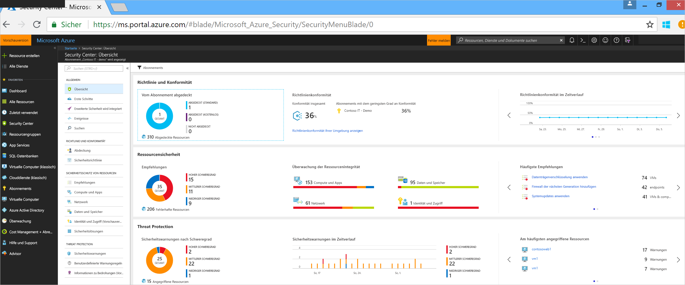
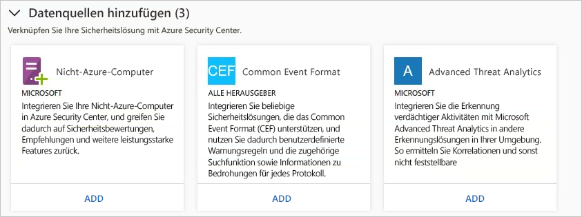
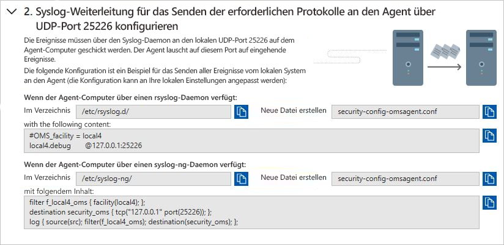
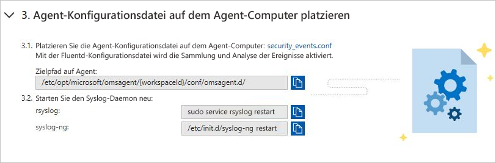
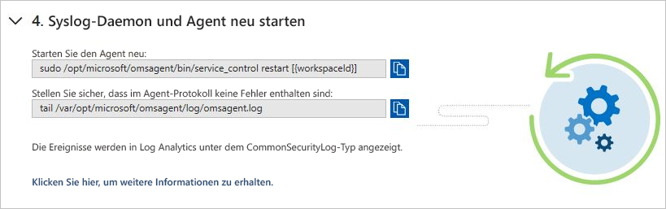
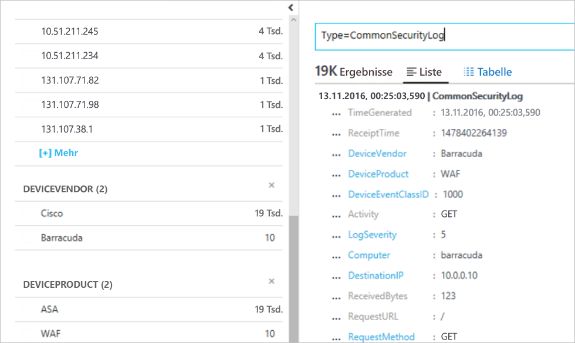

# Schnellstartanleitung: Herstellen einer Verbindung für Sicherheitslösungen mit Security Center

Zusätzlich zum Sammeln von Sicherheitsdaten von Ihren Computern können Sie Sicherheitsdaten von vielen anderen Sicherheitslösungen integrieren, z.B. für Lösungen mit Unterstützung des Common Event Format (CEF). CEF ist ein branchenübliches Standardformat, das in Verbindung mit Syslog-Nachrichten von vielen Sicherheitsanbietern verwendet wird, um die Ereignisintegration für unterschiedliche Plattformen zu ermöglichen.

In dieser Schnellstartanleitung wird Folgendes beschrieben:
- Verbinden einer Sicherheitslösung mit Security Center über CEF-Protokolle
- Überprüfen der Verbindung mit der Sicherheitslösung

## Voraussetzungen
Für den Einstieg in Security Center benötigen Sie ein Microsoft Azure-Abonnement. Wenn Sie nicht über ein Abonnement verfügen, können Sie sich für ein [kostenloses Testkonto](https://azure.microsoft.com/free/) registrieren.

Zum Durcharbeiten dieser Schnellstartanleitung müssen Sie den Tarif „Standard“ von Security Center verwenden. Sie können Security Center Standard kostenlos 60 Tage lang testen. Unter [Schnellstarthandbuch zu Azure Security Center](security-center-get-started.md) wird Schritt für Schritt beschrieben, wie Sie das Upgrade auf den Tarif „Standard“ durchführen.

Außerdem benötigen Sie einen [Linux-Computer](https://docs.microsoft.com/azure/log-analytics/log-analytics-agent-linux) mit Syslog-Dienst, der bereits mit Ihrer Security Center-Instanz verbunden ist.

## Herstellen einer Verbindung für die Lösung per CEF

1. Melden Sie sich beim [Azure-Portal](https://azure.microsoft.com/features/azure-portal/) an.
2. Wählen Sie im Menü **Microsoft Azure** die Option **Security Center**. **Security Center – Übersicht** wird geöffnet.

      

3. Klicken Sie im Hauptmenü von Security Center auf **Sicherheitslösungen**.
4. Klicken Sie auf der Seite „Sicherheitslösungen“ im Bereich **Datenquellen hinzufügen (3)** unter **Common Event Format** auf **Hinzufügen**.

    

5. Erweitern Sie auf der Seite „Common Event Format-Protokolle“ den zweiten Schritt **Syslog-Weiterleitung für das Senden der erforderlichen Protokolle an den Agent über UDP-Port 25226 konfigurieren**, und befolgen Sie die unten angegebene Anleitung auf Ihrem Linux-Computer:

    

6. Erweitern Sie den dritten Schritt **Agent-Konfigurationsdatei auf dem Agent-Computer platzieren**, und befolgen Sie die unten angegebene Anleitung auf Ihrem Linux-Computer:

    

7. Erweitern Sie den vierten Schritt **Syslog-Daemon und Agent neu starten**, und befolgen Sie die unten angegebene Anleitung auf Ihrem Linux-Computer:

    

## Überprüfen der Verbindung

Bevor Sie mit den unten angegebenen Schritten fortfahren, müssen Sie warten, bis das Syslog mit dem Melden an Security Center beginnt. Dies kann einige Zeit dauern und variiert je nach Größe der Umgebung.

1.  Klicken Sie im linken Bereich des Security Center-Dashboards auf **Suchen**.
2.  Wählen Sie den Arbeitsbereich aus, mit dem das Syslog (Linux-Computer) verbunden ist.
3.  Geben Sie *CommonSecurityLog* ein, und klicken Sie auf die Schaltfläche **Suchen**.

Im folgenden Beispiel werden die Ergebnisse dieser Schritte angezeigt: 

## Bereinigen von Ressourcen
Andere Schnellstartanleitungen und Tutorials in dieser Sammlung bauen auf dieser Schnellstartanleitung auf. Wenn Sie planen, mit den nachfolgenden Schnellstartanleitungen und Tutorials fortzufahren, sollten Sie weiter den Tarif „Standard“ nutzen und die automatische Bereitstellung aktiviert lassen. Gehen Sie wie folgt vor, falls Sie nicht fortfahren oder zum Free-Tarif zurückkehren möchten:

1. Kehren Sie zum Hauptmenü von Security Center zurück, und wählen Sie die Option **Sicherheitsrichtlinie**.
2. Wählen Sie das Abonnement oder die Richtlinie aus, für das bzw. die Sie zu „Free“ zurückwechseln möchten. Der Bereich **Sicherheitsrichtlinie** wird geöffnet.
3. Wählen Sie unter **RICHTLINIENKOMPONENTEN** die Option **Tarif**.
4. Wählen Sie **Free**, um für das Abonnement vom Tarif „Standard“ zu „Free“ zu wechseln.
5. Wählen Sie **Speichern**aus.

Gehen Sie wie folgt vor, um die automatische Bereitstellung zu deaktivieren:

1. Kehren Sie zum Hauptmenü von Security Center zurück, und wählen Sie die Option **Sicherheitsrichtlinie**.
2. Wählen Sie das Abonnement aus, für das Sie die automatische Bereitstellung deaktivieren möchten.
3. Wählen Sie im Bereich **Sicherheitsrichtlinie – Datensammlung** unter **Onboarding** die Option **Aus**, um die automatische Bereitstellung zu deaktivieren.
4. Wählen Sie **Speichern**aus.

>[!NOTE]
> Wenn Sie die automatische Bereitstellung deaktivieren, wird Microsoft Monitoring Agent nicht von virtuellen Azure-Computern entfernt, auf denen der Agent bereitgestellt wurde. Wenn Sie die automatische Bereitstellung deaktivieren, schränkt dies die Sicherheitsüberwachung für Ihre Ressourcen ein.
>

## Nächste Schritte
In dieser Schnellstartanleitung haben Sie gelernt, wie Sie für eine Linux-Syslog-Lösung per CEF eine Verbindung mit Security Center herstellen. Indem Sie Ihre CEF-Protokolle mit Security Center verbinden, können Sie die Such- und benutzerdefinierten Warnungsregeln sowie die Threat Intelligence-Funktion für jedes Protokoll nutzen. Weitere Informationen zur Verwendung von Security Center erhalten Sie, wenn Sie mit dem Tutorial zur Konfiguration einer Sicherheitsrichtlinie und zum Bewerten der Sicherheit Ihrer Ressourcen fortfahren.

> [!div class="nextstepaction"]
> [Tutorial: Definieren und Bewerten von Sicherheitsrichtlinien](./tutorial-security-policy.md)
