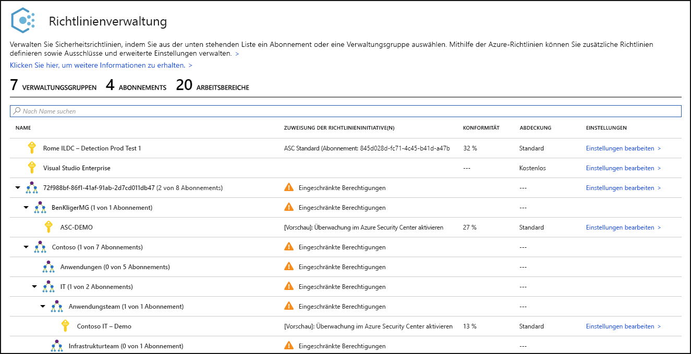
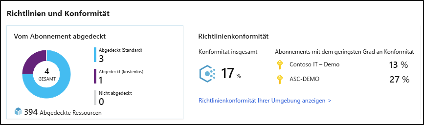
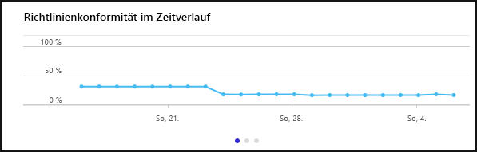
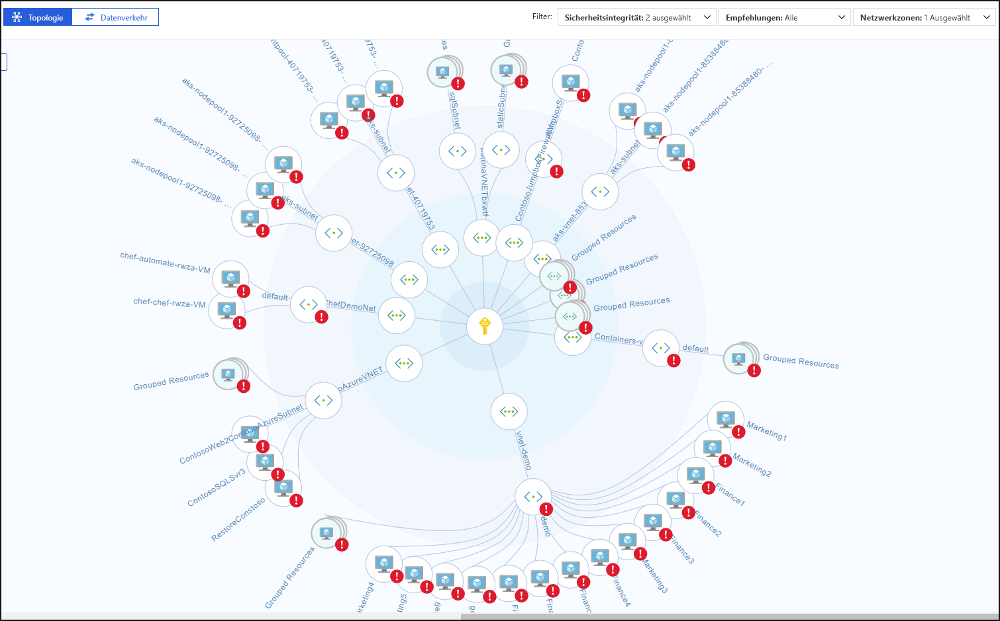
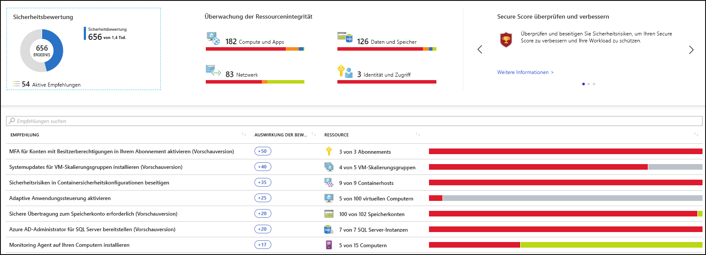
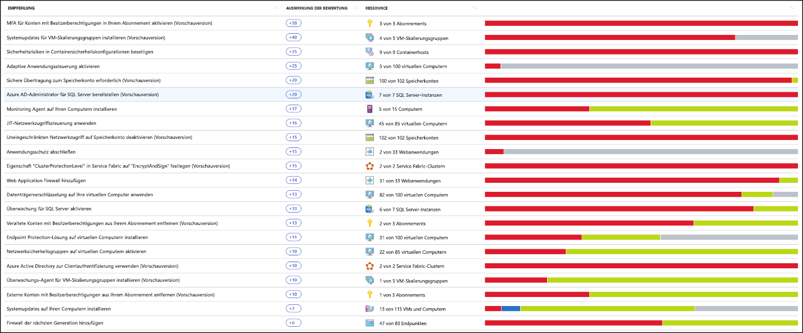
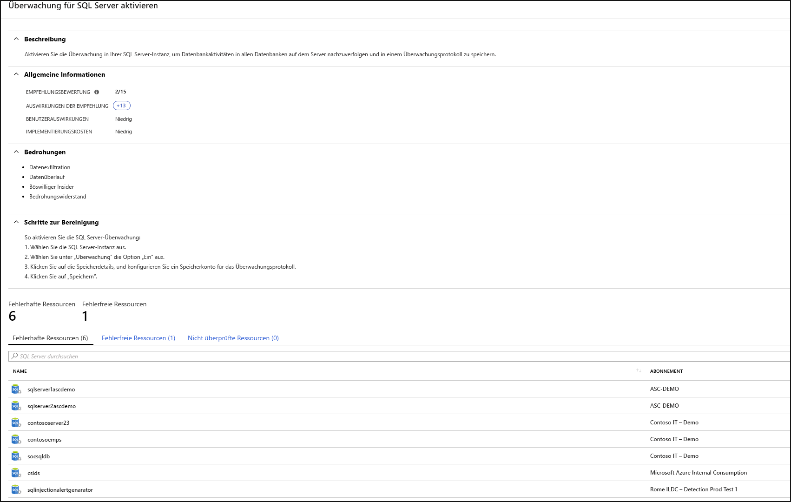
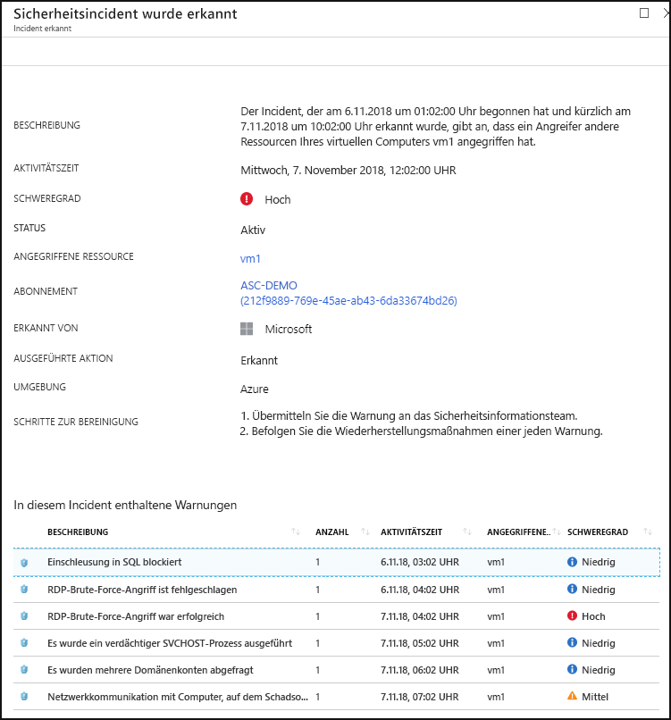

# Was ist Azure Security Center?

Azure Security Center ist ein vereinheitlichtes Sicherheitsverwaltungssystem für Infrastrukturen, mit dem der Sicherheitsstatus Ihrer Rechenzentren gestärkt wird und ein erweiterter Schutz vor Bedrohungen für Ihre Hybridworkloads in der Cloud (in Azure oder anderswo) und in der lokalen Umgebung bereitgestellt wird.

Der Schutz Ihrer Ressourcen ist eine gemeinsame Aufgabe, die von Ihrem Cloudanbieter (Azure) und Ihnen selbst (dem Kunden) wahrgenommen wird. Sie müssen sicherstellen, dass Ihre Workloads bei der Umstellung auf die Cloud geschützt sind. Bei der Umstellung auf IaaS (Infrastructure-as-a-Service) erhöht sich gegenüber PaaS (Platform-as-a-Service) und SaaS (Software-as-a-Service) außerdem die Verantwortung des Kunden. Mit Azure Security Center erhalten Sie die Tools, die Sie zum Absichern Ihres Netzwerks, Schützen Ihrer Dienste und Sicherstellen des Sicherheitsstatus benötigen.

Azure Security Center ist die Lösung für die drei größten Herausforderungen in Bezug auf die Sicherheit:

-   **Sich schnell ändernde Workloads**: Dies ist gleichzeitig eine Stärke und eine Schwäche der Cloud. Einerseits werden Benutzer in die Lage versetzt, mehr zu erreichen. Andererseits stellt sich die folgende Frage: Wie können Sie sicherstellen, dass die sich ständig ändernden Dienste, die von Benutzern verwendet und erstellt werden, Ihren Sicherheitsstandards entsprechen und auf den bewährten Sicherheitsmethoden basieren?

-   **Immer ausgereiftere Angriffe**: Bei jeder Ausführung Ihrer Workloads werden die Angriffe immer ausgereifter. Sie müssen Ihre öffentlichen Cloudworkloads schützen. Bei dieser Aufgabe handelt es sich praktisch um eine internetfähige Workload, die dazu führen kann, dass Sie noch angreifbarer sind, wenn Sie sich nicht an die bewährten Sicherheitsmethoden halten.

-   **Mangel an Personen mit Sicherheitskenntnissen**: Die Anzahl von Sicherheitswarnungen und Warnsystemen übersteigt deutlich die Anzahl von verfügbaren Administratoren mit dem erforderlichen Hintergrund und der Erfahrung, die zum Schützen Ihrer Umgebungen benötigt wird. Es ist eine ständige Herausforderung, hinsichtlich der neuesten Angriffstechniken immer auf dem Laufenden zu bleiben. Da sich der Sicherheitsbereich ständig ändert, ist es unmöglich, auf demselben Stand zu verharren.

Damit Sie diese Herausforderungen in Bezug auf den Schutz bewältigen können, werden mit Security Center Tools für folgende Zwecke bereitgestellt:

-   **Erhöhung des Sicherheitsstatus**: Mit Security Center wird Ihre Umgebung bewertet, damit Sie den Status Ihrer Ressourcen verstehen können: Sind sie sicher, oder sind sie nicht sicher?

-   **Schutz vor Bedrohungen**: Security Center bewertet Ihre Workloads und löst Empfehlungen zur Vermeidung von Bedrohungen und Warnungen zur Bedrohungserkennung aus.

-   **Schnellerer Aufbau des Schutzes**: In Security Center werden alle Vorgänge mit Cloudgeschwindigkeit durchgeführt. Aufgrund der nativen Integration ist die Bereitstellung von Security Center einfach, und Sie erhalten eine automatische Bereitstellung und den Schutz durch Azure-Dienste.

## Architecture

Da Security Center ein nativer Teil von Azure ist, werden PaaS-Dienste in Azure – z.B. Service Fabric, SQL-Datenbanken und Speicherkonten – mit Security Center überwacht und geschützt, ohne dass eine Bereitstellung erforderlich ist.

Darüber hinaus werden mit Security Center auch Server und virtuelle Computer, die nicht zu Azure gehören, in der Cloud und lokal geschützt. Dies ist sowohl für Windows- als auch für Linux-Server möglich, indem der Microsoft Monitoring Agent darauf installiert wird. Virtuelle Azure-Computer werden in Security Center automatisch bereitgestellt.

Die über die Agents und über Azure erfassten Ereignisse werden im Sicherheitsanalysemodul korreliert, um für Sie maßgeschneiderte Empfehlungen (Aufgaben zur Erhöhung der Sicherheit) und Warnungen zur Bedrohungserkennung bereitstellen zu können. Sie sollten sich an diese Empfehlungen halten, um dafür zu sorgen, dass Ihre Workloads geschützt sind. Es ist ratsam, die Warnungen schnellstmöglich zu untersuchen, um sicherzustellen, dass es für Ihre Workloads nicht zu schädlichen Angriffen kommt.

Wenn Sie Security Center aktivieren, wird die in Security Center integrierte Sicherheitsrichtlinie in Azure Policy als integrierte Initiative unter der Security Center-Kategorie dargestellt. Die integrierte Initiative wird automatisch allen in Security Center registrierten Abonnements (Tarife „Free“ oder „Standard“) zugewiesen. Die integrierte Initiative enthält nur Überwachungsrichtlinien. Weitere Informationen zu Security Center-Richtlinien in Azure Policy finden Sie unter [Arbeiten mit Sicherheitsrichtlinien](tutorial-security-policy.md).

## Stärken des Sicherheitsstatus

Mit Azure Security Center können Sie Ihren Sicherheitsstatus erhöhen. Sie erhalten mit dem Dienst Unterstützung beim Identifizieren und Durchführen von Aufgaben, die als bewährte Sicherheitsmethoden empfohlen werden, und implementieren sie dann für Ihre Computer, Datendienste und Apps. Dies umfasst auch die Verwaltung und Durchsetzung Ihrer Sicherheitsrichtlinien sowie die Sicherstellung, dass Ihre virtuellen Azure-Computer, Azure-externen Server und Azure PaaS-Dienste konform sind. Mit Security Center erhalten Sie die Tools, die Sie benötigen, um den Gesamtüberblick über Ihre Workloads und besonders über die Sicherheitseinrichtungen Ihres Netzwerks zu behalten. 

### Verwalten der Sicherheitsrichtlinie und der Konformität der Organisation

Es ist eine grundlegende Sicherheitsanforderung, dass Sie Ihre Workloads kennen und für deren Schutz sorgen. Der erste Schritt hierbei ist, maßgeschneiderte Sicherheitsrichtlinien aufzustellen. Da alle Richtlinien in Security Center auf Azure-Richtlinienkontrollen basieren, kommen Sie in den Genuss des vollen Funktionsumfangs und der Flexibilität einer  **erstklassigen Richtlinienlösung**. In Security Center können Sie Ihre Richtlinien so festlegen, dass sie für Verwaltungsgruppen, übergreifend für Abonnements und sogar für einen gesamten Mandanten ausgeführt werden.

Mit Security Center können Sie **Schatten-IT-Abonnements identifizieren**. Indem Sie sich in Ihrem Dashboard Abonnements mit dem Hinweis **Nicht abgedeckt** ansehen, können Sie sofort erkennen, wann neu erstellte Abonnements vorhanden sind. Sie können dann sicherstellen, dass diese durch Ihre Richtlinien abgedeckt und mit Azure Security Center geschützt sind.

Mit den erweiterten Überwachungsfunktionen in Security Center können Sie auch die **Konformität und Governance in Abhängigkeit der Zeit nachverfolgen und verwalten**. Mit **Konformität gesamt** erhalten Sie einen Wert dazu, in welchem Maße Ihre Abonnements mit den Richtlinien konform sind, die Ihrer Workload zugeordnet sind. 

### Fortlaufende Bewertungen

Mit Security Center werden ständig neue Ressourcen erkannt, die für Ihre Workloads bereitgestellt werden, und es wird bewertet, ob diese gemäß den bewährten Sicherheitsmethoden konfiguriert sind. Wenn nicht, werden sie gekennzeichnet, und Sie erhalten eine nach Priorität sortierte Liste mit Empfehlungen zu den Schritten, die zum Schützen Ihrer Computer ausgeführt werden müssen.

Eines der leistungsfähigsten Tools, das von Security Center für die ständige Überwachung des Sicherheitsstatus Ihres Netzwerks bereitgestellt wird, ist die **Netzwerkübersicht**. In der Übersicht können Sie die Topologie Ihrer Workloads anzeigen, um zu ermitteln, ob jeder Knoten richtig konfiguriert ist. Sie sehen, wie Ihre Knoten miteinander verbunden sind, und können unerwünschte Verbindungen blockieren, die einem Angreifer unter Umständen die Bewegung durch Ihr Netzwerk erleichtern könnten.

Security Center vereinfacht die Lösung Ihrer Sicherheitswarnungen um einen Schritt, indem ein **Secure Score** (Sicherheitsbewertung) hinzugefügt wird. Secure Scores werden jetzt jeder Empfehlung zugeordnet, die Sie erhalten. So können Sie verstehen, wie wichtig die einzelnen Empfehlungen für Ihren gesamten Sicherheitsstatus sind. Dies ist ein entscheidender Faktor beim **Sortieren Ihrer Sicherheitsmaßnahmen nach Priorität**.

### Optimieren und Verbessern der Sicherheit durch die Konfiguration von empfohlenen Kontrollen

Der Hauptnutzen von Azure Security Center basiert auf den Empfehlungen. Die Empfehlungen sind genau an die jeweiligen Sicherheitsrisiken Ihrer Workloads angepasst. Security Center übernimmt die Sicherheitsverwaltung für Sie, indem nicht nur Ihre Sicherheitsrisiken ermittelt werden, sondern auch spezifische Anleitungen zu ihrer Beseitigung bereitgestellt werden.

Auf diese Weise können Sie mit Security Center nicht nur die Sicherheitsrichtlinien festlegen, sondern auch Standards für die sichere Konfiguration Ihrer gesamten Ressourcen anwenden.

Mit den Empfehlungen können Sie die Angriffsfläche jeder einzelnen Ressource verkleinern. Dies umfasst virtuelle Azure-Computer, Azure-externe Server und Azure PaaS-Dienste, z.B. SQL und Speicherkonten, und mehr. Hierbei wird jeder Ressourcentyp anders bewertet und verfügt über eigene Standards.

## Schutz vor Bedrohungen

Mit dem Bedrohungsschutz von Security Center können Sie Bedrohungen auf IaaS-Ebene (Infrastructure-as-a-Service), für Azure-externe Server und auf PaaS-Ebene (Platform-as-a-Service) in Azure erkennen und verhindern.

Der Bedrohungsschutz von Security Center enthält eine Fusion-Schrittfolgenanalyse, bei der Warnungen in Ihrer Umgebung basierend auf einer Cyber-Schrittfolgenanalyse automatisch korreliert werden. Hiermit können Sie den gesamten Verlauf eines Angriffs, seinen Ausgangspunkt und die Auswirkungen auf Ihre Ressourcen besser verstehen.

### Erweiterter Schutz vor Bedrohungen

Bei Security Center erhalten Sie standardmäßig eine native Integration in Windows Defender Advanced Threat Protection. Dies bedeutet, dass Ihre virtuellen Windows-Computer und -Server ohne Konfigurationsaufwand vollständig in die Empfehlungen und Bewertungen von Security Center integriert werden. Die erweiterte Bedrohungserkennung wird auch für virtuelle Linux-Computer und -Server standardmäßig angeboten.

Außerdem können Sie mit Security Center die Anwendungssteuerungsrichtlinien in Serverumgebungen automatisieren. Mit den adaptiven Anwendungssteuerungen in Security Center können Sie das End-to-End-App-Whitelisting für Ihre Windows-Server nutzen. Sie müssen keine Regeln erstellen und keine Prüfung auf Verstöße durchführen. Dies wird alles automatisch für Sie erledigt.

### Schützen von PaaS

Mit Security Center können Sie Bedrohungen für Azure PaaS-Dienste erkennen. Sie können Bedrohungen erkennen, die Azure-Dienste wie Azure App Service, Azure SQL, Azure Storage-Konto und andere betreffen. Außerdem können Sie die native Integration mit dem Feature „User and Entity Behavioral Analytics“ (UEBA) von Microsoft Cloud App Security nutzen, um eine Anomalieerkennung für Ihre Azure-Aktivitätsprotokolle durchzuführen.

### Blockieren von Brute-Force-Angriffen

Mit Security Center können Sie die Anfälligkeit für Brute-Force-Angriffe verringern. Wenn Sie den Zugriff auf VM-Ports einschränken, indem Sie den Just-In-Time-Zugriff auf VMs nutzen, können Sie die Sicherheit für Ihr Netzwerk erhöhen, weil unnötige Zugriffsvorgänge verhindert werden. Sie können für ausgewählte Ports Richtlinien für den sicheren Zugriff festlegen, damit der Zugriff nur für autorisierte Benutzer, zulässige IP-Quelladressen oder IP-Adressbereiche und einen begrenzten Zeitraum möglich ist.

### Schützen von Datendiensten

Security Center enthält Funktionen, mit denen Sie eine automatische Klassifizierung Ihrer Daten in Azure SQL durchführen können. Sie können auch Bewertungen für potenzielle Sicherheitsrisiken für Azure SQL- und Storage-Dienste sowie Empfehlungen zu ihrer Entschärfung erhalten.

## Schnellerer Aufbau des Schutzes

Dank der Kombination aus nativer Azure-Integration (einschließlich Azure Policy und Azure Monitor-Protokollen) und nahtloser Integration in andere Microsoft-Sicherheitslösungen wie etwa Microsoft Cloud App Security und Windows Defender Advanced Threat Protection können Sie sicherstellen, dass Ihre Sicherheitslösung umfassend ist und einfach eingeführt werden kann (Onboarding und Rollout).

Darüber hinaus können Sie die vollständige Lösung über Azure hinaus auf weitere Workloads ausdehnen, die in anderen Clouds und in lokalen Rechenzentren ausgeführt werden.

### Automatisches Erkennen und Einbinden von Azure-Ressourcen

Security Center ermöglicht eine nahtlose, native Integration in Azure und Azure-Ressourcen. Dies bedeutet, dass Sie eine vollständige Sicherheitslösung mit Azure Policy und integrierten Security Center-Richtlinien für Ihre gesamten Azure-Ressourcen zusammenstellen können. Außerdem können Sie sicherstellen, dass dies automatisch auf neu erkannte Ressourcen angewendet wird, wenn Sie diese in Azure erstellen.

Umfassende Protokollsammlung: Protokolle von Windows und Linux werden im Sicherheitsanalysemodul genutzt und für die Erstellung von Empfehlungen und Warnungen verwendet.

## Nächste Schritte

- Für den Einstieg in Security Center benötigen Sie ein Microsoft Azure-Abonnement. Wenn Sie nicht über ein Abonnement verfügen, können Sie sich für ein [kostenloses Testabonnement](https://azure.microsoft.com/free/)registrieren.
- Der Security Center-Tarif „Free“ wird mit Ihrem Azure-Abonnement aktiviert. Um die Vorteile der erweiterten Funktionen für die Sicherheitsverwaltung und Erkennung von Bedrohungen nutzen zu können, müssen Sie ein Upgrade auf den Tarif „Standard“ durchführen. Der Tarif „Standard“ kann kostenlos getestet werden. Weitere Informationen finden Sie auf der Seite mit den [Preisen für Security Center](https://azure.microsoft.com/pricing/details/security-center/).
- Wenn Sie jetzt zum Aktivieren von Security Center Standard bereit sind, hilft Ihnen die Beschreibung der Schritte unter [Schnellstart: Einbinden Ihres Azure-Abonnements in Security Center Standard](security-center-get-started.md) weiter.

